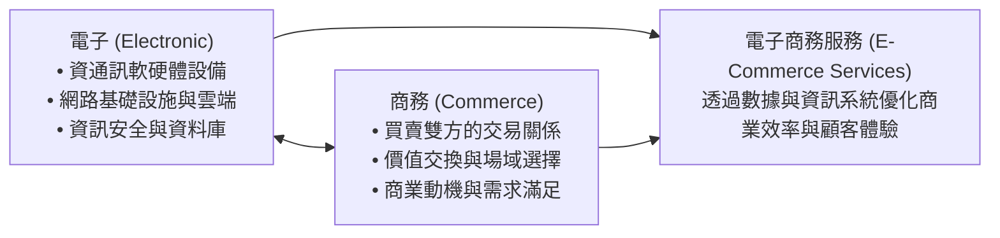
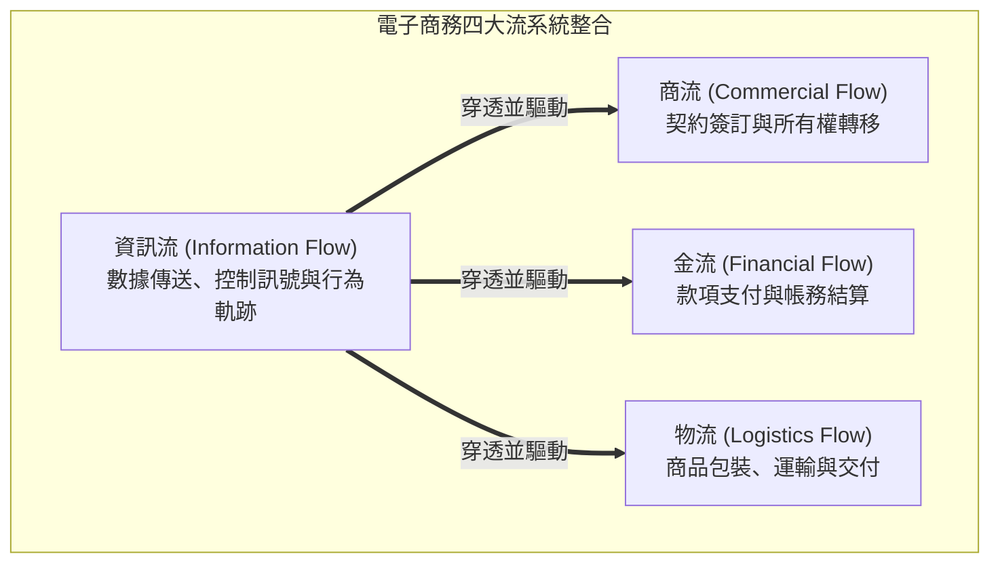
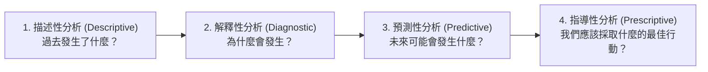
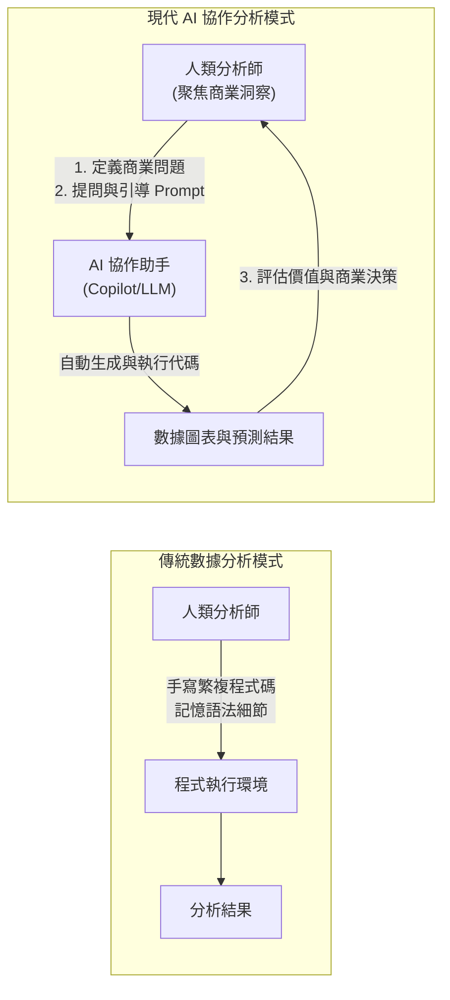
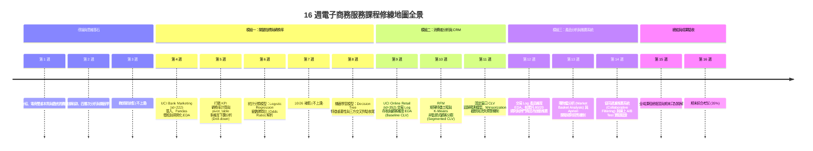
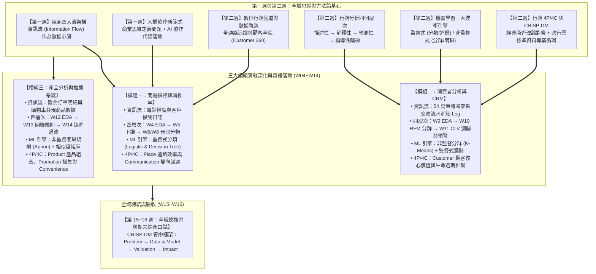
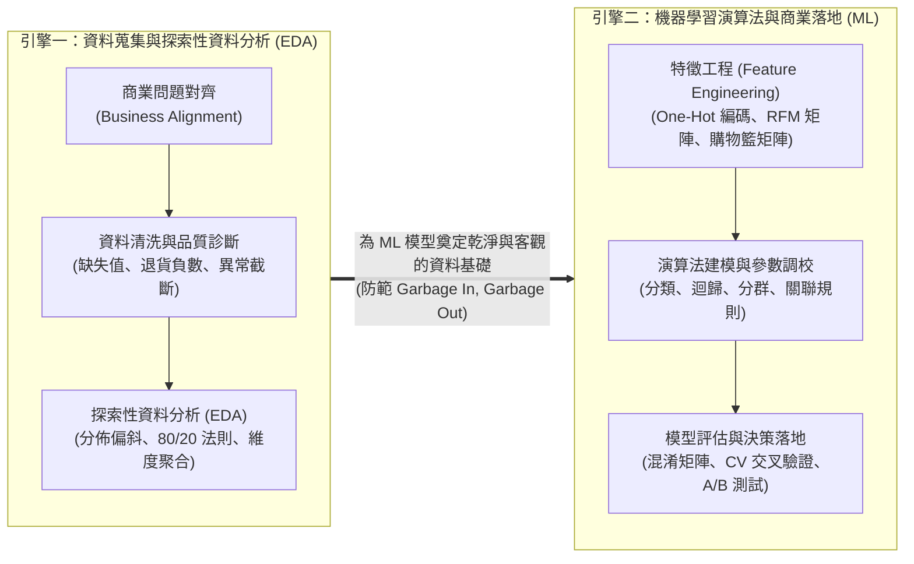
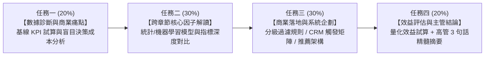
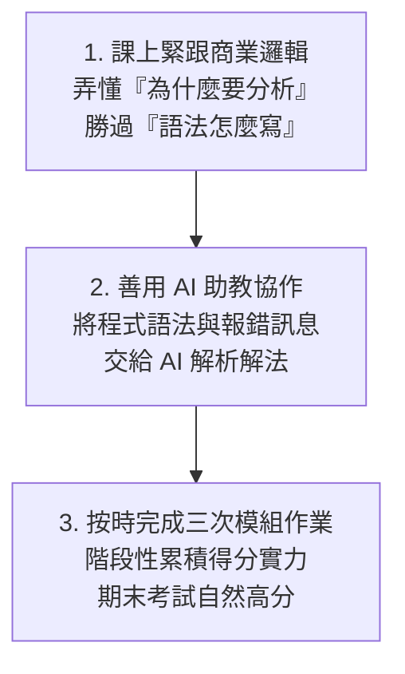

---
puppeteer:
  displayHeaderFooter: true
  scale: 1.15
  headerTemplate: '
第一章：電子商務服務導論與課程總覽
'
  footerTemplate: '
第  頁 / 共  頁
'
  margin:
    top: "1.5cm"
    bottom: "1.5cm"
    left: "1.5cm"
    right: "1.5cm"
---

---

# 第一章：電子商務服務導論與課程總覽

## 課程導讀

歡迎來到「電子商務服務」的探索旅程。當前我們所處的時代，電子商務（E-Commerce）早已不再只是「在網頁上擺放商品並提供購物車」那麼簡單。無論是大家日常使用的蝦皮購物、momo 購物網、Amazon，或是手機中各個品牌的獨立 App 與社群購物功能，其背後的商業競爭本質，都已經轉化為一場結合商業洞察、消費者心理學與數據科學的綜合較量。

本門課程是專為大三同學設計的實務與應用導向課程。我們非常清楚，許多人文社會或商管學科的同學在面對「資料科學」、「機器學習」或「程式設計」等關鍵字時，心裡難免會產生焦慮與抗拒，擔心自己因為缺乏資工或數學背景而無法跟上。

請同學們放心，在生成式人工智慧（Generative AI）技術全面爆發的今天，數據分析的門檻已經產生了根本性的轉變。過去需要耗費數個月學習的複雜程式語法，現在可以透過 AI 工具作為強大的協作助手；而真正決定分析成敗的核心，在於商業問題的定義、對資料的敏銳度，以及將分析結果轉化為實體決策的能力——這正是各位作為大三同學最核心的優勢所在。

貫穿本學期的核心學習精神可以總結為：

> 「用商業思維定義問題，用探索分析理解數據，用機器學習預測未來，用 AI 協作實現落地。」

---

## 第一節：電子商務的定義與商業架構

### 1.1 「電子」與「商務」的雙重本質

要理解電子商務服務，首先必須將「電子商務」這個詞彙拆解為兩個基本面向： 「電子（Electronic）」 與「商務（Commerce）」 。許多初學者往往過度偏重技術層面的「電子」，而忽略了商業本質的「商務」；或者只談行銷創意，卻不了解底層資訊系統的運作限制。

1. 「電子」的範疇： 代表支撐交易運行的基礎設施，包含資通訊軟硬體設備、網路通訊協定、行動裝置、雲端運算空間以及資訊安全防護。沒有穩定且安全的「電子」架構，交易便無法在數位環境中流暢且誠信地進行。

2. 「商務」的範疇： 代表商業活動的本質。在學習過程中，我們必須不斷詢問四個核心商業問題：

   - 主體與對象： 究竟是「什麼人」跟「什麼人」在進行交易？

   - 場域與介面： 交易發生在「什麼場所」（官網、App、社群平台或跨國跨境網站）？

   - 價值交換： 交易雙方用「什麼」交換「什麼」（貨幣、服務、數據或是訂閱權益）？

   - 商業動機： 買方為何需要這個產品或服務？賣方如何透過此交易獲取利潤並提供永續價值？

當「電子」與「商務」深度結合時，便孕育出了各種多元的電子商務商業模式。

### 1.2 電子商務的常見商業模式

在數位經濟中，依據交易參與主體的不同（企業 Business、消費者 Consumer、政府 Government、員工 Employee），電子商務展現出多樣化的架構：

- B2C（Business-to-Consumer，企業對消費者）： 最經典的電商形式。企業建立網站或平台，直接向終端消費者銷售商品或服務，例如 Apple 官網、Uniqlo 線上旗艦店。

- B2B（Business-to-Business，企業對企業）： 企業之間透過網路進行大宗採購、供應鏈對接或軟體服務交易，例如台灣積體電路（TSMC）與其上游設備商的電子化採購系統、Shopify 為商家提供建站服務。

- C2C（Consumer-to-Consumer，消費者對消費者）： 個人賣家將商品直接販售給個人買家，早期如 Yahoo! 奇摩拍賣、eBay，或是旋轉拍賣（Carousell）。

- B2B2C（Business-to-Business-to-Consumer，企業對企業對消費者）： 由平台業者提供技術設施、金流物流與流量場域，讓其他品牌商家入駐並銷售給終端消費者。例如蝦皮商城、momo 購物網與 PChome 24h 購物。

- C2B（Consumer-to-Business，消費者對企業）： 由消費者發起需求，逆向集合購買力向企業議價，例如群眾集資平台（嘖嘖、flyingV）或團購主揪團採購。

- 其他延伸範疇： 如 B2G（企業對政府） 採購標案系統、C2G（民眾對政府） 電子化報稅系統，以及企業內部改善管理效率的 B2E（企業對員工） 數位服務。

### 1.3 電子商務的四大流架構

無論哪一種商業模式，要讓一筆電子商務交易順利完成，系統底層必須完美串聯四大運作流程——商流 、金流 、物流 與資訊流 。

1. 商流（Commercial Flow）： 代表交易作業的流通與商品所有權的移轉過程。包含商品上架展示、買賣雙方達成契約意向、訂單成立至產權移交的商業合約精神。

2. 金流（Financial Flow）： 交易過程中資金的往來與結算。從傳統的信用卡刷卡、ATM 轉帳，演進至當代的行動支付（LINE Pay、Apple Pay）、第三方支付（綠界）以及先買後付（BNPL）。

3. 物流（Logistics Flow）： 實體或數位產品的配送過程。從倉儲管理、分揀揀貨、冷鏈運輸，到便利商店取貨與宅急送。

4. 資訊流（Information Flow）： 貫穿整個交易生命週期的數據訊號與控制訊息。從消費者的瀏覽點擊、搜尋關鍵字、購物車暫存，到訂單狀態更新、庫存扣減訊號與物流追蹤碼。

> 核心觀念： 在四流架構中，「資訊流」是現代電子商務的數據心臟 。金流的支付安全、物流的即時追蹤、商流的精準推薦，無一不仰賴資訊流的串聯。為了達到電子商務的最佳營運效益，我們必須學習如何運用資料科學與程式工具，從龐大的資訊流中掘取黃金。

---

### 1.4 課堂探索小活動：身邊電商服務的四大流拆解

請同學們花費 3 分鐘，回想你最近一次使用電商 App（如蝦皮、momo、Uber Eats 或 酷澎 Coupang）完成的購物體驗，並回答下列問題：

1. 主體識別： 這次購物屬於哪一種商業模式（B2C、B2B2C 還是 C2C）？

2. 四流對應：
   - 金流：你使用了哪種支付方式？
   - 物流：商品是如何抵達你手中的？
   - 資訊流：在收到商品前，App 發送了哪些「資訊流訊號」給你（如出貨通知、簡訊驗證碼）？

3. 請與同桌同學交流，討論如果資訊流中斷（例如物流系統無法即時更新狀態），對顧客體驗會造成什麼影響？

> 老師的提醒：
> * 資訊流不只是「網頁畫面」 ：很多初學者以為網頁做得很漂亮就是資訊流。其實，使用者在頁面上停留了幾秒、點擊了哪張圖片、最後為什麼沒有下單離開，這些背後隱藏的數據行為軌跡 ，才是資訊流最有價值的核心。
> * 四大流缺一不可 ：電商創業失敗往往不是因為沒有好商品（商流），而是金流手續費過高、物流配送過慢，或是資訊流無法有效串聯導致訂單錯亂。

---

## 第二節：從傳統行銷到數據驅動：為何文科生不需要害怕程式設計？

### 2.1 數位時代的行銷管道與數據寶庫

過去的傳統行銷（Traditional Marketing）主要依賴電視廣告、報章雜誌或戶外看板。這類管道最大的痛點在於 「無法精確量化成效」——正如行銷學名言所說：「我知道我的廣告費有一半浪費了，但我不知道是哪一半。」

而在數位時代，行銷活動大量轉移至 數位管道（Digital Channels） 上。這些管道不僅是宣播訊息的媒體，更是收集消費者真實行為的龐大數據寶庫：

- 電子郵件（Email）： 成本極低且具備一對一溝通特性。透過分析會員點擊率，進行個人化優惠推薦。

- 搜尋引擎（Search Engine）： 包含自然搜尋最佳化（SEO）與付費關鍵字廣告（PPC）。當使用者搜尋特定字詞時，代表其具備強烈的即時需求。

- 社群媒體（Social Media）： 如 Instagram、TikTok、Facebook、Dcard。除了品牌經營，更可累積用戶生成內容（UGC）與社群互動數據。

- 品牌網站與官方 App： 企業的核心陣地，可收集最完整的瀏覽路徑、商品停留時間與結算轉換數據。

### 2.2 行銷分析的四個層次全景預覽

擁有了海量的數位數據後，我們該如何進行分析？在資料科學領域，行銷分析依據商業價值與技術複雜度由淺入深劃分為四個層次： 描述性分析（過去發生了什麼） 、解釋性分析（為什麼發生） 、預測性分析（未來會發生什麼） 與指導性分析（應採取什麼最佳行動） 。

> 學習導引： 行銷分析四個層次的完整技術工具（SQL/BI $\rightarrow$ A/B Test $\rightarrow$ 機器學習 $\rightarrow$ 最佳化演算法）、數據需求成熟度以及對齊三大模組的實務案例，將於「第二章：資料科學與行銷」 進行全面且深入的拆解。

### 2.3 生成式 AI 時代的數據分析：從「手寫程式」到「AI 協作與問題定義」

看到預測性與指導性分析中出現的「機器學習」與「演算法」，非資工背景的同學可能會心生恐懼。然而，當前人工智慧發展已經進入了全新的範式轉移：

在過去，要完成一份行銷數據分析，資料科學家必須手寫數百行的 Python 或 R 程式碼，熟記各種複雜的函式庫語法（如 Pandas、Scikit-Learn），稍有一個括號或縮排錯誤就會導致程式崩潰。這使得程式語法成為非理工科系學生難以跨越的高牆。

而在生成式 AI 普及的今天，程式碼已不再是阻礙創意的藩籬，而是可被 AI 自動生成的工具！

在「AI 協作」的新模式下：

- AI 負責執行： 撰寫資料清洗腳本、繪製專業視覺化圖表、跑機器學習演算法模型。

- 人類（各位大三同學）負責指揮： 提出正確的商業問題、理解數據的背後意涵、評估模型產出的合理性，並制定最終的行銷決策。

因此，在本門課程中，我們不會要求大家死記硬背 Python 的語法規則，而是帶領大家學會如何利用 AI 工具輔助進行數據處理 ，將寶貴的精神聚焦於「商業問題的解讀」與「資料洞察的萃取」。

---

### 2.4 課堂動手做小活動：用自然語言向 AI 定義行銷問題

請同學們試著在紙上或手機記事本中，將以下一個模糊的商業願望，轉化為可以讓數據分析與 AI 工具執行的「具體分析問題」：

- 模糊的願望： 「我希望我們家電商網站的生意變得更好。」

- 請轉化為包含「四層次分析」概念的精確問題描述：  
  1. （描述性）我想知道過去三個月……
  2. （解釋性）我想釐清為什麼……
  3. （預測性）我想預測未來下個月……
  4. （指導性）我想知道系統應該採取什麼最佳行動來……

> 老師的真心話：
> * 不要讓「不會寫程式」成為你的心魔 ：在真實的商業世界裡，老闆不會因為你會背 Python 的 `import pandas as pd` 就給你高薪；老闆給高薪是因為你能告訴他：「根據這份數據分析，我們應該把 30% 的廣告預算從 Facebook 轉移到 TikTok，因為預測顯示這樣能提升 15% 的整體轉換率。」
> * 商業邏輯永遠比語法重要 ：語法錯了 AI 可以修正，但如果問題定義的方向錯了，寫出再完美的程式碼也只是在「精確地執行錯誤的指令」。

---

## 第三節：本學期 16 週修練地圖與三大模組架構

### 3.1 16 週課程進度全景地圖

本門課程精心規劃為 16 週的漸進式修練旅程。全學期的進度安排並非零散技術的隨機拼裝，而是由「第一週與第二週奠定思維基石」、「三大實戰模組深度鑽研」，直至「全域總複習與期末成果驗收」所構築出的螺旋上升知識體系。在考慮國定假日放假與彈性調整後，全學期的學習進程如下圖所示：

從上述學習地圖可以清晰看出，整個學期的修練分為三大核心階段：
1. 概念基石打底期（第 1~2 週）： 建立全域思維模型，釐清商業問題與數據分析的底層邏輯，克服程式恐懼並掌握人機協作方法。
2. 模組深入實戰期（第 4~14 週）： 扣除第 3 週放假與第 7 週補假，每 3~4 週專注攻克一個經典電商商業領域（轉換率預測、顧客 CRM、產品推薦），完整體驗從數據清洗到演算法落地的全流程。
3. 全域收斂驗收期（第 15~16 週）： 在第 15 週進行 14 週核心知識點的橫向與縱向貫通總複習，並全面聚焦期末口試高管情境攻防特訓；第 16 週則透過綜合考試，全方位驗收同學的理論理解與商業決策實力。

---

### 3.2 基石定位：第一週與第二週奠定全域架構的核心重要性

在進入模組一的技術操作之前，同學們必須深刻體會： 第一週與第二週的內容絕非單純的開學通識介紹，而是奠定整個學期所有數據分析與機器學習應用的核心基石與認知指南針（Cognitive Compass） 。

許多沒有程式背景的同學常急於在第一堂課學習寫程式語法，然而在真實的商業資料科學專案中，「語法操作」僅佔整體專案價值的極小部分；真正決定分析成敗與商業報酬率（ROI）的關鍵，在於前期能否 正確定義商業問題 、能否 洞悉底層資訊流結構 ，以及能否 選用正確的分析層次與演算法引擎 。第一週與第二週正是為了建構這套不可或缺的「底層操作系統（Underlying Operating System）」。

為了幫助同學們理解第一、二週概念如何向下貫穿後續全學期的課程，下圖展示了這兩週所奠定的六大核心基石與三大實戰模組之間的深層支撐關係：

從上述架構圖中，我們可以進一步解構第一週與第二週所奠定的六大核心概念，以及它們在後續 04~15 週中的具體支撐角色：

#### 1. 確立「資訊流作為電商數據心臟」的技術命脈（第一週 1.3 節）
第一週解構了電商四大流（商流、金流、物流、資訊流），並明確指出 資訊流是穿透並驅動其他三流的現代電商數據心臟 。如果沒有資訊流完整記錄每一次的使用者點擊、每一次結帳與每一次物流狀態，後續所有的資料科學與演算法都將失去原料：
- 在模組一中，我們所分析的 UCI Bank Marketing 資料集，正是電話推廣與顧客互動反饋的資訊流紀錄。
- 在模組二與模組三中，我們所依賴的 UCI Online Retail 54 萬筆巨量交易流水帳（Transaction Logs），就是電商系統中最純粹、最具商業價值的交易資訊流。
- 正是第一週建立了對資訊流的敬畏與敏銳度，同學們在後續面對複雜的 Log 資料庫時，才能一眼看穿資料背後的商業交易本質。

#### 2. 建立「商業思維定義問題，AI 協作代碼落地」的心理定見（第一週 2.3 節）
第一週打破了傳統非理工背景學生對手寫程式碼的恐懼，確立了生成式 AI 時代的人機分工新範式： 「人類負責商業問題的精確定義與最終決策，AI 助手負責代碼撰寫與報錯修復，機器學習演算法負責從數據中萃取規律」 。
這項心理建設至關重要。當進入第 4 週以後面對 Pandas 複雜的資料清洗語法、Scikit-Learn 的演算法物件建立時，同學們不會再因為漏掉一個括號或語法報錯而心生退意，而是能冷靜地引導 AI 助手進行協同除錯，將全部智力聚焦於「這段數據分析揭示了什麼商業危機」與「模型產出的預測結果該如何指導行銷決策」。

#### 3. 奠定「全通路數據軌跡與顧客全貌（Customer 360）」的收集視角（第二週 1.1~1.2 節）
第二週深入探討了四大數位行銷管道（Email、品牌官網/App、搜尋引擎、社群媒體）如何留下細緻的使用者數據軌跡。這項觀念讓同學們理解到：單一管道的點擊率並不能代表顧客的全部，真正的商業威力在於全通路數據的串聯與整合：
- 模組一所關注的電話與數位管道轉換率，正是探討如何最佳化特定接觸管道的溝通成效。
- 模組二將 54 萬筆零碎交易紀錄按顧客識別碼（`CustomerID`）進行聚合，建構 RFM 畫像與 CLV 預測，實踐了將散落的消費軌跡匯聚為「顧客 360 度全貌」的經典範例。
- 模組三的購物籃分析與推薦系統，則是透過捕捉顧客在購物車與結帳當下的即時行為軌跡，完成精準的意圖預測。

#### 4. 提供「貫穿三大模組週次進化的四層次分析階梯」（第二週 2.1~2.6 節）
第二週建立的「行銷分析四個層次」——描述性分析（過去發生了什麼）、解釋性分析（為什麼發生）、預測性分析（未來會發生什麼）與指導性分析（應該採取什麼最佳行動）， 並非僅是靜態的理論分類，而是直接成為三大核心模組內部「週次演進」的共通節奏與方法論階梯 ：
- 在模組一中： 第 4 週以 Pandas 進行描述性 EDA $\rightarrow$ 第 5 週以 `pivot_table` 下鑽進行解釋性歸因 $\rightarrow$ 第 6 週與第 8 週以 Logistic Regression 和 Decision Tree 進行預測性建模 $\rightarrow$ 透過調整決策門檻值（Decision Threshold）提供撥打策略的指導性行動。
- 在模組二中： 第 9 週進行交易 Log 的描述性探索並計算全域 Baseline CLV $\rightarrow$ 第 10 週透過 RFM 矩陣與 K-Means 分群解釋不同客群的價值差異 $\rightarrow$ 第 11 週建構固定時間窗口的連續數值迴歸預測模型 $\rightarrow$ 結合非合約制流失臨界門檻，產出 2D CLV-流失風險干預矩陣以指導 CRM 行動。
- 在模組三中： 第 12 週進行產品維度的描述性 EDA 與帕累托 80/20 分級 $\rightarrow$ 第 13 週透過 Apriori 演算法解釋商品之間的共現關聯性 $\rightarrow$ 第 14 週利用協同過濾推薦系統預測個體顧客可能感興趣的搭售商品 $\rightarrow$ 透過線上 A/B Testing 雙樣本假設檢定驗證推薦方案的商業效益。

#### 5. 繪製「機器學習三大技術引擎」的演算法地圖（第二週 3.1~3.4 節）
第二週對機器學習的三大類別——監督式學習（有標籤，分類與迴歸）、非監督式學習（無標籤，分群與關聯規則）以及強化學習（環境互動與策略最佳化）進行了系統性定義。這讓同學們在後續面對不同演算法時，能迅速在腦海中建立清晰的定位與架構感：
- 當面對「客戶是否會訂閱銀行定存」或「會員未來會消費多少金額」時，同學能直覺辨識出這屬於具備標準答案的 監督式學習 （分類與迴歸任務，對應模組一的 Logistic/Decision Tree 與模組二的 CLV 迴歸）。
- 當面對「如何在沒有人為標籤的情況下對數萬名顧客進行市場細分」或「如何發掘哪些商品經常被一起放進購物車」時，同學能迅速聯想到 非監督式學習 的範疇（分群與關聯規則，對應模組二的 K-Means 與模組三的 Apriori）。

#### 6. 搭建「傳統商管理論 4P/4C 與 CRISP-DM 方法論」的落地架構（第二週 4.5 節與第五節）
第二週為非資工背景的商管與文科同學建立了兩大至關重要的專業思維模型：
- 行銷 4P/4C 框架的演算法賦能： 確立了資料科學不是顛覆傳統行銷，而是用數據賦能行銷決策——模組一對應 Place（通路流量）與 Communication（溝通轉換）；模組二對應 Customer（顧客價值）與 Cost（獲客成本）；模組三對應 Product（產品搭售）、Promotion（促銷推薦）與 Convenience（購買便利）。
- CRISP-DM 跨行業資料探勘標準流程： 從商業理解、資料理解、資料準備、模型建立、模型評估到部署落地的六大步驟與動態反饋循環，直接成為學期三大模組作業評量（各 15 分）的企劃結構，更成為第 15 週期末口試答辯黃金框架（`Problem → Data & Model → Validation → Impact`）的根本骨幹。

---

### 3.3 學習雙引擎：從「資料蒐集與 EDA」跨越至「機器學習預測」

在理解了第一週與第二週奠定的核心架構後，同學們在進入三大模組的實作時，會發現每一個模組都嚴格遵守一條「雙階段學習路徑（Two-Stage Learning Pipeline）」。我們將其稱之為貫穿全學期的 「學習雙引擎」 ：

這兩大引擎在每個模組中的具體職責與分工如下：

#### 引擎一：資料蒐集與探索性資料分析（Exploratory Data Analysis，EDA）——「診斷的聽診器」
- 核心理念： 正如醫生在開刀或開藥之前，必須先進行抽血檢查、照超音波與量測血壓；數據分析師在套用任何高深模型前，必須先透過 EDA 徹底診斷資料的健康狀態。
- 任務範疇： 從資料庫中取得正確欄位，進行缺失值填補、剔除異常紀錄（例如模組二中清除退貨產生的負數數量與缺少會員編號的流水號），並透過敘述性統計（均值、中位數、百分位數）與視覺化圖表（直方圖、長條圖、箱型圖、熱力圖），發掘資料內部潛藏的右偏偏斜現象或帕累托分佈規律。
- 實務戒律： 「切勿跳過 EDA 直接跑模型！」 業界最致命的失敗莫過於「垃圾進，垃圾出（Garbage In, Garbage Out）」。缺乏紮實的 EDA 與資料清洗，再強大的演算法也只是在產出精緻的謊言。

#### 引擎二：機器學習演算法與商業決策落地（Machine Learning，ML）——「治療的手術刀」
- 核心理念： 在對數據有了客觀、深刻的結構理解後，我們進一步引進數學與機器學習演算法，將分析從「回顧過去（描述與解釋）」提升至「前瞻未來（預測與指導）」。
- 任務範疇： 將清洗後的資料進行特徵工程轉換（例如類別變數的 One-Hot 編碼、明細聚合為 RFM 行為矩陣、發票轉換為 0/1 購物籃矩陣）；接著套用最合適的演算法（如 Logistic Regression、Decision Tree、K-Means、Apriori 或 Collaborative Filtering）；最後結合商業限制進行模型評估（如混淆矩陣的精確率與召回率平衡、10-Fold 交叉驗證、線上 A/B 測試），產出可直接執行的行銷決策方案。

---

### 3.4 三大核心模組深入剖析與商業問題對齊

本學期在 16 週的旅程中，扣除第 3 週教師節放假與第 7 週 10/26 補假，將實戰精力精準聚焦於三大代表性電商業務領域：

#### 模組一：行銷中的關鍵指標與轉換率（第 4 至 6、8 週）
- 核心商業問題： 企業投入大量預算進行外呼推廣或廣告投放，究竟有多少顧客能被成功說服？哪些特徵（如年齡、職業、教育、通話時長或歷史接觸紀錄）是決定顧客轉換的關鍵驅動力？如何將有限的行銷預算精準投放給最具潛力的受眾？
- 實務載體與數據集： 採用金融與電商領域權威的 UCI Bank Marketing 資料集（`ucimlrepo id=222`） ，包含 45,211 筆真實電話行銷紀錄。
- 各週進度規劃：
  - 第 4 週（資料取得與 EDA）： 學習使用 Python API 載入數據，運用 Pandas 進行欄位型態檢視、缺失值檢查、特徵分佈視覺化（`seaborn.countplot`, `histplot`）。
  - 第 5 週（KPI 下鑽分析）： 計算核心轉換率 KPI，使用 `pd.pivot_table` 與 `groupby` 按多重維度（如職業 $\times$ 婚姻狀況）進行下鑽分析（Drill-down），繪製轉換率熱力圖定位極端高潛力客群。
  - 第 6 週（統計分類模型）： 建立邏輯斯迴歸（Logistic Regression）模型，利用 Sigmoid 函數預測轉換機率，並從迴歸係數計算變數勝算比（Odds Ratio），定量解析各特徵對轉換勝算的倍數影響。
  - 第 8 週（機器學習與總結對驗）： 建立決策樹（Decision Tree）模型，解析 Gini 不純度與 IF-THEN 規則切割，提取特徵重要性（Feature Importance）；進而將決策樹、邏輯斯迴歸與第 5 週人工下鑽分析結果進行 三方交叉對驗（Tri-angulation） ；最後探討混淆矩陣指標（Precision, Recall, F1-Score）並依資源限制進行決策門檻值（Decision Threshold）最佳化。
- 成果評量： 完成「模組一作業評量：電話行銷專案商業決策與精準受眾企劃」（15 分）。

#### 模組二：消費者分析與顧客關係管理（CRM）（第 9 至 11 週）
- 核心商業問題： 電商網站上的幾萬名顧客中，誰是貢獻大半營收的核心 VIP？哪些顧客過陣子可能就不再來買了（顧客流失風險）？我們該如何準確預測每位顧客未來能為企業帶來的終身價值（CLV），以制定分群維護策略？
- 實務載體與數據集： 採用廣受業界讚譽的 UCI Online Retail 跨國電商交易 Log 資料集（`id=352`） ，切換至 顧客維度（CustomerID） 進行分析。
- 各週進度規劃：
  - 第 9 週（交易 Log 存取與 Baseline CLV）： 清洗真實交易明細中的退貨負數訂單與缺失 CustomerID；按顧客聚合計算消費頻率（Frequency）與平均客單價（AOV）；實作 95 分位數截斷（Quantile Capping）修飾極端偏斜值；計算全局平均流失率與 全局單一 Baseline CLV 基準 ，深刻剖析一刀切平均數低估 VIP 與高估沉睡客的商業痛點；並驗證頂級 20% 顧客貢獻 75% 營收的帕累托分佈。
  - 第 10 週（RFM 特徵工程與 K-Means 分群）： 將原始 Log 轉換為 Recency（靜止天數）、Frequency（消費次數）與 Monetary（累積消費金額）三維矩陣；套用對數轉換消除右偏、使用 `StandardScaler` 標準化；套用 K-Means 非監督式演算法（$K=4$） 劃分四大顧客角色原型（Champions, Loyalists, Promising, Hibernating），為各客群計算專屬流失率與 客群分級 CLV（Segmented CLV） 。
  - 第 11 週（個體 CLV 迴歸預測與流失預警）： 建立固定時間窗口特徵工程（Fixed-Window），以觀測期（P1~P3）特徵預測目標期（P4）未來消費金額；採用 線性迴歸搭配 10-Fold 交叉驗證 預測個體未來金額；結合「預測未來消費金額 $\le 0$」與「靜止天數 Recency 突破非合約制流失臨界門檻（如 90 天/180 天）」雙重條件判定流失；最終建構 2D CLV-流失風險干預決策矩陣 ，制定自動化 CRM 挽回企劃。
- 成果評量： 完成「模組二作業評量：UCI 電商顧客分析與 CLV 預測暨流失預警企劃」（15 分）。

#### 模組三：產品分析與智慧推薦系統（第 12 至 14 週）
- 核心商業問題： 電商架上的幾千種商品中，哪些是創造 80% 利潤的長青明星商品？如何發掘經常被顧客一起放入購物籃的搭售組合（如相機與記憶卡）？當顧客瀏覽特定商品時，如何精準推薦他最可能喜歡的產品，以大幅提升客單價？
- 實務載體與數據集： 延續使用 UCI Online Retail 資料集（`id=352`） ，但將分析視角切換至 產品維度（`StockCode`） 與 交易發票維度（`InvoiceNo`） 。
- 各週進度規劃：
  - 第 12 週（產品維度 EDA 與熱門商品推薦）： 清洗非商品代碼（如郵資 `POST`、手動調整 `M`）；按商品聚合總銷量與總營收，繪製帕累托 80/20 累計曲線；建立全站、特定國家與第十週 VIP 分群的 熱門商品推薦器（Popularity-Based Recommender） ，做為最穩定可靠的基準線，專門解決無歷史數據新客的「冷啟動（Cold-Start）」難題。
  - 第 13 週（購物籃分析與 Apriori 關聯規則）： 將發票明細轉換為發票-商品稀疏矩陣（Invoice-Item Matrix）；套用非監督式的 Apriori 關聯規則演算法 ，計算支持度（Support）、置信度（Confidence）與提升度（Lift）；篩選出具備高 Lift 商業價值的商品搭售組合，設計滿額搭售促銷企劃。
  - 第 14 週（協同過濾推薦系統與 A/B 測試驗證）： 建構顧客-商品交互矩陣（User-Item Matrix），計算顧客間購買向量的 餘弦相似度（Cosine Similarity） ，實作 User-Based 協同過濾演算法，為個體顧客推薦專屬商品；最後導入 線上 A/B Testing 實驗設計與雙樣本假設檢定（$p\text{-value} < 0.05$） ，嚴謹評估推薦系統相較於隨機推薦或熱門推薦在點擊率（CTR）與客單價（AOV）上的統計顯著提升。
- 成果評量： 完成「模組三作業評量：Online Retail 產品維度 EDA 與個人化推薦系統企劃」（15 分）。

---

### 3.5 全域知識串聯、總複習與期末成果驗收（第 15 至 16 週）

在完成三大模組的實戰淬鍊後，學期最後兩週將迎來收網與驗收的高潮：

#### 第 15 週：全域課程總複習與期末口試精解
- 前十四週核心知識全域總複習與概念定義： 整合第 01 週至第 14 週所學，建立跨模組的商業綜觀視角（例如：如何將模組三的熱門與協同推薦商品，透過模組二的 RFM VIP 分群精準推送，以極大化模組一的點擊與下單轉換率），深入複習三大模組重要理論原理與指標算式意義。
- 期末口試特訓與高管情境攻防： 解析期末口試的四大評分維度（觀念精準度 30%、商業邏輯連貫性 30%、實務應變能力 20%、企劃表達溝通 20%），傳授業界高管最看重的 黃金答辯框架 ：
  $$\text{Problem（問題定義）} \longrightarrow \text{Data \& Model（數據與模型處置）} \longrightarrow \text{Validation（評估驗證）} \longrightarrow \text{Business Impact（商業效益）}$$
  並透過「優、中、劣」三級解答剖析，針對冷啟動、極端值偏斜、過擬合剪枝、A/B Test 統計不顯著等高管質疑進行實務答辯攻防特訓。

#### 第 16 週：期末綜合考試（35%）
- 全面綜合驗收： 著重全學期重要理論概念、指標算式意義（如勝算比、Gini、RFM、Lift、Cosine、t 檢定）以及將分析結果轉化為實體行銷決策的綜合邏輯思維。取消期末簡報排版負擔，回歸數據思考的真實本質。

---

### 3.6 課堂討論小活動：選定感興趣的電商專題方向

在結束本節全景地圖的導覽後，請同學們花費 4 分鐘，與身邊的同學組成 3~4 人的臨時討論小組，交流並記錄以下兩個問題：

1. 核心模組志向探索： 在「關鍵指標與轉換率（模組一）」、「消費者分析與 CRM（模組二）」與「產品分析與推薦系統（模組三）」這三大領域中，哪一個最能吸引你的興趣？是因為你對廣告投放感興趣、想探討會員經營，還是好奇智慧推薦演算法的黑盒子？
2. 生活中的商業痛點診斷： 如果以大家日常高頻使用的電商平台（例如：蝦皮購物、momo 購物網、酷澎 Coupang 或 誠品線上）為情境，你認為哪一家平台目前最需要上述哪一個模組的資料科學處方來解決營運痛點？

> 老師的提醒：
> * 切勿小看前兩週的概念打底 ：許多同學一開始以為聽懂了「四大流」和「四個分析層次」很簡單，就輕忽了背後的邏輯；直到第 6 週做迴歸、第 10 週做 K-Means 時才發現，凡是能夠把模型解釋得頭頭是道的同學，全都是在第 1~2 週把商業問題與分析層次想得最通透的人。
> * 三大模組環環相扣 ：指標轉換率（模組一）、消費者價值（模組二）與產品搭售推薦（模組三）並非三座孤島，而是驅動一家電商企業營收健康成長的三個齒輪。將第一、二週的基石思維內化，你就能在後續的實戰中游刃有餘！

---

## 第四節：課程要求、評量方式與學習資源

### 4.1 學期成績計算標準與三大模組作業評量規範

#### 4.1.1 全學期成績配比總覽

本門課程為減輕同學在學期末累積大型專案報告的龐大壓力，並落實「階段性學習、循序漸進」的教學理念，特別 取消了傳統的期中紙筆考試與耗時的期末大專案簡報 。

全學期的成績計算著重於三大部分：平時課堂參與（20%）、三個核心模組結束後的「階段性商業企劃作業」（各佔 15%，三次合計 45%），以及第 16 週的「期末綜合測驗」（佔 35%）。詳細配比與評量內涵如下表所示：

| 評量項目 | 配比 | 實務主題與核心要求 | 成果形式 |
| :--- | :---: | :--- | :--- |
| **課堂出席與參與** | 20% | 包含每週課堂互動、小組動手做小活動參與、即時提問與課堂點名。 | 平時課堂紀錄 |
| **模組一作業評量** | 15% | **【關鍵指標與轉換率】**銀行電話行銷專案商業決策與精準受眾企劃（UCI Bank Marketing 資料集）。 | 小組企劃書（最多 3 頁 A4） |
| **模組二作業評量** | 15% | **【消費者分析與 CRM】**UCI 電商交易 Log 分析、RFM K-Means 顧客分群與 CLV 預測暨流失預警企劃。 | 小組企劃書（最多 3 頁 A4） |
| **模組三作業評量** | 15% | **【產品分析與推薦系統】**Online Retail 產品維度 EDA、購物籃搭售與個人化推薦系統企劃。 | 小組企劃書（最多 3 頁 A4） |
| **期末綜合考試** | 35% | 於第 16 週舉行。綜合評量全學期三大模組理論基礎、指標算式意涵、模型診斷與商業決策思維。 | 個人綜合筆試 |

從上表可見，三次模組作業佔了學期總成績將近一半（45%）的比重。只要同學能跟隨每週課堂實作節奏，踏實掌握數據清洗、EDA 與模型解讀，便能在學期中穩定累積優異的基本盤分數。

#### 4.1.2 三大模組作業統一繳交須知

為了培養同學具備業界數據顧問團隊的專業工作習慣，三大模組作業均採嚴謹且統一的標準化規範：

1. **組隊合作機制**：
   - 每組以 **3 ~ 5 人** 為原則自由組隊合作，鼓勵跨專長協作（如：商業邏輯解讀、數據計算、AI Prompt 設計與報告編排互補）。
   - 每組由組長代表於指定期限前，將全組成果統一上傳至學校 TronClass 學習平台。
2. **嚴格篇幅與格式規範**：
   - **篇幅限制**：**最多以 3 張 A4 為限**（超出 3 頁者將酌予扣分）。這項限制是為了訓練同學淬鍊文字、精準溝通的能力，在業界向高階主管匯報時，「長篇大論不如一頁精闢洞察」。
   - **檔案格式**：統一轉檔為 **PDF 格式** 繳交，內文字體設定為 12 pt，維持排版整潔。
   - **內容呈現**：報告中**免貼大量原始程式碼**（程式碼由同學自行在 Colab 執行驗證），應將寶貴版面保留給精美圖表、統計摘要表、商業過濾規則與決策推論。
3. **檔案命名標準**：
   - 上傳檔案時請務必遵守統一命名格式：`組別_第X組_模組Y企劃書.pdf`。
   - 命名範例：`組別_第1組_模組一企劃書.pdf`、`組別_第3組_模組二企劃書.pdf`、`組別_第5組_模組三企劃書.pdf`。
4. **繳交時限**：
   - 題目於各模組教學結束當週正式發布，各組於**發布後一週內（下週上課前 23:59）**完成繳交，逾期不予受理。
5. **學術誠信與 AI 協作原則**：
   - 本課程極力倡導人機協作新範式。**非常歡迎且鼓勵同學使用 ChatGPT、Claude、Gemini 等生成式 AI 工具**作為團隊顧問，協助文案潤飾、計算驗證與企劃結構發想。
   - 但團隊必須秉持學術誠信：所有作業內的數據計算過程、統計指標解讀與商業決策方案，**必須經由小組成員全員充分討論並親自確認**，嚴禁未經思考盲目複製貼上 AI 生成內容。

#### 4.1.3 三大模組作業統一評分規準（Rubric）

三大模組作業均採用百分制評分規準（滿分 100 分，依 15% 權重折算為學期成績），從四大維度嚴謹評估小組的數據專業與企劃深度：

| 評分維度 | 配分權重 | 評分核心標準與考核要點 |
| :--- | :---: | :--- |
| **數據邏輯與公式精確度** | 25% | 指標算式（如 KPI 轉換率、CPA/ROI 試算、勝算比 Odds Ratio、Winsorization 截斷、Baseline/分群 CLV、Support/Confidence/Lift、Cosine 相似度、Precision/Recall 等）計算精確無誤，統計與資料科學觀念完全正確。 |
| **跨章節觀念整合能力** | 35% | 能靈活貫通各模組內部橫向與縱向核心技術（如模組一結合 EDA 下鑽、Logistic 迴歸與決策樹；模組二貫通交易 Log 偏斜診斷、RFM K-Means 與時間序列 CLV 預測；模組三貫通 Pareto ABC 分級、關聯搭售與協同過濾推薦），展現深厚的知識整合力。 |
| **商業落地與企劃可行性** | 25% | 所規劃的名單過濾條件、自動化 CRM 事件驅動觸發矩陣、2D 流失風險干預矩陣或多階層保底推薦架構具備高度實務操作性，能直接作為企業高階主管的決策處方或部門操作指南。 |
| **報告排版與精煉溝通** | 15% | 嚴格遵守 3 頁 A4 限制，排版結構專業、視覺化圖表清晰美觀、數據摘要得體、文字論述言簡意賅且無冗長贅言。 |

#### 4.1.4 作業四大必答任務通用骨幹結構

為了讓同學們在撰寫三次作業時能有清晰脈絡，三大模組作業均設計為對齊業界管顧專案的「四大標準必答任務」：

- **任務一：數據診斷與商業痛點剖析（配分 20%）**：以基線數據試算現有盲目決策帶來的資源浪費與成本痛點（如電銷無差別撥打、全局平均 CLV 迷思、長尾商品誤置首頁）。
- **任務二：跨章節核心指標與模型因子解讀（配分 30%）**：比較不同模型或演算法的發現（如 Logistic 勝算比 vs. 決策樹重要性、RFM 前處理效益、關聯規則 Confidence 與 Lift 雙向非對稱性）。
- **任務三：設計商業自動化與系統落地規則（配分 30%）**：設計實體可操作的方案（如 3 級黃金電銷名單規則、4 大客群自動化 CRM 觸發矩陣、多階層保底推薦降級架構）。
- **任務四：預期效益評估與高階主管簡報結論（配分 20%）**：重新估算新策略實施後的商業 ROI，並以「3 句話」向 CEO / CMO 精煉總結企劃精髓，展現向高層匯報的專業溝通力。

### 4.2 指定教科書與延伸學習資源

- 指定參考教科書：
  - Yoon Hyup Hwang 著，沈佩誼 譯，《行銷資料科學實務--使用Python與R》，碁峰資訊，2020 年。
  *(本教科書提供豐富的實體電商案例與數據集，為本課程各模組範例之重要參考依據)*

- 輔助學習工具與平台：
  - ChatGPT / Claude / Gemini： 作為課後 AI 助教，輔助理解演算法原理與生成分析腳本。
  - Google Colab 雲端環境： 零需安裝複雜軟體，透過瀏覽器即可執行 Python 分析流程。

### 4.3 零程式基礎學生的高分學習策略

為了幫助無程式背景的同學在本門課程中取得優異成績，老師提供以下三點「高分修練祕訣」：

1. 聽課抓核心邏輯： 課堂上請將注意力放在「為什麼這個商業問題需要這種分析方法」，而不是卡在某個程式符號。觀念通了，程式自然有 AI 幫你寫。

2. 建立「AI 協作除錯習慣」： 遇到分析腳本報錯時，不要慌張。將錯誤訊息複製貼給 AI 助手，並詢問：「我是電商分析初學者，請用簡單的語言告訴我這個錯誤是什麼意思？該如何修正？」

3. 踏實完成三大模組作業： 每個模組結束後都有對應的 15 分作業，這是最容易取得分數的環節。透過按部就班演練 EDA 與 AI 協作，不僅能穩拿 45 分模組作業分數，更能為 35% 的期末考試打下堅實基礎。

---

### 4.4 課堂交流小活動：課堂學習夥伴與互助規劃

雖然本學期取消了大型期末專案報告，但同學們在完成三次模組作業與學習 AI 協作時，依然非常鼓勵組建學習互助小組（建議 2-4 人）：

1. 學習互助意向調查：
   - 誰擅長「商業問題定義與文案整理」？
   - 誰對「數據觀察與邏輯推理」有敏銳度？
   - 誰對「與 AI 助手對話 Prompt 設計」感興趣？

2. 請嘗試與旁邊的同學交換聯絡方式，建立學習討論群組，方便課後互相討論模組作業與解惑！

> 老師的真心話：
> * 取消大報告，是為了讓你更專注學習 ：過去很多同學到了期末把 80% 的精力拿去排版簡報 PPT，反而沒時間弄懂數據分析的本質。這次我們把權重分配到三個模組作業（各 15 分）與期末考（35 分），就是希望大家每週都能踏實學會一個實用工具。
> * 評分絕對公平 ：只要每週跟著課堂節奏走，按時繳交模組作業，遇到不懂隨時發問或請 AI 助教解釋，拿高分絕對比想像中更容易！

---

## 本章小結與課後思考題

### 核心觀念回顧

1. 電子商務的本質： 電子商務是「電子技術」與「商業活動」的深度結合。其運作奠基於商流、金流、物流與資訊流 的完美整合，其中「資訊流」是驅動數據分析與商業優化的核心心臟。

2. 數據驅動與 AI 協作新範式： 當代行銷分析涵蓋描述、解釋、預測與指導四個層次。在生成式 AI 時代，非程式背景學生無需害怕代碼，應轉向「用商業思維定義問題，用 AI 協作處理數據」 的全新工作模式。

3. 本學期進度與評量： 扣除第 3 週教師節與第 7 週 10/26 補假，全學期精準聚焦於「指標與轉換率」、「消費者分析」與「產品分析」三大模組。成績由出席（20%）、三大模組作業（45%）與期末考（35%）組成，學習無負擔且階段性收穫明確。

---

### 課後思考題

在進入下一週「網路行銷與資料科學趨勢」之前，請同學們抽空思考以下三個問題：

1. 資訊流的商業價值： 傳統實體柑仔店與現代便利商店（如 7-Eleven）最大的差異之一就在於「POS 系統資訊流」。請試想，當顧客在結帳時，POS 系統收集了哪些資訊流數據？這些數據能幫助店長做什麼決策？

2. 描述性與預測性分析的差異： 如果一家服飾電商老闆說：「我上個月賣出 1,000 件羽絨衣。」這是屬於哪一種層次的分析？如果他想知道「今年冬天哪一款羽絨衣應該多備貨 500 件？」，他需要使用什麼層次的分析？

3. AI 協作時代的核心競爭力： 當人工智慧可以自動幫我們生成程式碼、甚至繪製視覺化圖表時，你認為未來行銷人員最不可被 AI 取代的「核心能力」會是什麼？
