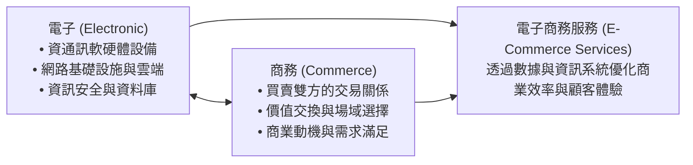
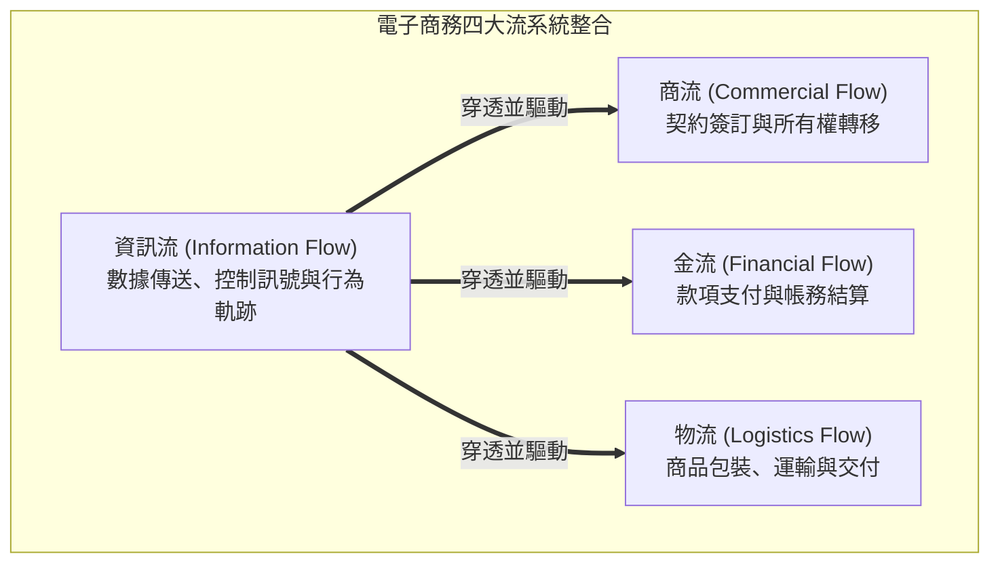
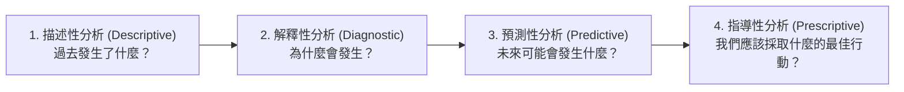
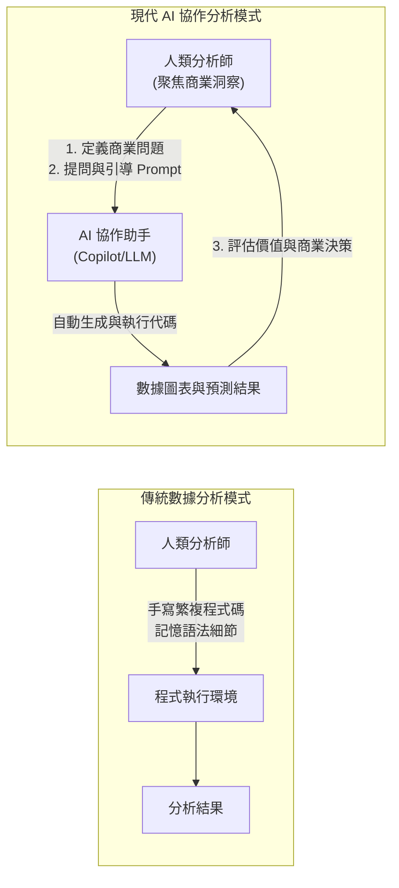
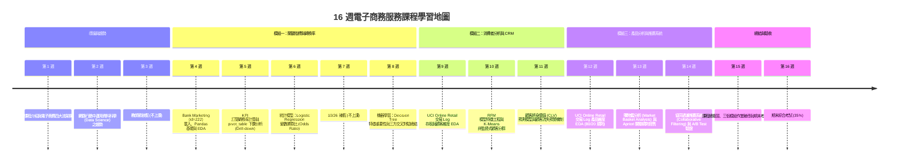
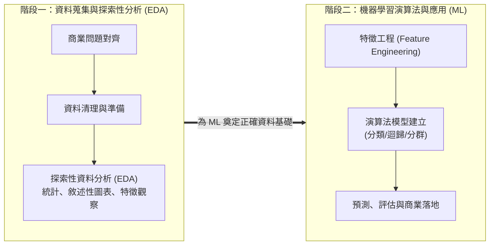
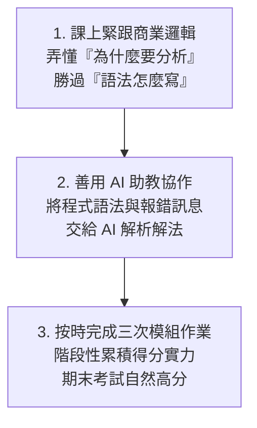

---

puppeteer:

  displayHeaderFooter: true   headerTemplate: '
第一章：電子商務服務導論與課程總覽
'

  footerTemplate: '
第  頁 / 共  頁
'

  margin:

    top: "1.5cm"

    bottom: "1.5cm"

    left: "1.5cm"

    right: "1.5cm"

---

---

# 第一章：電子商務服務導論與課程總覽

## 課程導讀

歡迎來到「電子商務服務」的探索旅程。當前我們所處的時代，電子商務（E-Commerce）早已不再只是「在網頁上擺放商品並提供購物車」那麼簡單。無論是大家日常使用的蝦皮購物、momo 購物網、Amazon，或是手機中各個品牌的獨立 App 與社群購物功能，其背後的商業競爭本質，都已經轉化為一場結合商業洞察、消費者心理學與數據科學的綜合較量。

本門課程是專為大三同學設計的實務與應用導向課程。我們非常清楚，許多人文社會或商管學科的同學在面對「資料科學」、「機器學習」或「程式設計」等關鍵字時，心裡難免會產生焦慮與抗拒，擔心自己因為缺乏資工或數學背景而無法跟上。

請同學們放心，在生成式人工智慧（Generative AI）技術全面爆發的今天，數據分析的門檻已經產生了根本性的轉變。過去需要耗費數個月學習的複雜程式語法，現在可以透過 AI 工具作為強大的協作助手；而真正決定分析成敗的核心，在於商業問題的定義、對資料的敏銳度，以及將分析結果轉化為實體決策的能力——這正是各位作為大三同學最核心的優勢所在。

貫穿本學期的核心學習精神可以總結為：

> 「用商業思維定義問題，用探索分析理解數據，用機器學習預測未來，用 AI 協作實現落地。」

---

## 第一節：電子商務的定義與商業架構

### 1.1 「電子」與「商務」的雙重本質

要理解電子商務服務，首先必須將「電子商務」這個詞彙拆解為兩個基本面向： 「電子（Electronic）」 與「商務（Commerce）」 。許多初學者往往過度偏重技術層面的「電子」，而忽略了商業本質的「商務」；或者只談行銷創意，卻不了解底層資訊系統的運作限制。

1. 「電子」的範疇： 代表支撐交易運行的基礎設施，包含資通訊軟硬體設備、網路通訊協定、行動裝置、雲端運算空間以及資訊安全防護。沒有穩定且安全的「電子」架構，交易便無法在數位環境中流暢且誠信地進行。

2. 「商務」的範疇： 代表商業活動的本質。在學習過程中，我們必須不斷詢問四個核心商業問題：

   - 主體與對象： 究竟是「什麼人」跟「什麼人」在進行交易？

   - 場域與介面： 交易發生在「什麼場所」（官網、App、社群平台或跨國跨境網站）？

   - 價值交換： 交易雙方用「什麼」交換「什麼」（貨幣、服務、數據或是訂閱權益）？

   - 商業動機： 買方為何需要這個產品或服務？賣方如何透過此交易獲取利潤並提供永續價值？

當「電子」與「商務」深度結合時，便孕育出了各種多元的電子商務商業模式。

### 1.2 電子商務的常見商業模式

在數位經濟中，依據交易參與主體的不同（企業 Business、消費者 Consumer、政府 Government、員工 Employee），電子商務展現出多樣化的架構：

- B2C（Business-to-Consumer，企業對消費者）： 最經典的電商形式。企業建立網站或平台，直接向終端消費者銷售商品或服務，例如 Apple 官網、Uniqlo 線上旗艦店。

- B2B（Business-to-Business，企業對企業）： 企業之間透過網路進行大宗採購、供應鏈對接或軟體服務交易，例如台灣積體電路（TSMC）與其上游設備商的電子化採購系統、Shopify 為商家提供建站服務。

- C2C（Consumer-to-Consumer，消費者對消費者）： 個人賣家將商品直接販售給個人買家，早期如 Yahoo! 奇摩拍賣、eBay，或是旋轉拍賣（Carousell）。

- B2B2C（Business-to-Business-to-Consumer，企業對企業對消費者）： 由平台業者提供技術設施、金流物流與流量場域，讓其他品牌商家入駐並銷售給終端消費者。例如蝦皮商城、momo 購物網與 PChome 24h 購物。

- C2B（Consumer-to-Business，消費者對企業）： 由消費者發起需求，逆向集合購買力向企業議價，例如群眾集資平台（嘖嘖、flyingV）或團購主揪團採購。

- 其他延伸範疇： 如 B2G（企業對政府） 採購標案系統、C2G（民眾對政府） 電子化報稅系統，以及企業內部改善管理效率的 B2E（企業對員工） 數位服務。

### 1.3 電子商務的四大流架構

無論哪一種商業模式，要讓一筆電子商務交易順利完成，系統底層必須完美串聯四大運作流程——商流 、金流 、物流 與資訊流 。

1. 商流（Commercial Flow）： 代表交易作業的流通與商品所有權的移轉過程。包含商品上架展示、買賣雙方達成契約意向、訂單成立至產權移交的商業合約精神。

2. 金流（Financial Flow）： 交易過程中資金的往來與結算。從傳統的信用卡刷卡、ATM 轉帳，演進至當代的行動支付（LINE Pay、Apple Pay）、第三方支付（綠界）以及先買後付（BNPL）。

3. 物流（Logistics Flow）： 實體或數位產品的配送過程。從倉儲管理、分揀揀貨、冷鏈運輸，到便利商店取貨與宅急送。

4. 資訊流（Information Flow）： 貫穿整個交易生命週期的數據訊號與控制訊息。從消費者的瀏覽點擊、搜尋關鍵字、購物車暫存，到訂單狀態更新、庫存扣減訊號與物流追蹤碼。

> 核心觀念： 在四流架構中，「資訊流」是現代電子商務的數據心臟 。金流的支付安全、物流的即時追蹤、商流的精準推薦，無一不仰賴資訊流的串聯。為了達到電子商務的最佳營運效益，我們必須學習如何運用資料科學與程式工具，從龐大的資訊流中掘取黃金。

---

### 1.4 課堂探索小活動：身邊電商服務的四大流拆解

請同學們花費 3 分鐘，回想你最近一次使用電商 App（如蝦皮、momo、Uber Eats 或 酷澎 Coupang）完成的購物體驗，並回答下列問題：

1. 主體識別： 這次購物屬於哪一種商業模式（B2C、B2B2C 還是 C2C）？

2. 四流對應：
   - 金流：你使用了哪種支付方式？
   - 物流：商品是如何抵達你手中的？
   - 資訊流：在收到商品前，App 發送了哪些「資訊流訊號」給你（如出貨通知、簡訊驗證碼）？

3. 請與同桌同學交流，討論如果資訊流中斷（例如物流系統無法即時更新狀態），對顧客體驗會造成什麼影響？

> 老師的提醒：
> * 資訊流不只是「網頁畫面」 ：很多初學者以為網頁做得很漂亮就是資訊流。其實，使用者在頁面上停留了幾秒、點擊了哪張圖片、最後為什麼沒有下單離開，這些背後隱藏的數據行為軌跡 ，才是資訊流最有價值的核心。
> * 四大流缺一不可 ：電商創業失敗往往不是因為沒有好商品（商流），而是金流手續費過高、物流配送過慢，或是資訊流無法有效串聯導致訂單錯亂。

---

## 第二節：從傳統行銷到數據驅動：為何文科生不需要害怕程式設計？

### 2.1 數位時代的行銷管道與數據寶庫

過去的傳統行銷（Traditional Marketing）主要依賴電視廣告、報章雜誌或戶外看板。這類管道最大的痛點在於 「無法精確量化成效」——正如行銷學名言所說：「我知道我的廣告費有一半浪費了，但我不知道是哪一半。」

而在數位時代，行銷活動大量轉移至 數位管道（Digital Channels） 上。這些管道不僅是宣播訊息的媒體，更是收集消費者真實行為的龐大數據寶庫：

- 電子郵件（Email）： 成本極低且具備一對一溝通特性。透過分析會員點擊率，進行個人化優惠推薦。

- 搜尋引擎（Search Engine）： 包含自然搜尋最佳化（SEO）與付費關鍵字廣告（PPC）。當使用者搜尋特定字詞時，代表其具備強烈的即時需求。

- 社群媒體（Social Media）： 如 Instagram、TikTok、Facebook、Dcard。除了品牌經營，更可累積用戶生成內容（UGC）與社群互動數據。

- 品牌網站與官方 App： 企業的核心陣地，可收集最完整的瀏覽路徑、商品停留時間與結算轉換數據。

### 2.2 行銷分析的四個層次全景預覽

擁有了海量的數位數據後，我們該如何進行分析？在資料科學領域，行銷分析依據商業價值與技術複雜度由淺入深劃分為四個層次： 描述性分析（過去發生了什麼） 、解釋性分析（為什麼發生） 、預測性分析（未來會發生什麼） 與指導性分析（應採取什麼最佳行動） 。

> 學習導引： 行銷分析四個層次的完整技術工具（SQL/BI $\rightarrow$ A/B Test $\rightarrow$ 機器學習 $\rightarrow$ 最佳化演算法）、數據需求成熟度以及對齊三大模組的實務案例，將於「第二章：資料科學與行銷」 進行全面且深入的拆解。

### 2.3 生成式 AI 時代的數據分析：從「手寫程式」到「AI 協作與問題定義」

看到預測性與指導性分析中出現的「機器學習」與「演算法」，非資工背景的同學可能會心生恐懼。然而，當前人工智慧發展已經進入了全新的範式轉移：

在過去，要完成一份行銷數據分析，資料科學家必須手寫數百行的 Python 或 R 程式碼，熟記各種複雜的函式庫語法（如 Pandas、Scikit-Learn），稍有一個括號或縮排錯誤就會導致程式崩潰。這使得程式語法成為非理工科系學生難以跨越的高牆。

而在生成式 AI 普及的今天，程式碼已不再是阻礙創意的藩籬，而是可被 AI 自動生成的工具！

在「AI 協作」的新模式下：

- AI 負責執行： 撰寫資料清洗腳本、繪製專業視覺化圖表、跑機器學習演算法模型。

- 人類（各位大三同學）負責指揮： 提出正確的商業問題、理解數據的背後意涵、評估模型產出的合理性，並制定最終的行銷決策。

因此，在本門課程中，我們不會要求大家死記硬背 Python 的語法規則，而是帶領大家學會如何利用 AI 工具輔助進行數據處理 ，將寶貴的精神聚焦於「商業問題的解讀」與「資料洞察的萃取」。

---

### 2.4 課堂動手做小活動：用自然語言向 AI 定義行銷問題

請同學們試著在紙上或手機記事本中，將以下一個模糊的商業願望，轉化為可以讓數據分析與 AI 工具執行的「具體分析問題」：

- 模糊的願望： 「我希望我們家電商網站的生意變得更好。」

- 請轉化為包含「四層次分析」概念的精確問題描述：  
  1. （描述性）我想知道過去三個月……
  2. （解釋性）我想釐清為什麼……
  3. （預測性）我想預測未來下個月……
  4. （指導性）我想知道系統應該採取什麼最佳行動來……

> 老師的真心話：
> * 不要讓「不會寫程式」成為你的心魔 ：在真實的商業世界裡，老闆不會因為你會背 Python 的 `import pandas as pd` 就給你高薪；老闆給高薪是因為你能告訴他：「根據這份數據分析，我們應該把 30% 的廣告預算從 Facebook 轉移到 TikTok，因為預測顯示這樣能提升 15% 的整體轉換率。」
> * 商業邏輯永遠比語法重要 ：語法錯了 AI 可以修正，但如果問題定義的方向錯了，寫出再完美的程式碼也只是在「精確地執行錯誤的指令」。

---

## 第三節：本學期 16 週修練地圖與三大模組架構

### 3.1 16 週課程進度全景地圖

本門課程精心規劃為 16 週的漸進式學習旅程，考慮國定假日放假調整，從第一週的課程導論、第二週的行銷數據趨勢，逐步推進至三大核心應用模組，最終以期末綜合考試進行成果驗收：

### 3.2 「資料蒐集與 EDA $\rightarrow$ 機器學習預測」學習雙引擎

觀察上述 16 週地圖，同學們會發現一個貫穿三大模組的核心運作規律：每一個模組都會嚴格遵循「雙階段學習路徑」 。

1. 第一階段：資料蒐集與探索性資料分析（Exploratory Data Analysis，EDA）
   - 核心任務： 就像醫生在開藥前必須先做抽血與照 X 光。我們必須先學習如何從電商資料庫中收集正確的欄位，進行數據清理（處理缺漏值、異常值），並利用敘述性統計與圖表，發掘資料內部的基本分佈規律與異常現象。

2. 第二階段：機器學習演算法進行分析與預測（Machine Learning，ML）
   - 核心任務： 在對數據有了深刻的探索理解後，我們進一步引進機器學習演算法（如邏輯斯迴歸、決策樹、K-Means 分群、關聯規則等），建立預測模型，將分析提升至預測性與指導性層次。

### 3.3 三大核心模組深入剖析

本學期劃分的傳統電商三大核心領域如下：

#### 模組一：行銷中的關鍵指標與轉換率（第 4 至 6、8 週，第 3 週放假、第 7 週補假）

- 核心商業問題： 花了幾十萬投放電話與網路廣告帶來的流量，究竟有多少人真正成功訂閱轉換？如何找出影響消費者「從接觸到訂閱轉換」的關鍵驅動因素？

- 實務內容： 採用 UCI Bank Marketing (id=222) 資料集。第 4 週進行 Pandas 資料存取與 EDA；第 5 週計算 KPI 轉換率與 `pivot_table` 下鑽分析；第 6 週學習 `Logistic Regression` 變數勝算比；第 8 週學習 `Decision Tree` 特徵重要性與三方交叉對驗總結。完成模組後進行模組一作業評量（15 分） 。

#### 模組二：消費者分析與 CRM（第 9 至 11 週）

- 核心商業問題： 誰是我們網站最有價值的「VIP 顧客」？哪些顧客過陣子可能就不再來買了（流失預警）？我們該如何計算一個顧客這輩子能為我們帶來多少收益（顧客終身價值 CLV）？

- 實務內容： 採用廣受讚譽的 UCI Online Retail 交易 Log 資料集（切換至顧客 CustomerID 維度）。第 9 週進行交易 Log 清洗與消費者 EDA；第 10 週進行 RFM 矩陣特徵工程與 K-Means 非監督式顧客分群；第 11 週建構 CLV 迴歸預測模型與顧客流失預警機制。完成模組後進行模組二作業評量（15 分） 。

#### 模組三：產品分析與推薦系統（第 12 至 14 週）

- 核心商業問題： 網站上的幾千種商品中，哪些是貢獻 80% 營收的明星商品？哪些商品適合綑綁在一起銷售？當顧客瀏覽特定產品時，系統該如何推薦最契合的搭售商品以提高客單價？

- 實務內容： 延續使用 UCI Online Retail 交易 Log 資料集（切換至產品 StockCode 與發票 InvoiceNo 維度）。第 12 週進行產品維度 EDA 與帕累托 80/20 規則分析；第 13 週進行發票購物籃分析（Apriori 關聯規則）；第 14 週建構協同過濾推薦系統（Collaborative Filtering）並結合 A/B Test 實驗設計驗證推薦成效。完成模組後進行模組三作業評量（15 分） 。

---

### 3.4 課堂討論小活動：選定感興趣的電商專題方向

請與前後桌同學組成 3-4 人的臨時討論小組，花費 4 分鐘討論並記錄：

1. 在「關鍵指標與轉換率」、「消費者分析」、「產品分析」這三大模組中，你們小組目前最感興趣的是哪一個？為什麼？

2. 如果要以一家你們日常喜歡的電商平台（例如：蝦皮、誠品線上、酷澎 Coupang）為分析目標，你們最想幫這家公司的 CEO 解決哪一個商業痛點？

> 老師的提醒：
> * 切勿跳過 EDA 直接做機器學習 ：許多初學者常犯的錯誤是資料一拿進來，連資料品質好不好、有沒有爛數字都不知道，就急著套用最複雜的機器學習模型。請記住「Garbage In, Garbage Out（垃圾進，垃圾出）」，沒有紮實的 EDA，機器學習只會產出毫無商業價值的垃圾預測。
> * 模組之間是環環相扣的 ：指標、消費者與產品並非孤立存在。優秀的電商經理人會將產品推薦（模組三）精準投放給特定消費族群（模組二），進而提升整體網站的轉換率（模組一）。

---

## 第四節：課程要求、評量方式與學習資源

### 4.1 學期成績計算標準

本門課程為減輕同學的大型報告壓力，並鼓勵持續性學習，取消期中考試與期末專案報告 ，著重於平時課堂參與、三個模組的階段性實作作業以及期末綜合觀念測驗。成績計算配比如下：

| 評量項目 | 配比 | 說明與要求 |
| :--- | :---: | :--- |
| 課堂出席與參與 | 20% | 包含每週課堂小活動參與、點名與課堂互動表現。 |
| 第一模組作業 | 15% | 【關鍵指標與轉換率】主題之資料探索與預測模型階段性實作。 |
| 第二模組作業 | 15% | 【消費者分析】主題之 RFM 分群與 CLV 預測階段性實作。 |
| 第三模組作業 | 15% | 【產品分析】主題之購物籃分析與推薦系統階段性實作。 |
| 期末考試 | 35% | 第 16 週舉行。綜合評量全學期三大模組理論、機器學習觀念與實務應用邏輯。 |

### 4.2 指定教科書與延伸學習資源

- 指定參考教科書：
  - Yoon Hyup Hwang 著，沈佩誼 譯，《行銷資料科學實務--使用Python與R》，碁峰資訊，2020 年。
  *(本教科書提供豐富的實體電商案例與數據集，為本課程各模組範例之重要參考依據)*

- 輔助學習工具與平台：
  - ChatGPT / Claude / Gemini： 作為課後 AI 助教，輔助理解演算法原理與生成分析腳本。
  - Google Colab 雲端環境： 零需安裝複雜軟體，透過瀏覽器即可執行 Python 分析流程。

### 4.3 零程式基礎學生的高分學習策略

為了幫助無程式背景的同學在本門課程中取得優異成績，老師提供以下三點「高分修練祕訣」：

1. 聽課抓核心邏輯： 課堂上請將注意力放在「為什麼這個商業問題需要這種分析方法」，而不是卡在某個程式符號。觀念通了，程式自然有 AI 幫你寫。

2. 建立「AI 協作除錯習慣」： 遇到分析腳本報錯時，不要慌張。將錯誤訊息複製貼給 AI 助手，並詢問：「我是電商分析初學者，請用簡單的語言告訴我這個錯誤是什麼意思？該如何修正？」

3. 踏實完成三大模組作業： 每個模組結束後都有對應的 15 分作業，這是最容易取得分數的環節。透過按部就班演練 EDA 與 AI 協作，不僅能穩拿 45 分模組作業分數，更能為 35% 的期末考試打下堅實基礎。

---

### 4.4 課堂交流小活動：課堂學習夥伴與互助規劃

雖然本學期取消了大型期末專案報告，但同學們在完成三次模組作業與學習 AI 協作時，依然非常鼓勵組建學習互助小組（建議 2-4 人）：

1. 學習互助意向調查：
   - 誰擅長「商業問題定義與文案整理」？
   - 誰對「數據觀察與邏輯推理」有敏銳度？
   - 誰對「與 AI 助手對話 Prompt 設計」感興趣？

2. 請嘗試與旁邊的同學交換聯絡方式，建立學習討論群組，方便課後互相討論模組作業與解惑！

> 老師的真心話：
> * 取消大報告，是為了讓你更專注學習 ：過去很多同學到了期末把 80% 的精力拿去排版簡報 PPT，反而沒時間弄懂數據分析的本質。這次我們把權重分配到三個模組作業（各 15 分）與期末考（35 分），就是希望大家每週都能踏實學會一個實用工具。
> * 評分絕對公平 ：只要每週跟著課堂節奏走，按時繳交模組作業，遇到不懂隨時發問或請 AI 助教解釋，拿高分絕對比想像中更容易！

---

## 本章小結與課後思考題

### 核心觀念回顧

1. 電子商務的本質： 電子商務是「電子技術」與「商業活動」的深度結合。其運作奠基於商流、金流、物流與資訊流 的完美整合，其中「資訊流」是驅動數據分析與商業優化的核心心臟。

2. 數據驅動與 AI 協作新範式： 當代行銷分析涵蓋描述、解釋、預測與指導四個層次。在生成式 AI 時代，非程式背景學生無需害怕代碼，應轉向「用商業思維定義問題，用 AI 協作處理數據」 的全新工作模式。

3. 本學期進度與評量： 扣除第 3 週教師節與第 7 週 10/26 補假，全學期精準聚焦於「指標與轉換率」、「消費者分析」與「產品分析」三大模組。成績由出席（20%）、三大模組作業（45%）與期末考（35%）組成，學習無負擔且階段性收穫明確。

---

### 課後思考題

在進入下一週「網路行銷與資料科學趨勢」之前，請同學們抽空思考以下三個問題：

1. 資訊流的商業價值： 傳統實體柑仔店與現代便利商店（如 7-Eleven）最大的差異之一就在於「POS 系統資訊流」。請試想，當顧客在結帳時，POS 系統收集了哪些資訊流數據？這些數據能幫助店長做什麼決策？

2. 描述性與預測性分析的差異： 如果一家服飾電商老闆說：「我上個月賣出 1,000 件羽絨衣。」這是屬於哪一種層次的分析？如果他想知道「今年冬天哪一款羽絨衣應該多備貨 500 件？」，他需要使用什麼層次的分析？

3. AI 協作時代的核心競爭力： 當人工智慧可以自動幫我們生成程式碼、甚至繪製視覺化圖表時，你認為未來行銷人員最不可被 AI 取代的「核心能力」會是什麼？
