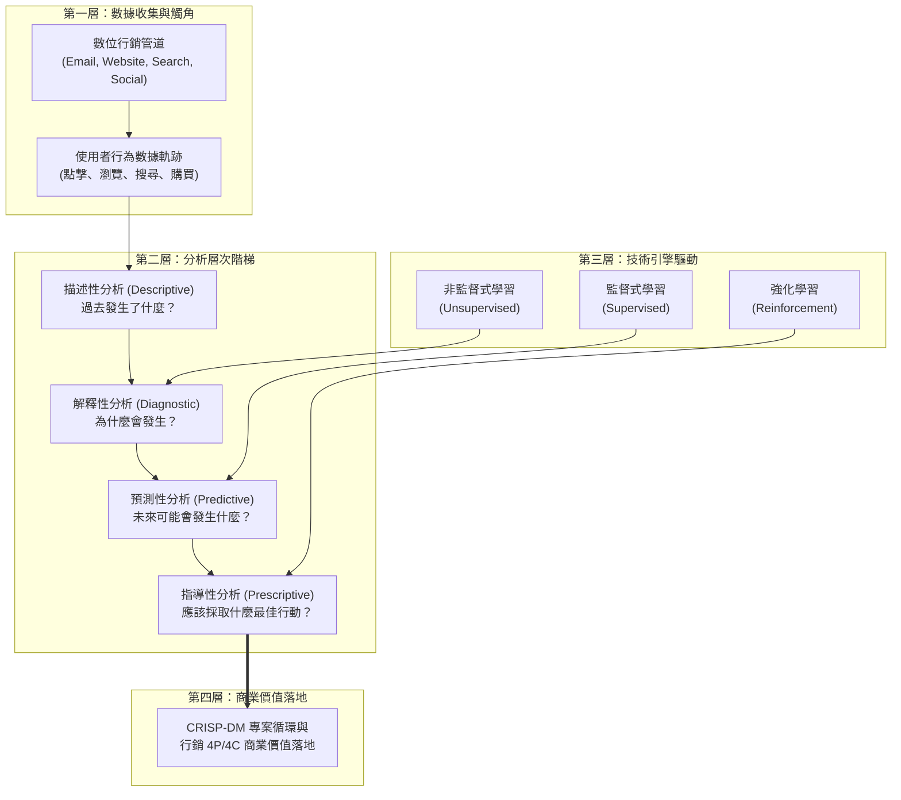
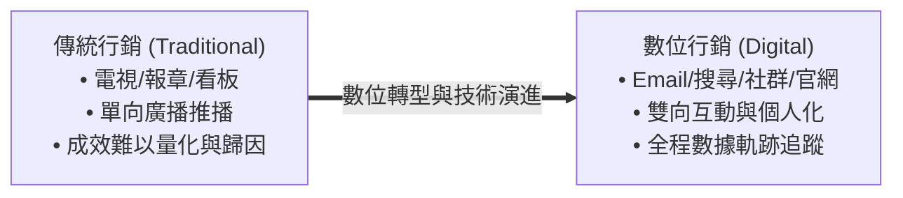
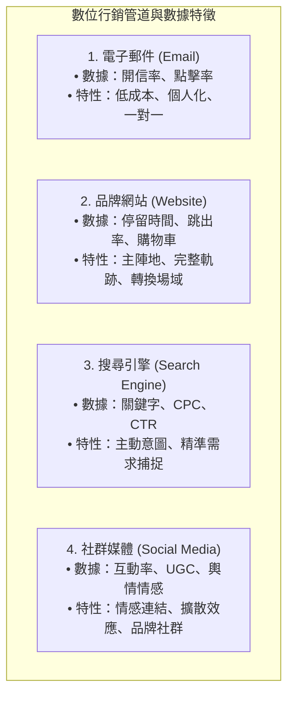
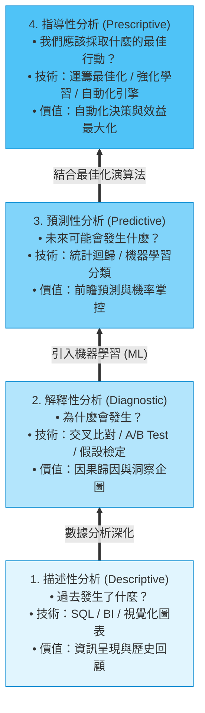
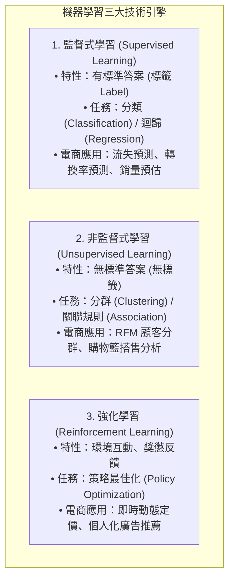
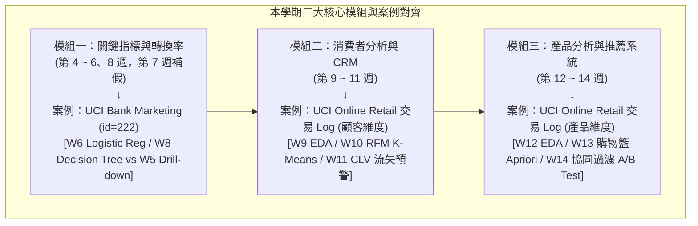
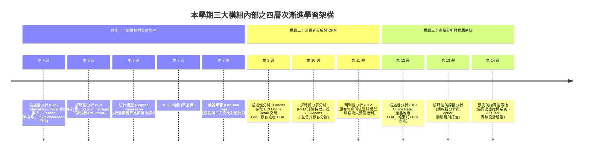
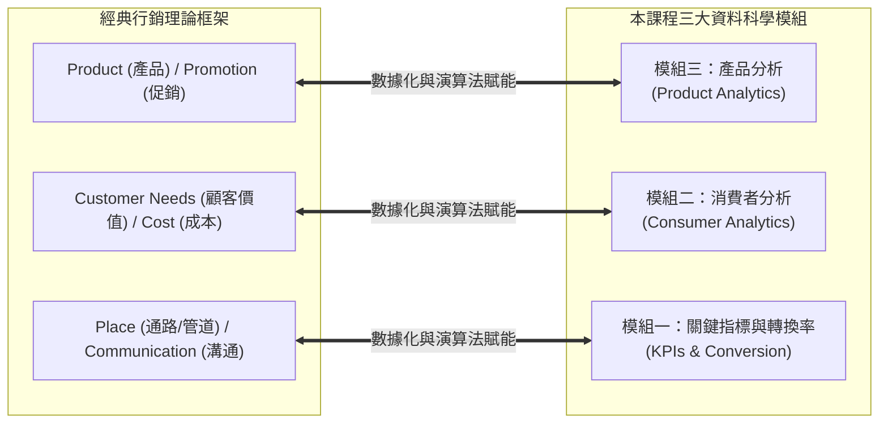
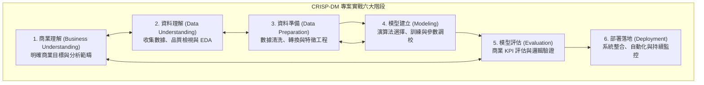

---

puppeteer:

  displayHeaderFooter: true   headerTemplate: '
第二章：資料科學與行銷
'

  footerTemplate: '
第  頁 / 共  頁
'

  margin:

    top: "1.5cm"

    bottom: "1.5cm"

    left: "1.5cm"

    right: "1.5cm"

---

---

# 第二章：資料科學與行銷

## 課程導讀

歡迎來到電子商務服務課程的第二章。在上一章中，我們宏觀地討論了電子商務的雙重本質，以及由商流、金流、物流與資訊流所交織出的商業運作體系，並確立了「資訊流」在當代數位商業中的核心地位。

進入第二章，我們將不直接從大家熟知的購物網站介面切入，而是要深入探討支撐現代電子商務營運運轉的靈魂與心臟——資料科學與行銷（Data Science and Marketing） 。

在當代電子商務的世界裡，不論是大家日常高頻使用的蝦皮購物、momo 購物網、酷棚（Coupang），還是智慧型手機中的各種品牌獨立 App，其背後的商業成功絕非偶然或單靠經驗直覺，而是奠基於對巨量「數據資料」的深刻理解、洞察與演算法應用。傳統的行銷決策往往依賴經驗與感性；而現代資料科學則為行銷注入了精確的理性、因果驗證與預測能力。

貫穿本章的核心學習思維可以總結為：

> 「行銷管道是收集顧客軌跡的觸角，資料科學是解讀行為的引擎，而四個分析層次則是驅動商業價值的階梯。」 本章將帶領同學們依序解構數位行銷管道與數據軌跡 、行銷分析的四個層次 、機器學習三大技術引擎 、對齊三大模組與行銷 4P/4C 的實戰案例 ，最後導入業界標準的資料專案方法論 CRISP-DM 。

---

## 第一節：數位時代的多元行銷管道與數據軌跡

### 1.1 傳統行銷的痛點與數位管道的轉型

在傳統行銷（Traditional Marketing）時代，企業推廣產品主要仰賴電視廣告、報章雜誌、廣播或戶外大型看板。這類宣傳方式被稱為「單向播送（Broadcasting）」，其最大的痛點在於 無法精確量化行銷成效與顧客行為 。正如行銷學大師約翰·華納梅克（John Wanamaker）名言所云：「我知道我的廣告費有一半浪費了，但我不知道是哪一半。」

而在數位時代，絕大多數的行銷活動都轉移到了 數位管道（Digital Marketing Channels） 上。這些管道不僅是宣播行銷訊息的平台，更是即時捕捉、記錄與收集消費者行為特徵的龐大「數據寶庫」。當使用者在數位平台上進行互動時，系統會自動留存下極為細緻的數據軌跡（Data Footprints） 。

### 1.2 四大核心數位管道與實體商業案例

在電子商務營運中，我們常見的四大核心數位行銷管道及其背後的數據特性如下：

#### 1. 電子郵件行銷（Email Marketing）

- 概念與特性： 電子郵件是最直接、最經典且具備高自主權的直接行銷（Direct Marketing）工具。其優勢在於邊際發送成本極低、資訊載體容量大，且具備「一對一」精準溝通與個體識別能力。

- 數據軌跡： 包含開信率（Open Rate）、點擊率（Click-Through Rate，CTR）、退信率（Bounced Rate）、退訂率以及轉換時間點。

- 商業案例： 星巴克（Starbucks）透過分析會員的歷史消費數據，將 Email 作為個人化優惠發送通道。星巴克發現，在早上消費美式咖啡的上班族，與在週末下午消費星冰樂的顧客，對優惠券的敏感度與時間需求截然不同。透過在對的時間點寄送專屬折價券，成功將 Email 點開率從業界平均的 15% 提升至 30% 以上，並帶來顯著的客單價成長。

#### 2. 品牌網站與電子商務平台（Website & E-Commerce Platform）

- 概念與特性： 官方網站或品牌電商 App 是企業的商業主陣地（Owned Media）。相較於第三方平台，企業在自家網站上擁有最高等級的數據控制權與分析維度。

- 數據軌跡： 包含不重複訪客數（Unique Visitors）、頁面停留時間（Dwell Time）、跳出率（Bounce Rate）、滾動深度、瀏覽路徑（Clickstream）與購物車放棄率（Cart Abandonment Rate）。

- 商業案例： 某知名天然手工皂電商發現，許多訪客在進入「手工皂成分頁面」後停留了將近 2 分鐘，卻有超過 60% 的人在未加入購物車的情況下直接跳出離去。經由數據分析與使用者測試，發現消費者對「敏感肌是否適用」存在疑慮。團隊隨後在頁面上優化了成分檢驗報告、加入滿意度評分與智慧搭售推薦系統，成功將網站下單轉換率提升了 20%。

#### 3. 搜尋引擎行銷（Search Engine Marketing，SEM）

- 概念與特性： 包含自然搜尋最佳化（Search Engine Optimization，SEO）與付費關鍵字廣告（Pay-Per-Click，PPC）。搜尋引擎的最大特色在於捕捉顧客的主動意圖（User Intent）——當使用者在 Google 輸入關鍵字時，代表其已具備明確的需求或購物動機。

- 數據軌跡： 關鍵字搜尋量、印象數（Impressions）、廣告點擊率（CTR）、每點擊成本（Cost Per Click，CPC）與品質分數（Quality Score）。

- 商業案例： 新創無線降噪耳機品牌在進入市場時，針對「最佳辦公降噪耳機」、「無線藍牙耳機推薦」等高意圖關鍵字投放 Google 搜尋廣告。透過即時監控後台數據，品牌將表現不佳的通用關鍵字預算，轉移至展現高購買意圖的特定型號關鍵字上，使整體廣告投資報酬率（Return on Ad Spend，ROAS）大幅翻倍。

#### 4. 社群媒體行銷（Social Media Marketing）

- 概念與特性： 涵蓋 Instagram、Facebook、TikTok、Dcard 等社交互動平台。社群媒體擅長建立品牌形象、引發情感共鳴，並能累積龐大的用戶生成內容（User Generated Content，UGC）。

- 數據軌跡： 按讚數、分享數、留言互動率、粉絲成長率、社群輿情情感標記（Sentiment Score）與標籤（Hashtag）擴散度。

- 商業案例： 服飾品牌 ZARA 善用 Instagram 經營社群生態。ZARA 不僅發布官方時尚照，更發起 `#ZaraOOTD` （Outfit of the Day，每日穿搭）活動，鼓勵全體消費者上傳穿著 ZARA 服飾的自拍照。這不僅為品牌創造了數百萬筆免費且真實的 UGC 照片，更提供了設計團隊觀測當季穿搭趨勢與熱門顏色搭配的龐大文字與影像數據庫。

---

### 1.3 課堂探索小活動：身邊數位管道的數據軌跡追蹤

請同學們花費 3 分鐘，回想你最近一次在手機或電腦上進行的購物或瀏覽體驗，並回答下列問題：

1. 管道識別： 你最初是透過哪一個數位管道（Email 促銷、Google 搜尋、IG 社群限時動態，還是直接開啟電商 App）得知該產品訊息的？

2. 數據軌跡反思： 在你最終決定「購買」或「離開」之前，你在該平台上留下了哪些數據軌跡？（例如：點擊了幾張圖片、比較了哪些規格、在購物車放置了多久？）

3. 分組討論： 與同桌同學交流，討論平台業者可能如何利用你留下的這些數據軌跡，在未來向你推播下一次的行銷訊息？

> 老師的提醒：
> * 別把「行銷管道」當作孤立單元 ：在真實的商業營運中，顧客不會只接觸單一管道。一個典型的消費者路徑可能是：在 IG 看到社群廣告（社群） $\rightarrow$ 點擊進入官網瀏覽商品（網站） $\rightarrow$ 上網搜尋評價（搜尋引擎） $\rightarrow$ 收到折扣碼 Email（Email）後完成購買。
> * 數據串聯才是重點 ：行銷資料科學的真正威力，不在於單獨分析 Email 的點擊率，而是將所有管道的數據軌跡串聯（Omnichannel Data Integration），建立出完整的顧客全貌（Customer 360 View）。

---

## 第二節：行銷分析的四個層次與技術跳躍

### 2.1 行銷分析層次全景與數據成熟度曲線

當企業透過各個數位管道收集到龐大的行為數據後，我們該如何從中萃取商業價值？在資料科學與商業分析（Business Analytics）領域，我們將行銷分析由淺入深、由過去展望未來，劃分為 四個漸進的分析層次（Four Levels of Marketing Analytics） ：

1. 描述性分析（Descriptive Analytics） 2. 解釋性分析（Diagnostic / Explanatory Analytics） 3. 預測性分析（Predictive Analytics） 4. 指導性分析（Prescriptive Analytics） 隨著分析層次由描述性向指導性推進，技術門檻與數據成熟度要求隨之提升，但同時所能創造的商業價值與競爭優勢也呈指數型成長 。

---

### 2.2 第一層：描述性分析（Descriptive Analytics）——「發生了什麼？」

#### 核心任務與定義：

描述性分析是行銷分析的第一步，其目標是用最直觀、客觀且精準的方式 總結歷史數據，還原商業活動的既定事實 。它回答的是「過去或現在發生了什麼事？」。

#### 工具與技術：

- 工具： SQL 數據庫查詢、Excel 樞紐分析表、BI 報表工具（如 Tableau、Power BI、Metabase）。

- 技術： 敘述性統計指標（總額、平均數、中位數、標準差、百分位數）、視覺化圖表（折線圖、長條圖、圓餅圖、熱力圖）。

#### 經典商業問題與指標：

- 「我們網站上個月的總銷售額是多少？不重複訪客有多少人？」

- 「過去一年，各個月份的平均轉換率（Conversion Rate）趨勢為何？」

- 「目前佔據公司總營收前三名的熱銷商品種類是什麼？」

---

### 2.3 第二層：解釋性分析（Diagnostic / Explanatory Analytics）——「為什麼會發生？」

#### 核心任務與定義：

在獲知歷史事實後，管理者必然會追問背後的原因。解釋性分析的目標在於 深入探討數據波動背後的根因（Root Cause），釐清變數之間的關聯性與因果關係 。它回答的是「為什麼會發生這樣的情況？」。

#### 工具與技術：

- 工具： Python (Pandas / Seaborn)、R 語言、統計分析套件。

- 技術： 下鑽分析（Drill-down）、交叉比對分析（Cross-tabulation）、統計假設檢定（如 t 檢定、卡方檢定）、歸因模型（Attribution Modeling）與 A/B 測試（A/B Testing） 。

#### 經典商業問題與指標：

- 「為什麼上週雙 11 活動開跑首日，網站的訂單下單量突然大幅下滑 35%？是因為金流系統故障，還是主要競爭對手推出了更激進的折扣方案？」

- 「推動本次電子報行銷活動開信率大增的主因，究竟是信件主旨寫得好，還是折價券金額足夠吸引人？」

- 「透過 A/B 測試比較，看新版購物車結帳流程是否真的顯著降低了顧客的放棄率？」

---

### 2.4 第三層：預測性分析（Predictive Analytics）——「未來可能會發生什麼？」

#### 核心任務與定義：

當分析從「看過去」跨越到「展望未來」，我們便進入了預測性分析的範疇。其目標在於 利用歷史數據建立數學或機器學習模型，估算未來事件發生的機率或數量趨勢 。它回答的是「未來可能會發生什麼？」。

#### 工具與技術：

- 工具： Python (Scikit-Learn / XGBoost / Prophet)、雲端 AI 平台。

- 技術： 時間序列預測（Time Series Forecasting）、多元線性/邏輯斯迴歸（Regression）、機器學習分類演算法（Decision Trees, Random Forest, Gradient Boosting）。

#### 經典商業問題與指標：

- 「根據過往五年的季節性數據與行銷預算，預測今年第四季度的羽絨外套總銷售量會是多少？」

- 「在現有的 10 萬名會員中，系統能否精確預測出哪些 VIP 顧客有高達 85% 的機率會在未來 30 天內取消訂閱（流失預警）？」

- 「當前正在瀏覽網頁的這位訪客，最終完成購買的機率是多少？」

---

### 2.5 第四層：指導性分析（Prescriptive Analytics）——「我們應該採取什麼最佳行動？」

#### 核心任務與定義：

指導性分析是行銷分析的高峰。它不僅能夠預測未來的多種可能性，更能夠在給定的限制條件（如預算、庫存、人力）下， 自動化給出最佳的決策方案或執行策略 。它回答的是「為了達到最佳商業結果，我們現在應該怎麼做？」。

#### 工具與技術：

- 工具： 運籌最佳化套件（PuLP / Gurobi）、強化學習框架、個人化推薦引擎。

- 技術： 線性與非線性規劃（Optimization Algorithms）、強化學習（Reinforcement Learning）、動態定價演算法（Dynamic Pricing Engines）。

#### 經典商業問題與指標：

- 「在總行銷預算為 500 萬元且必須達成 2,000 萬元營收的限制下，系統建議應該如何在 Google、Meta 與 TikTok 之間進行最佳化的預算動態分配？」

- 「針對預測即將流失的高價值顧客，系統應該自動發送 9 折券、免運券還是專屬贈品，才能在行銷成本最小化下達到最高的客戶挽回率？」

- 「面對即時的供需波動，電商平台該如何自動為熱門商品設定即時動態售價，以最大化整體利潤？」

---

### 2.6 四層次分析技術、工具與商業 ROI 比較表

為了幫助同學們對四個分析層次建立全景視野，我們將其技術細節與商業維度整理成下表：

| 分析層次 | 核心問題 | 主要技術與工具 | 數據成熟度需求 | 商業價值與 ROI |
| :--- | :--- | :--- | :--- | :--- |
| 描述性分析 (Descriptive) | 過去發生了什麼？ | SQL, Excel, BI 儀表板, 統計圖表 | 基礎 (單一來源歷史數據) | 基礎營運監控 (了解營運現況與事實) |
| 解釋性分析 (Diagnostic) | 為什麼會發生？ | 交叉比對, 假設檢定, A/B 測試 | 中等 (需整合多維度行為數據) | 洞察與歸因 (釐清成功或失敗根因) |
| 預測性分析 (Predictive) | 未來可能會發生什麼？ | 時間序列, 機器學習分類/迴歸模型 | 高等 (需要高品質標籤與歷史特徵) | 主動風險與機會管理 (精準預測、防患未然) |
| 指導性分析 (Prescriptive) | 應該採取什麼最佳行動？ | 運籌最佳化, 強化學習, 自動化系統 | 極高 (需即時數據串聯與自動化介面) | 自動化決策與效益極大化 (規模化創造最高商業 ROI) |

---

### 2.7 課堂動手做小活動：將商業疑問升級為四層次分析問題

請同學們試著在紙上或手機記事本中，選定一個你感興趣的電商產品（例如：手搖飲外送、線上課程、時尚服飾），將以下一個模糊的商業願望，拆解並升級為涵蓋「四層次分析」的精確問題清單：

- 原始模糊願望： 「我希望我們家電商 App 的會員回購率變好。」

- 請升級為精確的四層次問題： 1. 描述性問題： 我想知道過去半年，我們的會員平均回購週期是 ____ 天，回購率是 ____%？

  2. 解釋性問題： 我想釐清為什麼首購後第 ____ 天沒有回購的顧客，其主要原因是因為 ____ 還是 ____？

  3. 預測性問題： 我想建立模型，預測哪些註冊滿 14 天的會員，在未來一週內回購機率低於 ____%？

  4. 指導性問題： 針對這些低回購機率的會員，系統應該自動推播 ____ 優惠，才能在成本最小化下將回購率提升至 ____%？

> 老師的真心話：
> * 不要停留在「描述性分析」的溫暖區 ：許多初入職場的分析師，每天都在做拉 SQL 報表、畫 Excel 折線圖的描述性工作。雖然描述性分析很有用，但它的商業價值有限。
> * 邁向「預測與指導」才是高薪關鍵 ：企業之所以願意為高階資料科學家提供高薪，是因為他們能利用預測與指導性分析，直接幫公司「省下數百萬的盲目行銷預算」或「精準挽回即將流失的黃金 VIP 顧客」。

---

## 第三節：驅動預測與指導的技術引擎：機器學習三大類型

### 3.1 什麼是機器學習？電腦如何從數據中發現規律

在上一節的分析階梯中，我們看到當分析從「描述/解釋（看過去）」跨越到「預測/指導（展望未來）」時，必須引進全新的技術引擎——機器學習（Machine Learning，ML） 。

傳統的程式設計思維是： 「人類輸入數據 + 人類撰寫規則 $\rightarrow$ 電腦輸出答案」 。然而，在面對海量且動態變化的電商數據時，人類不可能窮舉所有的行銷規則。

機器學習則翻轉了這個範式： 「人類輸入數據 + 人類提供歷史答案 $\rightarrow$ 電腦自動學習並輸出規則（模型）」 。電腦會透過數學演算法，自動從龐大的歷史數據中發掘隱藏的模式、規律與關聯特徵，並建立預測模型。

在電商行銷應用中，機器學習主要劃分為三大核心類型：

---

### 3.2 監督式學習（Supervised Learning）與電商應用

#### 概念與運作原理：

監督式學習就像是在教導一位學生做有「標準答案（Ground Truth / Label）」的歷屆試題。我們向演算法提供大量的「輸入特徵（X，如顧客年齡、瀏覽次數）」以及對應的「正確標籤（Y，如最終購買或未購買）」。演算法的目標是學習一個映射函數 $f(X) = Y$，使得當未來輸入全新的特徵 $X_{new}$ 時，模型能夠準確預測出對應的 $Y_{new}$。

#### 兩大核心任務與電商實例：

1. 分類任務（Classification）： 預測目標 $Y$ 是離散的類別標籤。

   - 電商應用： 顧客流失預測（流失 vs. 留存）、轉換率預測（下單 vs. 未下單）、垃圾 Email 過濾。

   - 常用演算法： 邏輯斯迴歸（Logistic Regression）、決策樹（Decision Trees）、隨機森林（Random Forest）、XGBoost。

2. 迴歸任務（Regression）： 預測目標 $Y$ 是連續的數值。

   - 電商應用： 顧客終身價值（CLV）金額預估、雙 11 促銷期間特定產品的銷售數量預測。

   - 常用演算法： 多元線性迴歸（Linear Regression）、嶺迴歸（Ridge）、樹狀迴歸模型。

---

### 3.3 非監督式學習（Unsupervised Learning）與電商應用

#### 概念與運作原理：

與監督式學習不同，非監督式學習是在「沒有標準答案（無標籤 Label）」的情況下進行。演算法直接分析輸入數據的內在結構與幾何特徵，自動發掘數據點之間的相似性、相近性或關聯模式。它就像將一群沒有品種標籤的狗狗照片交給電腦，電腦根據耳朵形狀與毛色自動分類。

#### 兩大核心任務與電商實例：

1. 分群任務（Clustering）： 將相似的資料點自動歸類為同一群體（Cluster）。

   - 電商應用： RFM 顧客分群 （將顧客分為 VIP、潛力客、沉睡客）、市場細分（Market Segmentation）。

   - 常用演算法： K-Means 演算法、階層式分群（Hierarchical Clustering）、DBSCAN。

2. 關聯規則探勘（Association Rule Mining）： 發掘資料項目之間「同時出現」的高頻規律。

   - 電商應用： 購物籃分析（Market Basket Analysis） （發掘啤酒與尿布、相機與記憶卡同時被放入購物車的關聯搭售規律）。

   - 常用演算法： Apriori 演算法、FP-Growth 演算法。

---

### 3.4 強化學習（Reinforcement Learning）簡介

#### 概念與運作原理：

強化學習（Reinforcement Learning，RL）是機器學習中最具未來感的一支。它不依賴靜態數據集，而是讓一位 代理人（Agent） 在給定的環境（Environment） 中透過「試錯（Trial and Error）」不斷採取行動（Action） 。環境會根據行動的優劣給予獎勵（Reward） 或懲罰（Penalty） ，代理人的目標是學習出一套最佳策略（Policy），以獲取最大化的長期累積獎勵。

#### 電商場景前瞻應用：

- 動態定價引擎（Dynamic Pricing Engine）： 定價 Agent 根據市場需求、競爭對手價格與庫存壓力即時調整產品售價。若調價後營收成長則獲得正獎勵，若調價導致銷量暴跌則獲得負懲罰，最終學會自動化的最佳動態定價策略。

- 即時個人化推薦與廣告競價（Real-time Bidding & Recommendation）： 系統根據使用者的實時點擊反饋（點擊 = 正獎勵，跳出 = 負獎勵），動態調整廣告投放與推薦內容順序。

> 老師的提醒：
> * 不用背複雜的數學公式 ：對於非資工背景的同學，學習機器學習的關鍵在於「清楚定義問題的輸入與輸出」 ，而不是去死記演算法背後的矩陣微分公式。
> * 釐清「有無標籤」是第一步 ：拿到商業問題時，先問自己：「我們手上有沒有過去留下的標準答案（標籤）？」有標籤用監督式學習；沒標籤想找分群或關聯用非監督式學習；要即時互動最佳化用強化學習。

---

## 第四節：對齊三大模組的實戰案例：行銷管道遇上資料科學

為了讓同學們能夠將前述的行銷管道、四個分析層次與機器學習技術融會貫通，並為後續學期的課程鋪路，本節將 嚴格按照本學期的三大核心模組順序 ，介紹三個精選的跨領域實戰案例，並討論傳統行銷 4P/4C 框架與課程模組的深刻對映。

---

### 4.1 對齊模組一【關鍵指標與轉換率】：Bank Marketing 資料集與轉換率分析

#### 案例背景：

在行銷資料科學中，如何透過行銷活動提升顧客的「訂閱與購買轉換率」是極具代表性的商業課題。本模組實戰以金融與電商領域廣受使用的 UCI Bank Marketing 資料集（透過 `ucimlrepo` 套件載入 `id=222`） 為學習主軸。該資料集記錄了機構透過電話行銷推廣定期存款時，數萬筆客戶的人口統計變數、聯絡特徵以及最終是否成功訂閱的轉換結果（目標欄位 $y = \text{yes/no}$）。

#### 模組一四週學習路徑（第 4、5、6、8 週實務規劃，第 7 週補假）：

1. 第 4 週：資料取得與探索性資料分析（EDA）
   - 實務內容： 使用 Python 的 `ucimlrepo` 套件載入 Bank Marketing 資料集（`fetch_ucimlrepo(id=222)`）。
   - 技術重點： 著重於如何進行資料存取、 `Pandas` 套件的基本應用（資料讀取、型態檢視、缺失值與異常值處理）。
   - 圖形工具應用： 結合 `matplotlib` 及 `seaborn` 等視覺化圖形工具，繪製客戶屬性（如年齡 `age`、職業 `job`、教育 `education`、通話時長 `duration`）的分佈圖表。

2. 第 5 週：行銷關鍵績效指標（KPI）與下鑽分析（Drill-down Analysis）
   - 實務內容： 針對此資料集計算本次行銷活動的核心 KPI——訂閱轉換率（Conversion Rate） 。
   - 技術重點： 利用 Pandas 的 `pivot_table` 與 `groupby` 工具進行 下鑽分析（Drill-down Analysis） ，從整體轉換率逐層下鑽比對不同職業、婚姻狀況、教育程度與聯絡管道等細分客群之間的轉換率差異。

3. 第 6 週：邏輯斯迴歸（Logistic Regression）勝算比與變數解釋
   - 實務內容： 專注於 邏輯斯迴歸（Logistic Regression） 統計分類模型。
   - 技術重點： 學習如何從迴歸係數計算變數勝算比（Odds Ratio），深入剖析哪些變數對轉換率具備正向或負向影響，並與第 5 週人工 `pivot_table` 下鑽分析結果進行對比。
   - *(註：第 7 週為 10/26 補假，不上課)*

4. 第 8 週：決策樹（Decision Tree）特徵重要性與三方交叉比對收尾
   - 實務內容： 專注於 決策樹（Decision Tree） 機器學習模型。
   - 技術重點與對比： 提取決策樹的可解釋特徵重要性（Feature Importance），將 Decision Tree、Logistic Regression 與第 5 週的 Drill-down 下鑽分析結果進行三方交叉比對，完成模組一的總結收尾。

---

### 4.2 對齊模組二【消費者分析】：UCI 線上零售資料集與顧客生命週期管理 (CRM)

#### 案例背景：

在消費者分析領域，了解顧客的消費行為圖像、進行會員分群並預測顧客終身價值，是企業 CRM（顧客關係管理）的核心。本模組實戰採用廣受業界讚譽的 UCI 線上零售資料集（Online Retail Data Set） 。該資料集包含了跨國線上零售商數十萬筆真實交易明細（包含發票號碼 `InvoiceNo`、商品編號 `StockCode`、購買數量 `Quantity`、交易時間 `InvoiceDate`、單價 `UnitPrice` 與顧客 ID `CustomerID`）。

#### 模組二三週學習路徑（第 9 至 11 週實務規劃）：

1. 第 9 週：資料存取與消費者行為探索性資料分析（EDA）
   - 實務內容： 使用 Python 的 `Pandas` 套件讀取線上零售交易 Log 資料集。
   - 數據清洗與 EDA： 學習處理真實電商 Log 中的退貨負數訂單、剔除缺少 CustomerID 的紀錄；進行以「消費者」為單位的探索性資料分析（如客單價分佈、消費時間偏好、國籍分佈）。

2. 第 10 週：RFM 模型特徵工程與 K-Means 非監督式顧客分群
   - 實務內容： 將原始交易 Log 轉置聚合成以顧客為單位的 RFM 矩陣 （Recency 最新消費日、Frequency 消費頻率、Monetary 消費金額）。
   - 技術重點： 套用非監督式學習中的 K-Means 分群演算法 ，將數萬名會員自動劃分為若干個特徵群體（如高價值 VIP 核心客、對折扣敏感特攻隊、新進潛力股、沉睡待喚醒客），建立完整的顧客 360 度畫像。

3. 第 11 週：顧客終身價值（CLV）預測模型與流失預警機制
   - 實務內容： 結合歷史消費週期特徵，建立 顧客終身價值（CLV）迴歸預測模型 與 流失預警（Churn Prediction）機制 。
   - 技術重點： 在顧客展現出停止消費跡象前進行前瞻預測，協助行銷團隊自動標記出高流失風險的黃金 VIP 顧客，實施預防性精準行銷。

---

### 4.3 對齊模組三【產品分析】：UCI 線上零售資料集之購物籃分析與智慧推薦系統

#### 案例背景：

模組三延續使用同學已熟悉的 UCI 線上零售資料集（Online Retail Data Set） ，但將分析視角從「顧客（CustomerID）」切換為「產品與交易（InvoiceNo & StockCode）」。經營者希望透過資料科學發掘隱藏的商品搭售規律，提高單次購物客單價，並透過智慧推薦提供精準的產品搭配建議。

#### 模組三三週學習路徑（第 12 至 14 週實務規劃）：

1. 第 12 週：產品銷售表現與特徵數據探索性分析（EDA）
   - 實務內容： 針對交易 Log 切換至產品維度進行 EDA，繪製帕累托 80/20 曲線圖。分析哪些熱銷商品（StockCode）貢獻了全站 80% 的營收，以及不同品類商品的銷售分佈特徵。

2. 第 13 週：購物籃分析（Market Basket Analysis）與關聯規則探勘
   - 實務內容： 以發票號碼（`InvoiceNo`）為購物籃單位，套用非監督式學習的 Apriori 關聯規則演算法 。
   - 商業洞察： 自動探勘購物車中隱藏的產品組合搭售規律（如計算支持度 Support、置信度 Confidence 與提升度 Lift），發掘高頻發生的跨商品搭售組合。

3. 第 14 週：協同過濾推薦系統（Collaborative Filtering）與 A/B Test 實驗設計
   - 實務內容： 建構 協同過濾推薦系統（Collaborative Filtering） ，根據歷史交易矩陣計算產品與顧客的相似度，預測訪客可能感興趣的搭配商品；並結合 A/B 測試實驗設計 驗證推薦成效與商業效益。

---

### 4.4 貫穿三大模組的「四層次漸進學習邏輯」

觀察上述三個案例與本學期 16 週的課程規劃，同學們可以清晰地發現： 本門課程的週次安排並非零散的技術堆疊，而是每一個模組都嚴格依循著「四個分析層次」的演進邏輯漸進推進 ：

---

### 4.5 傳統行銷 4P 與現代行銷 4C 框架與課程三大模組的對映關聯

許多人文社會與商管背景的同學，在大學前期的行銷學課程中都學習過經典的 行銷 4P 框架（Product 產品, Price 價格, Place 通路, Promotion 促銷） 以及以顧客為中心演進的 行銷 4C 框架（Customer 顧客, Cost 成本, Convenience 便利, Communication 溝通） 。

資料科學絕非要拋棄這些經典理論，而是 透過數據與演算法，為 4P 與 4C 注入量化與自動化的實作能力 。本課程的三大模組與 4P/4C 的對映關係如下：

#### 1. 模組二【消費者分析】$\Longleftrightarrow$ 對應 4C 中的 Customer（顧客價值）與 4P 中的 Consumer Needs
- 對映解析： 傳統行銷 4C 強調「以顧客需求為核心」。模組二透過 RFM 矩陣、K-Means 顧客分群、CLV 預測與流失預警模型 ，讓企業不再只是憑空想像顧客畫像，而是能用真實交易數據精準定義誰才是高價值的 Customer，並透視其全生命週期的真實需求。

#### 2. 模組三【產品分析】$\Longleftrightarrow$ 對應 4P 中的 Product（產品）與 Promotion（促銷/搭售）及 4C 的 Convenience（便利）

- 對映解析： 4P 中的 Product 與 Promotion 討論「賣什麼產品」與「如何組合促銷」。模組三透過 購物籃分析與協同過濾推薦系統 ，將傳統人工設定的組合促銷，升級為系統自動發掘的關聯搭售；同時透過個人化推薦，大幅降低顧客尋找產品的時間成本，實踐了 4C 中 Convenience（購買便利性）的極致。

#### 3. 模組一【關鍵指標與轉換率】$\Longleftrightarrow$ 對應 4P 中的 Place（通路/流量）/ Promotion 與 4C 的 Communication（雙向溝通）

- 對映解析： 4P 中的 Place 代表交易發生的數位場域與流量管道，Communication 則代表與顧客的雙向互動。模組一透過 流量 KPI 監控、點擊率分析、下鑽歸因與雙模型預測 ，精確量化每一個數位行銷管道（Place）的溝通效率（Communication），確保每一筆促銷廣告預算都能轉化為實質的商業轉換。

---

## 第五節：資料科學專案的通用實戰框架：CRISP-DM

### 5.1 什麼是 CRISP-DM？業界標準的方法論

在了解了分析層次、機器學習技術與商業案例後，同學們可能會問：「當我拿到一份商業數據時，到底應該從哪裡開始著手？」

在真實的資料科學領域，為防止分析人員走入盲目摸索的陷阱，業界廣泛採用一套標準的資料探勘流程方法論——CRISP-DM（Cross-Industry Standard Process for Data Mining，跨行業數據挖掘標準流程） 。

CRISP-DM 將一個完整的資料科學專案拆解為 六個相互關聯的階段 ：

---

### 5.2 CRISP-DM 六大階段深度拆解與電商實例

#### 第一階段：商業理解（Business Understanding）

- 核心任務： 從商業目標出發，明確專案要解決的核心商業痛點，並將其轉化為可量化的資料科學問題與 KPI。

- 電商實例： 「我們書店 App 的首購會員，有超過 40% 在首購後 30 天內沒有進行第二次消費。團隊的商業目標是在不增加廣告預算前提下，將首購 30 天內的回購率提升 10%。」

#### 第二階段：資料理解（Data Understanding）

- 核心任務： 收集相關數據來源，進行初期的探索性資料分析（EDA），了解數據欄位的特性、品質、缺失情況與潛在的分佈規律。

- 電商實例： 從資料庫匯出過去一年 5 萬名新會員的個人屬性、首購訂單金額、購買書籍種類、APP 登入頻率與推播開啟紀錄，檢查欄位是否有缺漏。

#### 第三階段：資料準備（Data Preparation）

- 核心任務： 將原始數據清理、轉換並構建成適合輸入演算法模型的最終數據集（特徵工程 Feature Engineering）。

- 電商實例： 清理無效帳號與測試訂單；將消費時間點轉換為「距離首購的天數」；將書籍種類轉換為 One-Hot 編碼；計算「首購後 14 天內 APP 登入次數」作為特徵變數。

#### 第四階段：模型建立（Modeling）

- 核心任務： 選擇並套用各種機器學習演算法，調校模型參數，讓模型從數據中學習規律。

- 電商實例： 套用邏輯斯迴歸（Logistic Regression）與決策樹（Decision Tree）分類模型，訓練模型預測「會員是否會在 30 天內回購」。

#### 第五階段：模型評估（Evaluation）

- 核心任務： 從「商業目標」與「統計指標（如 Precision, Recall, AUC）」雙重標準評估模型表現，檢驗模型是否真正解決了第一階段定義的商業問題。

- 電商實例： 評估發現模型能在會員註冊第 14 天時，以 82% 的準確率標記出高流失風險顧客；且決策樹顯示「首購後 14 天內未開啟 App 且無收藏行為」是影響不回購的最強特徵。

#### 第六階段：部署與落地（Deployment）

- 核心任務： 將評估通過的模型正式整合進企業的營運系統或業務流程中，將數據洞察轉化為自動化的商業行動，並持續監控模型表現。

- 電商實例： 將預測模型部署至電商系統後台。系統每天凌晨自動執行排程，篩選出首購滿 14 天且預測回購率低於 30% 的會員，自動觸發發送一張「專屬新書 85 折優惠券」Email，實現數據驅動的自動化精準行銷。

---

### 5.3 CRISP-DM 的疊代與雙向循環本質

同學們必須特別注意： CRISP-DM 絕非一條單向的直線流程，而是一個具備雙向反饋與持續疊代的動態循環 ：

1. 雙向箭頭的意涵： 例如在「模型建立（Modeling）」階段發現特徵維度不足時，必須退回「資料準備（Data Preparation）」階段重新進行特徵工程；在「模型評估（Evaluation）」階段若發現模型結果無法解決商業痛點，則必須重新退回「商業理解（Business Understanding）」階段重新定義問題。

2. 持續監控與維護： 當模型部署上線後，隨著消費者行為改變與市場環境變遷，模型的預測準確率會隨時間逐漸衰退（Model Drift）。因此，團隊必須持續監控數據，定期啟動下一次 CRISP-DM 循環以更新模型。

---

### 5.4 課堂實作小活動：以「線上書店提升回購率」演練 CRISP-DM 流程

請同學們以 3-4 人小組為單位，選擇一個生活中的電商問題（例如：Uber Eats 如何減少顧客棄單、蝦皮如何提高買家評價率），嘗試在紙上畫出專屬的 CRISP-DM 六大階段實作心智圖：

1. 商業理解： 我們想解決的核心問題是？可量化的商業 KPI 是？

2. 資料準備： 我們需要收集並清洗哪些欄位？可以創造什麼新特徵？

3. 部署落地： 分析模型最後要如何與 App 或網站介面串聯？

> 老師的提醒：
> * 80% 的時間都會花在「商業理解與資料準備」 ：許多程式新手常以為資料科學就是一行 `model.fit()` 跑演算法。實務上，花在寫程式跑模型的時間往往不到 10%；真正的功力全在於前期有沒有搞懂商業問題，以及資料清理得乾不乾淨。

---

## 本章小結與課後思考題

### 核心觀念回顧

1. 行銷管道與數據軌跡： 現代數位行銷管道（Email、網站、搜尋引擎、社群媒體）是收集消費者行為軌跡的觸角。行銷資料科學的核心在於將多管道數據串聯，建立完整的顧客 360 度全貌視角。

2. 行銷分析的四個層次： 從「描述性（發生了什麼）」、「解釋性（為什麼發生）」、「預測性（未來會發生什麼）」到「指導性（該採取什麼最佳行動）」，分析難度與數據成熟度逐步提升，同時創造的商業價值也呈指數型成長。

3. 機器學習三大引擎： 機器學習是驅動預測與指導性分析的核心技術。監督式學習處理有標籤的分類與迴歸；非監督式學習處理無標籤的分群（RFM）與關聯（購物籃）；強化學習處理即時動態定價與策略最佳化。

4. 模組對齊與 4P/4C 框架： 本學期三大模組（指標與轉換率、消費者分析、產品分析）分別對應行銷 4P/4C 框架中的 Place/Communication、Customer 以及 Product/Promotion，且每個模組內部皆嚴格遵循四層次漸進學習結構。

5. CRISP-DM 標準流程： 解決商業問題必須仰賴規範化的流程。包含商業理解、資料理解、資料準備、模型建立、模型評估與部署落地六大階段，並具備雙向反饋與動態疊代本質。

---

### 課後思考題

在進入下一章「關鍵績效指標（KPI）與轉換率分析」之前，請同學們抽空思考以下三個問題：

1. 數位軌跡串聯的隱私爭議： 企業在收集顧客跨管道的數據軌跡（如第三方 Cookie、廣告追蹤碼）以建立 Customer 360 畫像時，可能面臨哪些隱私法規（如 GDPR、蘋果 iOS 隱私新制）的挑戰？行銷團隊該如何在「個人化推薦」與「保護用戶隱私」之間取得平衡？

2. 描述性與預測性分析的思考切換： 假設一家服飾電商老闆發現「上個月白色 T-Shirt 銷量突然大增 50%」（描述性分析），他想利用機器學習來預測「下個月是否應該加碼備貨 1,000 件」（預測性分析）。在建立預測模型時，有哪些外部特徵變數（如天氣氣溫、網紅穿搭話題、促銷折扣）是必須納入模型考量的？

3. CRISP-DM 失敗經驗反思： 在 CRISP-DM 六大階段中，為什麼業界普遍認為「第一階段（商業理解）」定義錯誤，是導致過半資料科學專案最終走向失敗的主因？請舉出一個你身邊「技術很炫但無法解決商業問題」的例子並加以說明。
