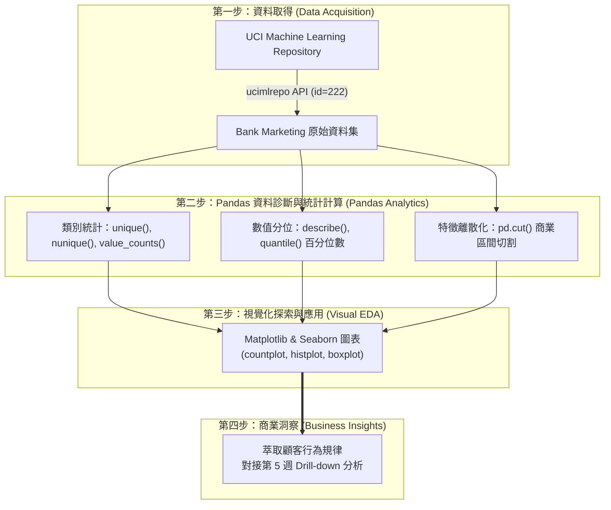
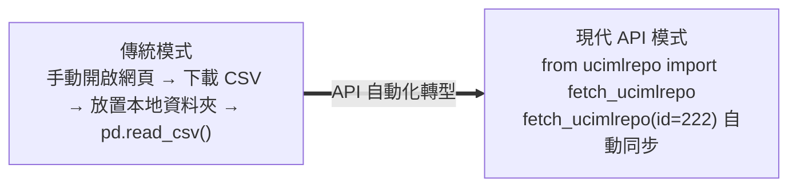
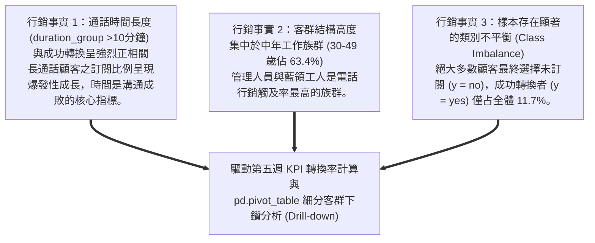

---
puppeteer:
  displayHeaderFooter: true
  scale: 1.15
  headerTemplate: '<div style="font-size: 11px; margin: 0 auto;">第四章：資料取得與探索性資料分析（EDA）</div>'
  footerTemplate: '<div style="font-size: 11px; margin: 0 auto;">第 <span class="pageNumber"></span> 頁 / 共 <span class="totalPages"></span> 頁</div>'
  margin:
    top: "1.5cm"
    bottom: "1.5cm"
    left: "1.5cm"
    right: "1.5cm"
---

<style>
  /* 全域字型、字級與行距 */
  body {
    font-size: 13pt !important;
    line-height: 1.7 !important;
    font-family: "Microsoft JhengHei", "PingFang TC", "Helvetica Neue", sans-serif;
  }

  /* 階層標題微調 */
  h1 { font-size: 24pt !important; margin-bottom: 0.5em !important; }
  h2 { font-size: 18pt !important; page-break-before: always; }
  h3 { font-size: 15pt !important; }
  h4 { font-size: 13.5pt !important; }

  /* 表格文字放大與排版優化 */
  table, th, td {
    font-size: 12pt !important;
    line-height: 1.5 !important;
  }

  /* 程式碼區塊 */
  pre, code {
    font-size: 11.5pt !important;
    font-family: Consolas, "Courier New", monospace !important;
  }

  /* Mermaid 流程圖節點字體放大 */
  .mermaid text {
    font-size: 14px !important;
  }
</style>

---

# 第四章：資料取得與探索性資料分析（EDA）

## 課程導讀

歡迎來到電子商務服務課程的第四章。在前面兩章中，我們解構了電子商務的四大流架構、行銷分析的四個層次，以及驅動預測與指導性分析的機器學習三大技術引擎。

從本章開始，我們正式進入 「模組一：關鍵指標與轉換率」 的實戰歷程！

在資料科學與機器學習的實務專案中，許多初學者常犯的錯誤是：一拿到資料就急著套用複雜的機器學習演算法模型（如 `model.fit()`）。然而，在業界有一句名言叫作 「Garbage In, Garbage Out（垃圾進，垃圾出）」——如果我們對資料的結構、品質、缺失狀況與分佈偏態一無所知，再強大的演算法也只能產出毫無價值的垃圾預測。

因此，本章將帶領同學們踏出資料科學專案的第一步： 「資料取得（Data Acquisition）」 與「探索性資料分析（Exploratory Data Analysis，EDA）」 。我們將以金融與電商領域廣受使用的UCI Bank Marketing 資料集（`id=222`） 為實戰載體，學習如何透過 Python API 存取權威數據庫，並結合 `Pandas` 的進階統計計算（`unique`, `nunique`, `quantile`, `cut`）與 `matplotlib`/ `seaborn` 視覺化工具，還原顧客人口統計變數與行為特徵的既定事實。

貫穿本章的核心學習思維可以總結為：

> 「資料取得是探索的起點，EDA 是資料診斷的聽診器；讓數據自己說話，才能為商業決策奠定基石。」



---

## 第一節：權威行銷資料集的取得與 API 存取（ucimlrepo 實戰）

### 1.1 什麼是 UCI Machine Learning Repository？

在進行行銷資料科學研究與實作時，找到具備真實商業脈絡且無隱私爭議的「標準公開資料集（Benchmark Datasets）」是極其關鍵的一步。

UCI Machine Learning Repository（加州大學歐文分校機器學習資料庫） 是全球資料科學界、機器學習領域中最權威且歷史悠久的公開數據庫之一。它收錄了來自各個領域（金融、醫療、電商、生物資訊等）數百個高品質的真實研究資料集，為全球學者與資料分析師提供了標準化的實務測試場域。

在過去，分析師需要手動前往 UCI 網站下載 CSV 檔案，再經由繁瑣的路徑解壓縮與載入。而在生成式 AI 與自動化資料管線（Data Pipeline）普及的今天，我們可以直接使用 Python 的 `ucimlrepo` 套件，透過程式碼 API 一鍵取得遠端資料集。



---

### 1.2 使用 Python ucimlrepo 套件載入 Bank Marketing 資料集

本學期模組一所採用的核心載體是Bank Marketing 資料集（UCI 資料庫編號 `id=222`） 。該資料集記錄了一家葡萄牙銀行機構在特定行銷專案期間，透過「電話行銷（Telemarketing）」向數萬名客戶推廣定期存款（Term Deposit）的真實歷史數據。

在 Python 環境中，我們可以透過簡潔的 API 指令載入該資料集。請參考下列程式碼：

```python
# 安裝 ucimlrepo 套件（若在 Google Colab 環境可直接執行）
# !pip install ucimlrepo
from ucimlrepo import fetch_ucimlrepo
# 透過資料集專屬 ID (222) 一鍵載入 Bank Marketing 資料集
bank_marketing = fetch_ucimlrepo(id=222)
# 提取特徵變數矩陣 (X) 與目標變數向量 (y)
X = bank_marketing.data.features
y = bank_marketing.data.targets
# 檢視載入結果之維度
print(f"特徵變數維度 X: {X.shape}")
print(f"目標變數維度 y: {y.shape}")
```

#### 程式碼解讀：

1. `fetch_ucimlrepo(id=222)` ：呼叫 API 直接向 UCI 資料庫請求代碼為 `222` 的 Bank Marketing 資料集，回傳一個包含數據與中繼資料（Metadata）的物件。

2. `bank_marketing.data.features` ：自動將資料集中的「輸入特徵（X，如顧客年齡、職業、教育、通話時長）」獨立拆解為一個 Pandas DataFrame。

3. `bank_marketing.data.targets` ：自動將「目標變數（y，顧客是否成功訂閱定期存款）」獨立抽取出來。

---

### 1.3 拆解 Bank Marketing 資料集結構：特徵變數與目標變數

載入資料集後，我們必須先理解這個資料集包含了哪些關鍵欄位與行銷脈絡。Bank Marketing 資料集共有45,211 筆客戶紀錄 ，主要包含四大類欄位特徵：

1. 顧客人口統計特徵（Customer Demographics）：
   - `age`（年齡）：連續型數值。
   - `job`（職業類型）：類別型（如 `management`, `blue-collar`, `technician`, `admin.` 等）。
   - `marital`（婚姻狀況）：類別型（`married`, `single`, `divorced`）。
   - `education`（教育程度）：類別型（`primary`, `secondary`, `tertiary`, `unknown`）。

2. 顧客資產與信用特徵（Financial Baseline）：
   - `default`（有無信用違約紀錄）：二元類別（`yes`/ `no`）。
   - `balance`（個人銀行帳戶平均年餘額）：連續型數值（歐元）。
   - `housing`（有無房屋貸款）：二元類別（`yes`/ `no`）。
   - `loan`（有無個人信用貸款）：二元類別（`yes`/ `no`）。

3. 當次電話行銷聯絡特徵（Campaign Contacts）：
   - `contact`（聯絡方式）：類別型（`cellular` 行動電話, `telephone` 市話, `unknown`）。
   - `day`（最後一次聯絡日期-日）：數值型（1~31）。
   - `month`（最後一次聯絡月份）：類別型（`jan`~ `dec`）。
   - `duration`（通話持續時間）：連續型數值（秒）。這是影響轉換極其關鍵的行為變數！

4. 目標變數（Target Variable $y$）：
   - `y`（最終是否成功訂閱定期存款）：二元類別標籤（`yes` 代表成功轉換， `no` 代表未轉換）。

---

### 1.4 課堂動手做小活動：探索 Bank Marketing 資料集中的欄位定義與行銷脈絡

請同學們開啟 Google Colab 筆記本，執行上述 `fetch_ucimlrepo(id=222)` 程式碼，並完成以下練習：

1. API 載入驗證： 印出 `X.head(5)` ，觀察資料前 5 筆紀錄，確認 `age`, `job`, `balance` 等欄位是否正常顯示。

2. 目標變數觀察： 執行 `y.value_counts()` ，計算資料集中回答 `yes` 與 `no` 的顧客分別有多少人？

3. 分組討論： 與同桌同學討論，在這 16 個特徵變數中，你認為哪一個變數對於預測顧客「願不願意訂閱定期存款」影響力最大？為什麼？

> 老師的提醒：
> * 不要直接下載 CSV 檔案 ：在過去，許多學生喜歡將 CSV 存放在自己的電腦桌面，然後寫死本地檔案路徑（如 `C:/Users/Leo/Desktop/bank.csv`）。這樣做只要換一部電腦或把程式碼交給同事就會獨立報錯。學會透過 API 載入標準資料庫，是邁向資料科學自動化與雲端協作的第一步！
> * 仔細閱讀標籤（Target $y$）的商業定義 ：在行銷專案中，$y$ 永遠是我們的核心關注焦點。搞清楚 $y$ 是 `yes/no` （分類問題）還是金額（迴歸問題），決定了後續所有 EDA 的方向。

---

## 第二節：使用 Pandas 進行資料診斷與常態統計計算

### 2.1 資料維度與結構檢視（shape, head, tail）

當我們成功將資料載入至 Pandas DataFrame 後，資料診斷的第一步就像是醫生幫病人量身高體重一樣，必須先釐清這份資料的總量維度（Dimensions） 。

在 Pandas 中，我們可以透過以下核心屬性與方法進行結構檢視：

```python
import pandas as pd
# 將特徵 X 與目標 y 合併為一個完整的分析 DataFrame
df = X.copy()
df['y'] = y
# 1. 檢視資料維度 (列數, 欄數)
print("資料集總維度 (列數, 欄數):", df.shape)
# 2. 觀察前 5 筆資料 (Head)
print("\n--- 資料前 5 筆視圖 ---")
print(df.head())
# 3. 觀察後 5 筆資料 (Tail)
print("\n--- 資料後 5 筆視圖 ---")
print(df.tail())
```

#### 程式碼解讀：

- `df.shape` ：回傳一個 Tuple `(45211, 17)` ，代表本資料集共有 45,211 行顧客紀錄，以及 17 個欄位變數。

- `df.head()` ：預設印出最前方的 5 行數據，幫助我們確認資料讀取格式是否對齊、有無無效的欄位標題。

---

### 2.2 資料型態解析：數值型與類別型特徵辨識（dtypes, info）

在 Pandas 中，資料欄位主要分為兩大陣營：數值型變數（Numeric Variables） 與類別型變數（Categorical Variables） 。區分這兩者對於後續進行統計計算與繪製統計圖表至關重要。

我們可以使用 `df.info()` 方法來進行全面的資料型態診斷：

```python
# 執行完整的資料診斷報告
print("--- Bank Marketing 資料型態與記憶體診斷 ---")
df.info()
```

```text
<class 'pandas.core.frame.DataFrame'>
RangeIndex: 45211 entries, 0 to 45210
Data columns (total 17 columns):
 #   Column     Non-Null Count  Dtype
---  ------     --------------  -----
 0   age        45211 non-null  int64
 1   job        45211 non-null  object
 2   marital    45211 non-null  object
 3   education  45211 non-null  object
 4   default    45211 non-null  object
 5   balance    45211 non-null  int64
 6   housing    45211 non-null  object
 7   loan       45211 non-null  object
 8   contact    45211 non-null  object
 9   day        45211 non-null  int64
 10  month      45211 non-null  object
 11  duration   45211 non-null  int64
 ...
dtypes: int64(7), object(10)
```

#### 診斷重點分析：

1. Dtype 為 `int64` 或 `float64`： 代表連續型數值（如 `age`, `balance`, `duration`）。這類變數可以計算平均數、百分位數、標準差，並可繪製直方圖（Histogram）。

2. Dtype 為 `object`： 代表文字類別（如 `job`, `education`, `marital`）。這類變數代表離散的群體類別，可以計算種類不重複值與出現比例，並可繪製長條圖（Bar Chart）。

---

### 2.3 類別型特徵統計：特徵值種類（unique）、數量（nunique）與出現比例（value_counts）

對於文字或離散的類別型欄位，我們不能計算平均數，但我們需要回答三個核心商業問題：

1. 「這個欄位到底包含了哪些不重複的類別標籤？」 $\rightarrow$ 使用 `unique()`
2. 「這個欄位一共有多少種不同的類別特徵？」 $\rightarrow$ 使用 `nunique()`
3. 「各個類別（含目標變數 y）出現的次數是多少？佔全體顧客的百分比例（%）是多少？」 $\rightarrow$ 使用 `value_counts()` 與 `value_counts(normalize=True)`

請參考下列程式碼示範：

```python
# 1. 檢視教育程度 (education) 包含哪些不重複的類別名稱
print("教育程度種類 (unique):", df['education'].unique())
# 2. 計算職業 (job) 一共有幾種不同的特徵值種類
print("職業類別數量 (nunique):", df['job'].nunique())
# 3. 計算婚姻狀況 (marital) 各類別的出現次數與百分比例 (%)
print("\n--- 婚姻狀況個數統計 ---")
print(df['marital'].value_counts())
print("\n--- 婚姻狀況百分比例 (%) 統計 ---")
print(df['marital'].value_counts(normalize=True) * 100)
# 4. 【核心重點】計算目標結果欄位 (y) 的次數與百分比例 (%)
print("\n--- 目標結果欄位 (y) 訂閱次數統計 ---")
print(df['y'].value_counts())
print("\n--- 目標結果欄位 (y) 訂閱百分比例 (%) 統計 ---")
print(df['y'].value_counts(normalize=True) * 100)
```

#### 輸出結果與商業解讀：

```text
教育程度種類 (unique): ['tertiary' 'secondary' 'primary' 'unknown']
職業類別數量 (nunique): 12
--- 婚姻狀況百分比例 (%) 統計 ---
married     60.19%
single      28.29%
divorced    11.52%
Name: marital, dtype: float64
--- 目標結果欄位 (y) 訂閱次數統計 ---
no     39922
yes     5289
Name: y, dtype: int64
--- 目標結果欄位 (y) 訂閱百分比例 (%) 統計 ---
no     88.30%
yes    11.70%
Name: y, dtype: float64
```

- 婚姻狀況商業洞察： 資料集中有超過60.2% 的顧客為已婚族群（`married`），單身族群（`single`）佔 28.3%。這告訴行銷團隊在規劃推廣專案時，家庭財務決策考量可能是影響定期存款意願的核心因素。

- 目標欄位 (y) 商業洞察： 數據揭露了顯著的類別不平衡（Class Imbalance） 事實——全體 45,211 名顧客中，高達88.3%（39,922 人） 最終未訂閱（`no`），僅有11.7%（5,289 人） 成功訂閱轉換（`yes`）。這項數據直接提醒我們：在評估行銷效益時，絕不能只看絕對下單人數，必須計算精確的「轉換率（Conversion Rate %）」，這也是我們第五週下鑽分析的核心出發點。

---

### 2.4 數值型特徵的深度統計與百分位數（quantile）

對於數值型變數，除了一般常見的平均值（Mean）與標準差（Std）之外，在商業資料分析中，百分位數（Quantiles / Percentiles） 是捕捉極端數據與極端值（Outliers）最強大的工具。

我們可以使用 `df.describe()` 查看預射的 25%、50%、75% 分位數；更可以使用 `quantile()` 方法自訂計算任意的百分位點（例如 10%、90%、99% 百分位）：

```python
# 1. 查看基礎統計摘要 (包含 25%, 50%, 75% 四分位數)
print("--- 數值型欄位基礎統計摘要 ---")
print(df[['age', 'balance', 'duration']].describe())
# 2. 使用 quantile() 自訂計算極端百分位數 (10%, 50%, 90%, 99%)
print("\n--- 通話時長 (duration 秒) 自訂百分位數 ---")
print(df['duration'].quantile([0.1, 0.5, 0.9, 0.99]))
```

| 統計量 | age (年齡) | balance (帳戶餘額 €) | duration (通話秒數) |
| :--- | :--- | :--- | :--- |
| mean | 40.93 歲 | 1,362.27 € | 258.16 秒 |
| 50% (中位數) | 39 歲 | 448 € | 180 秒 |
| 90% 百分位 | 56 歲 | 3,861 € | 557 秒 (約 9.3 分鐘) |
| 99% 百分位 | 71 歲 | 13,197 € | 1,269 秒 (約 21.1 分鐘) |
| max (最大值) | 95 歲 | 102,127 € | 4,918 秒 (約 82 分鐘) |

#### 百分位數深度洞察：

- 透過 `quantile([0.9, 0.99])` 我們發現：高達90% 的通話都在 557 秒（約 9.3 分鐘）以內結束 ，99% 的通話在 21 分鐘以內。極少數超過 20 分鐘的極端通話拉高了整體平均數（258 秒）。這證明了數據存在右偏特性，後續視覺化與模型分析時需特別留意極端值的影響。

---

### 2.5 數值型特徵的離散化區間切割（pd.cut）

在行銷實務中，連續的數字（如 18 歲到 95 歲的年齡）有時太過零散，不便於行銷團隊進行客群分層溝通。此時，我們需要進行特徵離散化（Discretization / Binning）——使用 Pandas 的 `pd.cut()` 將連續的數值變數依據商業邏輯切割為離散的「區間標籤」。 以下展示如何將連續年齡 `age` 切割為 4 個商業年齡層，以及將通話時間 `duration` 切割為 3 個通話長度區間：

```python
# 1. 使用 pd.cut() 將年齡 (age) 切割為 4 個商業年齡層區間
age_bins = [0, 30, 50, 65, 100]
age_labels = ['<30 (青年)', '30-49 (壯年主力)', '50-64 (資深高保留)', '>=65 (退休族群)']
df['age_group'] = pd.cut(df['age'], bins=age_bins, labels=age_labels, right=False)
# 2. 使用 pd.cut() 將通話時長 (duration) 切割為 3 個通話長度區間 (秒)
duration_bins = [0, 180, 600, 10000]
duration_labels = ['短通話 (<3分鐘)', '中通話 (3-10分鐘)', '長通話 (>10分鐘)']
df['duration_group'] = pd.cut(df['duration'], bins=duration_bins, labels=duration_labels, right=False)
# 3. 檢視切割後的新欄位出現頻率與比例
print("--- 年齡層分區 (age_group) 人數統計 ---")
print(df['age_group'].value_counts(normalize=True) * 100)
print("\n--- 通話長度分區 (duration_group) 人數統計 ---")
print(df['duration_group'].value_counts())
```

#### 商業價值分析：

- 經由 `pd.cut()` 切割後，我們創造了兩個全新的高階特徵欄位 `age_group` 與 `duration_group`！

- 數據顯示，「 `30-49 (壯年主力)` 」族群佔據了全體顧客的63.4% ；而通話時間超過 10 分鐘的「 `長通話 (>10分鐘)` 」顧客雖然僅有 2,689 人（約 5.9%），但這群人將是我們後續第三節視覺化與第五週下鑽分析中的「黃金轉換客群」！

---

### 2.6 缺失值（Missing Values）與未知值（unknown）的處理策略

在真實世界中，數據很少是完美的。缺失值處理解決不當會導致機器學習演算法直接崩潰。

在 Pandas 中，標準的缺失值會被標記為 `NaN`（Not a Number），我們可以用 `df.isnull().sum()` 進行檢測：

```python
# 1. 檢視標準 Pandas NaN 缺失值數量
print("--- 標準 NaN 缺失值檢視 ---")
print(df.isnull().sum())
# 2. 檢視字串型態的未知值 'unknown' 數量與比例
print("\n--- 職業欄位 (job) 中 'unknown' 的數量與比例 ---")
job_unknown_count = (df['job'] == 'unknown').sum()
print(f"個數: {job_unknown_count} 筆 ({job_unknown_count / len(df) * 100:.2f}%)")
print("\n--- 教育欄位 (education) 中 'unknown' 的數量與比例 ---")
edu_unknown_count = (df['education'] == 'unknown').sum()
print(f"個數: {edu_unknown_count} 筆 ({edu_unknown_count / len(df) * 100:.2f}%)")
```

> 重要觀念： 在 Bank Marketing 資料集中， `df.isnull().sum()` 顯示出來的缺失值皆為 0！這是因為 UCI 資料庫在收集時，將未填寫或無法追蹤的缺失資料標記為了文字字串 `'unknown'` （例如 `job` 中有 288 筆 `unknown`， `education` 中有 1,857 筆 `unknown`）。在 EDA 階段，我們必須將 `'unknown'` 視為一種獨立的離散類別進行觀察。

---

### 2.7 課堂動手做小活動：實作類別次數比例、百分位數與年齡/通話區間切割

請同學們開啟 Google Colab 筆記本，撰寫 Pandas 程式碼完成以下實作練習：

1. 類別比例統計： 撰寫程式碼，計算聯絡方式欄位 `contact` 中共有幾種特徵值種類（`nunique()`）？其中行動電話（`cellular`）佔全體的百分比例（`value_counts(normalize=True)`）是多少？

2. 極端百分位數： 針對個人銀行帳戶金額 `balance`，計算其 `quantile([0.05, 0.95])` （5% 與 95% 百分位數），觀察最貧窮 5% 與最富有 5% 客戶的資產差距有多大？

3. 區間切割實作： 請參考 `pd.cut()` 語法，將帳戶餘額 `balance` 切割為 3 個等級區間：
   - `'負債透支'` : `balance < 0`
   - `'一般資產'` : `0 <= balance < 5000`
   - `'高資產VIP'` : `balance >= 5000`
   請將切割結果新增為 `df['balance_group']` 欄位，並印出各等級的人數比例。

> 老師的真心話：
> * `unique()` 與 `nunique()` 是認識離散資料的第一步 ：許多新手拿到了類別欄位，連裡面有幾種分類都不清楚就拿去分析。先用 `nunique()` 確認類別數量，再用 `value_counts(normalize=True)` 看比例，能讓你立刻對客群分佈有宏觀的掌握。
> * `pd.cut()` 是將連續數據轉化為商業語言的神器 ：行銷總監聽不懂「年齡平均值 40.93 歲」，但行銷總監聽得懂「壯年主力客群佔 63.4%，退休族群佔 5.2%」。學會用 `pd.cut()` 做特徵區間分格，是資料分析師展現商業價值的關鍵必殺技！

---

## 第三節：顧客屬性與行為特徵的視覺化探索（matplotlib & seaborn）

### 3.1 視覺化在 EDA 中的角色：讓數據自己說話

古語有云：「一圖勝千言（A picture is worth a thousand words）。」

雖然 Pandas 的表格能提供精確的數字，但人類大腦對於圖像的特徵識別能力遠高於數字表格。在探索性資料分析（EDA）中，數據視覺化的目的不是為了製作炫目的簡報，而是要透過圖表快速抓出變數的分佈形狀、集中趨勢、極端值以及潛在的峰值 。

在 Python 數據分析生態系中，我們最常搭配使用的兩大視覺化繪圖庫為：

- `matplotlib` ： Python 最基礎的底層繪圖庫，提供畫布設定、座標軸調整與圖例標註等高度自訂功能。

- `seaborn` ： 基於 matplotlib 進行高階封裝的統計繪圖庫，語法極為簡潔，預設配色高雅，專門用於繪製漂亮的統計分佈圖。

```python
import matplotlib.pyplot as plt
import seaborn as sns
# 設定圖表高解析度與預設風格
plt.style.use('seaborn-v0_8-whitegrid')
plt.rcParams['font.sans-serif'] = ['DejaVu Sans', 'Arial'] # 確保英文顯示正常
```

---

### 3.2 類別型變數探索：使用 seaborn.countplot() 繪製職業與年齡區間分佈

對於離散的類別型變數（如職業 `job`、教育程度 `education`），以及我們在 2.5 節使用 `pd.cut()` 切割出來的年齡區間 `age_group` ，最適用的視覺化圖表是計數長條圖（Count Plot） 。

我們可以透過 `seaborn.countplot()` 自動統計每個類別出現的次數並繪製長條圖：

```python
fig, axes = plt.subplots(1, 2, figsize=(14, 5))
# 1. 繪製顧客職業 (job) 的次數分佈長條圖
sns.countplot(data=df, y='job', order=df['job'].value_counts().index, ax=axes[0], palette='Blues_r')
axes[0].set_title('Distribution of Customer Occupations', fontsize=12, fontweight='bold')
axes[0].set_xlabel('Customer Count')
# 2. 繪製由 pd.cut 切割出的年齡區間 (age_group) 分佈長條圖
sns.countplot(data=df, x='age_group', ax=axes[1], palette='Oranges')
axes[1].set_title('Customer Count by Age Group (pd.cut Result)', fontsize=12, fontweight='bold')
axes[1].set_xlabel('Age Group')
axes[1].set_ylabel('Customer Count')
plt.tight_layout()
plt.show()
```

#### 圖表視覺化洞察：

1. 職業分佈特徵： 電話行銷專案聯繫的前三大顧客職業分別為管理人員（`management`） 、藍領工人（`blue-collar`） 以及技術人員（`technician`） 。

2. 年齡區間特徵： 透過 `pd.cut()` 的視覺化呈現，我們可以直觀看出「 `30-49 (壯年主力)` 」長條高度遠超其他年齡層，代表銀行電話行銷名單高度集中於職場中青壯年人口。

---

### 3.3 連續型變數探索：結合百分位數 (quantile) 標註直方圖與箱形圖

對於連續型數值變數（如年齡 `age`、通話時長 `duration`），我們結合直方圖（Histogram） 與箱形圖（Boxplot） ，並將第二節算出的90% 百分位數（Quantile 0.9） 標註在圖表上，檢視離群值：

```python
fig, axes = plt.subplots(1, 2, figsize=(14, 5))
# 1. 繪製通話時長 (duration) 直方圖，並用紅虛線標註 90% 百分位點 (557 秒)
q90_duration = df['duration'].quantile(0.9)
sns.histplot(data=df, x='duration', bins=50, kde=True, ax=axes[0], color='skyblue')
axes[0].axvline(q90_duration, color='red', linestyle='--', linewidth=2, label=f'90th Percentile ({q90_duration:.0f}s)')
axes[0].set_title('Call Duration Distribution with 90th Quantile Line', fontsize=12, fontweight='bold')
axes[0].set_xlabel('Duration (Seconds)')
axes[0].legend()
# 2. 繪製通話時長 (duration) 箱形圖檢視離群值
sns.boxplot(data=df, x='duration', ax=axes[1], color='salmon')
axes[1].set_title('Call Duration Boxplot (Outliers Visualized)', fontsize=12, fontweight='bold')
axes[1].set_xlabel('Duration (Seconds)')
plt.tight_layout()
plt.show()
```

#### 圖表視覺化洞察：

1. 紅虛線的視覺意義： 直方圖上的紅虛線（`quantile(0.9)` = 557 秒）清楚地將數據分為兩半——左側 90% 的通話皆在 9.3 分鐘內結束；右側尾巴拖著的長尾，正是極少數的長通話顧客。

2. 通話時間離群值： 箱形圖右側拖著長長的一排黑點，代表絕大多數電話通話都在 5 分鐘內結束。通話時長極可能與最終 $y=\text{yes}$ 訂閱成功率具備強烈的關聯！

---

### 3.4 雙變數與切割區間交叉探索：觀察通話長度區間 (duration_group) 對訂閱意願的影響

在單變數 EDA 之後，我們將第二節用 `pd.cut()` 切割出來的通話長度區間 `duration_group` 與目標變數 $y$ 進行雙變數交叉繪圖：

```python
plt.figure(figsize=(10, 5))
# 觀察不同的通話長度區間 (duration_group) 下，最終是否訂閱 (y) 的顧客比例對比
sns.countplot(data=df, x='duration_group', hue='y', palette={'no': 'lightgrey', 'yes': 'limegreen'})
plt.title('Subscription Status (y) Across Call Duration Bins (pd.cut)', fontsize=14, fontweight='bold')
plt.xlabel('Call Duration Group', fontsize=12)
plt.ylabel('Customer Count', fontsize=12)
plt.legend(title='Subscribed (y)', labels=['No (Unsuccessful)', 'Yes (Successful)'])
plt.tight_layout()
plt.show()
```

#### 交叉探索重大洞察：

- 在「 `短通話 (<3分鐘)` 」客群中，綠色的成功訂閱人數（`yes`）微乎其微。

- 然而到了「 `長通話 (>10分鐘)` 」客群中，綠色成功訂閱的人數與比例產生了劇烈的倍數爆發 ！這證實了我們先前的假設：通話持續時間是顧客展現購買意圖最強烈的行為指標！

---

### 3.5 課堂動手做小活動：繪製自訂區間圖表與雙變數交叉觀察

請同學們在 Colab 中執行上述圖表繪製程式碼，並進行以下實作與修改：

1. 區間圖表繪製： 嘗試使用 `sns.countplot(data=df, x='balance_group', hue='y')` ，繪製你在 2.7 節切割出來的資產等級區間（balance_group） 與訂閱轉換 $y$ 的長條圖。

2. 分群觀察： 觀察在「 `高資產VIP` 」與「 `負債透支` 」客群中，綠色成功訂閱（`yes`）的相對比例有何差異？

3. 小組討論： 根據你畫出的圖表，如果行銷團隊時間有限，應該要求客服優先打給資產金額高的客戶，還是通話時間能聊得久的客戶？為什麼？

> 老師的提醒：
> * 將 `pd.cut()` 產生的離散區間拿來繪圖，洞察力遠超原始數字 ：原始的 `duration` 數字堆在一起很難看出趨勢；但切成「短通話」、「中通話」、「長通話」三大區間再拿去畫 `countplot`，商業趨勢一秒鐘就能被看懂！
> * 注意 Y 軸的刻度陷阱 ：在進行雙變數比較時，要特別留意類別之間的樣本數不平衡（Class Imbalance）。這正是我們第五週要引進 `pivot_table` 下鑽分析計算「轉換率百分點 %」的核心理由。

---

## 第四節：從 EDA 中萃取初步商業洞察與下一階段對接

### 4.1 數據探索所揭露的 3 個關鍵行銷事實

透過本章使用 `ucimlrepo` 載入 Bank Marketing 資料集，並結合 `Pandas` 統計計算（`unique`, `quantile`, `pd.cut`）與 `seaborn` 進行的探索性資料分析（EDA），我們成功從 45,211 筆原始數據中萃取出三個極具價值的關鍵行銷事實（Key Marketing Facts） ：



1. 通話時間（`duration`）是極致關鍵的意圖指標： EDA 顯然揭露了通話持續時間超過 10 分鐘（`duration_group`）的顧客，最終成功訂閱定期存款（$y=\text{yes}$）的機率呈倍數成長。這代表專案客服若能在前 30 秒誘發顧客興趣，將通話延伸至 3 分鐘以上，轉換率將大幅提升。

2. 主力觸及客群與高潛力客群的錯位： 電話行銷團隊花費了大量精力聯繫藍領工人（`blue-collar`），但該客群的總體訂閱比例偏低；反觀學生（`student`）與退休人員（`retired`）雖然聯繫總次數少，但成功轉換的相對比例卻相當亮眼。

3. 類別不平衡（Class Imbalance）的既定事實： 資料集中真正的成功訂閱者（$y=\text{yes}$）僅占全體的約 11.7%。這提醒我們不能只看絕對人數，必須計算精確的KPI——訂閱轉換率（Conversion Rate） 。

---

### 4.2 從 EDA 邁向解釋性分析：第四週與第五週下鑽分析（Drill-down）的邏輯銜接

在 CRISP-DM 資料科學框架中，我們在本章完成了「資料理解（Data Understanding）」 的階段任務。同學們已經學會了如何診斷數據、清理欄位、計算百分位數、切割商業區間與觀察視覺化分佈。

然而，單純的描述性 EDA 只能告訴我們「過去發生了什麼（例如：長通話成功數多、退休人員成功比例高）」，卻無法精確回答：

- 「不同職業搭配不同教育程度時，精確的訂閱轉換率百分比分別是多少？」

- 「聯絡方式（手機 vs. 市話）是否會顯著影響特定年齡層顧客的轉換率？」

為了深入解答這些因果歸因問題，在下一章（第五週：行銷關鍵績效指標與下鑽分析 ）中，我們將學習如何運用 Pandas 的靈魂工具—— `pd.pivot_table` （樞紐分析表） 與 `groupby` ，從整體轉換率逐層「下鑽（Drill-down）」 剖析交叉客群，完成從「描述性分析」邁向「解釋性分析」的重大跳躍！

---

### 4.3 課堂動手做小活動：撰寫你的第一份行銷 EDA 簡短洞察報告

請同學們以 2 人為一組，根據本章學到的 Pandas 與 Seaborn 分析結果，在 Colab 筆記本底部用 Markdown 區塊撰寫一份 150 字的「 Bank Marketing EDA 洞察報告」 ，必須包含以下結構：

1. 數據現況總結： 簡述分析了多少筆顧客紀錄？主力年齡層與資產分佈落在哪裡？

2. 一項視覺化發現： 描述你在繪製 `duration_group` 或職業分佈圖表時，觀察到的顯著特徵。

3. 一項行銷建議： 根據你的圖表觀察，建議電話行銷團隊下週應該調整什麼策略？

> 老師的真心話：
> * 數據分析師的價值在於將圖表轉化為行銷語言 ：在企業職場中，老闆或行銷總監沒有時間去研究你的 Python 程式碼或解讀龐大的統計表格。能夠將程式產出的繪圖，精煉成 3 句白話文的商業洞察與行動建議，才是決定你年薪價值的核心競爭力！

---

## 本章小結與課後思考題

### 核心觀念回顧

1. 權威資料集與 API 存取： UCI Machine Learning Repository 是資料科學界的標準數據庫。透過 Python `ucimlrepo` 套件的 `fetch_ucimlrepo(id=222)` 指令，能實現 Bank Marketing 資料集的一鍵自動化同步與載入。

2. Pandas 進階統計工具箱：
   - 類別型： `unique()` 列出類別、 `nunique()` 統計種類數、 `value_counts(normalize=True)` 計算百分比例。
   - 數值型： `describe()` 基礎摘要、 `quantile()` 捕獲極端百分位數。
   - 離散化： `pd.cut()` 將連續數值切分為符合商業語境的「區間標籤」（如 `age_group` 與 `duration_group`）。

3. Seaborn 統計視覺化與區間應用： 類別型變數（含 `pd.cut` 切割區間）使用 `countplot()` 觀察頻率分佈；連續型變數使用 `histplot()` 結合 `quantile()` 垂直虛線標註偏態與離群點；雙變數疊加 `hue='y'` 能直觀看出長通話區間帶來的轉換爆發。

4. 三大行銷事實與下鑽銜接： EDA 揭露了通話時長與轉換強烈正相關、客群結構集中於中年族群，以及存在 11.7% 的類別不平衡事實。這驅動我們在下一週使用 `pivot_table` 執行精確的 KPI 轉換率下鑽分析。

---

### 課後思考題

在進入下一章「關鍵績效指標（KPI）與下鑽分析」之前，請同學們抽空思考以下三個問題：

1. 極端值與統計量選擇： 在分析通話時長 `duration` 時，我們透過 `quantile(0.9)` 發現 90% 通話都在 9.3 分鐘以內，但最大值高達 82 分鐘。請問在向行銷團隊報告「一般通話大約多長」時，你認為應該報告平均數（Mean）還是中位數（Median）？為什麼？

2. `pd.cut()` 切割區間的商業邏輯： 如果我們在執行 `pd.cut()` 時，把年齡隨便分成每 5 歲一個區間（18-22, 23-27, 28-32...），與按照「青年、壯年、資深、退休」進行區間切割，哪一種方式比較有利於行銷團隊制定行動方案？為什麼？

3. 從 EDA 邁向 KPI 下鑽： 如果資料集中 $y=\text{yes}$（成功訂閱）的比例只有 11.7%，單看「成功訂閱人數」是否能客觀評估某個職業客群的行銷效益？為什麼我們需要計算「訂閱轉換率（Conversion Rate %）」？
