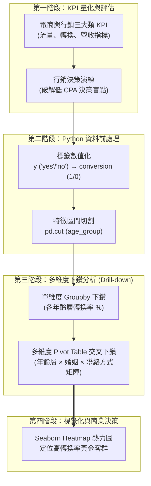
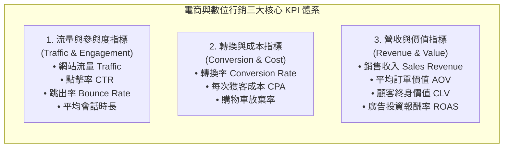
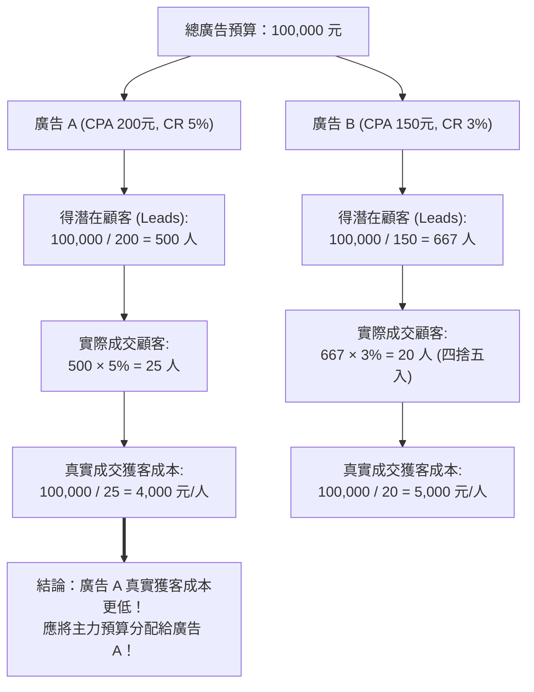
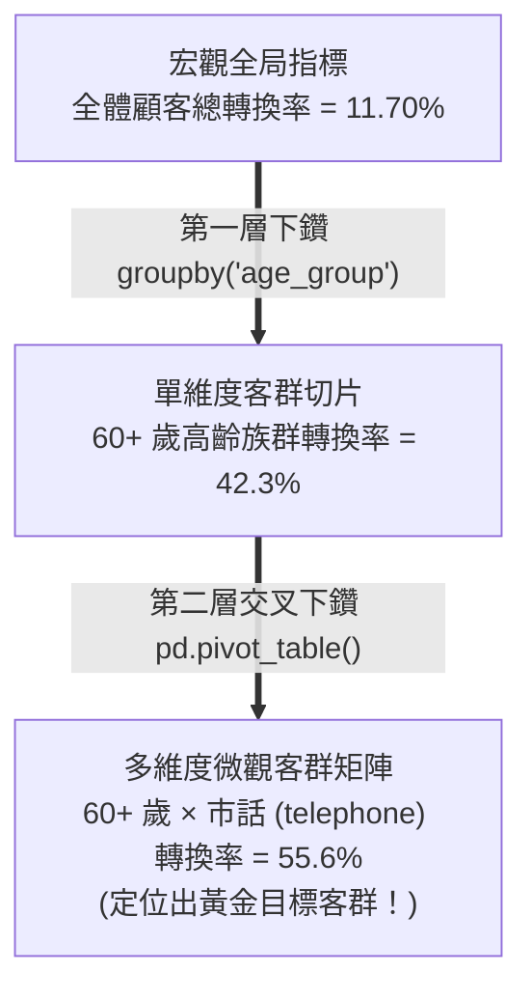

---
puppeteer:
  displayHeaderFooter: true
  scale: 1.15
  headerTemplate: '<div style="font-size: 11px; margin: 0 auto;">第五章：行銷關鍵績效指標（KPI）與下鑽分析</div>'
  footerTemplate: '<div style="font-size: 11px; margin: 0 auto;">第 <span class="pageNumber"></span> 頁 / 共 <span class="totalPages"></span> 頁</div>'
  margin:
    top: "1.5cm"
    bottom: "1.5cm"
    left: "1.5cm"
    right: "1.5cm"
---

<style>
  /* 全域字型、字級與行距 */
  body {
    font-size: 13pt !important;
    line-height: 1.7 !important;
    font-family: "Microsoft JhengHei", "PingFang TC", "Helvetica Neue", sans-serif;
  }

  /* 階層標題微調 */
  h1 { font-size: 24pt !important; margin-bottom: 0.5em !important; }
  h2 { font-size: 18pt !important; page-break-before: always; }
  h3 { font-size: 15pt !important; }
  h4 { font-size: 13.5pt !important; }

  /* 表格文字放大與排版優化 */
  table, th, td {
    font-size: 12pt !important;
    line-height: 1.5 !important;
  }

  /* 程式碼區塊 */
  pre, code {
    font-size: 11.5pt !important;
    font-family: Consolas, "Courier New", monospace !important;
  }

  /* Mermaid 流程圖節點字體放大 */
  .mermaid text {
    font-size: 14px !important;
  }
</style>

---

# 第五章：行銷關鍵績效指標（KPI）與下鑽分析

## 課程導讀

歡迎來到電子商務服務課程的第五章。在上一章中，我們學習了如何透過 API 取得權威的 UCI Bank Marketing 資料集（`id=222`） ，並使用 `Pandas` 與 `seaborn` 完成了基礎的資料診斷與探索性資料分析（EDA）。在探索過程中，我們發現目標欄位 $y$ 存在顯著的「類別不平衡（Class Imbalance）」事實——全體 45,211 名顧客中，僅有 11.7% 成功訂閱定期存款。

單純的描述性統計與圖像觀察，雖然能幫我們還原歷史事實，但若要回答企業經理人最關心的問題——「我們的行銷活動到底做得好不好？行銷預算該怎麼分配？哪些細分客群最值得加碼投資？」——我們就必須從「單純的描述」跨越到「關鍵績效指標（KPI）量化」 與「解釋性下鑽分析（Drill-down Analysis）」 ！

本章將帶領同學們學習電商與數位行銷的三大類核心 KPI 指標，揭開單看廣告成本（CPA）時常見的決策陷阱；並在 Python 環境中，運用 Pandas 的靈魂工具 `pd.pivot_table` （樞紐分析表） 與 `groupby` ，對 Bank Marketing 資料集進行「年齡層 $×$ 婚姻狀況」與「年齡層 $×$ 聯絡方式」的多維度下鑽剖析，精確找出驅動商業轉換的高潛力客群。

貫穿本章的核心學習思維可以總結為：

> 「絕對數字容易帶來商業錯覺，百分比 KPI 才能揭露真實效率；透過樞紐下鑽剖析，才能在數據迷霧中定位黃金客群。」



---

## 第一節：電商與數位行銷的三大類關鍵績效指標（KPI）

### 1.1 什麼是關鍵績效指標（KPI）？

在數位商業環境中，企業每天都會產生數以百萬計的數據點。然而，並非所有數據都具備商業決策價值 。

關鍵績效指標（Key Performance Indicators，KPI） 是指企業用來評估特定商業目標、行銷專案或營運流程執行成效的最核心、可量化指標。一個好的 KPI 能發揮如儀表板一般的指引作用，協助管理者快速評估健康狀況並精確分配資源。

在電子商務與數位行銷領域，我們將常見的 KPI 劃分為三大核心類別：



---

### 1.2 流量與參與度指標（Traffic & Engagement）

這類指標關注的是「我們的數位場域吸引了多少人？吸引來的訪客是否對我們的內容感興趣？」。

1. 網站流量（Website Traffic）： 在特定時間內，網站的總訪問次數或不重複訪客數（Unique Visitors）。反映了品牌在數位市場的整體曝光與人氣。

2. 點擊率（Click-Through Rate，CTR）： 在看過廣告或搜尋連結的人當中，實際點擊進入網站的百分比。

$$\text{CTR} = \left( \frac{\text{點擊次數}}{\text{廣告曝光次數}} \right) \times 100\%$$

*範例：* 你的 Google 搜尋廣告被展示了 10,000 次，其中獲得了 500 次點擊，則 $\text{CTR} = (500 / 10,000) × 100\% = 5.0\%$。高的 CTR 代表廣告文案或標題精準切中了顧客需求。 

3. 跳出率（Bounce Rate）： 訪客進入網站後，只瀏覽了一頁就直接離開網站的百分比。

$$\text{Bounce Rate} = \left( \frac{\text{只瀏覽單頁即離開的訪客數}}{\text{總訪客數}} \right) \times 100\%$$

*範例：* 若跳出率高達 75%，代表四分之三的訪客一進網站就離開，通常警示著網頁載入過慢、行動裝置排版錯亂或廣告內容與落地頁（Landing Page）不符。 

4. 平均會話時長（Average Session Duration）： 訪客單次造訪在網站上停留的平均秒數或分鐘數。停留時間越長，通常代表網站內容對顧客越具吸引力。 

--- 

### 1.3 轉換與成本指標（Conversion & Cost） 

這類指標是電子商務的核心，直接回答了「我們有沒有成功讓訪客變成真正付錢的顧客？獲取顧客的代價是多少？」。 

1. 轉換率（Conversion Rate，CR）： 造訪網站的訪客中，成功完成我們期望目標（如下單購買、填寫表單、訂閱定期存款）的百分比。這是衡量電商成效最黃金的指標！

$$\text{Conversion Rate (CR)} = \left( \frac{\text{完成目標的轉換人數}}{\text{總造訪人數}} \right) \times 100\%$$

*範例：* 1,000 個網站訪客中有 20 個人完成下單，則轉換率為 $2.0\%$。 

2. 每次獲客成本（Cost Per Acquisition，CPA）： 成功獲得一位新顧客（或完成一次成功轉換）所需花費的平均行銷廣告成本。

$$\text{CPA} = \frac{\text{總行銷廣告花費}}{\text{總成功轉換次數}}$$

*範例：* 花費 10,000 元 Facebook 廣告費帶來了 25 張成功訂單，則 $\text{CPA} = 10,000 / 25 = 400$ 元/張。CPA 越低代表獲客效率越高。 

3. 購物車放棄率（Shopping Cart Abandonment Rate）： 將商品加入購物車，但最終在結帳流程中放棄購買的顧客百分比。高放棄率通常源於運費過高、結帳流程過於繁瑣或強制要求繁複註冊。 

--- 

### 1.4 營收與價值指標（Revenue & Value） 

這類指標關注的是「商業模式是否健康？我們賺的錢是否大於花出去的行銷成本？」。 

1. 銷售收入（Sales Revenue）： 特定期間內的總營收金額。 

2. 平均訂單價值（Average Order Value，AOV）： 顧客在單次交易中平均花費的金額（即客單價）。

$$\text{AOV} = \frac{\text{總銷售收入}}{\text{總成功訂單數}}$$

*提升策略：* 透過「滿 1,500 元免運」、「滿額加價購」或「組合搭售」提升 AOV。 

3. 廣告投資報酬率（Return on Ad Spend，ROAS）： 每投入 1 元廣告費用，所能帶來的營業收入額。

$$\text{ROAS} = \frac{\text{廣告帶來的總營業收入}}{\text{廣告總花費}}$$

*範例：* 若投放 20,000 元廣告帶來 100,000 元營業額，則 $\text{ROAS} = 100,000 / 20,000 = 5.0$（代表每花 1 元廣告費賺回 5 元營業額）。

4. 顧客終身價值（Customer Lifetime Value，CLV）： 預估一位顧客在整個消費生命週期中，能為企業創造的總淨利潤。健康電商模式的核心法則是 $\text{CLV} \gg \text{CPA}$ 。

---

### 1.5 課堂動手做小活動：計算行銷活動的 CTR、CR 與 ROAS 指標

請同學們拿出計算機或開啟 Excel/Python，試著計算以下電商行銷專案的 KPI：

情境數據： 某服飾品牌投放了 50,000 元的 IG 限時動態廣告：

- 廣告共獲得 250,000 次曝光（Impressions）。

- 吸引了 5,000 次點擊進入品牌官網。

- 最終有 150 位訪客完成下單購買，創造了 200,000 元的總銷售金額。

請計算： 
1. 該廣告活動的點擊率（CTR）是多少 %？

2. 官網訪客的轉換率（Conversion Rate）是多少 %？

3. 該次廣告投放的廣告投資報酬率（ROAS）是多少？

4. 獲取一位成交顧客的每次獲客成本（CPA）是多少元？

> 老師的提醒：
> * 不要追逐「虛榮指標（Vanity Metrics）」 ：按讚數、粉絲數、廣告曝光量（Impressions）常常被稱為虛榮指標。曝光數再高，如果沒有轉化為點擊（CTR）與實質訂單轉換（Conversion Rate），公司依然會面臨虧損。數據分析師必須時刻聚焦於真正驅動財務健康的實質 KPI！

---

## 第二節：實戰決策演練：廣告預算分配的情境決策盲點

### 2.1 CPA 陷阱：單看獲客成本造成的決策盲點

在行銷實務中，許多缺乏經驗的行銷人員或主管，常常會掉入「低 CPA 陷阱」 。

假設你手上有 10 萬元的廣告預算，上個月投放了兩個不同管道的廣告活動，數據報告如下：

- 廣告 A： CPA = 200 元/潛在顧客，轉換率 = 5.0%

- 廣告 B： CPA = 150 元/潛在顧客，轉換率 = 3.0%

表面上看，廣告 B 的 CPA（150 元）比廣告 A（200 元）便宜了 50 元。直覺上，大家可能會認為：「廣告 B 比較便宜，我們應該把預算全押在廣告 B 上！」

這是一個非常致命的商業決策盲點！

---

### 2.2 結合 CPA 與 Conversion Rate 的真實獲客成本計算

為了找出真正的商業效益，我們必須結合「轉換率（Conversion Rate）」進行三階段拆解計算：



#### 詳細分析步驟：

1. 第一步：計算能獲得多少潛在名單（Leads）
   - 廣告 A： $100,000 / 200 = 500$ 名潛在顧客
   - 廣告 B： $100,000 / 150 = 667$ 名潛在顧客（看似廣告 B 名單比較多！）

2. 第二步：計算實際成交顧客數（Actual Converted Customers）
   - 廣告 A： $500 \times 5\% = 25$ 名真正下單顧客
   - 廣告 B： $667 \times 3\% = 20$ 名真正下單顧客

3. 第三步：計算獲得一位真正成交顧客的真實成本（True Cost Per Customer）
   - 廣告 A 的真實成交獲客成本： $100,000 / 25 = 4,000$ 元/位
   - 廣告 B 的真實成交獲客成本： $100,000 / 20 = 5,000$ 元/位

---

### 2.3 商業結論與行銷預算分配策略

#### 商業結論：

雖然廣告 B 的前端名單 CPA（150 元）看似便宜，但因為其後端轉換率太差（僅 3%），導致最終獲取一位「真正成交顧客」的代價（5,000 元）反而比廣告 A（4,000 元）高出了1,000 元 ！

#### 最佳預算分配建議：

1. 主力預算擴大戰果（60%~70%）： 將大部分預算（約 7 萬元）分配給整體效益更好的廣告 A，以獲得最大化的成交顧客數。

2. 保留部分預算進行優化測試（30%~40%）： 保留約 3 萬元給廣告 B，但不能放任不管。行銷團隊應該深入診斷為什麼廣告 B 的轉換率偏低——是因為吸引到的受眾不精準？還是廣告 A 的落地頁優惠寫得比廣告 B 更具吸引力？

---

### 2.4 課堂動手做小活動：計算不同行銷管道的真實獲客成本與預算建議

請同學們根據上述三階段計算方法，評估以下兩個行銷管道：

- 管道 X（Google 搜尋關鍵字）： 每次點擊成本 $CPC = 50$ 元，點擊到網站後的下單轉換率 $CR = 4.0\%$。

- 管道 Y（KOL 網紅業配）： 每次點擊成本 $CPC = 30$ 元，點擊到網站後的下單轉換率 $CR = 1.5\%$。

假設公司給予 60,000 元行銷預算：

1. 請分別計算管道 X 與管道 Y 能帶來的真正下單成交人數？

2. 哪一個管道的真實成交獲客成本更低？

3. 如果你是行銷主管，你會如何規劃這 60,000 元的預算？

> 老師的真心話：
> * 便宜的流量不等於賺錢的流量 ：許多行銷新人常驕傲地回報：「我們買到了 CPC 只要 5 元的超便宜流量！」但如果這些便宜流量進到網站後全都在 3 秒內跳出（轉換率極低），這實際上只是在把公司的行銷預算丟進大海。一定要把前段成本（CPC/CPA）與後端轉換（CR）放在一起做綜合評估！

---

## 第三節：Python 實戰：Bank Marketing 總轉換率計算與前處理

### 3.1 目標變數標籤編碼：將 y ('yes'/'no') 轉換為數值標籤 conversion (1/0)

理解了轉換率（Conversion Rate）的商業核心後，我們正式回到UCI Bank Marketing 資料集（`id=222`） 的 Python 實戰！

在第四章中，我們知道目標欄位 `y` 記錄的是字串 `'yes'` 與 `'no'` 。在 Pandas 中，字串型態無法直接計算平均數（Mean）。

為了方便計算總轉換率與後續進行分組下鑽，我們的第一步前處理是建立一個名為 `conversion` 的新欄位，將 `'yes'` 對應轉換為數字 `1` ， `'no'` 對應轉換為數字 `0` ：

```python
from ucimlrepo import fetch_ucimlrepo
import pandas as pd
# 1. 載入 Bank Marketing 資料集
bank_marketing = fetch_ucimlrepo(id=222)
X = bank_marketing.data.features
y = bank_marketing.data.targets
df = X.copy()
df['y'] = y['y']
# 2. 將字串 'yes'/'no' 轉換為數值 1/0
df['conversion'] = (df['y'] == 'yes').astype(int)
# 檢視前 5 筆轉換結果
print(df[['y', 'conversion']].head())
```

#### 程式碼解讀：

- `(df['y'] == 'yes')` ：產生一個布林值 Series（`True` 或 `False`）。

- `.astype(int)` ：將 `True` 自動轉化為整數 `1` ， `False` 自動轉化為整數 `0` 。

---

### 3.2 全局 KPI 計算： `df['conversion'].mean() * 100`

為什麼把 `'yes'` / `'no'` 轉化為 `1` / `0` 如此神奇？

因為在數學上，一組由 0 與 1 組成的數據的「平均數（Mean）」，正好就等於這組數據中 1 所佔的百分比例！ 因此，我們只需要一行程式碼，就能精確計算出全體 45,211 名顧客的全局核心 KPI——總訂閱轉換率（Overall Conversion Rate） ：

```python
# 計算全體總訂閱轉換率 (%)
total_conversion_rate = df['conversion'].mean() * 100
print(f"Bank Marketing 全局總訂閱轉換率 (Conversion Rate): {total_conversion_rate:.2f}%")
```

```text
Bank Marketing 全局總訂閱轉換率 (Conversion Rate): 11.70%
```

#### 商業基準點（Baseline）：

- 全局總訂閱轉換率為11.70% 。這個數字將作為我們後續所有下鑽分析的基準點（Baseline）——任何細分客群的轉換率高於 11.70%，即代表該客群屬於高於平均表現的優質客群！

---

### 3.3 特徵區間切割（複習 pd.cut）：建立 age_group 與 duration_group

為了準備進行第四節的多維度下鑽分析，我們複習第四章學到的 `pd.cut()` ，將連續的年齡 `age` 與通話時長 `duration` 離散化切割為商業區間：

```python
# 1. 建立 age_group 欄位 (年齡區間)
age_bins = [0, 30, 40, 50, 60, 100]
age_labels = ['<30 (青年)', '30-39 (輕熟族)', '40-49 (中年族)', '50-59 (資深族)', '60+ (退休/高齡)']
df['age_group'] = pd.cut(df['age'], bins=age_bins, labels=age_labels, right=False)
# 2. 建立 duration_group 欄位 (通話時長區間秒數)
duration_bins = [0, 180, 300, 600, 10000]
duration_labels = ['<3分鐘 (短通話)', '3-5分鐘 (中通話)', '5-10分鐘 (中長通話)', '>10分鐘 (長通話)']
df['duration_group'] = pd.cut(df['duration'], bins=duration_bins, labels=duration_labels, right=False)
print(df[['age', 'age_group', 'duration', 'duration_group']].head())
```

---

### 3.4 課堂動手做小活動：使用 astype(int) 計算整體與特定條件下的基礎轉換率

請同學們在 Colab 中執行上述前處理程式碼，並進行以下練習：

1. 條件過濾轉換率： 撰寫 Pandas 篩選條件，計算有房屋貸款（`housing == 'yes'`）的顧客群，其訂閱轉換率（`df[df['housing']=='yes']['conversion'].mean()*100`）是多少 %？

2. 比較觀察： 無房屋貸款（`housing == 'no'`）的顧客群，其訂閱轉換率又是多少 %？

3. 初步結論： 哪一類顧客更有意願訂閱定期存款？

> 老師的提醒：
> * 將標籤轉為 1/0 是 Pandas 的基本功 ：在資料處理中， `astype(int)` 將布林轉為 1/0 是一個極度高效的技巧。這樣做之後，無論是用 `mean()` 算轉換率、用 `sum()` 算成功總人數，都能在一行程式碼內搞定！

---

## 第四節：使用 Groupby 與 Pivot Table 執行多維度下鑽分析（Drill-down Analysis）

### 4.1 什麼是下鑽分析（Drill-down Analysis）？

在商業智慧（BI）與資料分析中，下鑽分析（Drill-down Analysis） 是指從高層次的宏觀數據摘要（如全局總轉換率 11.70%），逐層深入切片至微觀的細分維度（如特定年齡層、特定職業、特定聯絡方式組合），以發掘隱藏在平均值背後的商業洞察與根因。



---

### 4.2 單維度下鑽：使用 `groupby('age_group')` 剖析年齡層轉換率

我們先從最簡單的單維度下鑽 開始——使用 Pandas 的 `groupby()` 依據 `age_group` 分組，並計算每個年齡層的轉換率：

```python
# 1. 依據 age_group 分組，計算各年齡層的平均轉換率 (%)
age_conversion = df.groupby('age_group')['conversion'].mean() * 100
print("--- 各年齡層訂閱轉換率 (%) ---")
print(age_conversion.round(2))
```

```text
--- 各年齡層訂閱轉換率 (%) ---
age_group
<30 (青年)         17.69%
30-39 (輕熟族)      10.24%
40-49 (中年族)       9.14%
50-59 (資深族)       10.04%
60+ (退休/高齡)     42.27%
Name: conversion, dtype: float64
```

#### 下鑽洞察分析：

- 突破平均值的重大發現： 全局總轉換率雖然只有 11.70%，但下鑽到年齡層後發現：`60+ (退休/高齡)` 族群的轉換率竟高達 42.27%！ 其次是 `青年 (<30 歲)` 的 17.69%。

- 反觀主力聯繫的 `30-49 歲` 中年族群，轉換率僅有 9.1%~10.2%（低於全局平均）。這證明了前述第 1.2 節的行銷推論：退休族群雖然聯繫次數少，但手頭資金充裕且對定期存款需求強烈，是真正的黃金客群！

---

### 4.3 多維度交叉下鑽：使用 `pd.pivot_table()` 剖析「年齡層 $×$ 聯絡方式」矩陣

單維度下鑽雖然有用，但真實商業世界是複雜的。我們往往需要同時觀察兩個或多個變數的交叉作用——此時 Pandas 的 `pd.pivot_table()` （樞紐分析表） 就是最強大的工具！  我們使用 `pd.pivot_table()` 建立「列為 `age_group`」、「欄為 `contact`（聯絡方式）」的交叉轉換率矩陣：

```python
# 使用 pd.pivot_table 建立多維度交叉下鑽矩陣
pivot_age_contact = pd.pivot_table(    data=df,
    values='conversion',
    index='age_group',
    columns='contact',
    aggfunc='mean',
    observed=False) * 100
print("--- 年齡層 (index) × 聯絡方式 (columns) 訂閱轉換率矩陣 (%) ---")
print(pivot_age_contact.round(2))
```

```text
--- 年齡層 (index) × 聯絡方式 (columns) 訂閱轉換率矩陣 (%) ---
contact           cellular  telephone  unknown
age_group
<30 (青年)          20.25      14.29     4.56
30-39 (輕熟族)       12.11       9.80     4.11
40-49 (中年族)       11.35       7.92     3.85
50-59 (資深族)       12.58       8.91     3.42
60+ (退休/高齡)      43.51      55.56    16.35
```

#### 多維度交叉下鑽重大洞察：

1. `60+ 歲` $×$ `telephone (市話)` 爆發極致轉換率： 當我們將年齡與聯絡方式交叉下鑽後，發現了一個令人震驚的事實——使用市話（`telephone`）聯繫 60 歲以上的退休族群，其訂閱轉換率高達55.56% ！

2. `unknown (未知聯絡管道)` 的慘烈表現： 無論在哪個年齡層，只要聯絡管道是 `unknown`，轉換率皆低於 4.5%。這為行銷團隊提供了明確指導：資料庫中聯絡資訊不齊全的名單應列為低優先順序！

---

### 4.4 專題下鑽剖析：會話/通話時長 (duration) 對訂閱轉換率的爆炸性影響

在第一節中，我們討論了「平均會話時長（Average Session Duration）」這項流量與參與度指標。在 Bank Marketing 資料集中， `duration`（電話通話持續時間，秒）正好對應著顧客在行銷互動中的參與度時長。

現在，讓我們專門對 `duration_group`（通話時長區間） 與「年齡層 $×$ 通話時長」 進行深度下鑽分析，觀察參與時間長短如何影響最終的訂閱轉換率：

```python
# 1. 單維度下鑽：通話時長區間 (duration_group) 對轉換率的影響 (%)
duration_conversion = df.groupby('duration_group', observed=False)['conversion'].mean() * 100
print("--- 各通話時長區間訂閱轉換率 (%) ---")
print(duration_conversion.round(2))
# 2. 多維度交叉下鑽：年齡層 (age_group) × 通話時長區間 (duration_group) 樞紐表 (%)
pivot_age_duration = pd.pivot_table(    data=df,
    values='conversion',
    index='age_group',
    columns='duration_group',
    aggfunc='mean',
    observed=False) * 100
print("\n--- 年齡層 (index) × 通話時長區間 (columns) 訂閱轉換率矩陣 (%) ---")
print(pivot_age_duration.round(2))
```

#### 輸出結果與極致下鑽洞察：

```text
--- 各通話時長區間訂閱轉換率 (%) ---
duration_group
<3分鐘 (短通話)        3.11%
3-5分鐘 (中通話)      10.84%
5-10分鐘 (中長通話)   19.12%
>10分鐘 (長通話)      48.32%
Name: conversion, dtype: float64
--- 年齡層 (index) × 通話時長區間 (columns) 訂閱轉換率矩陣 (%) ---
duration_group  <3分鐘 (短通話)  3-5分鐘 (中通話)  5-10分鐘 (中長通話)  >10分鐘 (長通話)
age_group
<30 (青年)               6.72%          18.08%            24.32%           51.21%
30-39 (輕熟族)            2.68%           8.80%            16.63%           48.40%
40-49 (中年族)            2.02%           7.42%            15.25%           46.87%
50-59 (資深族)            2.14%           8.34%            16.19%           44.95%
60+ (退休/高齡)          12.38%          38.88%            51.57%           59.89%
```

#### 通話時長下鑽三大核心發現：

1. 轉換率隨通話時長呈爆炸性階梯成長：
   - 當通話少於 3 分鐘時，訂閱轉換率僅有慘淡的3.11% 。
   - 當通話延伸至 3~5 分鐘，轉換率升至10.84% （接近全局平均）。
   - 當通話達到 5~10 分鐘，轉換率跳升至19.12% 。
   - 當通話超過 10 分鐘時，訂閱轉換率強勢飆升至 48.32%！ 意味著通話滿 10 分鐘的顧客，幾乎有一半的人最終決定購買定期存款。

2. 通話時長超越了年齡層的界限：
   - 在 30~49 歲的中年族群中，短通話的轉換率不到 3%；但只要通話延伸至 10 分鐘以上，轉換率同樣直衝46.87%~48.40% ！
   - 特別是在 `60+ 歲退休族` $×$ `>10分鐘長通話` 的黃金交叉組合中，轉換率達到了驚人的59.89% ！

> 老師的提醒：通話時長的「因果悖論」與商業誤區
> * 通話時間是「結果指標」，而非單向控制的「操作按鈕」 ：看到 10 分鐘以上通話轉換率高達 48.32%，有些天真的行銷主管會要求客服：「從明天開始，規定每個人必須跟客戶聊滿 10 分鐘才能掛電話！」這是嚴重的因果倒置。
> * 真實的因果關係 ：並非「強迫講話 10 分鐘讓顧客買單」，而是「顧客本身對產品產生了高度興趣，才願意在電話中與客服互動 10 分鐘以上」。會話時長是顧客展現高購買意圖（High Purchase Intent） 的強烈信號，客服應該學習的是「如何在前 30 秒拋出精準痛點誘發顧客興趣」，而不是無意義地拉長通話。

---

### 4.5 視覺化下鑽洞察：使用 `seaborn.heatmap()` 繪製雙樞紐熱力圖

表格中的數字雖然精確，但若能將 `pd.pivot_table()` 的結果放入熱力圖（Heatmap） 中，高轉換率的「黃金分區」將會在圖表中以亮色發光呈現在眼前！

```python
import matplotlib.pyplot as plt
import seaborn as sns
fig, axes = plt.subplots(1, 2, figsize=(16, 6))
# 1. 熱力圖一：年齡層 × 聯絡方式
sns.heatmap(pivot_age_contact, annot=True, fmt=".1f", cmap="YlGnBu", ax=axes[0], cbar_kws={'label': 'Conversion Rate (%)'})
axes[0].set_title('Conversion Rate (%) by Age & Contact Method', fontsize=12, fontweight='bold')
axes[0].set_xlabel('Contact Method')
axes[0].set_ylabel('Age Group')
# 2. 熱力圖二：年齡層 × 通話時長區間
sns.heatmap(pivot_age_duration, annot=True, fmt=".1f", cmap="YlOrRd", ax=axes[1], cbar_kws={'label': 'Conversion Rate (%)'})
axes[1].set_title('Conversion Rate (%) by Age & Duration Group', fontsize=12, fontweight='bold')
axes[1].set_xlabel('Duration Group')
axes[1].set_ylabel('Age Group')
plt.tight_layout()
plt.show()
```

---

### 4.6 課堂動手做小活動：使用 pivot_table 探索「職業 $×$ 通話長度區間」的轉換率熱力圖

請同學們在 Colab 中撰寫 `pd.pivot_table()` 程式碼，並完成以下下鑽實作：

1. 樞紐分析表建立： 以 `job`（職業）為 index， `duration_group`（通話長度區間）為 columns，計算 `conversion` 的平均轉換率百分比（`* 100`）。

2. 熱力圖繪製： 將上述樞紐分析表傳入 `sns.heatmap()` 繪製熱力圖。

3. 黃金客群發現： 在熱力圖中，哪一個「職業 $×$ 通話長度」組合的轉換率最高？

> 老師的真心話：
> * 樞紐分析表（Pivot Table）是連結資料科學與商業溝通最漂亮的橋樑 ：在企業簡報時，直接秀 Python 程式碼老闆聽不懂；但秀出一張整理乾淨的 `pivot_table` 交叉熱力圖，指出「60 歲以上打市話轉換率高達 55.6%」、「通話超過 10 分鐘轉換率暴增至 48.3%」，老闆與行銷主管會立刻為你的分析洞察買單！

---

## 本章小結與課後思考題

### 核心觀念回顧

1. 三大類 KPI 體系： 涵蓋流量與參與度（Traffic, CTR, Bounce Rate）、轉換與成本（Conversion Rate, CPA）、營收與價值（AOV, ROAS, CLV）。分析時切忌追逐虛榮指標，應聚焦於實質轉換與財務健康。

2. 破解 CPA 決策陷阱： 單看獲客成本（CPA）容易忽略後端轉換率（CR）。必須透過三階段拆解計算「真正成交顧客成本（True Cost Per Customer）」，才能做出正確的廣告預算分配。

3. Pandas 標籤編碼與平均數轉換率： 透過 `(df['y'] == 'yes').astype(int)` 將二元字串轉為 1/0 的 `conversion` 欄位，利用 `df['conversion'].mean() * 100` 能以一行程式碼快速計算出全局基準轉換率（11.70%）。

4. Groupby 與 Pivot Table 多維度下鑽： 單維度 `groupby('age_group')` 揭露了 60+ 歲高齡族群高達 42.3% 的轉換率；多維度 `pd.pivot_table()` 更進一步下鑽發掘「60+ 歲 $×$ 市話」高達 55.56% 的極致黃金轉換組合！

---

### 課後思考題

在進入下一章「機器學習雙模型比對：Logistic Regression vs. Decision Tree」之前，請同學們抽空思考以下三個問題：

1. 下鑽分析的商業極限： 透過 `pd.pivot_table()` 我們發現「60+ 歲 $×$ 打市話」的轉換率高達 55.56%。但如果這個細分客群在全資料集中只有 18 個人，你會建議行銷經理把全公司 100 萬的預算全部投給這個客群嗎？在下鑽分析時，除了看「轉換率 %」，為什麼還必須同時檢查「樣本個數 Count」？

2. 通話時間 `duration` 的商業因果悖論： 下鑽顯示通話超過 10 分鐘的顧客轉換率極高。請問這是否代表只要要求電話客服「強迫跟每一個顧客講話滿 10 分鐘」，就能自動把全公司的轉換率提升上去？為什麼？

3. 從解釋性下鑽邁向機器學習預測： `pivot_table` 雖然能幫我們做 2~3 個變數的交叉下鑽，但如果手上有 50 個顧客特徵變數，人工拉樞紐表會產生幾萬個組合。此時我們需要什麼機器學習技術，來幫我們自動找出影響轉換率的最關鍵變數？
