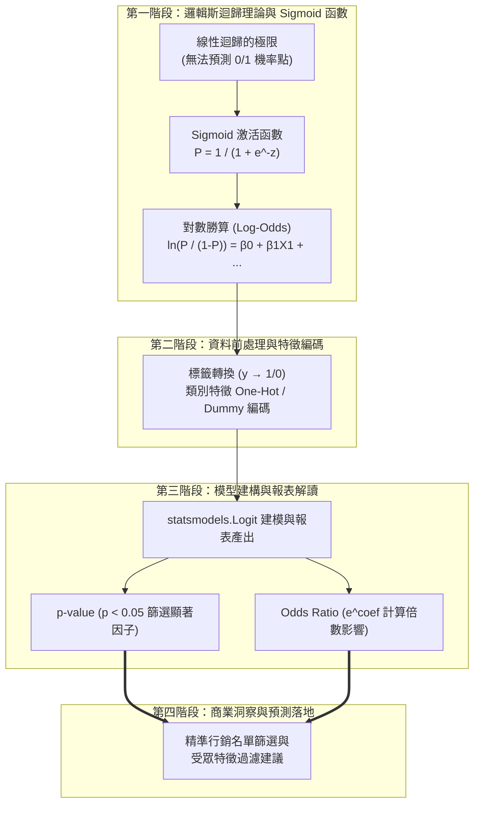
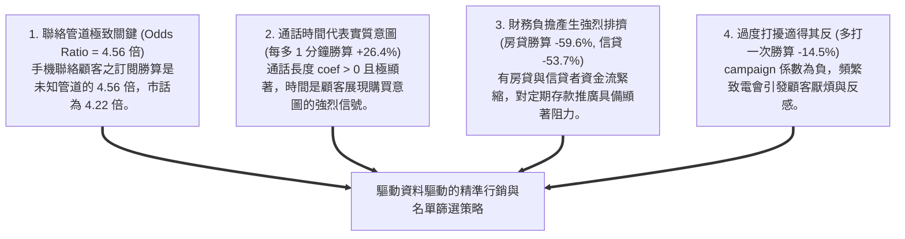

---
puppeteer:
  displayHeaderFooter: true
  scale: 1.15
  headerTemplate: '<div style="font-size: 11px; margin: 0 auto;">第六章：以 Logistic Regression 分析與預測行銷的勝算</div>'
  footerTemplate: '<div style="font-size: 11px; margin: 0 auto;">第 <span class="pageNumber"></span> 頁 / 共 <span class="totalPages"></span> 頁</div>'
  margin:
    top: "1.5cm"
    bottom: "1.5cm"
    left: "1.5cm"
    right: "1.5cm"
---

<style>
  /* 全域字型、字級與行距 */
  body {
    font-size: 13pt !important;
    line-height: 1.7 !important;
    font-family: "Microsoft JhengHei", "PingFang TC", "Helvetica Neue", sans-serif;
  }

  /* 階層標題微調 */
  h1 { font-size: 24pt !important; margin-bottom: 0.5em !important; }
  h2 { font-size: 18pt !important; page-break-before: always; }
  h3 { font-size: 15pt !important; }
  h4 { font-size: 13.5pt !important; }

  /* 表格文字放大與排版優化 */
  table, th, td {
    font-size: 12pt !important;
    line-height: 1.5 !important;
  }

  /* 程式碼區塊 */
  pre, code {
    font-size: 11.5pt !important;
    font-family: Consolas, "Courier New", monospace !important;
  }

  /* Mermaid 流程圖節點字體放大 */
  .mermaid text {
    font-size: 14px !important;
  }
</style>

---

# 第六章：以 Logistic Regression 分析與預測行銷的勝算

## 課程導讀

歡迎來到電子商務服務課程的第六章。在前面兩章中，我們分別學習了探索性資料分析（EDA）與基於樞紐分析表（Pivot Table）的下鑽分析（Drill-down Analysis）。透過第 5 週的下鑽剖析，我們發現了高齡族群、市話聯絡與長通話時間具備較高的訂閱轉換率。

然而，人工樞紐下鑽分析有一個嚴重的侷限： 我們一次只能交叉 2 到 3 個變數 。如果在真實商業場景中，我們同時面臨 10 個、50 個甚至上百個顧客特徵（年齡、資產、房貸、信貸、聯絡方式、撥打次數...），人工拉樞紐表將會產生數萬種組合，產生嚴重的「維度災難（Curse of Dimensionality）」。

此時，我們需要引入第一個機器學習統計模型——邏輯斯迴歸（Logistic Regression） ！

本章將使用同學們已熟悉的 UCI Bank Marketing 資料集（`id=222`） ，透過數值化標籤與 Dummy Variable（虛擬變數）編碼，使用 Python `statsmodels` 與 `scikit-learn` 套件建構邏輯斯迴歸模型。我們不僅要用模型預測顧客「是否會訂閱定期存款（$y=\text{yes/no}$）」，更要透過p-value（統計顯著性） 、係數（coef 影響方向） 以及勝算比（Odds Ratio，$\text{OR} = e^{\beta}$） ，解讀驅動行銷成功背後的核心關鍵因素！

貫穿本章的核心學習思維可以總結為：

> 「下鑽分析能觀察單維現象，邏輯斯迴歸能控制多維干擾；透過勝算比與顯著性，把海量特徵轉化為精準的行銷決策指南。」



---

## 第一節：從線性迴歸到邏輯斯迴歸（Logistic Regression）

### 1.1 為什麼二元分類問題不能用「線性迴歸」？

在統計學中，許多同學最早接觸的模型是線性迴歸（Linear Regression） 。線性迴歸的公式為：

$$Y = \beta_0 + \beta_1 X_1 + \beta_2 X_2 + \dots + \beta_k X_k$$

當我們的預測目標 $Y$ 是連續的金額（例如預測顧客下個月會花多少錢）時，線性迴歸運作良好。然而，在行銷參與度與轉換率分析中，我們的目標 $Y$ 通常是二元類別標籤（Binary Outcome） ： - 顧客是否回應電話行銷？（$y = 1$（yes）, $y = 0$（no））： - 顧客是否點擊 Email 折價券？（$y = 1$（click）, $y = 0$（no click））

若直接使用線性迴歸來預測 $0/1$ 標籤，會面臨兩個致命缺點：
1. 預測數值超出機率範圍： 線性迴歸產出的預測值可能小於 $0$ 或大於 $1$（例如得出「該顧客購買機率是 $135\%$ 或 $-20\%$」），這在機率學上完全無法解釋。
2. 極端值干擾嚴重： 線性迴歸對離群值極度敏感，會使預測迴歸線產生嚴重歪斜。

---

### 1.2 Sigmoid 激活函數與機率轉換 為了解決上述問題，邏輯斯迴歸（Logistic Regression） 引入了著名的Sigmoid 激活函數（Sigmoid Function） ，將線性迴歸的輸出映射至 $(0, 1)$ 之間的標準機率區間：$$\sigma(z) = \frac{1}{1 + e^{-z}}$$其中 $z = \beta_0 + \beta_1 X_1 + \beta_2 X_2 + \dots + \beta_k X_k$。

```mermaid
flowchart LR
 X["特徵變數 X1, X2..."] --> Linear["線性組合 z = β0 + β1X1 + ..."] Linear --> Sigmoid["Sigmoid 函數 P = 1 / (1 + e^-z)"] Sigmoid --> Prob["輸出標準機率 P ∈ (0, 1)"]
```

如上所示，無論 $z$ 是多麼大的正數或多麼小的負數，經由 Sigmoid 轉換後，最終輸出 $P = P(Y=1|X)$ 永遠緊緊被鎖定在 $0.0$ 到 $1.0$ 之間（代表成功轉換的機率）。

---

### 1.3 對數勝算（Log-Odds）與勝算比（Odds Ratio） 為了理解邏輯斯迴歸中係數（$\beta$）的統計意義，我們需要理解勝算（Odds） 的概念。

1. 勝算（Odds）： 事件發生機率 $P$ 與未發生機率 $(1-P)$ 的比值：$$\text{Odds} = \frac{P}{1 - P}$$

*範例：* 若顧客購買機率 $P = 0.8$，未購買機率 $1 - P = 0.2$，則勝算 $\text{Odds} = 0.8 / 0.2 = 4$（代表購買的勝算是不購買的 4 倍）。

2. 對數勝算（Log-Odds）： 對 Odds 取自然對數 $\ln$，得到邏輯斯迴歸的核心等式：$$\ln\left(\frac{P}{1-P}\right) = \beta_0 + \beta_1 X_1 + \beta_2 X_2 + \dots + \beta_k X_k$$

3. 勝算比（Odds Ratio，OR）： 當特徵 $X_i$ 增加 1 個單位時，新勝算與舊勝算的比值，計算公式為：$$\text{Odds Ratio (OR)} = e^{\beta_i}$$

   - 若 $\beta_i > 0$，則 $\text{OR} = e^{\beta_i} > 1$：特徵每增加 1 單位，成功轉換的勝算增加為原來的 $e^{\beta_i}$ 倍（正向驅動因子）。
   - 若 $\beta_i < 0$，則 $\text{OR} = e^{\beta_i} < 1$：特徵每增加 1 單位，成功轉換的勝算降低為原來的 $e^{\beta_i}$ 倍（負向阻礙因子）。

---

### 1.4 課堂動手做小活動：計算勝算 (Odds) 與勝算比 (Odds Ratio)

請同學們拿出計算機或使用 Python，回答以下三題觀念計算題：

1. 勝算計算： 若某個細分客群的訂閱轉換機率 $P = 0.20$（20%），請計算該客群的勝算（Odds）是多少？
2. 勝算比轉換： 假設邏輯斯迴歸模型中，房貸特徵 `housing` 的係數 $\beta = -0.9076$，請計算其勝算比 $\text{OR} = e^{-0.9076}$ 約為多少？
3. 商業解釋： 上述 $\text{OR} \approx 0.404$ 代表有房屋貸款的顧客，其訂閱定期存款的勝算相較於無房貸顧客減少了百分之多少？

> 老師的提醒：
> * 別把「勝算 (Odds)」跟「機率 (Probability)」搞混 ：機率是 $\frac{\text{成功}}{\text{全體}}$（範圍 0 到 1）；勝算是 $\frac{\text{成功}}{\text{失敗}}$（範圍 0 到無窮大）。勝算比（Odds Ratio $e^{\beta}$）是邏輯斯迴歸中最重要、最常用來向主管解釋的統計指標！

---

## 第二節：模型前處理：從類別文字到數值編碼（Dummy Variables）

### 2.1 為什麼電腦看不懂類別文字？

在把數據餵給統計模型或機器學習演算法之前，我們必須進行「特徵編碼（Feature Encoding）」 。因為數學矩陣與邏輯斯迴歸只能處理數字，無法直接對文字（如 `cellular`, `telephone`, `married`, `management`）進行微分與矩陣運算。

在 Python Pandas 中，常見的類別處理工具包含：
1. `factorize()` / `LabelEncoding`： 將文字類別快速轉為數字標籤（0, 1, 2, 3...）。適用於二元標籤或具備順序性的類別。
2. One-Hot Encoding（獨熱編碼）/ Dummy Variables（虛擬變數）： 將無順序性的多類別欄位拆解為獨立的二元 0/1 欄位。

---

### 2.2 虛擬變數陷阱（Dummy Variable Trap）與基準組選擇

當使用 `pd.get_dummies()` 對多類別欄位（如聯絡方式 `contact` 包含 `cellular`, `telephone`, `unknown`）進行 One-Hot 編碼時，必須注意虛擬變數陷阱（Dummy Variable Trap）——若將所有衍生欄位同時放入模型，會造成嚴重的「完全多重共線性（Multicollinearity）」。

因此，在邏輯斯迴歸中，若一個欄位有 $K$ 個類別，我們只保留 $K-1$ 個虛擬變數，將被剔除的那一個類別作為「對照基準組（Reference Group）」 。

```python
import pandas as pd
from ucimlrepo import fetch_ucimlrepo
# 1. 載入 Bank Marketing 資料集 (id=222)
bank_marketing = fetch_ucimlrepo(id=222)
X = bank_marketing.data.features.copy()
y = bank_marketing.data.targets.copy()
df = X.copy()
df['conversion'] = (y['y'] == 'yes').astype(int)
# 2. 對二元類別變數進行 0/1 標籤轉換
df['housing_code'] = (df['housing'] == 'yes').astype(int)
df['loan_code'] = (df['loan'] == 'yes').astype(int)
# 3. 處理多類別欄位 contact：使用 pd.get_dummies() 進行 One-Hot Encoding (獨熱編碼)
contact_dummies = pd.get_dummies(df['contact'], prefix='contact', dtype=int)
# 4. 避免虛擬變數陷阱 (Dummy Variable Trap)：
# 剔除未知的對照基準組 (Reference Group)，保留 contact_cellular 與 contact_telephone 納入模型
df['contact_cellular'] = contact_dummies['contact_cellular']
df['contact_telephone'] = contact_dummies['contact_telephone']
print(df[['housing', 'housing_code', 'contact', 'contact_cellular', 'contact_telephone']].head())
```

---

### 2.3 課堂動手做小活動：使用 pd.get_dummies 進行類別特徵編碼

請同學們在 Colab 中嘗試執行以下二元編碼練習：

1. 二元編碼： 撰寫一行程式碼 `df['default_code'] = (df['default'] == 'yes').astype(int)` ，將有無信用違約紀錄轉為 0/1 數值。
2. 多類別編碼： 執行 `pd.get_dummies(df['marital'], drop_first=True)` ，觀察預設 drop_first=True 會自動剔除哪一個婚姻類別作為對照基準組？
3. 小組討論： 為什麼在邏輯斯迴歸中一定要剔除一個對照組？如果三個婚姻狀態（`married`, `single`, `divorced`）全部放進模型會發生什麼事？

> 老師的提醒：
> * 一定要記得設定對照組 ：解釋 Dummy Variable 的迴歸係數時，所有的係數都是「相較於對照組」的相對影響。例如： `contact_cellular` 的係數是指「使用手機聯繫，相較於 unknown（未知管道）勝算提升了多少倍」。

---

## 第三節：Python 實戰：建立 statsmodels 邏輯斯迴歸模型與結果報表解讀

### 3.1 建立 statsmodels Logit 模型

在 Python 生態系中， `scikit-learn` 套件擅長進行機器學習預測，而`statsmodels` 套件則提供了極為詳細的傳統統計檢定報表（包含 p-value、標準誤 z-score 與信賴區間）。

我們使用 `statsmodels.api.Logit` 建立 Bank Marketing 資料集的邏輯斯迴歸模型：

```python
import statsmodels.api as sm
import numpy as np
# 定義特徵變數 X (包含常數項 const) 與目標變數 y
X_cols = [
    'age',              # 顧客年齡 (連續型)
    'balance',          # 帳戶餘額 (連續型)
    'duration',         # 通話時長 (秒, 連續型)
    'campaign',         # 本專案聯絡次數 (連續型)
    'housing_code',     # 有無房貸 (1/0)
    'loan_code',        # 有無信貸 (1/0)
    'contact_cellular', # 手機聯繫 (1/0, 基準為 unknown)
    'contact_telephone' # 市話聯繫 (1/0, 基準為 unknown)
]
X_model = sm.add_constant(df[X_cols])
y_model = df['conversion']
# 訓練邏輯斯迴歸模型
logit_model = sm.Logit(y_model, X_model).fit()
# 印出完整的統計摘要報表
print(logit_model.summary())
```

---

### 3.2 解讀邏輯斯迴歸結果報表（Logit Regression Results Table）

執行上述程式碼後，我們會獲得一張權威的統計結果報表。這張報表就是我們萃取商業洞見的金礦：

```text
                           Logit Regression Results
==============================================================================
Dep. Variable:             conversion   No. Observations:                45211
Model:                          Logit   Df Residuals:                    45202
Method:                           MLE   Pseudo R-squ.:                  0.2398
=====================================================================================
                        coef    std err          z      P>|z|      [0.025      0.975]
-------------------------------------------------------------------------------------
const                -3.6662      0.091    -40.455      0.000      -3.844      -3.489
age                  -0.0009      0.001     -0.636      0.525      -0.004       0.002
balance            2.293e-05   4.41e-06      5.204      0.000    1.43e-05    3.16e-05
duration              0.0039   6.01e-05     64.544      0.000       0.004       0.004
campaign             -0.1563      0.010    -15.735      0.000      -0.176      -0.137
housing_code         -0.9076      0.036    -25.391      0.000      -0.978      -0.837
loan_code            -0.7699      0.056    -13.673      0.000      -0.880      -0.660
contact_cellular      1.5163      0.055     27.637      0.000       1.409       1.624
contact_telephone     1.4409      0.083     17.445      0.000       1.279       1.603
=====================================================================================
```

#### 解讀兩大核心欄位：

1. 第一步：看 P 值（`P>|z|`）判斷「統計顯著性」
   - 判定門檻： 通常以 $p < 0.05$ 作為特徵是否具備顯著影響力的標準。
   - 顯著特徵（$p < 0.05$）： `duration`, `campaign`, `housing_code`, `loan_code`, `contact_cellular`, `contact_telephone`, `balance` 的 $p$ 值均為 `0.000` ，代表它們對顧客是否訂閱具備高度顯著影響！
   - 不顯著特徵（$p > 0.05$）： 連續年齡 `age` 的 $p$ 值為 `0.525` （$> 0.05$），代表在其他特徵被控制的情況下，線性年齡與訂閱率的關係不顯著（因為年齡對訂閱的影響是非線性的！）。

2. 第二步：看係數（`coef`）與勝算比（`Odds Ratio = exp(coef)`）判斷「影響方向與強度」
   - 係數正負（`coef` 正負號）判斷影響方向：
     - `coef > 0` （正係數）： 代表該特徵與訂閱勝算呈正相關。例如 `contact_cellular` 的係數為 `+1.5163` 、 `duration` 的係數為 `+0.0039` ，代表使用手機聯繫或增加通話時間均能顯著提升顧客訂閱勝算。
     - `coef < 0` （負係數）： 代表該特徵與訂閱勝算呈負相關。例如 `housing_code` 的係數為 `-0.9076` 、 `campaign` 的係數為 `-0.1563` ，代表有房貸負擔或頻繁撥打電話均會降低顧客的訂閱勝算。
   - 勝算比（$\text{OR} = e^{\text{coef}}$）判斷影響強度與倍數：
     - 由於對數勝算（Log-Odds）單位較抽象，商業實務上我們會將係數取自然指數 $e^{\text{coef}}$ 轉換為勝算比（Odds Ratio） ，用倍數向主管與客戶解釋特徵影響力：
     - $\text{OR} > 1.0$（正向倍數）： 代表該特徵每增加 1 單位，成功訂閱的勝算變為原本的 $\text{OR}$ 倍。例如 `contact_cellular` 的 $\text{OR} = e^{1.5163} \approx 4.56$，代表用手機聯繫的勝算是未知管道的 4.56 倍（勝算大幅提升 356%！）。
     - $\text{OR} < 1.0$（負向比例）： 代表該特徵每增加 1 單位，成功訂閱的勝算降低為原本的 $\text{OR}$ 倍。例如 `housing_code` 的 $\text{OR} = e^{-0.9076} \approx 0.404$，代表有房貸顧客的訂閱勝算僅為無房貸顧客的 40.4%（勝算大減 59.6%！）。

---

### 3.3 提取勝算比（Odds Ratio）與整理結果對照表

我們在 Python 中將 `coef` 取指數 $\exp(\text{coef})$，計算出每個特徵的勝算比（Odds Ratio）：

```python
# 提取係數、勝算比與 p 值，並整理為漂亮的表格
summary_table = pd.DataFrame({
    '係數 (coef)': logit_model.params,
    '勝算比 (Odds Ratio)': np.exp(logit_model.params),
    'p 值 (p-value)': logit_model.pvalues
})
# 標記統計上是否顯著 (p < 0.05)
summary_table['顯著性 (p < 0.05)'] = summary_table['p 值 (p-value)'].apply(lambda x: '顯著 ***' if x < 0.05 else '不顯著')
print(summary_table.round(4))
```

| 特徵變數 | 係數 (coef) | 勝算比 (Odds Ratio) | p 值 (p-value) | 統計顯著性 |
| :--- | :--- | :--- | :--- | :--- |
| const (常數項) | -3.6662 | 0.0256 | 0.0000 | 顯著*** |
| duration (通話秒數) | +0.0039 | 1.0039 | 0.0000 | 顯著*** |
| contact_cellular (手機) | +1.5163 | 4.5553 | 0.0000 | 顯著*** |
| contact_telephone (市話) | +1.4409 | 4.2244 | 0.0000 | 顯著*** |
| campaign (聯繫次數) | -0.1563 | 0.8553 | 0.0000 | 顯著*** |
| housing_code (有房貸) | -0.9076 | 0.4035 | 0.0000 | 顯著*** |
| loan_code (有信貸) | -0.7699 | 0.4631 | 0.0000 | 顯著*** |
| balance (帳戶餘額) | +0.00002 | 1.0000 | 0.0000 | 顯著*** |
| age (連續年齡) | -0.0009 | 0.9991 | 0.5249 | 不顯著 |

---

### 3.4 特徵工程進階實踐：結合第 5 章 `pd.cut()` 年齡分層與虛擬變數（Model 2）

在上表的基線模型（Model 1）中，同學們會發現一個耐人尋味的現象：連續變數 `age` 的 $p$ 值為 `0.5249` （$p > 0.05$），在統計上 並不顯著。

這是否代表年齡對顧客訂閱定期存款沒有影響？ 完全不是！回顧第五章的下鑽分析，我們發現了顧客年齡與轉換率呈現明顯的 「U 型非線性關係」：年輕族群（$<30$ 歲）轉換率高達 17.69%，退休族群（$60+$ 歲）轉換率更高達 42.27%，而 30~50 歲的中壯年族群轉換率最低（約 9%~10%）。線性邏輯斯迴歸嘗試用一條直線去擬合這條 U 型曲線，因而得出了「斜率接近 0 且不顯著」的錯誤印象。

為了解決這個問題，我們進行 特徵工程（Feature Engineering）：依據第五章的切割標準，先用 `pd.cut()` 將年齡切割為 5 個離散區間，再使用 `pd.get_dummies()` 轉為虛擬變數矩陣，並以 `30-39` 歲作為對照基準組（Reference Group）建立 Model 2：

```python
# 1. 依據第五章劃分標準進行 pd.cut() 特徵切割
df['age_group'] = pd.cut(
    df['age'], bins=[0, 30, 40, 50, 60, 100], labels=['<30', '30-39', '40-49', '50-59', '60+'], right=False)
# 2. 使用 pd.get_dummies() 進行 One-Hot 編碼
age_dummies = pd.get_dummies(df['age_group'], prefix='age', dtype=int)
# 3. 選定 'age_30-39' 為對照基準組 (Reference Group)，納入其餘 4 個年齡虛擬變數
age_feature_cols = ['age_<30', 'age_40-49', 'age_50-59', 'age_60+']
for col in age_feature_cols:
    df[col] = age_dummies[col]
# 4. 建構包含年齡分層虛擬變數的 Logit 模型 (Model 2)
X_cols_m2 = age_feature_cols + [
    'balance', 'duration', 'campaign', 'housing_code', 'loan_code', 'contact_cellular', 'contact_telephone'
]
X_model_m2 = sm.add_constant(df[X_cols_m2])
logit_model_m2 = sm.Logit(y_model, X_model_m2).fit()
# 印出 Model 2 統計摘要
print(logit_model_m2.summary())
```

#### Model 2 勝算比（Odds Ratio）與跨章節對照分析：

| 特徵變數 | 係數 (coef) | 勝算比 (Odds Ratio) | p 值 (p-value) | 統計顯著性 |
| :--- | :--- | :--- | :--- | :--- |
| const (常數項, 對照組 30-39歲) | -3.8162 | 0.0220 | 0.0000 | 顯著*** |
| age_<30 (年輕族群 <30歲) | +0.5827 | 1.7908 | 0.0000 | 顯著*** |
| age_40-49 (壯年族群 40-49歲) | -0.1479 | 0.8625 | 0.0013 | 顯著*** |
| age_50-59 (中年族群 50-59歲) | -0.2499 | 0.7789 | 0.0000 | 顯著*** |
| age_60+ (退休族群 60+歲) | +0.9948 | 2.7043 | 0.0000 | 顯著*** |
| duration (通話秒數) | +0.0039 | 1.0039 | 0.0000 | 顯著*** |
| contact_cellular (手機) | +1.4722 | 4.3587 | 0.0000 | 顯著*** |
| contact_telephone (市話) | +1.2306 | 3.4232 | 0.0000 | 顯著*** |
| housing_code (有房貸) | -0.8297 | 0.4362 | 0.0000 | 顯著*** |

#### 重大教學發現與對照結論：

1. 年齡特徵奇蹟般回歸顯著（$p < 0.001$）： 經由 `pd.cut()` + `pd.get_dummies()` 轉換後， `age_<30` 與 `age_60+` 的 $p$ 值均降至 `0.0000` ！說明年齡並非無效變數，而是必須透過非線性分層才能釋放其解釋力。

2. 勝算比精確量化高風險與高價值族群（相較於 30-39 歲對照組）：
   - 年輕族群（$<30$ 歲）： 勝算比為 $\text{OR} = 1.7908$（訂閱勝算比 30-39 歲高出79.1% ）。
   - 退休族群（$60+$ 歲）： 勝算比飆升至 $\text{OR} = 2.7043$（訂閱勝算比 30-39 歲高出170.4% ！）。

3. 模型解釋力整體提升： 模型的擬合優度（Pseudo R-squared）從 Model 1 的 `0.2398` 提升至 Model 2 的 `0.2542` ，驗證了特徵工程對機器學習模型的強大威力。

---

### 3.5 課堂動手做小活動：比較 Model 1 與 Model 2 的結果

請同學們根據上述 Model 1 與 Model 2 的比較結果，回答以下問題：

1. U 型趨勢解讀： 為什麼在 Model 2 中， `age_40-49` （$\text{OR}=0.86$）與 `age_50-59` （$\text{OR}=0.78$）的勝算比都小於 1？這對行銷名單篩選有何啟示？
2. 計算勝算提升： 若相較於 30-39 歲對照組，60 歲以上顧客的勝算比為 $2.7043$ ，請計算這群退休族群相對勝算增加了百分之多少？
3. 小組討論： 如果沒有進行第五章的 EDA 與 Pivot Table 下鑽分析，我們直接跑 Model 1 可能會下什麼錯誤的行銷結論？這說明了資料探索（EDA）與機器學習模型之間有何不可或缺的關係？

> 老師的提醒：
> * 別輕易捨棄不顯著的連續變數 ：當連續變數在迴歸模型中不顯著時，先別急著刪除它！試著畫分布圖（EDA），檢查是否存在 U 型或分段曲線。透過 `pd.cut()` + `pd.get_dummies()` 進行非線性離散化，往往能讓隱藏的特徵重新煥發高度顯著的商業價值！

---

## 第四節：邏輯斯迴歸結果的商業洞察與預測落地

### 4.1 從迴歸模型萃取 4 大核心行銷洞察

透過邏輯斯迴歸模型的量化驗證，我們從 Bank Marketing 資料集中獲得了 4 大深刻的商業洞察：



1. 聯絡管道是成功的基礎門檻（`contact_cellular` $\text{OR} = 4.56$）：
   - 相較於資訊不齊全的 `unknown` 管道，使用行動電話聯繫顧客，訂閱勝算大增4.56 倍 （$456\%$）；使用市話亦高達4.22 倍 。
   - 行銷決策： 應優化資料庫品質，優先淘汰無明確聯絡電話的無效名單。

2. 通話時間是購買意圖的強烈信號（`duration` $\text{OR} = 1.0039$/秒）：
   - 每多通話 1 分鐘（60 秒），訂閱勝算提升 $e^{0.0039 \times 60} = 1.264$倍（增加 26.4%） ；若多通話 5 分鐘，勝算提升3.25 倍 ！
   - 行銷決策： 開發前 30 秒黃金腳本，吸引顧客持續聆聽。

3. 負債結構對定期存款產生顯著排擠（`housing` $\text{OR} = 0.404$, `loan` $\text{OR} = 0.463$）：
   - 有房屋貸款的顧客，訂閱勝算僅為無房貸者的40.4% （降低 59.6%）；有個人信貸者勝算降低 53.7%。
   - 行銷決策： 定期存款產品應優先排斥有房貸與信貸的名單，或改推理財避險產品。

4. 控制聯繫頻率，避免過度打擾（`campaign` $\text{OR} = 0.855$）：
   - 專案撥打次數每增加 1 次，訂閱勝算降低14.5% （$\text{OR} = 0.855$）。
   - 行銷決策： 設定疲勞度控管機制（Frequency Capping），單一專案聯繫超過 3 次未果即自動暫停。

---

### 4.2 使用 Scikit-Learn 進行顧客回應機率預測

除了用 `statsmodels` 看統計解釋外，在生產環境中，我們常使用`scikit-learn` 套件來為每一位新進顧客計算「預測訂閱機率 $P$」，並過濾出高機率名單：

```python
from sklearn.linear_model import LogisticRegression
# 1. 使用特徵工程後最佳的 Model 2 特徵群 (X_cols_m2) 建構並訓練 Scikit-Learn 模型
# X_cols_m2 包含年齡分層虛擬變數 (age_<30, age_40-49, age_50-59, age_60+) 與其餘行銷特徵
sk_model = LogisticRegression(max_iter=1000)
sk_model.fit(df[X_cols_m2], df['conversion'])
# 2. 預測新進顧客的成功訂閱機率 (predict_proba)
# 回傳陣列 [未訂閱機率 P(y=0), 成功訂閱機率 P(y=1)]
df['predicted_prob'] = sk_model.predict_proba(df[X_cols_m2])[:, 1]
# 3. 篩選出預測成功機率 > 50% 的黃金優先名單
high_priority_customers = df[df['predicted_prob'] > 0.50]
print(f"全局 45,211 名顧客中，經 Model 2 邏輯斯迴歸標記為高機率的名單共有: {len(high_priority_customers)} 人")
print(high_priority_customers[['age', 'age_group', 'job', 'duration', 'housing', 'predicted_prob']].head())
```

---

### 4.3 課堂動手做小活動：撰寫行銷策略與受眾篩選建議

請同學們以 2 人為一組，根據邏輯斯迴歸的 Odds Ratio 結果與 Scikit-Learn 預測機率，完成以下實作：

1. 受眾過濾規則： 如果你是行銷專案經理，請寫出 3 個用來篩選電話行銷名單的「排除規則」（例如：排除有房貸且...）。
2. 預測門檻調整： 在預測性行銷中，如果我們將高優先順序門檻從 `predicted_prob > 0.5` 降為 `predicted_prob > 0.3` ，撥打的名單人數會增加還是減少？這對行銷成本與轉換率會有什麼影響？

> 老師的真心話：
> * 邏輯斯迴歸是可解釋 AI（XAI）的基石 ：在 AI 時代，許多人喜歡用黑盒子模型（如神經網路）。但企業老闆往往要求：「告訴我為什麼這個顧客會買？背後原因是什麼？」邏輯斯迴歸產出的勝算比（Odds Ratio），能同時兼具預測能力與 100% 的商業可解釋性，這正是它在金融與電商界歷久不衰的原因！

---

## 本章小結與課後思考題

### 核心觀念回顧

1. 邏輯斯迴歸基本原理： 透過 Sigmoid 函數 $\sigma(z) = \frac{1}{1 + e^{-z}}$ 將線性組合映射至 $(0, 1)$ 機率區間，專門解決二元分類與參與度預測問題。
2. 對數勝算與勝算比（Odds Ratio）： 勝算 $\text{Odds} = \frac{P}{1-P}$。勝算比 $\text{OR} = e^{\beta}$ 代表特徵增加 1 單位時勝算變為幾倍。$\text{OR} > 1$ 為正向驅動因子，$\text{OR} < 1$ 為負向阻礙因子。
3. Dummy Variable 與對照組： 類別文字必須轉為 0/1 數值，多類別需剔除一個對照基準組（Reference Group）以避免虛擬變數陷阱。
4. Bank Marketing 模型四大洞察： 行動電話聯繫勝算飆升 4.56 倍；通話時間每增 1 分鐘勝算提升 26.4%；房貸與信貸顯著降低勝算（降低 50%~60%）；頻繁聯繫（`campaign`）產生反效果。

---

### 課後思考題

在進入第八週「決策樹模型（Decision Tree）與三方交叉比對」之前，請同學們抽空思考以下三個問題：

1. 非線性關係的盲點： 本章模型中，連續年齡 `age` 的 p 值為 `0.525` （不顯著）。但在第 5 週下鑽分析中，我們發現 60 歲以上退休族的轉換率高達 42.3%。為什麼線性邏輯斯迴歸抓不出這個現象？（提示：年齡與轉換率是「U 型」非線性關係）。
2. 勝算比的商業溝通： 如果某個行銷實習生跟老闆報告：「房貸特徵的係數是 -0.9076，所以有房貸的人不會買。」這句話有什麼問題？你該如何用勝算比（Odds Ratio = 0.404）幫他進行專業修正？
3. Logistic Regression vs. Decision Tree： 邏輯斯迴歸假設變數之間是獨立相加的（Additive）。如果我們想自動抓出「年齡與通話時長」的複雜非線性互動切割，第八週的決策樹（Decision Tree）模型會具備什麼獨特的優勢？
