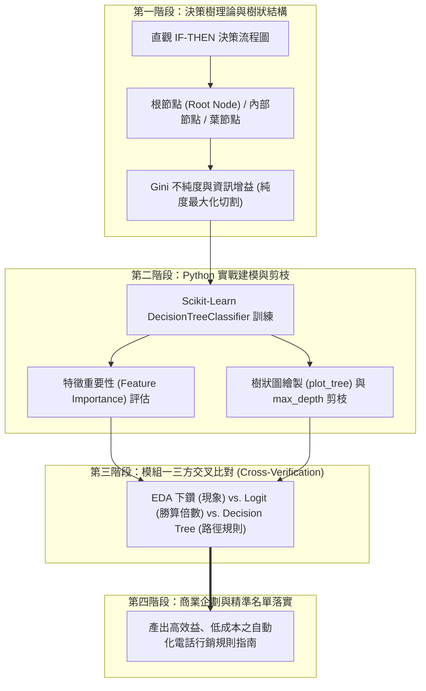
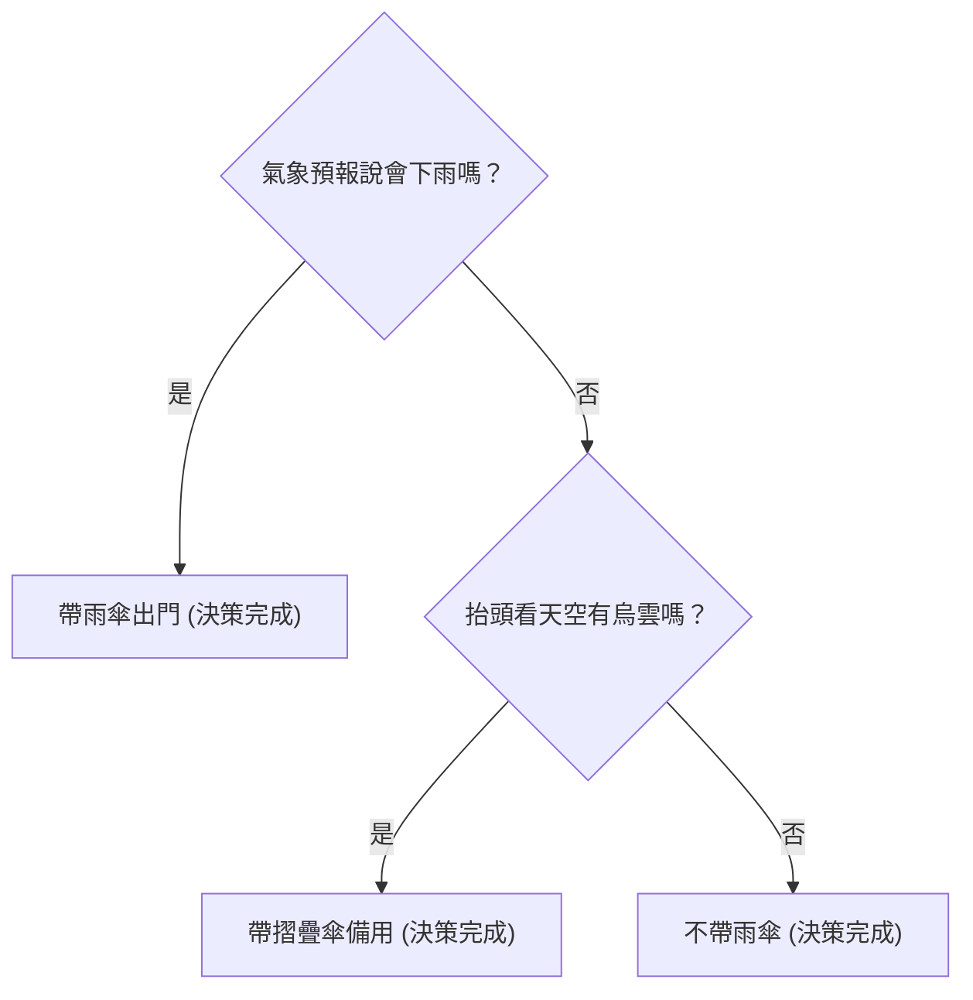
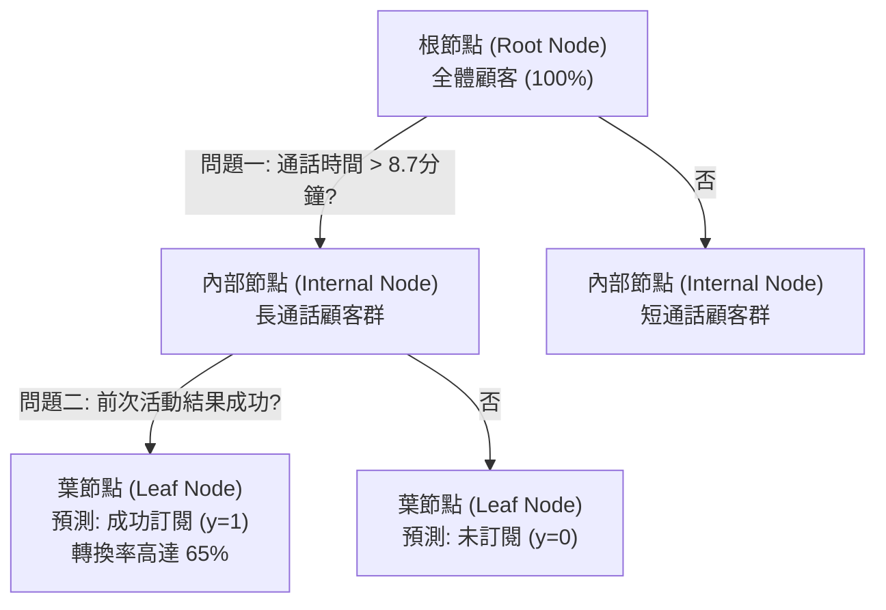
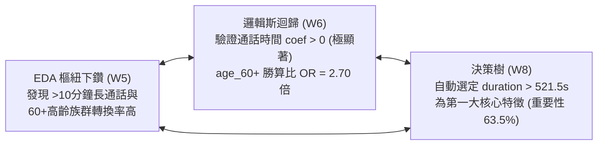

---
puppeteer:
  displayHeaderFooter: true
  scale: 1.15
  headerTemplate: '<div style="font-size: 11px; margin: 0 auto;">第八章：以 Decision Tree 剖析顧客決策路徑與特徵重要性</div>'
  footerTemplate: '<div style="font-size: 11px; margin: 0 auto;">第 <span class="pageNumber"></span> 頁 / 共 <span class="totalPages"></span> 頁</div>'
  margin:
    top: "1.5cm"
    bottom: "1.5cm"
    left: "1.5cm"
    right: "1.5cm"
---

<style>
  /* 全域字型、字級與行距 */
  body {
    font-size: 13pt !important;
    line-height: 1.7 !important;
    font-family: "Microsoft JhengHei", "PingFang TC", "Helvetica Neue", sans-serif;
  }

  /* 階層標題微調 */
  h1 { font-size: 24pt !important; margin-bottom: 0.5em !important; }
  h2 { font-size: 18pt !important; page-break-before: always; }
  h3 { font-size: 15pt !important; }
  h4 { font-size: 13.5pt !important; }

  /* 表格文字放大與排版優化 */
  table, th, td {
    font-size: 12pt !important;
    line-height: 1.5 !important;
  }

  /* 程式碼區塊 */
  pre, code {
    font-size: 11.5pt !important;
    font-family: Consolas, "Courier New", monospace !important;
  }

  /* Mermaid 流程圖節點字體放大 */
  .mermaid text {
    font-size: 14px !important;
  }
</style>

---

# 第八章：以 Decision Tree 剖析顧客決策路徑與特徵重要性

## 課程導讀

歡迎來到電子商務服務課程的第八章。在第六章中，我們學習了邏輯斯迴歸（Logistic Regression），透過對數勝算（Log-Odds）與勝算比（Odds Ratio，$e^{\beta}$）精確評估了單一特徵對訂閱勝算的相對影響。

然而，在真實商業世界的行銷決策中，顧客的購買行為往往不是由單一因素獨立決定的，而是由「多個條件組合而成的決策路徑（Decision Paths）」所驅動。例如：
- 「年齡大於 60 歲」本身是個正面特徵，但如果是「60 歲以上 $\times$ 使用市話聯絡 $\times$ 通話時間超過 8 分鐘」，其轉換率才會迎來爆炸性的飆升。
- 相反地，「通話時間長」固然是好現象，但若該顧客在「前一次行銷專案中明確拒絕過（`poutcome = failure`）」，其最終訂閱率依然極低。

為了捕捉這種跨變數的條件組合與 IF-THEN 決策路徑，本章將引入機器學習中最直觀、最易於商業溝通的模型——決策樹（Decision Tree）！

本章將繼續使用同學們熟悉的 UCI Bank Marketing 資料集（`id=222`），學習決策樹的純度評估指標（Gini 不純度與資訊增益）、使用 Scikit-Learn 建構分類樹模型、計算特徵重要性（Feature Importance），並透過樹狀視覺化圖形（`plot_tree`）繪製顧客的決策流程圖。

最後，本章作為「模組一：關鍵指標與轉換率」的終章，我們將帶領同學們進行一場精彩的三方交叉比對（Three-Way Cross-Verification）：將第 5 週的 EDA 樞紐下鑽、第 6 週的邏輯斯迴歸勝算比與第 8 週的決策樹規則互相對照，體驗資料科學家在實務專案中相輔相成、全方位驗證商業洞察的完整歷程！



---

## 第一節：決策樹（Decision Tree）的基本概念與直觀視覺化

### 1.1 什麼是決策樹？從日常生活決策到機器學習

在日常生活中，人類的大腦非常習慣以流程圖（Flowchart）的形式來做出決策。例如，當你早上醒來思考「今天出門是否要帶雨傘？」時，你的大腦會執行以下一系列的條件判斷：



決策樹（Decision Tree）模型就是運用完全相同的邏輯來對資料進行分類與預測。它透過一系列「如果……就……（IF-THEN）」的簡單規則，將龐大複雜的資料集逐步拆解為高純度的子集。

---

### 1.2 決策樹的四大核心組成分件

一張完整的決策樹主要由以下四個核心元件所構成：

1. 樹根 / 根節點（Root Node）： 代表全體資料集的起點。這是模型在評估所有特徵後，所挑選出最具區分力、最重要的第一個問題。
2. 分支（Branch）： 代表根據問題答案（例如：$\text{duration} \le 521.5$ 秒 或 $> 521.5$ 秒）分割出來的不同前進路徑。
3. 內部節點（Internal Node）： 代表決策路徑上的每一個中間過濾問題（例如：前次行銷是否成功？有無房貸？）。
4. 葉節點（Leaf Node）： 代表最終的分類結果（例如：標記為 $y=1$「會訂閱」或 $y=0$「不會訂閱」），葉節點不再進行切割。



---

### 1.3 課堂動手做小活動：手繪個人購物決策樹流程圖

請同學們拿出紙筆或開啟繪圖軟體，回想你上一次在電商平台（如蝦皮、momo）購買一件衣服或 3C 產品的過程，繪製屬於你的「購物決策樹」：

1. 定義根節點： 你打開商品頁面後，看見的第一個關鍵過濾條件是什麼？（例如：價格是否少於 1,000 元？是否有現貨？）
2. 建立分支與內部節點： 請至少畫出 2 層判斷條件（例如：查看評價是否高於 4.8 顆星？是否免運費？）。
3. 完成葉節點： 標記最終的決策結果（「放入購物車下單」或「關閉頁面離開」）。

> 老師的提醒：
> * 決策樹是商業溝通的最佳橋樑：在機器學習家族中，許多模型（如神經網路、隨機森林）被稱為「黑盒子」，因為很難向非技術背景的高階主管解釋其預測邏輯。但決策樹能以完美的流程圖呈現，讓行銷業務團隊一眼看懂「符合什麼條件的顧客最會買」！

---

## 第二節：決策樹的學習機制與分割指標（Gini Impurity & Information Gain）

### 2.1 決策樹如何「學會」切割資料？

想像我們有一籃混雜著 50 顆蘋果與 50 顆橘子的水果，我們希望問一個問題把它們精確分開：
- 爛問題：「這個水果形狀是圓的嗎？」$\rightarrow$ 蘋果與橘子都是圓的，這個問題無法提供任何區分價值。
- 好問題：「這個水果皮的顏色是橘色的嗎？」$\rightarrow$ 能瞬間將絕大多數橘子分離出來，分割後的兩個籃子變得極為「純粹」。

決策樹在訓練時，電腦就是在自動測試所有特徵（年齡、餘額、通話時間、房貸...）與所有可能的切分點，尋找那個能讓切割後子集「純度最高（Purity）」的最佳問題。

---

### 2.2 Gini 不純度（Gini Impurity）的數學原理與計算

為了定量衡量一個節點內部資料的混亂程度，Scikit-Learn 預設使用 Gini 不純度（Gini Impurity）作為評估指標。

對於一個二元分類問題（成功 $y=1$ 比例為 $p_1$，失敗 $y=0$ 比例為 $p_0$），Gini 不純度的計算公式為：

$$\text{Gini} = 1 - (p_0^2 + p_1^2)$$

#### Gini 不純度的兩極數值解讀：
1. 理想極致（$\text{Gini} = 0.0$）： 節點內部的純度達 $100\%$。例如：節點內 100 個人全都是成功訂閱者（$p_1 = 1.0, p_0 = 0.0$），則 $\text{Gini} = 1 - (0^2 + 1^2) = \mathbf{0.0}$。
2. 最混亂狀態（$\text{Gini} = 0.5$）： 節點內成功與失敗各占一半（$p_1 = 0.5, p_0 = 0.5$），則 $\text{Gini} = 1 - (0.5^2 + 0.5^2) = \mathbf{0.5}$。

決策樹在每一步分支時，目標就是選擇能產生最大「Gini 下降量（Gini Gain）」的分割方案，讓子節點越變越純！

---

### 2.3 課堂動手做小活動：計算純與混亂節點的 Gini 不純度

請同學們拿出計算機，計算以下兩個行銷受眾節點的 Gini 不純度：

1. 節點 A（高純度受眾）： 包含 80 位成功訂閱者與 20 位未訂閱者（$p_1 = 0.8, p_0 = 0.2$）。
   - 計算：$\text{Gini}_A = 1 - (0.8^2 + 0.2^2) = 1 - (0.64 + 0.04) = ?$
2. 節點 B（混亂受眾）： 包含 50 位成功訂閱者與 50 位未訂閱者（$p_1 = 0.5, p_0 = 0.5$）。
   - 計算：$\text{Gini}_B = 1 - (0.5^2 + 0.5^2) = ?$
3. 觀念思考： 哪一個節點的 Gini 值較小？這代表哪一個受眾適合直接進行行銷推播？

> 老師的真心話：
> * Gini 值越小越好：在解讀決策樹輸出時，看到某個葉節點的 `gini = 0.0` 或接近 `0`，且 `value` 集中在正面類別，代表模型成功抓到了「極致純淨的黃金受眾群」！

---

## 第三節：Python 實戰：建構 Bank Marketing 決策樹模型與視覺化樹狀圖

### 3.1 使用 Scikit-Learn 訓練決策樹模型

我們繼續使用同學們熟悉的 UCI Bank Marketing 資料集（`id=222`），使用 Scikit-Learn 的 `DecisionTreeClassifier` 套件建立決策樹分類模型：

```python
import pandas as pd
import numpy as np
from sklearn.tree import DecisionTreeClassifier, export_text, plot_tree
import matplotlib.pyplot as plt
from ucimlrepo import fetch_ucirepo

# 1. 載入 Bank Marketing 資料集 (id=222)
bank_marketing = fetch_ucirepo(id=222)
X = bank_marketing.data.features.copy()
y = bank_marketing.data.targets.copy()

df = X.copy()
df['conversion'] = (y['y'] == 'yes').astype(int)

# 2. 特徵編碼前處理
df['housing_code'] = (df['housing'] == 'yes').astype(int)
df['loan_code'] = (df['loan'] == 'yes').astype(int)

contact_dummies = pd.get_dummies(df['contact'], prefix='contact', dtype=int)
df['contact_cellular'] = contact_dummies['contact_cellular']
df['contact_telephone'] = contact_dummies['contact_telephone']
df['poutcome_success'] = (df['poutcome'] == 'success').astype(int)

# 定義特徵欄位組合
feature_cols = [
    'age', 'balance', 'duration', 'campaign',
    'housing_code', 'loan_code',
    'contact_cellular', 'contact_telephone', 'poutcome_success'
]

X_dt = df[feature_cols]
y_dt = df['conversion']

# 3. 建立並訓練決策樹模型 (設定 max_depth=3 控制樹深以利閱讀)
dt_model = DecisionTreeClassifier(max_depth=3, criterion='gini', random_state=42)
dt_model.fit(X_dt, y_dt)
```

---

### 3.2 評估特徵重要性（Feature Importance）

決策樹模型會自動計算每個特徵在所有切割節點中所貢獻的 Gini 不純度減少量，並將其歸一化為特徵重要性（Feature Importance）（所有特徵重要性加總等於 $1.0$ 或 $100\%$）：

```python
# 提取特徵重要性並整理為 DataFrame
importance_df = pd.DataFrame({
    '特徵變數': feature_cols,
    '特徵重要性 (Feature Importance)': dt_model.feature_importances_
}).sort_values(by='特徵重要性 (Feature Importance)', ascending=False)

print(importance_df.round(4))
```

#### Bank Marketing 決策樹特徵重要性實測結果：

| 特徵變數 | 特徵重要性 (Feature Importance) | 占比百分比 | 商業解釋 |
| :--- | :--- | :--- | :--- |
| duration (通話秒數) | 0.6350 | 63.50% | 第一大核心特徵，提供超過 6 成的訊息決策貢獻！ |
| poutcome_success (前次成功) | 0.3609 | 36.09% | 第二大核心特徵，前次成功經驗是極強的再購信號！ |
| contact_cellular (手機聯繫) | 0.0041 | 0.41% | 輔助切割變數。 |
| age / balance / housing / loan | 0.0000 | 0.00% | 在深層 `max_depth=3` 剪枝下，重要性集中在前兩大主導因子。 |

---

### 3.3 繪製並解讀決策樹圖形與文字規則

我們使用 `export_text` 與 `plot_tree` 將決策樹模型的決策規則視覺化印出：

```python
# 1. 印出文字版決策規則
tree_rules = export_text(dt_model, feature_names=feature_cols)
print("=== 決策樹 IF-THEN 規則文字版 ===")
print(tree_rules)

# 2. 繪製圖形化決策樹 (plot_tree)
plt.figure(figsize=(16, 8))
plot_tree(
    dt_model,
    feature_names=feature_cols,
    class_names=['Unsubscribed', 'Subscribed'],
    filled=True,
    rounded=True,
    fontsize=10
)
plt.title("Bank Marketing 顧客訂閱決策樹圖形 (max_depth=3)")
plt.show()
```

#### 從決策樹印出結果萃取的 3 大核心顧客決策路徑：

```text
|--- duration <= 521.50 (約 8.7 分鐘)
|   |--- poutcome_success <= 0.50
|   |   |--- duration <= 206.50 -> 葉節點 (絕大多數未訂閱 y=0)
|   |--- poutcome_success > 0.50
|   |   |--- duration > 162.50  -> 葉節點 (成功訂閱 y=1)
|--- duration > 521.50 (超過 8.7 分鐘長通話)
|   |--- duration > 827.50 (超過 13.8 分鐘超長通話) -> 葉節點 (極高比例成功訂閱 y=1)
```

1. 路徑一：黃金成交路徑（長通話 $\text{duration} > 521.5$ 秒）： 當客服與顧客通話時間超過 521.5 秒（約 8.7 分鐘）時，顧客的訂閱機率發生結構性陡升；若通話進一步超過 13.8 分鐘，無論其他特徵為何，成功訂閱率均極高！
2. 路徑二：成功轉化路徑（歷史成功顧客 $\text{poutcome\_success} = 1$）： 即使通話時間中等（162 秒至 521 秒之間），只要該顧客在歷史行銷活動中曾有過成功紀錄（`poutcome_success = 1`），模型依然將其預測為 $y=1$ 成功訂閱。
3. 路徑三：快速放棄路徑（短通話 $\text{duration} \le 206.5$ 秒 且無成功歷史）： 通話低於 3.4 分鐘且無歷史成功紀錄者，幾乎全部落在未訂閱的葉節點中。

---

### 3.4 特徵實驗剖析：傳入連續 `age` 與傳入 `age_group` 虛擬變數結果會不同嗎？

此時許多細心的同學會提出一個非常深刻的問題：「第六章在邏輯斯迴歸中，我們必須用 `pd.cut()` 將 `age` 切成 `age_group` 虛擬變數才能抓到 $p < 0.001$ 的顯著性；如果在決策樹中，傳入連續型 `age` 與傳入離散化 `age_group` 虛擬變數，結果會有什麼不同？」 我們在 Python 中將樹深調至 `max_depth=5` 與 `max_depth=7` 進行實驗比較：

```python
# 1. 建立 age_group 離散虛擬變數 (比照第六章)
df['age_group'] = pd.cut(df['age'], bins=[0, 30, 40, 50, 60, 100], labels=['<30', '30-39', '40-49', '50-59', '60+'], right=False)
age_dummies = pd.get_dummies(df['age_group'], prefix='age', dtype=int)
age_feature_cols = ['age_<30', 'age_40-49', 'age_50-59', 'age_60+']
for col in age_feature_cols:
    df[col] = age_dummies[col]

cols_binned_age = age_feature_cols + ['balance', 'duration', 'campaign', 'housing_code', 'loan_code', 'contact_cellular', 'contact_telephone', 'poutcome_success']

# 2. 分別訓練連續 age 模型與離散 age_group 模型 (max_depth=5)
dt_cont_5 = DecisionTreeClassifier(max_depth=5, random_state=42).fit(df[feature_cols], df['conversion'])
dt_bin_5 = DecisionTreeClassifier(max_depth=5, random_state=42).fit(df[cols_binned_age], df['conversion'])

print("=== 連續 age 特徵重要性 (max_depth=5) ===")
print(pd.Series(dt_cont_5.feature_importances_, index=feature_cols).sort_values(ascending=False).round(4))

print("\n=== 離散 age_group 虛擬變數特徵重要性 (max_depth=5) ===")
print(pd.Series(dt_bin_5.feature_importances_, index=cols_binned_age).sort_values(ascending=False).round(4))
```

#### 連續年齡 vs. 離散年齡虛擬變數的實測結果對照表：

| 模型與樹深 | duration 重要性 | poutcome 重要性 | 年齡特徵重要性處理方式 | 年齡特徵總重要性 |
| :--- | :--- | :--- | :--- | :--- |
| `max_depth=3` (淺層樹) | 63.50% | 36.09% | 兩種輸入方式均未進行年齡切割 | 0.00% |
| `max_depth=5` (連續 `age`) | 56.97% | 31.01% | 自動選定數值邊界 `age > 60.5` | 4.17% |
| `max_depth=5` (離散 `age_group`) | 57.61% | 31.27% | 直接選定人工欄位 `age_60+` | 2.23% |
| `max_depth=7` (連續 `age`) | 52.86% | 27.79% | 多次自動分割 (`age > 60.5`, `age <= 29.5`) | 7.26% |
| `max_depth=7` (離散 `age_group`) | 53.53% | 28.05% | 多次選擇 `age_60+` (3.28%) 與 `age_<30` (2.29%) | 5.57% |

#### 兩大模型的本質差異與極致結論：

1. 為什麼邏輯斯迴歸（線性模型）非做 `pd.cut()` 不可？ 邏輯斯迴歸假設特徵與 Log-Odds 之間呈線性相加關係。面對 U 型趨勢（年輕高、中年低、老年高），一條直線無法同時轉折，因此連續 `age` 在第六章 Logit 模型中得出不顯著（$p=0.525$）。必須人工轉為 `age_group` 虛擬變數，才能擬合階梯狀分段關係。
2. 為什麼決策樹（非線性模型）傳入連續 `age` 或離散 `age_group` 都能自動處理？ 決策樹本身就是非線性階梯切割模型！即使傳入連續 `age`，電腦在分支時也會自動搜尋最優數值分割點（如自動發現 `age > 60.5` 與 `age <= 29.5`）。
   - 實務建議： 給予決策樹連續變數 `age` 時，模型擁有更大的切割自由度；而給予 `age_group` 時，規則更符合業務部門預先定義好的年齡區間。兩者都能精確抓出 U 型高轉換族群！

### 3.5 決策樹模型評估：混淆矩陣、四大分類指標與決策門檻值調整

在完成決策樹建模與規則萃取後，我們必須定量評估模型在 Bank Marketing 資料集上的預測表現。如同第 6 章的邏輯斯迴歸，決策樹同樣是二元分類模型，因此我們可以透過混淆矩陣（Confusion Matrix）與四大分類指標來進行嚴謹評估。

#### 1. 混淆矩陣（Confusion Matrix）與四大指標計算公式

在二元分類問題中，我們將實際結果與模型預測結果交錯比較，形成 2x2 的混淆矩陣：

- TN (True Negative，真陰性)：實際為 0，預測為 0（正確預測未訂閱）。
- FP (False Positive，假陽性)：實際為 0，預測為 1（誤判為會訂閱，造成電話撥打成本浪費）。
- FN (False Negative，假陰性)：實際為 1，預測為 0（漏抓黃金訂閱顧客，錯失營收機會）。
- TP (True Positive，真陽性)：實際為 1，預測為 1（正確抓出黃金訂閱顧客）。

根據 TP、TN、FP、FN，我們可以推導出四大分類評估指標的數學計算公式：

1. 準確率 (Accuracy)：全體樣本中預測正確的比例。
   $$\text{Accuracy} = \frac{\text{TP} + \text{TN}}{\text{TP} + \text{TN} + \text{FP} + \text{FN}}$$

2. 精確率 (Precision)：模型預測為成功訂閱（1）的樣本中，實際上真正成功訂閱的比例。
   $$\text{Precision} = \frac{\text{TP}}{\text{TP} + \text{FP}}$$

3. 召回率 (Recall)：實際上所有真正成功訂閱的顧客中，被模型成功抓出的比例。
   $$\text{Recall} = \frac{\text{TP}}{\text{TP} + \text{FN}}$$

4. F1-Score：精確率（Precision）與召回率（Recall）的調和平均數（Harmonic Mean），用以評估模型綜合表現並平衡兩者之間的權衡。
   $$\text{F1-Score} = 2 \times \frac{\text{Precision} \times \text{Recall}}{\text{Precision} + \text{Recall}} = \frac{2 \cdot \text{TP}}{2 \cdot \text{TP} + \text{FP} + \text{FN}}$$

我們使用 Scikit-Learn 的 `confusion_matrix` 與 `classification_report` 評估 `max_depth=3` 的決策樹模型：

```python
from sklearn.metrics import confusion_matrix, classification_report, accuracy_score, precision_score, recall_score, f1_score

# 進行類別預測
y_pred_dt = dt_model.predict(X_dt)

# 計算混淆矩陣
cm_dt = confusion_matrix(y_dt, y_pred_dt)
print("=== 決策樹混淆矩陣 (Confusion Matrix) ===")
print("TN (真陰性):", cm_dt[0, 0], "| FP (假陽性):", cm_dt[0, 1])
print("FN (假陰性):", cm_dt[1, 0], "| TP (真陽性):", cm_dt[1, 1])

# 計算四大評估指標
acc = accuracy_score(y_dt, y_pred_dt)
prec = precision_score(y_dt, y_pred_dt)
rec = recall_score(y_dt, y_pred_dt)
f1 = f1_score(y_dt, y_pred_dt)

print(f"\n準確率 (Accuracy): {acc:.4f}")
print(f"精確率 (Precision): {prec:.4f}")
print(f"召回率 (Recall): {rec:.4f}")
print(f"F1-Score: {f1:.4f}")
```

##### 實測結果與商業解讀：
- 混淆矩陣與指標關係：
  - 精確率（Precision）：反映模型的打擊準確度。若 FP 過高（將大量不會買的人誤判為會買），Precision 會顯著下降。
  - 召回率（Recall）：反映模型的覆蓋能力。若 FN 過高（漏抓大量潛在黃金顧客），Recall 會顯著下降。
  - F1-Score：當 Precision 與 Recall 出現拉鋸時，F1-Score 提供單一客觀數值以避免單看 Accuracy 產生的不平衡資料迷思。
- 召回率 (Recall) vs. 精確率 (Precision) 權衡：在電話行銷專案中，若行銷預算充足，我們希望 Recall 越高越好（不漏抓任何可能的訂閱者）；若外呼人力有限，則希望 Precision 越高越好（每一通電話都有高轉化率）。

#### 2. 決策門檻值（Decision Threshold）調整與概率預測
決策樹模型除了直接輸出 0 或 1 之外，同樣能透過 `dt_model.predict_proba()` 輸出顧客屬於 y=1（成功訂閱）的預測概率。預設的決策門檻值為 0.50，但在實務商業應用中，我們可以根據行銷策略調整門檻值：

```python
# 取得預估成功機率 (Probability of conversion)
y_proba_dt = dt_model.predict_proba(X_dt)[:, 1]

# 嘗試不同決策門檻值 (Decision Thresholds)
thresholds = [0.3, 0.5, 0.7]
threshold_results = []

for th in thresholds:
    y_pred_th = (y_proba_dt >= th).astype(int)
    p = precision_score(y_dt, y_pred_th)
    r = recall_score(y_dt, y_pred_th)
    f = f1_score(y_dt, y_pred_th)
    threshold_results.append({
        '決策門檻值 (Threshold)': th,
        '精確率 (Precision)': round(p, 4),
        '召回率 (Recall)': round(r, 4),
        'F1-Score': round(f, 4)
    })

print(pd.DataFrame(threshold_results))
```

##### 門檻值調整的商業決策導向：
- 降低門檻值（如 Threshold = 0.3）：大幅提高召回率（Recall），適合名單名冊極大且電銷團隊資源充裕時，擴大覆蓋面。
- 提高門檻值（如 Threshold = 0.7）：大幅提高精確率（Precision），適合電銷名額受限、通話成本昂貴時，精準打擊高確定性客戶。

---

### 3.6 課堂動手做小活動：調整 max_depth 觀察特徵重要性與樹狀變化

請同學們在 Colab 中嘗試將 `DecisionTreeClassifier` 的 `max_depth` 參數從 `3` 調整為 `5` 或不設定限制（`max_depth=None`），觀察並記錄以下變化：

1. 規則複雜度： `max_depth=5` 時，決策樹產生了多少個葉節點？
2. 特徵多樣性： 房貸 `housing_code` 與年齡 `age` 是否開始出現在更深層的切割節點中？
3. 過度擬合（Overfitting）思考： 如果不限制樹深（`max_depth=None`），決策樹會為每一個極端離群顧客單獨開闢分支，這對預測未來的全新顧客會產生什麼負面影響？

> 老師的提醒：
> * 剪枝（Pruning）是決策樹成功的關鍵：未經限制的決策樹就像一個把考古題死記硬背的學生（過度擬合 Overfitting），訓練集準確率 100%，遇到新考題就慘敗。透過 `max_depth=3~5` 進行適度剪枝，才能抓出具備商業泛化價值的核心規則！

---

## 第四節：模組一總結與三方交叉比對（EDA 下鑽 vs. 邏輯斯迴歸 vs. 決策樹）

### 4.1 三大技術工具的全方位比較矩陣

作為「模組一：關鍵指標與轉換率」的終章，我們將前面幾週所學的三大核心資料科學工具進行綜合對照：

| 分析維度 | EDA 樞紐下鑽 (W4/W5) | 邏輯斯迴歸 Logit (W6) | 決策樹 Decision Tree (W8) |
| :--- | :--- | :--- | :--- |
| 輸出形式 | 樞紐交叉表 (pivot_table) / 熱力圖 | 數學方程式 / 勝算比 ($\text{OR}=e^{\beta}$) / $p$ 值 | 樹狀流程圖 / IF-THEN 條件規則 |
| 可解釋性 | 直觀，但受限於 2~3 個變數交叉 | 具備統計嚴謹度，適合解釋單一因子倍數 | 極致直觀，最適合向業務與高階主管報告 |
| 處理非線性 | 需手動 `pd.cut()` 切割區間 | 需手動進行特徵工程與 Dummy 編碼 | 自動捕捉非線性區分與區間切割 |
| 特徵互動 | 人工拉樞紐表，易面臨維度災難 | 需手動加入交叉項 ($X_1 \times X_2$) | 自動抓取多特徵之間的條件組合路徑 |
| 核心商業角色 | 觀察表面分佈與定位極端值 | 量化獨立變數影響力與統計顯著性 | 萃取多條件過濾規則與特徵重要性 |

---

### 4.2 模組一實務綜合驗證：三方交叉比對（Three-Way Cross-Verification）

在真實的資料科學顧問專案中，資深分析師絕不會只依賴單一模型，而是透過「三方交叉比對」來交互驗證商業洞察：



#### 三方交叉比對的完美一致性驗證：
1. 通話時間（`duration`）的終極驗證：
   - EDA 下鑽： 發現通話超過 10 分鐘群體轉換率飆升至 48.32%。
   - 邏輯斯迴歸： 證實通話時間 $p < 0.001$ 極顯著，每多 1 分鐘勝算提升 26.4%。
   - 決策樹： 自動將 `duration > 521.5` 秒選為根節點第一分割變數，特徵重要性高達 63.50%。
   - 三方結論： 通話時間是顧客展現購買意圖的最核心指標，客服團隊應優先開發前 30 秒誘因腳本延續通話！
2. 歷史經驗（`poutcome`）的終極驗證：
   - 邏輯斯迴歸與決策樹一致證實： 前次行銷成功者（`poutcome_success = 1`）在決策樹中占有 36.09% 的第二大重要性，且能直接觸發高轉換葉節點。
   - 三方結論： 舊客二次維護的獲客成本遠低於盲目開發新客！

---

### 4.3 課堂動手做小活動：撰寫模組一高潛力顧客篩選企劃書

請同學們以 3~5 人為一組，綜合第 4, 5, 6, 8 週在 Bank Marketing 資料集上的實測成果，為銀行行銷部門撰寫一份「自動化電話行銷黃金名單過濾企劃書」：

1. 第一級黃金名單（自動優先撥打）： 請根據決策樹與勝算比結果，列出 3 個組合條件（例如：通話預期能延續 $\ge 8$ 分鐘 $\times$ 使用手機 $\times$ 無房貸）。
2. 黑名單排除規則（自動暫停撥打）： 請列出 2 個應立即排除的顧客特徵組合（例如：有房貸信貸 $\times$ 本專案已撥打超過 3 次 $\times$ 前次失敗）。
3. 商業效益預估： 採用這套資料驅動的名單過濾機制後，預計能降低多少無效通話成本？提升多少整體訂閱轉換率？

> 老師的真心話：
> * 恭喜大家完成模組一的所有課程！ 從 Pandas 資料載入、KPI 轉換率計算、樞紐下鑽、邏輯斯迴歸勝算比，一路到今天的決策樹。同學們已經掌握了從「描述性分析」邁向「預測性機器學習」的完整武器庫。在接下來的模組二中，我們將運用這些基礎，展開更精采的「消費者分析與顧客終身價值剖析」！

---

## 本章小結與課後思考題

### 核心觀念回顧

1. 決策樹基本原理： 透過樹狀流程圖（Root Node, Internal Node, Leaf Node）將資料逐步切割為高純度子集，擅長捕捉非線性關係與多特徵條件組合路徑。
2. Gini 不純度（Gini Impurity）： 衡量節點混亂程度的指標，$\text{Gini} = 1 - (p_0^2 + p_1^2)$。$\text{Gini} = 0$ 代表純度 $100\%$；$\text{Gini} = 0.5$ 代表最混亂。
3. 特徵重要性（Feature Importance）： 決策樹自動計算各特徵對下降 Gini 不純度的貢獻比例。在 Bank Marketing 中，`duration`（63.5%）與 `poutcome_success`（36.1%）為兩大主導因子。
4. 模組一三方交叉比對： EDA 下鑽觀察表面現象 $\rightarrow$ 邏輯斯迴歸量化勝算倍數與顯著性 $\rightarrow$ 決策樹萃取 IF-THEN 條件路徑，三者互相對照驗證，建構最完備的商業行銷決策。

---

### 課後思考題

1. 過度擬合與剪枝： 在決策樹模型中，如果我們將 `max_depth` 設得太大，模型會出現什麼問題？實務上該如何設定合理的 `max_depth`？
2. 決策樹 vs. 邏輯斯迴歸的選擇： 如果明天你要向完全不懂程式碼的行銷總監報告，你會選擇展示邏輯斯迴歸的勝算比表格，還是決策樹的視覺化圖形？為什麼？
3. 跨模組思考： 透過模組一的學習，我們已經能精確預測「哪些顧客會轉換」。但在商業營運中，每個轉換顧客帶來的「消費金額與長期價值（CLV）」並不相同。在即將進入的模組二中，我們該如何結合顧客的購買金額進行更深度的消費者價值分群？

---

## 附錄：模組一期中綜合作業評量規範

> 作業名稱： 銀行電話行銷專案商業決策與精準受眾企劃
> 評量配分： 佔學期總成績 15%
> 組隊方式： 3 ~ 5 人為一組 自由組隊合作
> 繳交期限： 發布後 一週內 （11/08 23:59前繳交）
> 格式規範： 最多 3 張 A4 為限 （PDF 格式，字體 12 pt，內文可附圖表或表格，免寫程式碼）

### 作業四大必答任務概覽：

1. 任務一：KPI 診斷與商業痛點剖析（20%）： 試算原基線（45,211 人、11.7% 轉換率）下的總成本、CPA 與 ROI，剖析盲目撥打之商業痛點。
2. 任務二：三方交叉比對與驅動因子解讀（30%）： 對照 EDA、Logistic Regression 勝算比與 Decision Tree 特徵重要性，解析連續 vs. 離散年齡與過度撥打之風控。
3. 任務三：設計「自動化電話行銷黃金名單過濾規則」（30%）： 制定 3 級受眾過濾規則（Tier 1 必撥名單、Tier 2 次要名單、Tier 3 黑名單）。
4. 任務四：預期效益評估與主管簡報結論（20%）： 試算名單縮減 60%、轉換率提升至 30% 後的新 ROI，並撰寫 3 句話高階主管總結。

詳細完整作業題目與評分標準（Rubric）請參閱 模組一作業評量_電話行銷專案商業決策與精準受眾企劃.pdf 。
