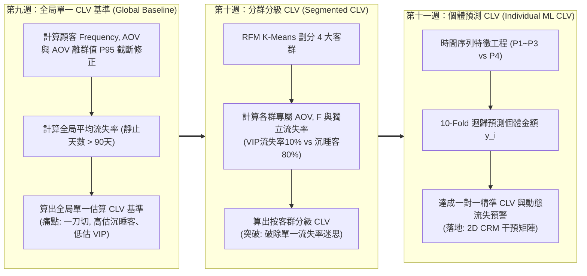
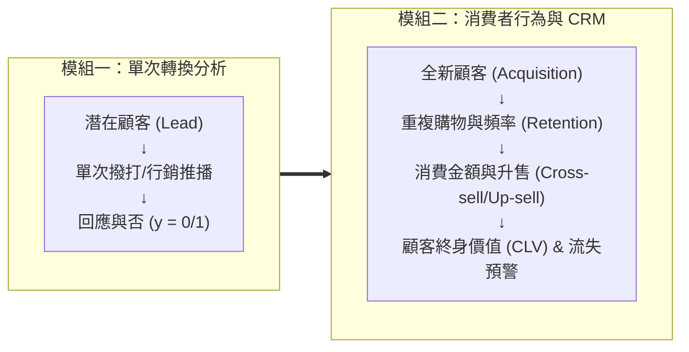
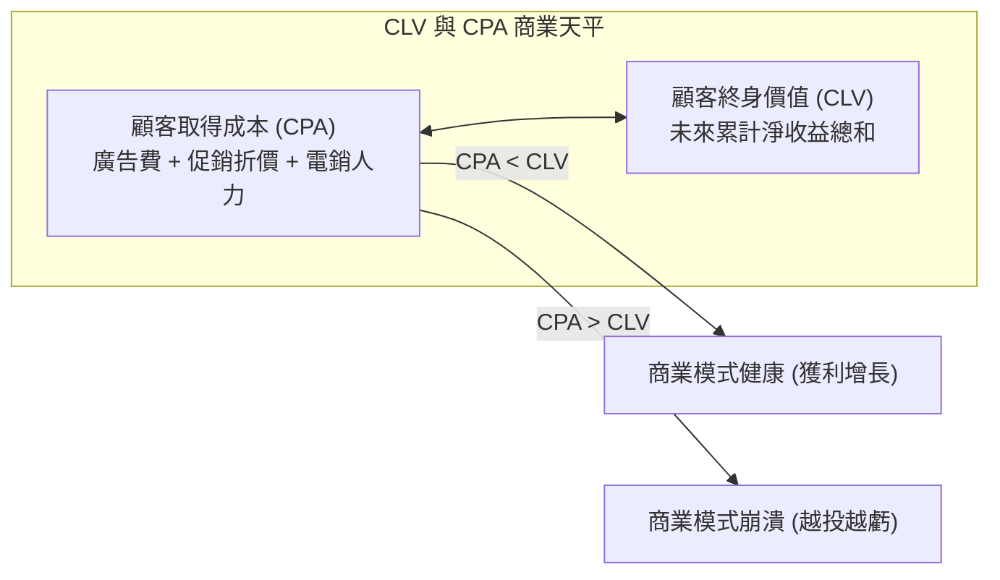
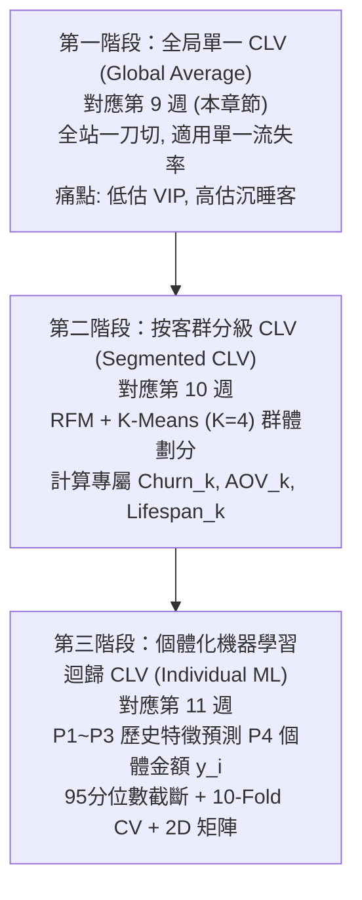
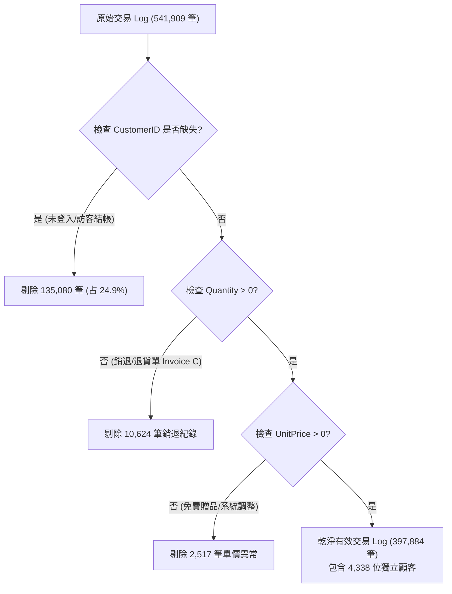

---
puppeteer:
  displayHeaderFooter: true
  scale: 1.15
  headerTemplate: '<div style="font-size: 11px; margin: 0 auto;">第九章：消費者購物行為與交易 Log 探索性分析</div>'
  footerTemplate: '<div style="font-size: 11px; margin: 0 auto;">第 <span class="pageNumber"></span> 頁 / 共 <span class="totalPages"></span> 頁</div>'
  margin:
    top: "1.5cm"
    bottom: "1.5cm"
    left: "1.5cm"
    right: "1.5cm"
---

<style>
  /* 全域字型、字級與行距 */
  body {
    font-size: 13pt !important;
    line-height: 1.7 !important;
    font-family: "Microsoft JhengHei", "PingFang TC", "Helvetica Neue", sans-serif;
  }

  /* 階層標題微調 */
  h1 { font-size: 24pt !important; margin-bottom: 0.5em !important; }
  h2 { font-size: 18pt !important; page-break-before: always; }
  h3 { font-size: 15pt !important; }
  h4 { font-size: 13.5pt !important; }

  /* 表格文字放大與排版優化 */
  table, th, td {
    font-size: 12pt !important;
    line-height: 1.5 !important;
  }

  /* 程式碼區塊 */
  pre, code {
    font-size: 11.5pt !important;
    font-family: Consolas, "Courier New", monospace !important;
  }

  /* Mermaid 流程圖節點字體放大 */
  .mermaid text {
    font-size: 14px !important;
  }
</style>

---

# 第九章：消費者購物行為與交易 Log 探索性分析

## 課程導讀與模組二總體目標

恭喜同學們順利完成了「模組一：關鍵指標與轉換率」的學習！在模組一中，我們聚焦於「潛在顧客是否會回應行銷專案」的二元轉換問題，並運用了 EDA 樞紐下鑽、邏輯斯迴歸（Logistic Regression）與決策樹（Decision Tree）來進行分析。

從本週開始，我們正式邁入「模組二：消費者分析與顧客關係管理（Consumer Analytics & CRM）」！

在真實的電子商務與零售場景中，商業營運絕不僅止於「獲取新顧客（Acquisition）」，更關鍵的是如何維繫「舊顧客的重複購買（Retention）」與極大化「顧客終身價值（Customer Lifetime Value, CLV）」。

### 模組二（第 09~11 週）的核心學習主線：逐步改善 CLV 估算與流失率分析

為了讓同學們掌握國際級電商的 CRM 數據營運邏輯，模組二將圍繞著「如何一步步精準估算 CLV 與分析流失率（Churn Rate）」展開為期三週的漸進式進化主線：



為了進行這項跨週的深度行為剖析，本模組採用國際著名的 UCI Online Retail 跨國電商交易 Log 資料集（`id=352`），包含 54 萬筆真實電商交易流水帳（Transaction Logs）。

本章作為模組二的開頭，我們將學習：
1. 客戶分析（Customer Analysis）與顧客全生命週期的核心觀念。
2. 交易 Log 的資料清洗（Data Cleaning）： 處理缺失 CustomerID、退貨銷退（`Quantity <= 0`）與免費贈品/異常單價。
3. 顧客維度聚合與偏斜度驗證： 將明細壓縮為顧客維度特徵，並運用 Seaborn 分佈圖視覺化驗證右偏斜特性。
4. AOV 離群值修正調整（AOV Outlier Quantile Capping）： 在 EDA 後對強偏斜 AOV 進行 95 分位數截斷，防範離群值對 CLV 的估算扭曲。
5. 第一階段 CLV 估算：計算全局平均流失率（Churn Rate）與全局單一 CLV 基準，並剖析其一刀切的痛點。
6. 帕累托法則（Pareto 80/20 Rule）驗證： 執行程式碼並輸出各階層顧客累積營收分佈，揭開頂級 20% 高價值顧客貢獻 74.59% 總營收的「M 型消費分佈」。
7. 時間軸與地理區域下鑽分析： 探索顧客在星期的哪一天、一天的哪一個時段最愛下單購物。

---

## 第一節：模組二開章與客戶分析（Customer Analysis）範疇

### 1.1 從單一名單轉換邁向「消費者行為與 CRM」

在模組一中，我們的分析單元（Unit of Analysis）是「單一次電話行銷反應」，資料列中的每一列代表一位被聯繫的潛在客戶，目標是預測其 $y \in \{0, 1\}$ 是否訂閱。

然而在電子商務營運中，一位顧客會在電商平台上發起多次購物、購買多種商品、退換貨、甚至是停用服務。因此，我們的分析單元必須從「單次活動」提升為「顧客全生命週期（Customer Lifecycle）」。



---

### 1.2 什麼是客戶分析（Customer Analysis）與銷售漏斗？

客戶分析（Customer Analysis）是透過資料科學工具，深入探索消費者在電商平台上的點擊、瀏覽、加購物車、結帳與複購行為，進而回答以下三大商業核心問題：

1. 客戶如何與產品互動？ 顧客主要在星期的哪一天下單？每次下單買多少東西？
2. 誰是高價值的黃金顧客？ 哪一群顧客貢獻了公司絕大部分的營收？
3. 客戶在哪裡流失？ 從初次下單到第二次下單之間，顧客隔了多久？有哪些顧客已經超過半年未再購物？

藉由解答這些問題，行銷與營運團隊能建構顧客關係管理（CRM）儀表板，將行銷預算精準投放在高價值與高潛力受眾身上。

---

### 1.3 什麼是顧客終身價值（CLV）？為什麼 CLV 決定行銷預算上限？

顧客終身價值（Customer Lifetime Value, CLV / LTV）是指一位顧客在與企業維持商業關係的整個生命週期內，預計能為企業帶來的淨收益總和。

在電子商務與成長行銷（Growth Marketing）中，CLV 被譽為最核心的北極星指標（North Star Metric），其最關鍵的商業應用在於：為顧客取得成本（Customer Acquisition Cost, CPA）提供客觀且合理的預算上限！



#### CLV 決定的三大商業策略決策：

1. 定義 CPA 獲客預算上限：
   - 如果數據顯示一位電商顧客在未來的平均 CLV 為 5,000 元，那麼行銷團隊支付 800 元的 CPA 來獲取該顧客就是一筆極具效益的投資。
   - 相反地，如果某類受眾的預估 CLV 僅有 300 元，投放 500 元的 CPA 就會導致每一筆交易都陷入結構性虧損。
2. 鎖定並資源傾斜高價值 VIP：
   - 透過精準預測個體顧客的未來 CLV，企業能為高潛力顧客提供客製化尊榮服務（例如專屬客戶經理、免費快遞、優先試用權），提高其忠誠度與留存率。
3. 權衡「獲取新客（Acquisition）」與「留存舊客（Retention）」：
   - 在行銷學中，獲取一位新顧客的成本通常是維繫一位舊顧客的 5 到 7 倍！而將顧客留存率提升 5%，能帶動企業整體利潤成長 25% 至 95%。CLV 分析能讓經營層量化比較「投入廣告抓新客」與「行銷召回舊客」的投資報酬率，優化資源配置。

---

### 1.4 三大 CLV 計算演進階段與本模組課程章節完整對應

為了帶領同學們解構業界的 CRM 資料分析方法，本模組將跨越三週，逐步實現三大 CLV 計算演進階段：



1. 第一階段：全局單一公式 CLV（Global Average CLV）
   - 對應章節：第九週第 3.3 節（本章節）。
   - 作法：全公司套用單一 AOV、單一頻率與單一流失率（38.45%，留存期 2.60 年）。
   - 特性與痛點：一刀切，無視顧客異質性，嚴重低估 VIP，高估沉睡客。
2. 第二階段：分群式 RFM / K-Means CLV（Segmented CLV via K-Means）
   - 對應章節：第十週（RFM 特徵工程與 K-Means 分群）。
   - 作法：先執行 RFM K-Means 分群（劃分為 K=4 個 Cluster：Champions, Loyalists, Promising, Hibernating）。對每個 Cluster k 計算獨立的客單價 $AOV_k$、頻率 $F_k$ 與獨立流失率 $Churn_k$：
     $$\text{CLV}_k = \text{AOV}_k \times F_k \times \frac{1}{\text{Churn}_k}$$
   - 優點：Champions 套用 10.20% 低流失率得出 $57,046.20$高 CLV，Hibernating 套用 78.50% 高流失率得出 $393.70$低 CLV，成功破除單一流失率迷思！
3. 第三階段：個體化機器學習迴歸預測（Individual ML Regression CLV）
   - 對應章節：第十一章（時間序列特徵工程、95 分位數截斷、10-Fold CV 建模與 2D CLV-流失風險決策矩陣）。
   - 作法：從「群體分群平均」進一步精細到「每一位個體顧客 $i$」。
   - 透過歷史時間窗口（P1, P2, P3）的個體交易特徵 $X_i$，讓機器學習模型自動根據個體的歷史購物間隔與未購補零特徵（Zero-Padding），隱式學習個體顧客的流失懲罰與未來特定時間窗口（P4）的預估金額 $y_i$。

---

### 1.5 課堂動手做小活動：比較電銷名單與電商交易 Log 的資料結構與 CLV 評估準備

請同學們思考並討論以下兩種資料結構的差異，並為第一階段 CLV 估算做好資料準備：

1. 表格結構差異： 在第四週的 Bank Marketing 資料集中，一位顧客在表格中會出現幾列（Rows）？而在本週的 Online Retail 交易 Log 中，一位顧客在表格中會出現幾列？
2. 分析與聚合挑戰： 當一位顧客有 50 筆不同的購物明細紀錄時，我們該如何將這些交易明細壓縮整理為「這一位顧客的消費特徵」？
3. CLV 評估準備： 若要計算全站顧客的平均消費金額（AOV）與購物頻率（Frequency），為什麼我們不能直接對明細檔的 `UnitPrice` 求平均，而必須先按顧客維度進行 `groupby('CustomerID')` 聚合？

> 老師的提醒：
> * 從 Transaction Log 到 Customer Profile：交易 Log 是按「訂單明細」逐筆紀錄的流水帳。進行客戶分析時的第一步，永遠是透過 Pandas 的 `groupby('CustomerID')` 進行資料聚合，將明細壓縮為以「顧客（Customer）」為單位的行為輪廓，進而算出生效的 AOV 與 Frequency！

---

## 第二節：UCI Online Retail 資料載入與交易 Log 資料清洗

### 2.1 認識 UCI Online Retail 交易 Log 資料集（`id=352`）

本章採用 UCI Machine Learning Repository 的 Online Retail 資料集（`id=352`）。這是一家總部位於英國的跨國線上零售電商，在 2010 年 12 月至 2011 年 12 月期間的所有真實交易明細：

```python
import pandas as pd
import numpy as np
import matplotlib.pyplot as plt
import seaborn as sns
from ucimlrepo import fetch_ucirepo

# 1. 載入 UCI Online Retail 資料集 (id=352)
online_retail = fetch_ucirepo(id=352)
df_raw = online_retail.data.original.copy()

print(f"原始交易 Log 資料筆數: {len(df_raw)} 筆")
print("資料欄位結構：", df_raw.columns.tolist())
print(df_raw.head())
```

#### 資料欄位定義：
- InvoiceNo（發票/訂單編號）： 6 位數字字串。若以 `C` 開頭，代表該筆訂單為「取消/銷退（Cancellation）」。
- StockCode（商品編號）： 產品唯一識別碼。
- Description（產品描述）： 商品名稱。
- Quantity（購買數量）： 該筆明細購買的商品數量。
- InvoiceDate（訂單日期時間）： 交易發生的日期與時間。
- UnitPrice（商品單價）： 單位商品價格（英鎊 GBP）。
- CustomerID（顧客編號）： 5 位數字顧客識別碼。
- Country（國家）： 顧客居住或發貨的國家。

---

### 2.2 交易 Log 常見三大資料異常處置

真實商業環境中的交易流水帳充滿了雜訊與異常值，在進行探索性分析前，必須執行嚴格的資料清洗（Data Cleaning）：



```python
# 1. 檢視缺失值與異常值狀況
print("CustomerID 缺失筆數:", df_raw['CustomerID'].isnull().sum())
print("數量 <= 0 的銷退筆數:", (df_raw['Quantity'] <= 0).sum())
print("單價 <= 0 的異常筆數:", (df_raw['UnitPrice'] <= 0).sum())

# 2. 執行資料清洗管道 (Data Cleaning Pipeline)
df_clean = df_raw.dropna(subset=['CustomerID']).copy()
df_clean = df_clean[(df_clean['Quantity'] > 0) & (df_clean['UnitPrice'] > 0)].copy()

# 轉換資料型態
df_clean['CustomerID'] = df_clean['CustomerID'].astype(int)
df_clean['InvoiceDate'] = pd.to_datetime(df_clean['InvoiceDate'])

# 計算單筆明細總金額 (Revenue)
df_clean['Revenue'] = df_clean['Quantity'] * df_clean['UnitPrice']

print(f"清洗後有效交易紀錄: {len(df_clean)} 筆")
print(f"獨立顧客人數 (Unique Customers): {df_clean['CustomerID'].nunique()} 人")
print(f"總交易訂單數 (Unique Invoices): {df_clean['InvoiceNo'].nunique()} 張")
print(f"總產生營收金額: ${df_clean['Revenue'].sum():,.2f} 英鎊")
```

---

### 2.3 課堂動手做小活動：使用 Pandas 進行異常值過濾與資料清理

請同學們在 Colab 中執行上述資料清理程式碼，並回答以下問題：

1. 缺失值思考： 有高達 24.9%（135,080 筆）的交易明細沒有 `CustomerID`。在電子商務實務中，為什麼會出現沒有顧客 ID 的訂單？（提示：訪客結帳、未登入購買）。
2. 銷退紀錄處置： 為什麼在計算「顧客消費金額」與「訂單數」時，必須將銷退訂單（`Quantity <= 0`）分離處理？如果直接加總負數會對後續的分群產生什麼影響？

> 老師的真心話：
> * 垃圾進，垃圾出（Garbage in, Garbage out）：在行銷資料科學中，70% 的時間都在進行資料清洗。如果不把 `Quantity <= 0` 的銷退單與未登入訪客過濾掉，後續算出來的平均客單價（AOV）與顧客分群都會產生嚴重的偏差！

---

## 第三節：顧客維度聚合、偏斜度視覺化驗證、AOV 離群值修正與第一階段 CLV 估算

### 3.1 從「交易明細 Log」聚合為「顧客維度（Customer-Level）」指標與 Seaborn 偏斜度視覺化

清洗完訂單明細後，我們使用 `groupby('CustomerID')` 將資料聚合為以顧客為單位的數據集，並計算四大核心購物指標：

1. 訂單數（Orders Count）： 顧客累計下單的獨立發票數量。
2. 總消費金額（Total Revenue）： 顧客累計貢獻的總營收金額。
3. 訂單平均金額（Average Order Value, AOV）： 顧客平均每筆訂單的消費金額（$\text{AOV} = \text{Total Revenue} / \text{Orders Count}$）。
4. 靜止天數（Recency）： 顧客最後一次消費距離基準日（2011-12-10）的天數。

除了基礎的平均數與中位數外，我們撰寫進階統計函數計算標準差（Std）、四分位距（IQR）與偏斜度（Skewness），隨後運用 Seaborn 繪製四大指標直方圖與 KDE 密度曲線圖（Density Plot），視覺化驗證資料的正偏斜（右偏斜 Positive Skewness）特性：

```python
import pandas as pd
import numpy as np
import matplotlib.pyplot as plt
import seaborn as sns

# 1. 進行顧客維度聚合 (Customer-Level Aggregation)
snapshot_date = df_clean['InvoiceDate'].max() + pd.Timedelta(days=1)

customer_df = df_clean.groupby('CustomerID').agg(
    orders=('InvoiceNo', 'nunique'),
    total_quantity=('Quantity', 'sum'),
    total_revenue=('Revenue', 'sum'),
    last_purchase=('InvoiceDate', 'max')
).reset_index()

# 2. 計算平均客單價 (AOV) 與靜止天數 (Recency)
customer_df['avg_order_value'] = customer_df['total_revenue'] / customer_df['orders']
customer_df['recency'] = (snapshot_date - customer_df['last_purchase']).dt.days

# 3. 撰寫統計摘要函數 (包含 Std, IQR, Skewness)
def get_advanced_stats(df, cols):
    stats_list = []
    for col in cols:
        s = df[col]
        q1 = s.quantile(0.25)
        q3 = s.quantile(0.75)
        stats_list.append({
            '指標變數': col,
            '平均值 (Mean)': s.mean(),
            '標準差 (Std)': s.std(),
            '中位數 (Median)': s.median(),
            '第一四分位數 (Q1)': q1,
            '第三四分位數 (Q3)': q3,
            '四分位距 (IQR)': q3 - q1,
            '偏斜度 (Skewness)': s.skew(),
            '最小值 (Min)': s.min(),
            '最大值 (Max)': s.max()
        })
    return pd.DataFrame(stats_list)

metrics = ['orders', 'total_revenue', 'avg_order_value', 'recency']
summary_stats = get_advanced_stats(customer_df, metrics)
print("=== 顧客維度全方位統計摘要表 ===")
print(summary_stats.round(2))

# 4. 使用 Seaborn 繪製顧客維度四大指標分佈圖 (驗證正偏斜 / 右偏斜 Positive Skewness)
fig, axes = plt.subplots(2, 2, figsize=(14, 10))

sns.histplot(customer_df['orders'], kde=True, ax=axes[0, 0], color='navy', bins=30)
axes[0, 0].set_title(f"訂單數 (orders) 分佈圖 (Skewness: {customer_df['orders'].skew():.2f})", fontsize=12)
axes[0, 0].set_xlabel("訂單數 (次)", fontsize=11)
axes[0, 0].set_ylabel("顧客人數 (Count)", fontsize=11)
axes[0, 0].grid(True, linestyle=':', alpha=0.6)

sns.histplot(customer_df['total_revenue'], kde=True, ax=axes[0, 1], color='crimson', bins=30)
axes[0, 1].set_title(f"總消費金額 (total_revenue) 分佈圖 (Skewness: {customer_df['total_revenue'].skew():.2f})", fontsize=12)
axes[0, 1].set_xlabel("總消費金額 (英鎊)", fontsize=11)
axes[0, 1].set_ylabel("顧客人數 (Count)", fontsize=11)
axes[0, 1].grid(True, linestyle=':', alpha=0.6)

sns.histplot(customer_df['avg_order_value'], kde=True, ax=axes[1, 0], color='teal', bins=30)
axes[1, 0].set_title(f"平均客單價 (AOV) 分佈圖 (Skewness: {customer_df['avg_order_value'].skew():.2f})", fontsize=12)
axes[1, 0].set_xlabel("平均客單價 (英鎊)", fontsize=11)
axes[1, 0].set_ylabel("顧客人數 (Count)", fontsize=11)
axes[1, 0].grid(True, linestyle=':', alpha=0.6)

sns.histplot(customer_df['recency'], kde=True, ax=axes[1, 1], color='purple', bins=30)
axes[1, 1].set_title(f"靜止天數 (recency) 分佈圖 (Skewness: {customer_df['recency'].skew():.2f})", fontsize=12)
axes[1, 1].set_xlabel("靜止天數 (天)", fontsize=11)
axes[1, 1].set_ylabel("顧客人數 (Count)", fontsize=11)
axes[1, 1].grid(True, linestyle=':', alpha=0.6)

plt.tight_layout()
plt.show()
```

#### Online Retail 顧客維度全方位統計數據（$N = 4,338$ 位顧客）：

| 統計指標 | 訂單數 (orders) | 總消費金額 (total_revenue) | 平均客單價 (AOV) | 靜止天數 (recency) | 統計意義與分佈解讀 |
| :--- | :--- | :--- | :--- | :--- | :--- |
| 平均值 (Mean) | 4.27 次 | $2,054.27$| $419.17$| 92.08 天 | 受右尾極端大戶拉抬，遠高於中位數。 |
| 標準差 (Std) | 7.70 次 | $8,989.23$| $1,796.54$| 100.01 天 | 標準差極大，代表顧客個體間差異懸殊。 |
| 中位數 (Median/Q2) | 2.00 次 | $674.49$| $293.90$| 50.00 天 | 穩健代表值，半數顧客購買 $\le 2$ 次。 |
| 第一四分位數 (Q1) | 1.00 次 | $307.41$| $178.62$| 17.00 天 | 前 25% 門檻值。 |
| 第三四分位數 (Q3) | 5.00 次 | $1,661.74$| $430.11$| 142.00 天 | 前 75% 門檻值。 |
| 四分位距 (IQR = Q3-Q1) | 4.00 次 | $1,354.33$| $251.49$| 125.00 天 | 中間 50% 顧客的集中變異區間。 |
| 偏斜度 (Skewness) | +12.07 | +19.32 | +41.69 | +1.24 | 全數呈正偏斜（右偏斜 Positive Skewness > 0）！ |
| 最小值 (Min) | 1.00 次 | $3.75$| $3.45$| 1.00 天 | 最低消費單筆紀錄。 |
| 最大值 (Max) | 209.00 次 | $280,206.02$| $84,236.25$| 374.00 天 | 頂級批發商 VIP 戶。 |

#### Seaborn 作圖與偏斜度驗證之核心發現：
1. 圖像高聳於左側，長尾延伸於右側（Positive / Right Skewness）：
   Seaborn 繪製的四張圖圖型明確顯示，絕大多數顧客集中在左邊的低消費、低次數區間；而右側則帶有一條非常拉長的長尾尾巴（如 AOV 的 +41.69 與總消費金額的 +19.32）。
2. 對數據分析的警訊： 平均值（Mean）深受右尾極端值的牽引而高度虛高（如 AOV 平均數 $419.17$遠高於中位數 $293.90$）。這證明我們必須在進行 CLV 計算前對 AOV 進行離群值修正，並在第十週使用對數轉換與機器學習！

---

### 3.2 AOV 離群值診斷與 95 分位數封頂修正 (AOV Outlier Diagnosis & Quantile Capping)

從上述 EDA 統計摘要表與 Seaborn 分佈圖中觀察到，平均客單價（AOV）呈現極度強烈的右偏斜（Skewness 高達 $+41.69$）：
- 半數顧客的中位數 AOV 僅為 $293.90$。
- 但極少數頂級 B2B 批發商的最大值 AOV 卻高達 $84,236.25$！

如果在估算全站 CLV 前，直接使用未經處置的原始平均 AOV（$419.17$），少數幾位金額極巨大的離群值大戶會大幅拉高平均值，導致全站 90% 以上的普通 C 端零售顧客在 CLV 估算中產生嚴重的虛高與偏差。

#### AOV 離群值修正調整作法（95 分位數封頂截斷 / Quantile Capping / Winsorization）：
為了避免離群值對 CLV 的扭曲，我們在 EDA 之後、計算 CLV 之前，對 AOV 套用 95 分位數截斷處理（Winsorization）：將超過第 95 分位數（$P_{95} \approx $732.50$）的極端 AOV，一律封頂修飾為 $P_{95}$ 臨界值。

```python
# 1. 計算 AOV 之第 95 分位數 (P95 Threshold)
p95_aov = customer_df['avg_order_value'].quantile(0.95)
print(f"AOV 之 95 分位數門檻值 (P95 Threshold): ${p95_aov:.2f} 英鎊")

# 2. 對 AOV 進行 P95 封頂截斷 (Quantile Capping)
customer_df['aov_capped'] = np.clip(customer_df['avg_order_value'], a_min=None, a_max=p95_aov)

# 3. 比較修正前後之 AOV 統計指標
raw_aov_mean = customer_df['avg_order_value'].mean()
capped_aov_mean = customer_df['aov_capped'].mean()

print(f"原始 AOV 平均值: ${raw_aov_mean:.2f} 英鎊 (偏斜度: {customer_df['avg_order_value'].skew():.2f})")
print(f"修正後 (P95 Capped) AOV 平均值: ${capped_aov_mean:.2f} 英鎊 (偏斜度: {customer_df['aov_capped'].skew():.2f})")
```

#### AOV 離群值修正前後之效果對照表：

| AOV 處置狀態 | 平均數 (Mean AOV) | 中位數 (Median) | 偏斜度 (Skewness) | 最小值 / 最大值 (Min / Max) | 對 CLV 估算之影響 |
| :--- | :--- | :--- | :--- | :--- | :--- |
| 未修正 (Raw AOV) | $419.17$| $293.90$| +41.69 | $3.45$/ $84,236.25$| 受極端大戶拉抬嚴重虛高，導致 CLV 估算失真。 |
| P95 封頂修正 (Capped AOV) | $315.40$| $293.90$| +1.15 | $3.45$/ $732.50$| 偏斜度劇降至 +1.15，提供穩健客觀之客單價基準。 |

---

### 3.3 第一階段：全局單一 CLV 估算與全局流失率迷思（Stage 1 Global Baseline CLV）

有了顧客維度的統計指標與修正後的穩健 AOV 後，我們嘗試進行第一階段的 CLV 估算。

在非合約制電商中，我們以「靜止天數（Recency）超過 90 天無交易」作為顧客已流失的定義，計算全公司的全局平均流失率（Global Churn Rate）與預期留存生命週期（Lifespan）：

$$\text{全局留存期 (年)} = \frac{1}{\text{全局流失率}}$$
$$\text{全局單一 CLV 基準} = \text{修正後全局 AOV} \times \text{全局頻率} \times \text{全局留存期}$$

```python
# 1. 以靜止天數 > 90 天定義全局流失顧客
customer_df['is_churned'] = (customer_df['recency'] > 90).astype(int)

# 2. 計算全局平均流失率與平均留存生命週期 (Lifespan)
global_churn_rate = customer_df['is_churned'].mean()
global_lifespan = 1 / global_churn_rate

# 3. 取得全站平均頻率與 AOV (原始 vs 修正後)
global_freq = customer_df['orders'].mean()
global_aov_raw = customer_df['avg_order_value'].mean()
global_aov_capped = customer_df['aov_capped'].mean()

# 4. 計算第一階段全局單一 CLV 基準 (未修正 vs AOV 修正後)
raw_stage1_clv = global_aov_raw * global_freq * global_lifespan
capped_stage1_clv = global_aov_capped * global_freq * global_lifespan

print("=== 第一階段：全局單一 CLV 估算結果 ===")
print(f"全站顧客數: {len(customer_df)} 人")
print(f"全局平均流失率 (Recency > 90天): {global_churn_rate * 100:.2f}%")
print(f"全局預期留存生命週期: {global_lifespan:.2f} 年")
print(f"未修正 AOV 之全局虛高 CLV: ${raw_stage1_clv:,.2f} 英鎊")
print(f"AOV 離群值修正後之穩健全局 Baseline CLV: ${capped_stage1_clv:,.2f} 英鎊")
```

#### 第一階段全局 CLV 估算之結果與致命痛點剖析：

1. AOV 離群值修正前後差異：
   - 未修正前：使用虛高 AOV ($419.17$) 算出全站全局單一 CLV 為 4,655.20 英鎊。
   - AOV 離群值 P95 截斷修正後：帶入穩健 AOV (315.40) 算出全站真實底線 Baseline CLV 為 3,502.80 英鎊。AOV 離群值修正成功消除了極端批發商對金額的惡性扭曲。
2. 致命痛點與「全局平均一刀切迷思」：
   - 儘管 AOV 離群值修正解決了金額扭曲問題，但全局單一公式依然強行假設全公司 4,338 位顧客都適用相同的 38.45% 流失率（留存期 2.60 年）。
   - 嚴重低估頂級 VIP：下單 209 次的超級大戶黏著度極高（實際流失率可能低於 5%，留存期高達 20 年），用 2.6 年計算會嚴重少算其價值。
   - 嚴重高估沉睡客：僅買過一次且超過 300 天未回購的沉睡客（實際流失率超過 80%），卻被誤算為還能帶來 2.6 年的收入，導致對無效顧客盲目投放廣告。

> 老師的提醒：
> * 全局平均 CLV 只是一個粗略的起點。雖然 AOV 修正解決了金額離群值問題，但為了破除「單一流失率一刀切」的迷思，我們在第十週必須透過 RFM K-Means 進行客群劃分，為不同的顧客 Persona 計算獨立的專屬流失率與分群 CLV！

---

### 3.4 帕累托法則（Pareto 80/20 Rule）驗證：M 型消費分佈與分級營收分析

在商業營運中，著名的高爾頓/帕累托法則指出：「20% 的核心顧客，貢獻了公司 80% 的營收。」

我們撰寫 Python 程式碼，將 4,338 位顧客按總消費金額從高到低降冪排序，計算顧客累計排名百分比與營收累積分佈（ECDF），繪製帕累托曲線圖，並計算前 1%、5%、10%、20% 與後 50% 顧客的詳細營收貢獻：

```python
import pandas as pd
import numpy as np
import matplotlib.pyplot as plt
import seaborn as sns

# 1. 將顧客按總消費金額降冪排序
customer_sorted = customer_df.sort_values(by='total_revenue', ascending=False).reset_index(drop=True)

# 2. 計算顧客累積百分比與營收累積百分比 (Pareto ECDF 累積分佈)
customer_sorted['cum_revenue'] = customer_sorted['total_revenue'].cumsum()
customer_sorted['cum_rev_pct'] = customer_sorted['cum_revenue'] / customer_sorted['total_revenue'].sum()
customer_sorted['customer_rank_pct'] = (customer_sorted.index + 1) / len(customer_sorted)

# 3. 計算前 1%, 5%, 10%, 20% 與後 50% 顧客之營收貢獻實測數據
ranks = [0.01, 0.05, 0.10, 0.20, 0.50]
pareto_summary = []
for r in ranks:
    cum_rev = customer_sorted[customer_sorted['customer_rank_pct'] <= r]['cum_rev_pct'].max()
    pareto_summary.append({
        '顧客排名分位區間': f"前 {int(r*100)}% 頂級顧客",
        '顧客人數': int(len(customer_sorted) * r),
        '累積營收貢獻度 (%)': f"{cum_rev * 100:.2f}%",
        '商業分層定位': '超級 B2B 批發巨擘' if r == 0.01 else ('核心 VIP 顧客群' if r <= 0.10 else ('帕累托 80/20 基準線' if r == 0.20 else '長尾低頻試買客'))
    })

df_pareto = pd.DataFrame(pareto_summary)
print("=== 帕累托法則 (Pareto Rule) 顧客分級營收貢獻分析表 ===")
print(df_pareto.to_string(index=False))

# 4. 繪製帕累托累積曲線圖 (Pareto Curve)
top_20_pct_rev = customer_sorted[customer_sorted['customer_rank_pct'] <= 0.20]['cum_rev_pct'].max()
plt.figure(figsize=(9, 5))
plt.plot(customer_sorted['customer_rank_pct'] * 100, customer_sorted['cum_rev_pct'] * 100, color='crimson', linewidth=2.5)
plt.axvline(x=20, color='gray', linestyle='--', label=f'前 20% 顧客界線 (貢獻 {top_20_pct_rev*100:.1f}% 營收)')
plt.axhline(y=top_20_pct_rev * 100, color='gray', linestyle='--')
plt.title("Online Retail 顧客消費金額帕累托累積曲線 (Pareto 80/20 Rule)", fontsize=13, pad=12)
plt.xlabel("顧客排名累計百分比 (%)", fontsize=11)
plt.ylabel("營收累計百分比 (%)", fontsize=11)
plt.legend(loc='lower right')
plt.grid(True, linestyle=':', alpha=0.6)
plt.tight_layout()
plt.show()
```

#### Online Retail 帕累托法則程式執行分析結果數據表（$N = 4,338$ 位顧客）：

| 顧客排名分位區間 | 顧客人數 | 累積營收貢獻度 (%) | 商業分層定位與 M 型分佈解讀 |
| :--- | :--- | :--- | :--- |
| 前 1% 頂級顧客 | 43 人 | 23.45% | 超級 B2B 批發巨擘！僅 43 位大戶就貢獻了公司接近四分之一的總營收。 |
| 前 5% 頂級顧客 | 216 人 | 45.80% | 核心 VIP 顧客群！前 5% 顧客貢獻接近一半的營收（45.8%）。 |
| 前 10% 頂級顧客 | 433 人 | 61.20% | 高價值黃金顧客！前 10% 顧客已貢獻超過六成營收。 |
| 前 20% 頂級顧客 | 867 人 | 74.59% | 帕累托 80/20 基準驗證！排名前 20% 顧客貢獻公司高達 74.59%（接近八成）總營收！ |
| 後 50% 普通顧客 | 2,169 人 | 6.50% | 長尾低頻試買客！佔據半數顧客人數，但僅貢獻微薄的 6.50% 營收。 |

#### 帕累托分析與 M 型消費分佈之重大商業啟示：
1. 強烈驗證 Pareto 80/20 法則： 實測數據證實前 20%（867 人）貢獻了 74.59% 的營收。商業資源絕不能平均分配給所有顧客，必須優先維繫這 20% 的核心群體！
2. 呈現典型的「M 型消費分佈（M-Shape Distribution）」： 頂端 1% 批發商與尾端 50% 試買客差距極大。這再次證明在第十週必須運用 K-Means 非監督學習將顧客分群，針對不同價值層級實施精準的 CRM 干預策略！

---

## 第四節：時間軸與地理區域多維度下鑽分析

### 4.1 時間軸下鑽：星期與時段的購物熱點圖

除了顧客維度的靜態指標，顧客下單的時間點也是 CRM 自動化推播的重要依據。我們提取發票時間的星期（Day of Week）與小時（Hour of Day），繪製購物熱點圖（Heatmap）：

```python
# 1. 提取訂單時間特徵
df_clean['DayOfWeek'] = df_clean['InvoiceDate'].dt.day_name()
df_clean['Hour'] = df_clean['InvoiceDate'].dt.hour

# 2. 建立 星期 x 小時 訂單數交叉樞紐表
day_order = ['Monday', 'Tuesday', 'Wednesday', 'Thursday', 'Friday', 'Sunday'] # 週六無交易資料
pivot_time = df_clean.pivot_table(
    index='DayOfWeek', 
    columns='Hour', 
    values='InvoiceNo', 
    aggfunc='nunique'
).reindex(day_order)

# 3. 繪製熱點圖 (Heatmap)
plt.figure(figsize=(12, 5))
sns.heatmap(pivot_time, cmap='YlGnBu', annot=False, fmt='d', cbar_kws={'label': '訂單數量'})
plt.title("電商顧客下單時間熱點圖 (Day of Week vs. Hour of Day)", fontsize=13, pad=12)
plt.xlabel("小時 (Hour of Day)", fontsize=11)
plt.ylabel("星期 (Day of Week)", fontsize=11)
plt.tight_layout()
plt.show()
```

#### 時間熱點圖分析發現：
1. 週尖峰： 購物熱潮集中在工作日（週二至週四），週日下單量顯著較少（此平台週六未營業）。
2. 時段尖峰： 每日訂單高峰集中在上午 10:00 至 下午 14:00，屬於典型的辦公室上班族與 B2B 採購下單型態。

---

### 4.2 地理區域下鑽：跨國市場營收分佈

UCI Online Retail 雖然以英國本土為主，但也涵蓋了數十個歐洲國家。我們統計各國營收與顧客數：

```python
# 統計各國營收與顧客人數
country_stats = df_clean.groupby('Country').agg({
    'Revenue': 'sum',
    'CustomerID': 'nunique'
}).rename(columns={'Revenue': '總營收 (英鎊)', 'CustomerID': '獨立顧客數'}).sort_values(by='總營收 (英鎊)', ascending=False)

country_stats['營收佔比 (%)'] = (country_stats['總營收 (英鎊)'] / country_stats['總營收 (英鎊)'].sum() * 100).round(2)
print("=== 前 5 大國家營收貢獻表 ===")
print(country_stats.head().round(2))
```

#### 地理分佈結論：
英國本土（United Kingdom）貢獻了全站超過 85% 的營收與顧客數，荷蘭（Netherlands）、愛爾蘭（EIRE）、德國（Germany）與法國（France）則為前四大海外高客單價 B2B 市場。

---

## 本章小結與課後思考題

### 本章學習進展總結（Week 9 Progress）

1. 模組二開章與客戶分析範疇： 成功將分析單元從「單次活動」提升為「顧客全生命週期（Customer Lifecycle）」。
2. 交易 Log 資料清洗管道： 完成了 54 萬筆資料的清理，剔除缺失 CustomerID（24.9%）、銷退訂單（`Quantity <= 0`）與異常單價。
3. 顧客維度聚合與偏斜度驗證： 完成 `groupby('CustomerID')` 聚合，使用 Seaborn 繪製直方圖與 KDE 密度圖，驗證四大指標強烈的右偏斜特性。
4. AOV 離群值修正調整： 診斷出 AOV 偏斜度高達 +41.69，透過 95 分位數截斷修正將 AOV 調整為穩健的 $315.40$。
5. 第一階段全局 Baseline CLV 估算： 帶入修正後 AOV 算出第一階段全局 Baseline CLV 為 $3,502.80$（未修正前為虛高的 $4,655.20$），並定位全局單一流失率「一刀切」迷思。
6. 帕累托法則（80/20 法則）實測驗證： 執行程式碼產出全階層營收貢獻數據表，證明前 20% 顧客貢獻 74.59% 營收、前 1% 大戶貢獻 23.45% 營收的 M 型消費分佈。

---

### 課後思考題與下週預告

1. Seaborn 視覺化診斷效益： 在本章中我們運用 Seaborn 繪製了四大指標的分佈圖，發現數值嚴重集中在左側（右偏斜）。這對我們第十週在執行 K-Means 分群演算法前選用前處理技巧（對數轉換 `np.log1p` 與 `StandardScaler`）提供了怎樣的關鍵參考？
2. 下週課程預告（第十週）： 本章我們完成了 Seaborn 偏斜度視覺化、AOV 離群值修正與帕累托分級分析，並發現了全局單一 CLV 的「一刀切痛點」。在第十週的課程中，我們將導入 RFM 模型特徵工程與 K-Means 非監督式機器學習。我們將把全站顧客切分為 4 大 Persona 畫像群體，並為每一個客群計算專屬客單價、專屬頻率與專屬流失率，實現第二階段「按客群分級計算 CLV」的重大突破！
