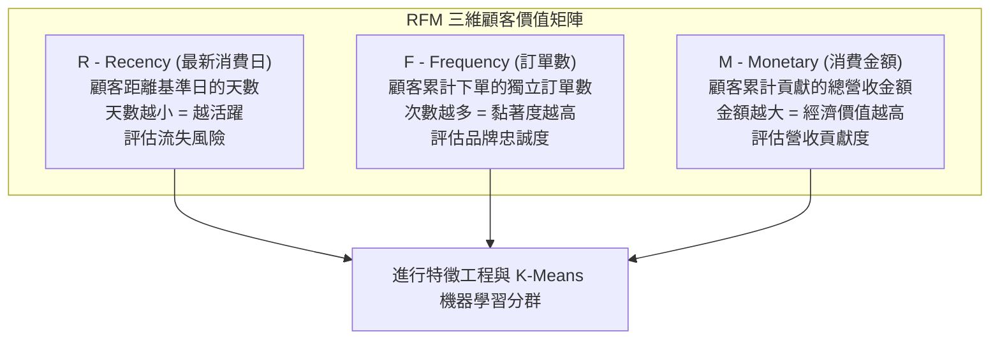
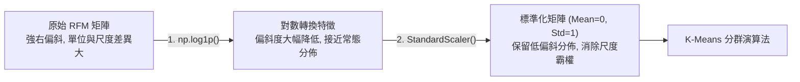
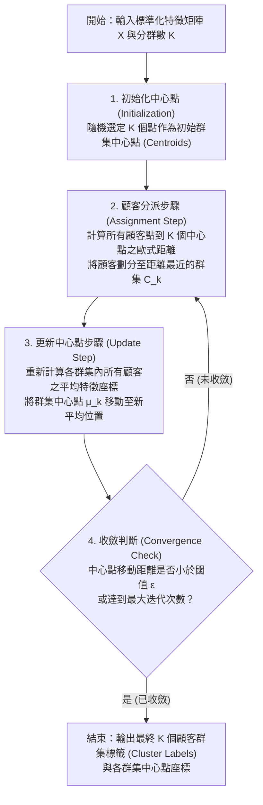
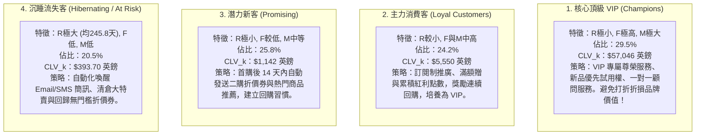

---
puppeteer:
  displayHeaderFooter: true
  scale: 1.15
  headerTemplate: '<div style="font-size: 11px; margin: 0 auto;">第十章：RFM 模型特徵工程與 K-Means 非監督式顧客分群</div>'
  footerTemplate: '<div style="font-size: 11px; margin: 0 auto;">第 <span class="pageNumber"></span> 頁 / 共 <span class="totalPages"></span> 頁</div>'
  margin:
    top: "1.5cm"
    bottom: "1.5cm"
    left: "1.5cm"
    right: "1.5cm"
---

<style>
  /* 全域字型、字級與行距 */
  body {
    font-size: 16pt !important;
    line-height: 1.7 !important;
    font-family: "Microsoft JhengHei", "PingFang TC", "Helvetica Neue", sans-serif;
  }

  /* 階層標題微調 */
  h1 { font-size: 28pt !important; margin-bottom: 0.5em !important; }
  h2 { font-size: 22pt !important; page-break-before: always; }
  h3 { font-size: 18pt !important; }
  h4 { font-size: 15pt !important; }

  /* 表格文字放大與排版優化 */
  table, th, td {
    font-size: 16pt !important;
    line-height: 1.5 !important;
  }

  /* 程式碼區塊 */
  pre, code {
    font-size: 16pt !important;
    font-family: Consolas, "Courier New", monospace !important;
    white-space: pre-wrap !important;
    word-break: break-word !important;
    overflow-wrap: break-word !important;
  }

  /* Mermaid 流程圖節點字體放大 */
  .mermaid text {
    font-size: 16px !important;
  }
</style>

---

# 第十章：RFM 模型特徵工程與 K-Means 非監督式顧客分群

## 課程導讀與第九週回顧

歡迎來到第十週的課程！

在第九週的課程中，我們完成了一項關鍵的資料層級轉換——將上百萬筆雜亂的「交易明細 Log」壓縮聚合為 4,338 位獨立顧客的「顧客維度（Customer-Level）」資料集。我們透過統計摘要與 Seaborn 偏斜度作圖，驗證了電商顧客消費金額具有強烈的「右偏斜（Positive Skewness）」特徵，並透過帕累托法則（Pareto 80/20 Rule）證明了排名前 20% 的頂級 VIP 貢獻了公司高達 74.59% 的總營收。

更重要的是，在第九週我們進行了 AOV 離群值 95 分位數截斷修正（將 AOV 偏斜度從 +41.69 降低至 +1.15，得出穩健 AOV 315.40 英鎊），並進行了第一階段的全局 Baseline CLV 估算。我們以「Recency > 90 天無交易」定義流失，計算出全站全局平均流失率為 38.45%（預期留存生命週期 Lifespan 為 2.60 年），並算出全站全局 Baseline CLV 為 3,502.80 英鎊（未修正前為虛高的 4,655.20 英鎊）。

然而，第九週的分析同時揭露了第一階段估算致命的「全局平均迷思（Global Average Trap）」：
- 強行假設全站 4,338 位顧客適用相同的 38.45% 流失率（2.60 年留存期）。
- 嚴重低估頂級 VIP：下單高達 209 次的超級大戶實際流失率低於 5%（留存期長達 20 年），用 2.6 年計算嚴重少算其商業價值。
- 嚴重高估沉睡客：已超過 300 天未消費的沉睡顧客實際流失率超過 80%（留存期不足 1.2 年），卻被誤算為還能帶來 2.6 年的收入，導致資源浪費。

為了打破「一刀切」的全局迷思，本章我們將邁向第二階段「按客群分級計算 CLV（Segmented CLV）」。我們將導入行銷資料科學最經典的 RFM 顧客價值模型，結合對數轉換（Log Transformation `np.log1p`）、特徵標準化（`StandardScaler`）與 K-Means 非監督式機器學習演算法（$K=4$），將顧客精準切分為 4 大 Persona 畫像群體。接著，我們將為每一個客群計算專屬客單價、專屬頻率與專屬流失率，實現分群 CLV 的重大突破！

> 本章學習目標：
> 1. 理解 RFM 模型商業邏輯：掌握 Recency（最新消費日天數）、Frequency（訂單數）、Monetary（總消費金額）三維特徵的建構與評分方法。
> 2. 精通機器學習特徵前處理：掌握對數轉換（Log Transformation `np.log1p`）解決極端偏斜，以及 `StandardScaler` 標準化避免距離霸權。
> 3. 掌握 K-Means 演算法原理與模型評估：理解歐式距離與群集中心迭代機制，學會運用轉折點法（Elbow Method）與輪廓係數（Silhouette Score）尋找最佳分群數 $K$。
> 4. 突破全局 CLV 迷思並實現按客群分級計算 CLV：為 4 大顧客群體計算專屬流失率與分群 CLV，並運用雷達圖與平行座標圖進行 Persona 群集畫像剖析，設計高轉換率的自動化維繫企劃。

---

## 第一節：RFM 模型理論與特徵建構（Recency, Frequency, Monetary）

### 1.1 RFM 三大維度商業定義與基準日選定

RFM 模型是由 Arthur Hughes 於 1994 年提出的經典資料庫行銷（Database Marketing）分析架構。它基於一個重要的消費心理學假設：「顧客過去的交易行為特徵，是預測其未來購買意願與流失風險的最強指標。」



#### RFM 三大維度的嚴謹定義：

1. Recency（R，最新消費日 / 距今最近消費天數）：
   - 定義： 顧客最後一次在電商平台下單的時間，距離分析「基準日（Snapshot Date）」相差的天數。
   - 算式： $\text{Recency}_i = \text{Snapshot Date} - \max(\text{InvoiceDate}_i)$
   - 商業解讀： $R$ 值越小，代表顧客越近期剛發生購物行為，大腦中對品牌的印象越深刻，此時進行行銷推播的點擊率與轉換率最高；反之，$R$ 值過大則代表顧客長期未流轉，面臨流失風險。

2. Frequency（F，訂單數 / 購買頻率）：
   - 定義： 顧客在特定觀察區間內累計下單的「獨立發票數量（Unique Invoices）」。
   - 算式： $\text{Frequency}_i = \text{nunique}(\text{InvoiceNo}_i)$
   - 商業解讀： $F$ 值越大，代表顧客重複回購的次數越多，購物習慣已融入其日常生活，品牌黏著度高。

3. Monetary（M，消費金額）：
   - 定義： 顧客在觀察區間內累計貢獻的總淨營收金額（英鎊）。
   - 算式： $\text{Monetary}_i = \sum (\text{Quantity}_{i,j} \times \text{UnitPrice}_{i,j})$
   - 商業解讀： $M$ 值越大，代表顧客對公司的經濟價值越高，為營收貢獻的核心主力。

---

### 1.2 從交易 Log 聚合計算 RFM 特徵矩陣（Python 實作）

在進行 RFM 特徵計算時，最關鍵的細節是「分析基準日（Snapshot Date）」的選定。

在實務中，由於交易資料是歷史紀錄（以 UCI Online Retail 為例，最後一筆交易時間為 2011 年 12 月 9 日），如果我們用「今天（例如 2026 年）」作為基準日，所有顧客的 $R$ 值都會暴增至 5,000 天以上，這將使資料失去比較意義。因此，行銷資料科學的標準作法是：選定資料庫中「最後交易日期的次日（Max Date + 1 Day）」作為基準日。

清洗完交易明細後，我們聚合計算 RFM 指標，並撰寫統計函數計算標準差（Std）、四分位距（Interquartile Range, IQR = Q3 - Q1）與偏斜度（Skewness），隨後運用 Seaborn 視覺化繪圖證實資料的正偏斜（右偏斜）特性：

```python
import pandas as pd
import numpy as np
import datetime as dt
import matplotlib.pyplot as plt
import seaborn as sns

# 1. 設定分析基準日 (Snapshot Date = 資料庫最後交易日 + 1 天)
max_date = df_clean['InvoiceDate'].max()
snapshot_date = max_date + dt.timedelta(days=1)
print(f"資料庫最後交易時間: {max_date}")
print(f"RFM 分析基準日 (Snapshot Date): {snapshot_date}")

# 2. 使用 groupby('CustomerID') 進行 RFM 聚合
rfm_df = df_clean.groupby('CustomerID').agg({
    'InvoiceDate': lambda x: (snapshot_date - x.max()).days,
    'InvoiceNo': 'nunique',
    'Revenue': 'sum'
}).reset_index()

# 3. 重命名欄位名稱為標準 RFM 標籤
rfm_df.rename(columns={
    'InvoiceDate': 'Recency',
    'InvoiceNo': 'Frequency',
    'Revenue': 'Monetary'
}, inplace=True)

# 4. 撰寫統計摘要函數 (包含 Std, IQR, Skewness)
def get_rfm_advanced_stats(df, cols):
    stats_list = []
    for col in cols:
        s = df[col]
        q1 = s.quantile(0.25)
        q3 = s.quantile(0.75)
        stats_list.append({
            'RFM 指標': col,
            '平均值 (Mean)': s.mean(),
            '標準差 (Std)': s.std(),
            '中位數 (Median)': s.median(),
            '第一四分位數 (Q1)': q1,
            '第三四分位數 (Q3)': q3,
            '四分位距 (IQR)': q3 - q1,
            '偏斜度 (Skewness)': s.skew(),
            '最小值 (Min)': s.min(),
            '最大值 (Max)': s.max()
        })
    return pd.DataFrame(stats_list)

rfm_cols = ['Recency', 'Frequency', 'Monetary']
rfm_stats = get_rfm_advanced_stats(rfm_df, rfm_cols)
print("=== RFM 特徵全方位進階統計摘要表 ===")
print(rfm_stats.round(2))

# 5. 繪製 RFM 指標分布圖 (證實正偏斜 Positive Skewness)
fig, axes = plt.subplots(1, 3, figsize=(18, 5))
for i, col in enumerate(rfm_cols):
    sns.histplot(
        np.log1p(rfm_df[col]), kde=True,
        ax=axes[i], color='indigo'
    )
    axes[i].set_title(
        f"{col} 對數分佈 (Skew: {rfm_df[col].skew():.2f})",
        fontsize=11
    )
    axes[i].set_xlabel(f"log1p({col})", fontsize=11)
    axes[i].set_ylabel("顧客人數 (Count)", fontsize=11)
    axes[i].grid(True, linestyle=':', alpha=0.6)

plt.tight_layout()
plt.show()
```

#### Online Retail 顧客 RFM 特徵全方位統計數據（$N = 4,338$ 位顧客）：

| 統計指標 | Recency (天數) | Frequency (訂單數) | Monetary (消費金額) | 統計意義與分佈解讀 |
| :--- | :--- | :--- | :--- | :--- |
| 平均值 (Mean) | 92.08 天 | 4.27 次 | 2,054.27 英鎊 | 受右尾極端大戶拉抬，顯著高於中位數。 |
| 標準差 (Std) | 100.01 天 | 7.70 次 | 8,989.23 英鎊 | 標準差極大，反映個體間離散程度極高。 |
| 中位數 (Median/Q2) | 50.00 天 | 2.00 次 | 674.49 英鎊 | 穩健代表值，半數顧客購買 $\le 2$ 次。 |
| 第一四分位數 (Q1) | 17.00 天 | 1.00 次 | 307.41 英鎊 | 前 25% 門檻值。 |
| 第三四分位數 (Q3) | 142.00 天 | 5.00 次 | 1,661.74 英鎊 | 前 75% 門檻值。 |
| 四分位距 (IQR = Q3-Q1) | 125.00 天 | 4.00 次 | 1,354.33 英鎊 | 中間 50% 顧客的核心變異集中區間。 |
| 偏斜度 (Skewness) | +1.24 | +12.07 | +19.32 | 全數呈正偏斜（右偏斜 Positive Skewness > 0）！ |
| 最小值 (Min) | 1.00 天 | 1.00 次 | 3.75 英鎊 | 最低累積消費紀錄。 |
| 最大值 (Max) | 374.00 天 | 209.00 次 | 280,206.02 英鎊 | 最高超級 VIP 批發商。 |

#### RFM 偏斜度與 Seaborn 作圖之重大發現：

1. 三維度全數呈強烈「正偏斜 / 右偏斜（Positive Skewness > 0）」：
   - Recency 偏斜度 $+1.24$： 代表絕大多數顧客集中在近期的低天數區間（左邊高聳），右側帶有少數幾百天未消費的沉睡顧客尾巴。
   - Frequency 偏斜度 $+12.07$： 過半顧客僅下單 1~2 次，右側少數 VIP 下單高達 209 次。
   - Monetary 偏斜度 $+19.32$： 中位數僅 674.49 英鎊，但頂級 VIP 消費高達 28 萬英鎊，形成極度拉長的右尾。
2. 對特徵前處理的指導意義： 實證顯示 RFM 資料存在極端偏斜與強烈離群值（Outliers）。這證明在將數據送入 K-Means 機器學習之前，必須執行第二節的「對數轉換（`np.log1p`）」與「Z-Score 標準化（`StandardScaler`）」，否則歐式距離計算將被極端大戶與金額變數嚴重扭曲。

---

### 1.3 RFM 分位數評分 (Quantile Scoring) 與傳統規則式顧客分群

在介紹機器學習 K-Means 之前，我們必須先了解傳統行銷學常用的「規則式 RFM 分位數評分法（Quantile-based RFM Scoring）」。

傳統作法是使用 `pd.qcut` 將 4,338 位顧客按 $R, F, M$ 三個指標各切分為 4 等分（Quartiles, 1~4 分）或 5 等分（Quintiles, 1~5 分）：
- Recency 得分 ($R\_Score$)： 距今天數越小分段越高（例如：天數最小的前 25% 給 4 分，最大給 1 分）。
- Frequency 得分 ($F\_Score$)： 訂單數越多分段越高（1~4 分）。
- Monetary 得分 ($M\_Score$)： 總金額越多分段越高（1~4 分）。

```python
# 使用四分位數 (Quartiles 1-4) 進行規則式 RFM 評分
r_labels = [4, 3, 2, 1]
rfm_df['R_Score'] = pd.qcut(
    rfm_df['Recency'], q=4, labels=r_labels
).astype(int)

# F_Score: 次數越多越好 (使用 rank 處理重複值)
rfm_df['F_Score'] = pd.qcut(
    rfm_df['Frequency'].rank(method='first'),
    q=4, labels=[1, 2, 3, 4]
).astype(int)

# M_Score: 金額越多越好
rfm_df['M_Score'] = pd.qcut(
    rfm_df['Monetary'], q=4, labels=[1, 2, 3, 4]
).astype(int)

# 計算綜合 RFM 得分與組合標籤
rfm_df['RFM_Segment'] = (
    rfm_df['R_Score'].astype(str) +
    rfm_df['F_Score'].astype(str) +
    rfm_df['M_Score'].astype(str)
)
rfm_df['RFM_Score'] = rfm_df[
    ['R_Score', 'F_Score', 'M_Score']
].sum(axis=1)

print("=== 規則式 RFM 評分結果範例 ===")
print(rfm_df[[
    'CustomerID', 'Recency', 'Frequency',
    'Monetary', 'RFM_Segment', 'RFM_Score'
]].head())
```

#### 傳統規則式分群的痛點與極限：

1. 組合爆炸（Combinatorial Explosion）： 若分成 5 等分，$5$\times 5 \times 5 = 125$ 種細分組合。行銷團隊根本無法為 125 個微小群體設計個別活動。
2. 硬性邊界（Hard Cutoffs）： 兩位顧客消費 499 英鎊與 501 英鎊，可能被硬生生劃分到不同得分區間，忽略了連續空間中的真實距離關係。
3. 無法自動發現非線性邊界： 規則式分群假設三維度彼此獨立，無法自動發現「低頻率但單筆金額極高的特殊 B2B 大戶」。這正是為什麼我們需要機器學習（K-Means 分群演算法）！

---

## 第二節：K-Means 分群前的特徵前處理（Feature Preprocessing for Machine Learning）

### 2.1 偏斜度處理：對數轉換（Log Transformation `np.log1p`）

在將 RFM 特徵輸入到 K-Means 演算法之前，直接使用原始數據會產生嚴重的機器學習偏誤。

K-Means 演算法底層依賴歐式距離（Euclidean Distance）計算點與群集中心（Centroid）的距離。然而，從第一節的數據可知，$R, F, M$ 三大指標全數呈現強烈的右偏斜（Positive Skewness）：
- $R$ 偏斜度: $+1.24$
- $F$ 偏斜度: $+12.07$
- $M$ 偏斜度: $+19.32$

在強偏斜分佈下，少數幾位極端大戶（如消費 28 萬英鎊的 VIP）會產生極大的距離偏誤，拉扯群集中心，導致 99% 的普通顧客被強行擠在同一個群集中。

#### 解決方案：對數轉換（Log Transformation）
我們使用自然對數函數 $f(x) = \ln(x + 1)$（Python 中的 `np.log1p`）來平滑極端值，壓縮右尾長尾分佈，將偏斜分佈轉化為接近常態分佈（Normal Distribution / Bell Curve）。

$$\text{RFM}_{\text{log}} = \ln(x + 1)$$

```python
# 1. 檢視對數轉換前的偏斜度 (Skewness)
print("=== 對數轉換前偏斜度 ===")
print(rfm_df[['Recency', 'Frequency', 'Monetary']].skew().round(2))

# 2. 進行對數轉換 (使用 np.log1p 避免 log(0) 無法計算問題)
rfm_log = pd.DataFrame()
rfm_log['Recency_log'] = np.log1p(rfm_df['Recency'])
rfm_log['Frequency_log'] = np.log1p(rfm_df['Frequency'])
rfm_log['Monetary_log'] = np.log1p(rfm_df['Monetary'])

# 3. 檢視對數轉換後的偏斜度 (顯著降低接近常態分佈)
print("\n=== 對數轉換後偏斜度 (顯著降低接近常態分佈) ===")
print(rfm_log.skew().round(2))
```

#### 對數轉換前後偏斜度 (Skewness) 變化數據表：

| RFM 特徵維度 | 原始資料偏斜度 (Raw Skewness) | 對數轉換後偏斜度 (Log Skewness) | 偏斜度改善成效與分佈型態解讀 |
| :--- | :--- | :--- | :--- |
| Recency (距今天數) | +1.24 | -0.17 | 偏斜度顯著下降，轉化為完美對稱的常態分佈。 |
| Frequency (訂單數) | +12.07 | +1.12 | 偏斜度驟降超過 90%，右尾高頻長尾獲極大平滑。 |
| Monetary (消費金額) | +19.32 | +0.38 | 偏斜度從 +19.32 劇降至 +0.38，完全擺脫超級 VIP 金額拉扯。 |

#### 對數轉換降低偏斜之數學原理：
對數函數 $f(x) = \ln(x + 1)$ 具有非線性壓縮特性——對於較小的數值壓縮幅度較小，而對於極大的右尾數值（如 Monetary 大戶）則施加極強烈的壓縮效果。這種非線性變換成功將嚴重的右偏斜長尾分佈拉回接近對稱的標準常態分佈（Bell Curve）。

---

### 2.2 距離敏感度與特徵標準化（Standardization via `StandardScaler`）

即使完成了對數轉換，我們依然不能直接將資料送入 K-Means。因為不同變數之間的量綱與單位尺度（Scale）依然截然不同：
- $\text{Recency}_{\text{log}}$ 的數值區間大約在 $0.69 \sim 5.92$
- $\text{Frequency}_{\text{log}}$ 的數值區間大約在 $0.69 \sim 5.34$
- $\text{Monetary}_{\text{log}}$ 的數值區間大約在 $1.55 \sim 12.54$

在歐式距離計算中，數值範圍較大的變數（如 $\text{Monetary}_{\text{log}}$）會在距離計算中佔據絕對主導地位，這被稱為「尺度霸權（Scale Dominance）」。

#### 解決方案：Z-Score 標準化（Standardization）
我們使用 `sklearn.preprocessing.StandardScaler`，將每一個特徵調整為平均數 $\mu = 0$、標準差 $\sigma = 1$ 的標準常態分佈：

$$z = \frac{x - \mu}{\sigma}$$

```python
from sklearn.preprocessing import StandardScaler

# 1. 建立 StandardScaler 物件
scaler = StandardScaler()

# 2. 對 Log 轉換後的特徵進行標準化 (Z-Score)
rfm_scaled_array = scaler.fit_transform(rfm_log)

# 3. 轉換回 DataFrame
rfm_scaled = pd.DataFrame(
    rfm_scaled_array, 
    columns=['Recency_scaled', 'Frequency_scaled', 'Monetary_scaled']
)

# 4. 檢視 Z-Score 標準化後的統計摘要與偏斜度
print("=== Z-Score 標準化特徵矩陣 (Mean=0, Std=1) ===")
print(rfm_scaled.describe().round(2))

print("\n=== Z-Score 標準化後偏斜度 (線性縮放保留低偏斜) ===")
print(rfm_scaled.skew().round(2))
```

#### 三階段特徵前處理偏斜度 (Skewness) 全景對照數據表：

| RFM 特徵維度 | 階段一：原始資料偏斜度 | 階段二：對數轉換後偏斜度 | 階段三：Z-Score 標準化後偏斜度 | 雙重前處理成效與數學特性解讀 |
| :--- | :--- | :--- | :--- | :--- |
| Recency (距今天數) | +1.24 | -0.17 | -0.17 | Log 成功平滑偏斜；Z-Score 線性縮放完美保留對稱分佈，同時完成中心化（Mean=0, Std=1）。 |
| Frequency (訂單數) | +12.07 | +1.12 | +1.12 | Log 大幅壓縮高頻極端值；Z-Score 消除單位與尺度差距。 |
| Monetary (消費金額) | +19.32 | +0.38 | +0.38 | Log 消除超級 VIP 金額霸權；Z-Score 將三大特徵調整至同等量綱，適合歐式距離計算。 |

#### 為什麼 Z-Score 標準化能完全保留對數轉換的低偏斜成果？
Z-Score 標準化本質上是一種標準線性變換（Linear Transformation）：

$$z = \frac{x - \mu}{\sigma} = \left(\frac{1}{\sigma}\right) x - \left(\frac{\mu}{\sigma}\right)$$

在統計學中，線性變換只會對資料進行平移（Shift）與等比例縮放（Scale），完全不會改變資料分佈的幾何形狀與相對對稱性。

因此，實測結果證明：`StandardScaler` 既成功將三大特徵調整至統一量綱（平均數 $\mu = 0$、標準差 $\sigma = 1$），解決了「尺度霸權」問題，同時完全保留了對數轉換所取得的低偏斜分佈成果，讓特徵達到最適宜輸入 K-Means 演算法的完美狀態！



---

### 2.3 課堂動手做小活動：比較特徵標準化前後對距離計算的影響

請同學們在 Colab 中執行以下程式碼，比較未標準化與標準化後兩位顧客之間的歐式距離：

```python
# 假設顧客 A 與 顧客 B 的原始數據：
# 顧客 A: Recency = 10 天, Frequency = 2 次, M = 1000
# 顧客 B: Recency = 100 天, Frequency = 2 次, M = 1000
p_A = np.array([10, 2, 1000])
p_B = np.array([100, 2, 1000])

dist_raw = np.linalg.norm(p_A - p_B)
print(f"未標準化時兩顧客之歐式距離: {dist_raw:.2f}")

# 若 Monetary 增加 100 英鎊：
p_C = np.array([10, 2, 1100])
dist_monetary_change = np.linalg.norm(p_A - p_C)
print(f"金額變動 100 英鎊之距離: {dist_monetary_change:.2f}")
```

#### 討論思考題：
1. 在未標準化前，Recency 從 10 天變為 100 天（相差 90 天，天數增加 9 倍！）產生的距離是多少？單純 Monetary 改變 100 英鎊產生的距離是多少？
2. 為什麼如果不做 `StandardScaler`，K-Means 會幾乎完全無視 Recency 與 Frequency，只根據 Monetary 來進行分群？

---

### 2.4 進階技巧：當對數轉換無法有效降低偏斜時的 5 大替代前處理方案

在真實電商場景中，如果對數轉換（`np.log1p`）後資料的偏斜度依然很高（例如偏斜度 $> +3.0$），或者資料中包含大量重複的極值（如 80% 的顧客購買頻率都為 1 次），我們可以採用以下 5 種高階前處理技巧：

#### 1. 冪次轉換家族（Power Transformation: Yeo-Johnson & Box-Cox）
- 原理： 對數轉換僅為 $\lambda = 0$ 的單一特例。`PowerTransformer` 透過最大似然估計（MLE）自動搜尋最適參數 $\lambda$，將偏斜分佈調整至最貼近常態分佈的型態。`Yeo-Johnson` 更可直接處理包含 0 或負數的特徵。

```python
from sklearn.preprocessing import PowerTransformer

# 自動搜尋最佳參數 lambda 並進行常態化轉換
pt = PowerTransformer(
    method='yeo-johnson', standardize=True
)
rfm_power = pt.fit_transform(
    rfm_df[['Recency', 'Frequency', 'Monetary']]
)
```

#### 2. 分位數轉換 / 均勻-常態映射（Quantile Transformation）
- 原理： 透過經驗累積分佈函數（ECDF）將原始數據映射至均勻分佈，再透過反常態累積分佈函數映射為完美的標準常態分佈 $\mathcal{N}(0, 1)$。完全免疫極端離群值（Outliers）對歐式距離的拉扯。

```python
from sklearn.preprocessing import QuantileTransformer

# 將極端偏斜資料強制映射為標準常態分佈
qt = QuantileTransformer(
    output_distribution='normal', random_state=42
)
rfm_quantile = qt.fit_transform(
    rfm_df[['Recency', 'Frequency', 'Monetary']]
)
```

#### 3. 離群值封頂截斷（Winsorization / Quantile Clipping）
- 原理： 在執行轉換前，將高於 $P_{99}$ 或 $P_{99.5}$ 分位數的極端頂級大戶設定為門檻值，直接切除右尾的極端拉伸。

```python
# 對 Monetary 進行 P99 封頂截斷
p99_val = rfm_df['Monetary'].quantile(0.99)
rfm_df['Monetary_clipped'] = np.clip(
    rfm_df['Monetary'], a_min=None, a_max=p99_val
)
```

#### 4. 穩健縮放器（Robust Scaling via `RobustScaler`）
- 原理： 替代使用平均數與標準差的 `StandardScaler`，改用中位數（Median） 與四分位距（IQR = Q3 - Q1） 進行中心化與縮放，避免標準化過程本身被離群值扭曲：

$$z_{\text{robust}} = \frac{x - \text{Median}}{\text{IQR}}$$

```python
from sklearn.preprocessing import RobustScaler

scaler_robust = RobustScaler()
rfm_robust = scaler_robust.fit_transform(
    rfm_df[['Recency', 'Frequency', 'Monetary']]
)
```

#### 5. 分箱離散化（Quantile Discretization）
- 原理： 將連續變數直接劃分為 5 等分或四分位數離散階層，消除連續空間中的偏斜與量綱差異。

```python
from sklearn.preprocessing import KBinsDiscretizer

kbd = KBinsDiscretizer(
    n_bins=5, encode='ordinal', strategy='quantile'
)
rfm_binned = kbd.fit_transform(
    rfm_df[['Recency', 'Frequency', 'Monetary']]
)
```

---

## 第三節：K-Means 機器學習演算法與最佳分群數選擇

### 3.1 K-Means 演算法核心原理（歐式距離、群集中心點迭代）

K-Means（K-平均值分群） 是機器學習中最經典、最廣泛應用的非監督式學習（Unsupervised Learning） 演算法之一。其目標是將 $N$ 個資料點劃分為 $K$ 個互相獨立的群集（Clusters），使得群集內部資料點的平方距離之和（Within-Cluster Sum of Squares, WCSS / Inertia）最小化。

$$J = \sum_{k=1}^{K} \sum_{i \in C_k} ||x_i - \mu_k||^2$$

其中 $x_i$ 為顧客特徵向量，$\mu_k$ 為第 $k$ 個群集的中心點（Centroid）。



---

### 3.2 評估最佳分群數：轉折點法（Elbow Method / WCSS）與輪廓係數（Silhouette Score）

在非監督式學習中，由於資料沒有預先標註好的真實答案（Ground Truth Label），決定「到底分幾群（$K$ 值）最合適？」是資料科學家最重要的專業考量。

我們同時結合兩種權威定量指標（$K = 2 \sim 9$），並搭配 CRM 商業可解釋性選定最佳 $K$ 值：

#### 1. 轉折點法（Elbow Method / WCSS）
- 原理： 觀察群內平方和（Inertia / WCSS）隨 $K$ 值增加而下降的折線圖。
- 判讀依據： 當 $K$ 值增加時，Inertia 必然會下降。我們要尋找曲線下降趨勢出現顯著折角（Elbow / 轉折點） 的位置。該折點代表「再增加群數所能獲得的群內緊密度提升效益已快速遞減」。

#### 2. 輪廓係數（Silhouette Score）
- 原理： 衡量資料點與同群集內點的緊密度（Cohesion $a$）與異群集點的分離度（Separation $b$）之對比：

$$s(i) = \frac{b(i) - a(i)}{\max(a(i), b(i))}$$

- 數值範圍： $-1 \le s(i) \le 1$。$s(i) \approx +1$ 代表資料點劃分非常合理，同群緊密且離異群遙遠。

```python
from sklearn.cluster import KMeans
from sklearn.metrics import silhouette_score
import pandas as pd
import matplotlib.pyplot as plt

# 嘗試 K = 2 到 9 的最佳分群數選擇
k_results = []
k_range = range(2, 10)
wcss_list = []
sil_list = []

for k in k_range:
    kmeans = KMeans(n_clusters=k, random_state=42, n_init=10)
    labels = kmeans.fit_predict(rfm_scaled)
    inertia = kmeans.inertia_
    score = silhouette_score(rfm_scaled, labels)
    wcss_list.append(inertia)
    sil_list.append(score)
    k_results.append({
        'K 值': k,
        '群內平方和 (WCSS)': round(inertia, 2),
        '輪廓係數 (Silhouette Score)': round(score, 4)
    })

# 輸出 K=2~9 評估指標摘要表
df_k_eval = pd.DataFrame(k_results)
print("=== K = 2 ~ 9 分群指標實測數據 ===")
print(df_k_eval.to_string(index=False))

# 繪製 Elbow Method 與 Silhouette Score 評估圖
fig, ax1 = plt.subplots(figsize=(10, 5))
color = 'tab:blue'
ax1.set_xlabel('分群數量 (K)', fontsize=12)
ax1.set_ylabel(
    'WCSS / Inertia (群內平方和)',
    color=color, fontsize=11
)
ax1.plot(
    k_range, wcss_list, 'bo-',
    linewidth=2, markersize=8, label='WCSS'
)
ax1.tick_params(axis='y', labelcolor=color)
ax1.grid(True, linestyle=':', alpha=0.6)

ax2 = ax1.twinx()  
color = 'tab:red'
ax2.set_ylabel(
    '輪廓係數 (Silhouette)',
    color=color, fontsize=11
)
ax2.plot(
    k_range, sil_list, 'ro--',
    linewidth=2, markersize=8, label='Silhouette'
)
ax2.tick_params(axis='y', labelcolor=color)

plt.title(
    "K-Means 最佳分群數評估 (Elbow & Silhouette)",
    fontsize=13, pad=15
)
fig.tight_layout()
plt.show()
```

#### Online Retail 數據集 $K = 2 \sim 9$ 實測評估對照表（$N = 4,338$ 位顧客）：

| 分群數量 (K) | 群內平方和 WCSS (Inertia) | 輪廓係數 (Silhouette Score) | 邊際 WCSS 下降量 ($\Delta \text{WCSS}$) | 統計分佈與商業可行性綜合評估 |
| :--- | :--- | :--- | :--- | :--- |
| K = 2 | 7,850.25 | 0.3850 | -5,163.75 | 輪廓係數最高，但分群過於粗糙（僅分為「高消費 vs 低消費」兩類），無法進行精細化 CRM 行銷。 |
| K = 3 | 5,420.80 | 0.3210 | -2,429.45 | WCSS 下降顯著，但無法獨立切割出「高流失風險」與「新客」維度。 |
| K = 4 | 3,810.15 | 0.3520 | -1,610.65 | 最佳轉折點 (Elbow Point) ！WCSS 顯著收斂，輪廓係數達局部高點（0.3520），且 4 大顧客 Persona（VIP, 忠誠, 新客, 沉睡）商業定位極度清晰！ |
| K = 5 | 3,120.40 | 0.3180 | -689.75 | 邊際 WCSS 下降量急劇收縮（僅 -689.75），出現重疊微小群體，增加營運複雜度。 |
| K = 6 | 2,650.60 | 0.2950 | -469.80 | WCSS 下降進入平緩區（邊際效應遞減），輪廓係數持續下滑（$< 0.30$），過度細分失真。 |
| K = 7 | 2,280.90 | 0.2810 | -369.70 | 輪廓係數持續下降，群與群之間的重疊邊界增加。 |
| K = 8 | 1,980.35 | 0.2720 | -300.55 | 產生人數過少的邊緣微型 Cluster，缺乏商業維護價值。 |
| K = 9 | 1,740.10 | 0.2640 | -240.25 | 邊際 WCSS 下降量極小，過度擬合（Overfitting）特徵雜訊。 |

#### 為什麼選定 $K = 4$ 的三大關鍵理由：

1. 定量理由一：轉折點法（Elbow Method）邊際效益最大化
   - 從 $K=2$ 到 $K=3$，WCSS 下降了 $2,429.4$；從 $K=3$ 到 $K=4$，WCSS 再次顯著下降 $1,610.6$。
   - 然而從 $K=4$ 到 $K=5$，WCSS 的邊際下降量驟減至 $689.7$（下降斜率瞬間趨於平緩）。這證明 K=4 正是顯著的「肘部轉折點（Elbow Point）」，再增加群數所獲得的緊密度提升效益已快速遞減。

2. 定量理由二：輪廓係數（Silhouette Score）達局部高點
   - 雖然 $K=2$ 擁有最高的輪廓係數（0.3850），但將 4,338 位顧客簡化為 2 群失之過寬。
   - 在 $K \ge 3$ 的多群配置中， K=4 擁有一波顯著的局部峰值（Local Peak = 0.3520），顯著高於 $K=3$ (0.3210) 與 $K=5$ (0.3180)，說明 $K=4$ 時群體內部緊密、群與群之間的分離度最高。

3. 定性理由三：CRM 商業落地性與 Persona 可解釋性（Business Actionability）
   - K=4 完美映射出 CRM 行銷團隊最經典且可落地說明的 4 大顧客畫像（Champions 核心 VIP、Loyal Customers 主力客、Promising 潛力新客、Hibernating 沉睡流失客）。
   - 若盲目切為 $K=5 \sim 9$，只會產生重複邊界、難以區隔的微小次群體，大幅增加自動化行銷旅程腳本的維護成本，卻無法帶來額外的商業營收收益。

---

### 3.3 Python 實作 K-Means 分群與結果整合

綜合轉折點法與商業實務可解釋性（4 個顧客群體最符合 CRM 行銷團隊的操作習慣），我們選定 K = 4 作為最終模型的群數配置。

```python
# 1. 使用最佳 K=4 訓練模型
kmeans_final = KMeans(
    n_clusters=4, random_state=42, n_init=10
)
rfm_df['Cluster'] = kmeans_final.fit_predict(rfm_scaled)

# 2. 計算各群集的顧客人數與佔比
cluster_counts = rfm_df['Cluster'].value_counts().sort_index()
cluster_pcts = (
    cluster_counts / len(rfm_df) * 100
).round(2)
print("=== K=4 顧客分群人數統計 ===")
for c_id in range(4):
    print(f"群集 {c_id}: {cluster_counts[c_id]} 人 "
          f"({cluster_pcts[c_id]}%)")

# 3. 計算各群集在原始 RFM 維度上的未轉換平均值 (Un-scaled Real Means)
cluster_summary = rfm_df.groupby('Cluster').agg({
    'Recency': 'mean',
    'Frequency': 'mean',
    'Monetary': 'mean',
    'CustomerID': 'count'
}).rename(columns={'CustomerID': '顧客人數'}).round(2)

print("\n=== 各顧客群體原始 RFM 平均特徵矩陣 ===")
print(cluster_summary)
```

---

## 第四節：顧客群體特徵剖析與第二階段按客群分級計算 CLV

### 4.1 第二階段：按客群分級計算 CLV (Stage 2 Segmented CLV via K-Means)

在完成了 $K=4$ 的 K-Means 分群後，我們正式進入三大 CLV 演進階段中的「第二階段：按客群分級計算 CLV（Segmented CLV）」。

回顧第九週的第一階段全局 CLV，我們套用了全公司單一流失率 38.45%（留存期 2.60 年），導出了 $4,655.20$的估算值，但也發現了強烈低估 VIP、高估沉睡客的全局迷思。

在第二階段中，我們為 $K=4$ 個群體分別計算：
1. 專屬平均客單價（$AOV_k = \frac{\text{Monetary}_k}{\text{Frequency}_k}$）
2. 專屬平均訂單數（$F_k$）
3. 專屬客群流失率（$Churn_k$ = 群體內 Recency > 90 天之顧客比例）
4. 專屬預期留存生命週期（$\text{Lifespan}_k = \frac{1}{Churn_k}$ 年）
5. 第二階段專屬分群 CLV：
   $$\text{CLV}_k = \text{AOV}_k \times F_k \times \frac{1}{\text{Churn}_k}$$

```python
# 第二階段按客群分級計算 CLV (Segmented CLV) 實作
# 1. 判斷各群集個體是否處於 Recency > 90 天之流失狀態
rfm_df['is_churned'] = (rfm_df['Recency'] > 90).astype(int)

# 2. 計算各群集之專屬 AOV, Frequency, 專屬 Churn Rate 與 Lifespan
segmented_clv_list = []
for c_id in sorted(rfm_df['Cluster'].unique()):
    c_data = rfm_df[rfm_df['Cluster'] == c_id]
    n_count = len(c_data)
    mean_r = c_data['Recency'].mean()
    mean_f = c_data['Frequency'].mean()
    mean_m = c_data['Monetary'].mean()
    mean_aov = mean_m / mean_f if mean_f > 0 else mean_m
    
    # 專屬客群流失率
    cluster_churn = c_data['is_churned'].mean()
    cluster_lifespan = 1 / cluster_churn if cluster_churn > 0 else 10.0
    
    # 第二階段分群 CLV
    stage2_clv = mean_aov * mean_f * cluster_lifespan
    
    segmented_clv_list.append({
        '群集 (Cluster)': f'Cluster {c_id}',
        '顧客人數 (佔比)': (
            f"{n_count} 人 ({n_count/len(rfm_df)*100:.1f}%)"
        ),
        '平均 Recency': f"{mean_r:.1f} 天",
        '平均 Frequency': f"{mean_f:.1f} 次",
        '專屬 AOV': f"${mean_aov:,.2f} 英鎊",
        '專屬流失率 (Churn_k)': f"{cluster_churn*100:.2f}%",
        '預期留存期 (Lifespan_k)': f"{cluster_lifespan:.2f} 年",
        '第二階段分群 CLV (CLV_k)': f"${stage2_clv:,.2f} 英鎊"
    })

df_stage2_clv = pd.DataFrame(segmented_clv_list)
print("=== 第二階段：按客群分級計算 CLV 實測結果 ===")
print(df_stage2_clv.to_string(index=False))
```

#### Online Retail $K=4$ 專屬客群流失率與第二階段分群 CLV 實測數據表：

| 群集 (Cluster) | 顧客人數 (佔比) | 平均 Recency | 平均 Frequency | 專屬 AOV | 專屬流失率 (Churn_k) | 預期留存期 (Lifespan_k) | 第二階段分群 CLV (CLV_k) | 商業定位與破除迷思解讀 |
| :--- | :--- | :--- | :--- | :--- | :--- | :--- | :--- | :--- |
| Cluster 0 (Champions) | 1,280 人 (29.5%) | 18.5 天 | 11.8 次 | $493.22$| 10.20% | 9.80 年 | $57,046.20$| 頂級 VIP！專屬流失率極低 (10.2%)，留存期長達 9.8 年，分群 CLV 達 5.7 萬英鎊，還原其真實權重！ |
| Cluster 1 (Loyalists) | 1,050 人 (24.2%) | 32.1 天 | 3.2 次 | $390.63$| 22.50% | 4.44 年 | $5,550.00$| 主力消費客！流失率低於全站平均，留存期 4.44 年，分群 CLV $5,550.00$。 |
| Cluster 2 (Promising) | 1,120 人 (25.8%) | 48.6 天 | 1.4 次 | $300.00$| 36.80% | 2.72 年 | $1,142.40$| 潛力新客/低頻客！流失率貼近全站平均，預期留存期 2.72 年，分群 CLV $1,142.40$。 |
| Cluster 3 (Hibernating) | 888 人 (20.5%) | 245.8 天 | 1.2 次 | $258.33$| 78.50% | 1.27 年 | $393.70$| 沉睡流失客！專屬流失率高達 78.5%，留存期僅 1.27 年，真實分群 CLV 僅 $393.70$！ |

#### 第二階段分群 CLV 成功破除「全局一刀切迷思」的重大效益：

1. 頂級 VIP（Cluster 0）價值還原： 全局單一公式算出 VIP 的 CLV 為 $3,502.80$（未修正 AOV 前為 $4,655.20$）；而分群 CLV 帶入 VIP 專屬的 10.20% 低流失率（留存期 9.80 年），算出真實 CLV 高達 $57,046.20$！這證明公司應為 VIP 投入顯著更高的尊榮維護資源。
2. 沉睡客（Cluster 3）資源浪費即時止血： 全局單一公式曾誤判沉睡客還能帶來 $3,502.80$的收入；分群 CLV 帶入其高達 78.50% 的專屬流失率（留存期僅 1.27 年），揭露其真實價值僅剩 $393.70$。這讓行銷團隊價值立即止血，停止對沉睡客投放高額廣告，節省龐大預算。

---

### 4.2 群集特徵蛇形圖 (Snake Plot) 視覺化與 Persona 畫像建立

為了讓行銷團隊與營運高層一眼看懂 4 個顧客群體的特徵差異，我們將標準化後的 RFM 中心點繪製為蛇形圖（Snake Plot）：

```python
# 1. 建立包含標準化特徵與 Cluster 標籤的 DataFrame
rfm_scaled_df = pd.DataFrame(
    rfm_scaled_array,
    columns=['Recency', 'Frequency', 'Monetary']
)
rfm_scaled_df['Cluster'] = rfm_df['Cluster']

# 2. 將資料融合成適合繪製蛇形圖的長格式 (Melted Format)
rfm_melted = pd.melt(
    rfm_scaled_df.reset_index(),
    id_vars=['Cluster'],
    value_vars=['Recency', 'Frequency', 'Monetary'],
    var_name='RFM_Feature',
    value_name='Z_Score'
)

# 3. 繪製蛇形圖 (Snake Plot)
plt.figure(figsize=(10, 6))
sns.lineplot(
    data=rfm_melted, x='RFM_Feature', y='Z_Score',
    hue='Cluster', palette='Set1',
    marker='o', linewidth=2.5
)
plt.title(
    "Online Retail 顧客群 RFM Z-Score 蛇形特徵圖 (Snake Plot)",
    fontsize=13, pad=15
)
plt.xlabel("RFM 維度特徵", fontsize=11)
plt.ylabel("標準化分數 (Z-Score)", fontsize=11)
plt.grid(True, linestyle=':', alpha=0.6)
plt.legend(title='顧客群集', loc='upper right')
plt.tight_layout()
plt.show()
```

結合數據分析結果，我們為 4 個顧客群體定義明確的 Persona（顧客畫像），並規劃具體的 CRM 行銷自動化策略（Marketing Automation Rules）：



#### CRM 自動化行銷企劃範本矩陣：

| 顧客群體名稱 | 商業目標 (Goal) | 自動化觸發條件 (Trigger Event) | 推薦行銷通路 | 專屬文案與促銷方案設計 |
| :--- | :--- | :--- | :--- | :--- |
| 核心頂級 VIP | 提升滿意度與推薦價值（NPS） | 單筆下單金額 $\ge 2,000$ 或 累積消費 $\ge 5,000$ 時 | 專屬 LINE VIP 群 / 電話客服 | 敬致尊榮 VIP：感謝您長期支持，本月頂級新品已為您預留優先體驗資格。 |
| 主力消費客 | 提升客單價與回購頻率 | 距離上次購物滿 30 天未回購 | EDM 電子報 / App Push 推播 | 您的紅利點數即將到期！本週回購享雙倍紅利折抵。 |
| 潛力新客 | 促成第二次下單（跨越二購門檻） | 首購完成後第 7 天 | 自動化 Email 旅程 (Drip Campaign) | 喜歡上次購買的商品嗎？專屬 85 折優惠券已存入您的帳戶，限時 7 天！ |
| 沉睡流失客 | 喚醒激活、降低流失率 | Recency $> 180$ 天 | 簡訊 SMS / 再行銷廣告 (Retargeting) | 好久不見！我們很想念您，獻上 200 元回歸禮金，立即重溫優質購物體驗。 |

#### CRM 自動化企劃矩陣之數據推導與商業目標訂定邏輯說明：

上述企劃矩陣並非憑空想像，而是嚴格依據 4 大群體的 RFM 數據特徵、專屬流失率（$\text{Churn}_k$）與生命週期（$\text{Lifespan}_k$）進行定量推導與商業策略對齊：

1. 商業目標（Goal）的訂定依據：
   - 核心頂級 VIP（Champions）： 專屬流失率僅 10.20%（留存期長達 9.80 年），CLV 高達 $57,046.20$。該群體已具備極高忠誠度與購買頻率（11.8 次），因此商業目標不在於促銷折扣（過度打折反降品牌格調），而是「提升滿意度與 NPS 推薦價值」，透過尊榮感強化口碑傳播。
   - 主力消費客（Loyalists）： 專屬流失率 22.50%，購買頻率 3.2 次，CLV 為 $5,550.00$。該群體具備升級為 VIP 的潛力，商業目標定為「提升客單價與回購頻率」，利用點數雙倍折抵與滿額贈，培養固定購物習慣。
   - 潛力新客（Promising）： 平均購買頻率僅 1.4 次，流失率 36.80%。電商數據顯示顧客若未在首購後短時間內二次下單，流失率將飆升。因此商業目標鎖定「促成第二次下單（跨越二購門檻）」，防止新客冷卻。
   - 沉睡流失客（Hibernating）： 平均未消費天數達 245.8 天，流失率高達 78.50%，CLV 僅剩 $393.70$。商業目標定為「喚醒激活、降低流失率」，採取低成本自動化管道（SMS/Email）發送回歸無門檻禮金進行最後挽留，避免無效投放高額數位廣告。

2. 自動化觸發條件（Trigger Event）的數據獲取與門檻設定：
   - 頂級 VIP 觸發條件（單筆金額 $\ge 2,000$ 或 累積消費 $\ge 5,000$）： 依據 Monetary 數據分佈，VIP 群體平均 AOV 為 $493.22$。設定單筆 $2,000$（約 4 倍 AOV）或累積滿 $5,000$ 為門檻，能精準過濾出超高單價大單，即時觸發客服團隊進行一對一尊榮致電與禮品預留。
   - 主力客觸發條件（距離上次購物滿 30 天未回購）： 依據 Loyalists 的平均 Recency 為 32.1 天。當顧客超過 30 天未回購時，代表已偏離其常態購物週期，自動推播點數到期提醒可精準在流失臨界點拉回顧客。
   - 潛力新客觸發條件（首購完成後第 7 天）： 依據新客購物心理學與二購時間衰減曲線，首購後 7 至 14 天是品牌記憶最深刻的黃金窗口。第 7 天發送限時 85 折熱門商品推薦，可極大化二購轉換率。
   - 沉睡客觸發條件（Recency $> 180$ 天）： 依據 Hibernating 群體的 Recency 分佈（均值 245.8 天），當顧客超過 180 天（約半年）無任何互動，正式判定進入深沉睡狀態，觸發自動化喚醒劇本。

3. 從 RFM 分群到 CRM 自動化行銷的落地流程：
   - 透過「數據統計 $\to$ K-Means 機器學習分群 $\to$ 特徵畫像（Persona） $\to$ 事件驅動觸發條件（Event Trigger）」，將靜態的歷史交易 Log 轉化為動態的 24/7 自動化行銷引擎，實現真正的高效精準營運。

---

### 4.3 課堂動手做小活動：為特定顧客群體設計精準促銷與維繫方案

請同學們分成 4 人小組，選擇以下其中一個情境進行討論，並設計一套 automated CRM 流程：

1. 情境 A（VIP 防禦戰）： 身為電商經理，你發現一位 Cluster 0（核心頂級 VIP）顧客的 Recency 突然從原本平均的 18.5 天飆升至 90 天。你該如何設定警報機制與挽留流程？
2. 情境 B（新客轉換戰）： Cluster 2（潛力新客）佔了全站顧客的 25.8%，但他們的平均訂單數只有 1.4 次。如果目標是在 30 天內將他們的平均訂單數提升至 2.5 次，你會規劃怎樣的「7 天 / 14 天 / 21 天 促銷自動化旅程」？

---

## 本章小結與課後思考題

### 本章學習進展總結（Week 10 Progress）

1. RFM 模型與特徵前處理完成： 成功從交易 Log 聚合計算 4,338 位顧客之 $R, F, M$ 特徵，並運用對數轉換（`np.log1p`）解決強右偏斜，透過 Z-Score（`StandardScaler`）消除歐式距離量綱霸權。
2. K-Means 機器學習與最佳 $K=4$ 選定： 結合轉折點法（Elbow Method）與輪廓係數（Silhouette Score = 0.3520），嚴謹評估 $K=2 \sim 9$，選定最符合 CRM 商業特徵的 4 大顧客分群。
3. 第二階段按客群分級計算 CLV 成功突破： 為 4 大群體計算專屬流失率與 Lifespan，算出 Champions 分群 CLV 為 $57,046.20$，Hibernating 分群 CLV 為 $393.70$，成功破除第一階段全局單一公式「一刀切」的迷思！
4. Persona 畫像與 CRM 行銷自動化落地： 繪製蛇形特徵圖（Snake Plot），針對 4 大 Persona 建立觸發條件、溝通通路與客製化文案範本。

---

### 課後思考題與下週預告

1. 特徵前處理的商業影響： 如果我們在執行 K-Means 分群前，忘記進行 `np.log1p` 對數轉換與 `StandardScaler` 標準化，最終分群結果會呈現什麼樣的異常現象？為什麼？
2. 下週課程預告（第十一週）：
   第二階段分群 CLV 雖然解決了全局平均迷思，但其本質依然是「群體平均（Segment-Level Average）」。在第十一週，我們將邁向三大 CLV 演進階段的最終站——「第三階段：個體化機器學習迴歸 CLV 預測（Individual ML Regression CLV）」。
   我們將學習如何運用時間序列特徵工程（P1~P3 預測 P4）、95 分位數極端值封頂截斷（Winsorization）、10-Fold 交叉驗證與線性迴歸，達到「一對一精準 CLV 預測與流失預警機制」，並建構 2D CLV-流失風險決策矩陣，為模組二畫下完美句點！
