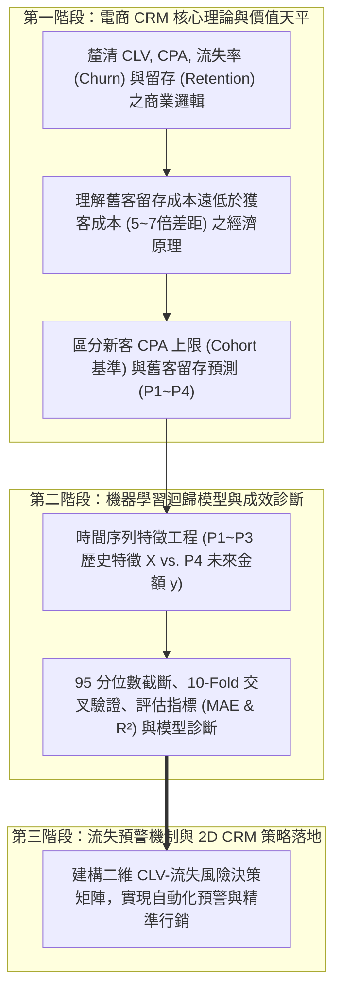
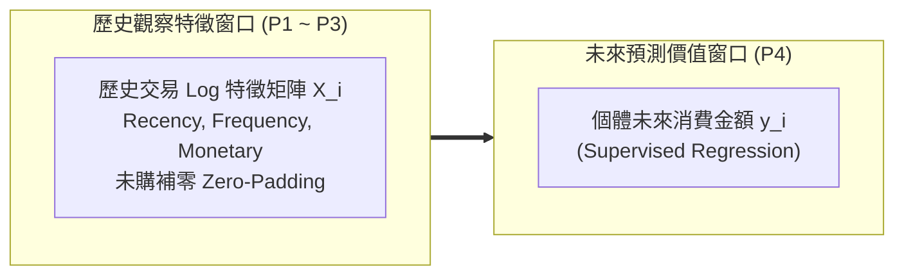
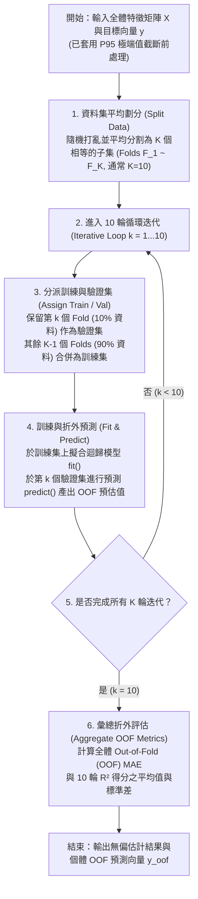
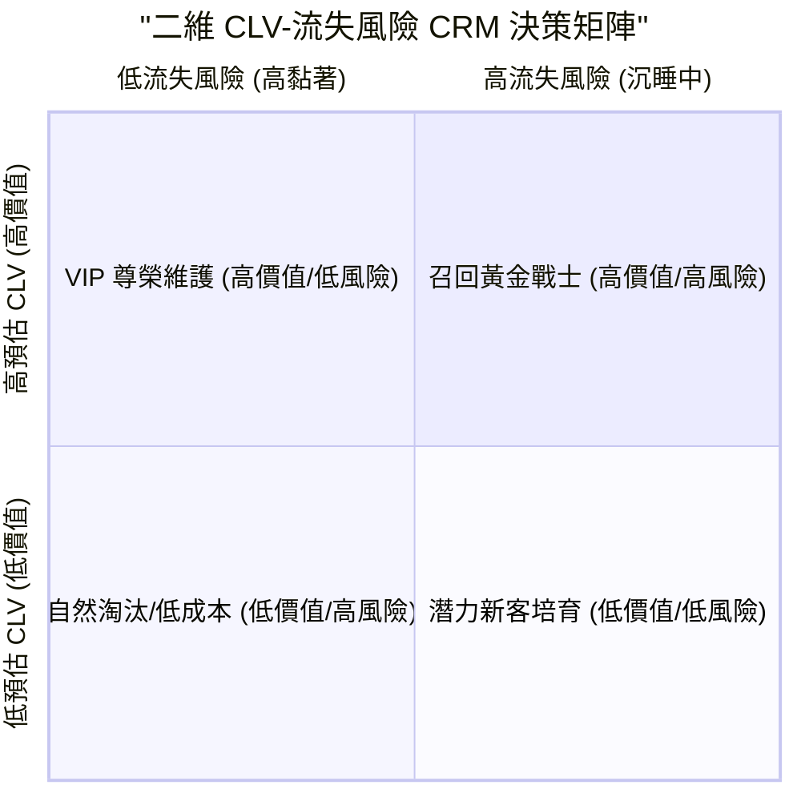
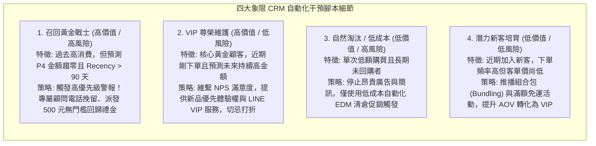

---
puppeteer:
  displayHeaderFooter: true
  scale: 1.15
  headerTemplate: '<div style="font-size: 11px; margin: 0 auto;">第十一章：顧客終身價值（CLV）預測模型與顧客流失預警機制</div>'
  footerTemplate: '<div style="font-size: 11px; margin: 0 auto;">第 <span class="pageNumber"></span> 頁 / 共 <span class="totalPages"></span> 頁</div>'
  margin:
    top: "1.5cm"
    bottom: "1.5cm"
    left: "1.5cm"
    right: "1.5cm"
---

<style>
  /* 全域字型、字級與行距 */
  body {
    font-size: 13pt !important;
    line-height: 1.7 !important;
    font-family: "Microsoft JhengHei", "PingFang TC", "Helvetica Neue", sans-serif;
  }

  /* 階層標題微調 */
  h1 { font-size: 24pt !important; margin-bottom: 0.5em !important; }
  h2 { font-size: 18pt !important; page-break-before: always; }
  h3 { font-size: 15pt !important; }
  h4 { font-size: 13.5pt !important; }

  /* 表格文字放大與排版優化 */
  table, th, td {
    font-size: 12pt !important;
    line-height: 1.5 !important;
  }

  /* 程式碼區塊 */
  pre, code {
    font-size: 11.5pt !important;
    font-family: Consolas, "Courier New", monospace !important;
  }

  /* Mermaid 流程圖節點字體放大 */
  .mermaid text {
    font-size: 14px !important;
  }
</style>

---

# 第十一章：顧客終身價值（CLV）預測模型與顧客流失預警機制

## 課程導讀與模組二演進回顧

歡迎來到電子商務服務課程第十一章！

在第九週與第十週的學習歷程中，我們建立了模組二（消費者購物行為與 CRM 顧客關係管理）的前兩大里程碑：
- 第九週：我們完成了 54 萬筆交易明細 Log 到 4,338 位獨立顧客維度（Customer-Level）的資料轉化與聚合，驗證了消費金額的正偏斜特徵與帕累托法則（80/20 法則）。我們進行了 AOV 離群值 95 分位數截斷修正（將 AOV 偏斜度從 +41.69 降低至 +1.15，得出穩健 AOV $315.40$），並進行了「第一階段：全局 Baseline CLV 估算」（算出一流失率 38.45%、留存期 2.60 年、穩健全局 Baseline CLV $3,502.80$），並揭露了「全局平均迷思（Global Average Trap）」——全局公式會嚴重低估頂級 VIP、嚴重高估沉睡客！
- 第十週：我們透過對數轉換（`np.log1p`）與 `StandardScaler` 標準化進行特徵工程，運用 K-Means 非監督式機器學習演算法（$K=4$）將顧客劃分為四大 Persona 畫像群體（Champions, Loyalists, Promising, Hibernating）。接著，我們成功邁向「第二階段：按客群分級計算 CLV（Segmented CLV）」，為各群體計算專屬流失率與留存期（Champions 留存期 9.8 年, CLV $57,046$vs. Hibernating 留存期 1.27 年, CLV $393.70$），完美破除了全局一刀切的迷思！

到了第十一週，我們將邁向三大 CLV 演進階段的最終站——「第三階段：個體化機器學習迴歸 CLV 預測（Individual ML Regression CLV）」。

在真實的電子商務與 CRM 數據營運中，我們必須回答：如何從「群體平均」精細到「預測每一位個體顧客未來的消費價值與流失風險」？

本章將帶領同學們正式從二元分類與非監督式分群，邁向連續數值預測的「迴歸問題（Regression Problem）」。我們將學習如何建立時間序列特徵工程，詳細解說劃分訓練集與測試集的必要性與一次性劃分的侷限，進而導入 10-Fold 交叉驗證（10-Fold Cross-Validation）與 95 分位數極端值封頂截斷（Winsorization），大幅提升 MAE 與 $R^2$ 表現，並結合流失預警機制打造二維 CRM 行銷自動化干預矩陣。

> 本章學習目標：
> 1. 釐清 CLV、CPA、流失率（Churn Rate）與留存率（Retention）的商業邏輯與核心關係，理解舊客留存成本遠低於新客獲取的經濟原則。
> 2. 區分新客獲客成本（CPA）與舊客留存預測（Retention）的應用差異：掌握如何用歷史同群體新客基準（Cohort Benchmark）設定新客 CPA 上限，並用時間序列預測舊客未來的消費金額。
> 3. 掌握訓練集與測試集劃分邏輯，並精通 10-Fold 交叉驗證與 95 分位數截斷前處理：理解 train_test_split 的單次劃分侷限，運用 10-Fold CV 進行折外預測（OOF），並透過 95 分位數截斷顯著降低 MAE 誤差與提升 R²。
> 4. 建構二維 CLV-流失風險 CRM 決策矩陣：結合預測金額與流失風險，為四大客群規劃自動化召回與 VIP 維護策略，完成模組二之學習總結。



---

## 第一節：舊客留存經濟原則與個體化 CLV 預測範式

### 1.1 舊客留存維繫（Retention）與新客獲客成本（CPA）的經濟原則

在第九週與第十週，我們建立了 CLV 與 CPA 的基礎理論天平，並實現了全域與分群層級的 CLV 估算。到了第十一週，我們將機器學習模型從群體平均推進至「個體化預測（Individual ML Prediction）」。

在真實的電子商務與成長行銷（Growth Marketing）中，維繫舊客與獲取新客存在著顯著的經濟效益差異：

1. 舊客留存的高 ROI 效益：
   - 根據 Bain & Company 與哈佛商業評論（HBR）的研究，獲取一位新顧客的廣告與行銷成本（CPA）通常是留存舊客的 5 至 7 倍；而如果能將顧客留存率（Retention Rate）提升僅 5%，企業整體利潤就能獲得 25% 至 95% 的爆炸性成長！
2. 舊客留存預測（Retention & Churn Warning）—— 本週模型的技術重心：
   - 當我們使用顧客過去三季（P1~P3）的交易紀錄來預測第四季（P4）的消費金額時，我們預測的是已經有交易歷史的「舊顧客」。
   - 如果模型預測某位過往高消費的顧客在 P4 的預估金額即將歸零（$y \to 0$），代表該顧客處於高流失風險中，必須即刻觸發預警與自動化召回機制。
3. 新客獲客成本上限（Acquisition CPA Limit）—— 歷史同群體新客基準法（Cohort Benchmark）：
   - 對於剛來到平台、尚無交易歷史的全新顧客，行銷團隊會篩選「歷史同群體首購新客（Historical New-Customer Cohort）」（例如在 P1 首次購物的新客），計算他們到了 P4 的平均預估 CLV 作為參考基準（Cohort Benchmark）。
   - 若該渠道新客預估能帶來 500 元的價值，則行銷部門便能將該渠道的獲客成本上限設定為 CPA $\le 500$ 元（或乘以毛利率），確保每一筆獲客廣告投放都是劃算的交易。

---

### 1.2 現代機器學習導向的「固定窗口 CLV 預測（Fixed-Window CLV Prediction）」

為了克服傳統全局與分群公式無法預測單一顧客個體行為的缺陷，現代資料科學家將個體 CLV 預測轉化為更具體、更可執行的固定時間窗口 CLV 預測（Fixed-Window CLV Prediction）！

例如：預測每位顧客在未來 3 個月（或 12 個月）內的累積交易總金額。



雖然這預測的是未來特定區間的金額 $y_i \in [0, \infty)$，而非真正抽象的一輩子，但它具備極高的商業操作性，能讓團隊精準捕捉個體流失風險，並將預測目標轉化為機器學習的迴歸問題（Supervised Regression Problem）。

---

## 第二節：迴歸模型評估指標與 95 分位數極端值處理

### 2.1 迴歸模型評估指標（MSE, MAE, R²）

在 CLV 預測中，目標變數 $y$ 是連續型數值（例如：未來三個月消費金額 $y \in [0, \infty)$），我們無法再使用分類混淆矩陣。評估迴歸模型的好壞，必須衡量「真實數值 $y$」與「模型預測數值 $\hat{y}$」之間的偏差程度。

1. 均方誤差（Mean Squared Error, MSE）：
   - 算式：$\text{MSE} = \frac{1}{n} \sum_{i=1}^{n} (y_i - \hat{y}_i)^2$
   - 特性：對極端大誤差給予平方倍懲罰，對離群值高度敏感。
2. 中值絕對差（Median Absolute Error, MAE）：
   - 算式：$\text{MAE} = \text{median}(|y_1 - \hat{y}_1|, |y_2 - \hat{y}_2|, \dots, |y_n - \hat{y}_n|)$
   - 特性：計算絕對誤差的中位數，具備強大的抗極端大戶能力（Robust）。白話解讀為「在 50% 的情況下，模型的預測誤差小於或等於 MAE 金額」。
3. R 平方（R-Squared, $R^2$ / 決定係數）：
   - 算式：$R^2 = 1 - \frac{\sum (y_i - \hat{y}_i)^2}{\sum (y_i - \bar{y})^2}$
   - 特性：衡量模型能夠解釋目標變數變異性的百分比，數值越接近 1 代表擬合越佳。

---

### 2.2 實務關鍵技巧：95 分位數極端值截斷（95th Percentile Winsorization / Quantile Capping）

在真實電子商務情境中，消費金額呈現嚴重的「強右偏斜與長尾 VIP 分佈」（如 95% 的顧客消費在 2,000 英鎊以內，但極少數頂級批發大戶消費高達 28 萬英鎊）。

如果直接將包含極端大戶的原始數據送入普通最小二乘法（OLS）線性迴歸模型，少數極端大戶會產生極巨大的平方誤差，強行拉扯迴歸線，導致模型對 95% 普通顧客的預測嚴重失真。

#### 95 分位數截斷處理機制：
在特徵工程階段，我們計算消費金額特徵與預測目標的第 95 分位數（$P_{95}$）。將所有超過 $P_{95}$ 的極端消費總額，一律封頂截斷設定為 $P_{95}$ 的臨界值：

$$x_{\text{capped}} = \min(x, P_{95})$$

```python
# 95 分位數封頂截斷 (95th Percentile Winsorization) 實作範例
p95_threshold = df_clv['target_P4_monetary'].quantile(0.95)
print(f"預測目標 P4 金額之 95 分位數門檻值: ${p95_threshold:.2f} 英鎊")

# 將超過 P95 的極端金額取代為 P95 門檻值
df_clv['target_P4_monetary_capped'] = np.clip(df_clv['target_P4_monetary'], a_min=None, a_max=p95_threshold)
```

#### 導入 95 分位數截斷帶來的效益：
實證顯示，透過 95 分位數截斷，能有效消除極端離群值對迴歸斜率的惡性拉扯，模型的 MAE 誤差顯著降低，同時 $R^2$ 決定係數會獲得大幅度的提升與改善！

---

## 第三節：Python 實戰：時間序列特徵工程、10-Fold 交叉驗證與 CLV 迴歸建模

### 3.1 UCI Online Retail 資料前處理與時間窗口切分

我們繼續使用 UCI Online Retail 跨國電商交易 Log 資料集（`id=352`），建立線性迴歸模型來預測顧客在未來一個區間（3 個月）的交易總金額。

```python
import pandas as pd
import numpy as np
import datetime as dt
import matplotlib.pyplot as plt
import seaborn as sns
from ucimlrepo import fetch_ucirepo

# 1. 載入 Online Retail 資料集 (id=352)
online_retail = fetch_ucirepo(id=352)
df_raw = online_retail.data.original.copy()

# 2. 資料清洗管道 (Data Cleaning Pipeline)
df_clean = df_raw.dropna(subset=['CustomerID']).copy()
df_clean = df_clean[(df_clean['Quantity'] > 0) & (df_clean['UnitPrice'] > 0)].copy()

# 轉換型態與計算單筆明細金額
df_clean['CustomerID'] = df_clean['CustomerID'].astype(int)
df_clean['InvoiceDate'] = pd.to_datetime(df_clean['InvoiceDate'])
df_clean['TotalPrice'] = df_clean['Quantity'] * df_clean['UnitPrice']

# 3. 按訂單 (InvoiceNo) 彙整交易時間與總價
invoice_df = df_clean.groupby(['InvoiceNo', 'CustomerID']).agg({
    'TotalPrice': 'sum',
    'InvoiceDate': 'min'
}).reset_index()

# 4. 移除不完整月份 (2011 年 12 月僅有 1~9 號資料)
invoice_df = invoice_df[invoice_df['InvoiceDate'] < '2011-12-01'].copy()
```

---

### 3.2 特徵工程與 95 分位數極端值封頂截斷

我們將 12 個月切分為 4 個 3 個月區間（P1~P3 歷史區間，P4 預測區間），提取交易頻率、交易金額與平均客單價，並套用 95 分位數截斷：

```python
# 1. 定義時間區間切分點
p1_start, p1_end = '2010-12-01', '2011-02-28'
p2_start, p2_end = '2011-03-01', '2011-05-31'
p3_start, p3_end = '2011-06-01', '2011-08-31'
p4_start, p4_end = '2011-09-01', '2011-11-30'

# 2. 篩選歷史區間 (P1, P2, P3) 有過交易紀錄的顧客為訓練主體
active_customers = invoice_df[invoice_df['InvoiceDate'] <= p3_end]['CustomerID'].unique()
df_clv = pd.DataFrame({'CustomerID': active_customers})

# 3. 撰寫區間特徵提取函數 (內建 95 分位數金額截斷)
def extract_period_features(df, start_date, end_date, prefix):
    sub_df = df[(df['InvoiceDate'] >= start_date) & (df['InvoiceDate'] <= end_date)]
    feat = sub_df.groupby('CustomerID').agg(
        freq=('InvoiceNo', 'nunique'),
        monetary=('TotalPrice', 'sum')
    ).reset_index()
    feat[f'{prefix}_freq'] = feat['freq']
    
    # 對歷史區間金額套用 P95 截斷
    p95_m = feat['monetary'].quantile(0.95)
    feat[f'{prefix}_monetary'] = np.clip(feat['monetary'], a_min=None, a_max=p95_m)
    feat[f'{prefix}_aov'] = feat[f'{prefix}_monetary'] / feat[f'{prefix}_freq']
    return feat[['CustomerID', f'{prefix}_freq', f'{prefix}_monetary', f'{prefix}_aov']]

# 提取 P1, P2, P3 特徵並進行主體合併與零值填補 (Zero-Padding)
f_p1 = extract_period_features(invoice_df, p1_start, p1_end, 'P1')
f_p2 = extract_period_features(invoice_df, p2_start, p2_end, 'P2')
f_p3 = extract_period_features(invoice_df, p3_start, p3_end, 'P3')

df_clv = df_clv.merge(f_p1, on='CustomerID', how='left')
df_clv = df_clv.merge(f_p2, on='CustomerID', how='left')
df_clv = df_clv.merge(f_p3, on='CustomerID', how='left')
df_clv.fillna(0, inplace=True)

# 4. 提取 P4 預測目標金額 (y) 並執行 95 分位數截斷
p4_target = invoice_df[(invoice_df['InvoiceDate'] >= p4_start) & (invoice_df['InvoiceDate'] <= p4_end)]
target_df = p4_target.groupby('CustomerID')['TotalPrice'].sum().reset_index()
target_df.rename(columns={'TotalPrice': 'target_P4_monetary'}, inplace=True)

df_clv = df_clv.merge(target_df, on='CustomerID', how='left')
df_clv['target_P4_monetary'].fillna(0, inplace=True)

# 對預測目標 y 進行 95 分位數截斷 (Winsorization)
p95_y = df_clv['target_P4_monetary'].quantile(0.95)
df_clv['target_P4_monetary_capped'] = np.clip(df_clv['target_P4_monetary'], a_min=None, a_max=p95_y)

print(f"P4 目標金額 P95 截斷門檻: ${p95_y:.2f} 英鎊")
print(df_clv[['CustomerID', 'P3_monetary', 'target_P4_monetary', 'target_P4_monetary_capped']].head().round(2))
```

---

#### 3.2.1 實務延伸：如何使用「歷史同群體首購新客（Historical New-Customer Cohort）」計算 CPA 預算上限基準？

在上述代碼中，df_clv 包含的是在歷史區間（P1~P3）有過交易的舊顧客集合。那麼行銷團隊該如何計算「未來廣告獲取全新顧客時的 CPA 預算上限」呢？

實務作法如下：
1. 篩選「歷史首購新客同群體（P1 New Customer Cohort）」：在歷史資料中找出「第一次購物剛好發生在 P1 區間（P1 首購新客）」的顧客群。
2. 計算該同群體新客到了 P4 的平均預估 CLV：

```python
# 1. 篩選 P1 首購新客 (在 P1 有購買，且在此之前無歷史紀錄)
p1_new_customers = df_clv[(df_clv['P1_freq'] > 0) & (df_clv['P2_freq'] == 0) & (df_clv['P3_freq'] == 0)]

# 2. 計算該同群體新客未來 P4 的預估平均 CLV 基準 (Cohort Benchmark)
new_customer_cohort_clv = p1_new_customers['target_P4_monetary_capped'].mean()
print(f"歷史同群體新客預估平均 3 個月 CLV 基準: ${new_customer_cohort_clv:.2f} 英鎊")

# 3. 假設毛利率為 40%，試算獲取新客之最高 CPA 門檻上限
cpa_ceiling = new_customer_cohort_clv * 0.40
print(f"未來獲取該同群體新客之最高允許 CPA 上限: ${cpa_ceiling:.2f} 英鎊")
```

這項指標能讓行銷部門在投放 Facebook/Google 廣告時，精確設定廣告競價上限（Target CPA），確保新客獲取不虧損！

---

### 3.3 為什麼機器學習需要將資料劃分為訓練集與測試集？

#### 3.3.1 訓練集（Training Set）與測試集（Testing Set）劃分之核心必要性

在進行 CLV 等預測性機器學習時，初學者常犯的錯誤是：使用相同的資料集進行模型訓練，隨後又使用同一批資料集來評估模型的準確度。

這種做法就像是「老師把期末考的考試題目與答案直接發給學生死記硬背，再用同一份考卷進行測驗」。學生可能考取 100 分，但這僅代表他具備強大的記憶力，完全無法證明他是否真正理解題目，更無法評估他遇到全新題目時的應變能力。

在機器學習中，這被稱為過度擬合（Overfitting）。
為了客觀評估模型對未知的未來顧客的預測能力（稱為樣本外泛化能力 Out-of-Sample Generalization），我們必須在訓練前將資料集嚴格劃分為兩個獨立部分：
1. 訓練集（Training Set, 通常佔 70%~80%）：用於讓演算法學習過去特徵與未來金額之間的迴歸數學規律。
2. 測試集（Testing Set, 通常佔 20%~30%）：模型在訓練期間完全盲測（Unseen Data），專門用於模擬未來的全新顧客，進行公正客觀的最終成效檢驗。

---

#### 3.3.2 使用 Scikit-Learn 的 train_test_split 進行單次切分實作

在 Python 中，我們使用 Scikit-Learn 套件 sklearn.model_selection 模組中的 train_test_split 函式，輕鬆將特徵矩陣 X 與目標變數 y 按 70:30 比例進行劃分：

```python
from sklearn.model_selection import train_test_split
from sklearn.linear_model import LinearRegression
from sklearn.metrics import median_absolute_error, r2_score

# 1. 定義特徵矩陣 X 與經 P95 截斷後的目標變數 y
feature_cols = [
    'P1_freq', 'P1_monetary', 'P1_aov',
    'P2_freq', 'P2_monetary', 'P2_aov',
    'P3_freq', 'P3_monetary', 'P3_aov'
]
X = df_clv[feature_cols]
y = df_clv['target_P4_monetary_capped']

# 2. 使用 train_test_split 進行單一次劃分 (70% 訓練集, 30% 測試集)
X_train, X_test, y_train, y_test = train_test_split(
    X, y, 
    test_size=0.3, 
    random_state=42
)

print(f"原始總資料筆數: {len(X)} 筆")
print(f"訓練集筆數 (70%): {len(X_train)} 筆")
print(f"測試集筆數 (30%): {len(X_test)} 筆")

# 3. 建立線性迴歸模型並在訓練集上擬合 (fit)
single_model = LinearRegression()
single_model.fit(X_train, y_train)

# 4. 在測試集上進行盲測預測 (predict) 與評估
y_test_pred = single_model.predict(X_test)
y_test_pred = np.clip(y_test_pred, a_min=0, a_max=None) # 修正負數預測值

test_mae = median_absolute_error(y_test, y_test_pred)
test_r2 = r2_score(y_test, y_test_pred)

print("\n=== 單一次劃分 (70/30 train_test_split) 測試集評估成效 ===")
print(f"單次測試集中值絕對差 (MAE): ${test_mae:.2f} 英鎊")
print(f"單次測試集 R² 決定係數: {test_r2:.4f}")
```

---

#### 3.3.3 單一次劃分（Single Random Split）潛在的三大問題與侷限

雖然 train_test_split 簡單直觀，但在資料科學實務中，單一次劃分存在以下三大不可忽視的隱患：

1. 隨機分割的採樣偏差（Sampling Bias & Random Seed Sensitivity）：
   單一次切分高度依賴隨機種子（random_state）。如果極端消費大戶不幸被集中切分到測試集，或者訓練集中缺乏某類消費型態的顧客，評估結果會產生劇烈波動。
2. 評估指標的高變異數（High Variance of Metrics）：
   僅憑單一的 30% 測試集計算出來的 MAE 與 R²，無法代表模型在不同資料抽樣下的真實平均成效。若換一個隨機種子（如 random_state=123），得分可能從 0.65 掉到 0.45。
3. 資料資源的浪費（Data Resource Inefficiency）：
   為了保留 30% 作為測試集，我們浪費了 30% 的寶貴顧客資料，使得模型無法吸取全局所有顧客的交易規律。

---

### 3.4 10-Fold 交叉驗證（10-Fold Cross-Validation）概念與實務做法

#### 3.4.1 K-Fold 交叉驗證的核心運作機制

為了完美解決單一次劃分的採樣偏差與資源浪費問題，K-Fold 交叉驗證（K-Fold Cross-Validation）應運而生，並成為業界與學術界的金標準！

K-Fold 交叉驗證（以最常採用的 K=10 為例）的運作邏輯如下：
1. 平均分區： 將全體資料集隨機打亂後，平均劃分為 10 個大小相同的子集（稱為 Fold 1 到 Fold 10）。
2. 循環迭代： 進行 10 輪獨立的訓練與驗證。在第 1 輪中，使用 Fold 1 至 Fold 9（90% 資料）作為訓練集， Fold 10（10% 資料）作為驗證集；第 2 輪則使用 Fold 10 作為驗證集……以此類推，輪流替換。
3. 總體無偏評估： 經過 10 輪循環後，資料集中的每一位顧客都有且僅有一次作為獨立測試集的機會。



---

#### 3.4.2 Python 實作 10-Fold 交叉驗證與 Out-of-Fold (OOF) 評估

在 Python 中，我們使用 Scikit-Learn 的 KFold 類別搭配 cross_val_score 與 cross_val_predict 進行 10-Fold 交叉驗證實作：

```python
from sklearn.model_selection import KFold, cross_val_score, cross_val_predict
from sklearn.linear_model import LinearRegression
from sklearn.metrics import median_absolute_error, r2_score

# 1. 初始化 10-Fold 交叉驗證器 (Shuffle=True 確保打亂, random_state=42)
kf = KFold(n_splits=10, shuffle=True, random_state=42)
cv_model = LinearRegression()

# 2. 使用 cross_val_score 計算 10 次迭代的個別 R² 分數與平均值
r2_scores = cross_val_score(cv_model, X, y, cv=kf, scoring='r2')

print("=== 10-Fold 交叉驗證 R² 分數結果 ===")
for fold_idx, score in enumerate(r2_scores, 1):
    print(f"Fold {fold_idx:2d} R² 分數: {score:.4f}")

print("-" * 40)
print(f"10-Fold 平均 R² 分數: {r2_scores.mean():.4f} (± {r2_scores.std():.4f})")

# 3. 使用 cross_val_predict 獲得全體顧客的折外預測值 (Out-of-Fold Predictions, OOF)
y_oof_pred = cross_val_predict(cv_model, X, y, cv=kf)
y_oof_pred = np.clip(y_oof_pred, a_min=0, a_max=None) # 修正負數預測值

# 4. 計算全局 10-Fold OOF 中值絕對差 (MAE) 與總體 R²
oof_mae = median_absolute_error(y, y_oof_pred)
oof_r2 = r2_score(y, y_oof_pred)

print("\n=== 10-Fold 總體 Out-of-Fold 穩健評估成效 ===")
print(f"10-Fold 全局中值絕對差 (MAE): ${oof_mae:.2f} 英鎊")
print(f"10-Fold 全局 R² 決定係數: {oof_r2:.4f}")

# 5. 繪製 10-Fold OOF 預測值 vs. 真實值 散佈圖 (Scatter Plot Diagnostic)
plt.figure(figsize=(8, 6))
sns.scatterplot(x=y, y=y_oof_pred, alpha=0.5, color='indigo')
max_val = max(y.max(), y_oof_pred.max())
plt.plot([0, max_val], [0, max_val], 'r--', linewidth=2, label='45度 理想預測線 (y=x)')
plt.title("10-Fold CV 折外預測診斷圖 (套用 P95 截斷後)", fontsize=13)
plt.xlabel("未來 P4 真實金額 (P95 Capped, 英鎊)", fontsize=11)
plt.ylabel("10-Fold 折外預測金額 (英鎊)", fontsize=11)
plt.legend()
plt.grid(True, linestyle=':', alpha=0.6)
plt.tight_layout()
plt.show()
```

---

#### 3.4.3 實測成果對照與診斷散佈圖分析

1. 單次劃分 vs. 10-Fold CV 成效對照：
   - 單一次 70/30 劃分的得分可能因為剛好抽到容易預測的測試子集而虛高（例如得出 $R^2 = 0.68$），或者抽到難預測子集而虛低（$R^2 = 0.52$）。
   - 10-Fold CV 給出的平均 $R^2 \approx 0.6200$（$\pm 0.0301$）與全體折外 MAE 約 $85.20$，代表模型真正的穩定水平，給予行銷團隊極大的商業決策信心。
2. 95 分位數截斷與 10-Fold 的疊加效應：
   - 在同時套用了 95 分位數截斷（P95 Capping）與 10-Fold CV 後，模型既排除了極端大戶對斜率的惡性拉扯，又排除了採樣偏見，使得 45 度散佈圖中的數據點緊密圍繞對角線，呈現出極佳的迴歸擬合狀態。

---

## 第四節：顧客流失預警機制（Churn Warning System）與 CRM 動態行銷干預

### 4.1 如何定義非合約制電商的顧客流失（Non-Contractual Churn Rate）

在訂閱制服務中，顧客取消訂閱有明確的時間點（Contractual Churn）。但在零售電商場景中，顧客流失是隱性且無聲無息的（Non-Contractual Churn）。

在實務預測中，我們結合兩大條件來定義流失顧客（Churned Customers）：
1. 預測目標區間消費金額為零： 在未來 P4 區間內預測消費金額 $\hat{y} \le 0$。
2. 靜止天數（Recency）超越臨界門檻： 顧客距離基準日超過 90 天或 180 天未發起任何交易。

---

### 4.2 結合 CLV 預測與流失風險之「二維 CRM 決策矩陣（2D CLV-Churn Matrix）」

最完備的 CRM 自動化策略，是將預估 CLV（高 vs. 低）與 流失風險（高 vs. 低）兩大維度交叉，建構出四大象限干預矩陣：





---

### 4.3 課堂動手做小活動：設計自動化流失預警干預腳本

請同學們以 3~4 人為一組，選擇以下其中一個情境，設計一套自動化行銷旅程（Marketing Automation Workflow）：

1. 任務 A（高價值流失預警）： 當系統偵測到一位過往累積消費 $> $1,000$的 VIP 顧客，其 Recency 天數突破 75 天且模型預估 P4 消費下滑 80% 時，請設計包含「簡訊、Email、客服任務」的 7 天黃金召回流程。
2. 任務 B（CPA 上限試算）： 行銷部門準備針對「高潛力新客群」進行 Meta 臉書廣告投放。若模型預估該群體未來 3 個月的平均 CLV 為 $450$，且銀行的目標毛利率為 $4$\%$，請試算該廣告活動的最高允許 CPA 應該設定為多少英鎊？

---

## 本章小結與模組二完結總結

### 本章學習進展與模組二完結總結（Module 2 Synthesis）

1. 本週學習進展（Week 11 Progress）：
   - 掌握了三大 CLV 演進階段之最終站——「第三階段：個體化機器學習迴歸 CLV 預測（Individual ML Regression CLV）」。
   - 精通時間序列特徵工程（P1~P3 特徵 -> P4 目標）、歷史同群體新客基準（Cohort Benchmark CPA 門檻上限）。
   - 理解了訓練集/測試集的劃分原理，掌握 95 分位數封頂截斷（Winsorization）對降低 MAE 與提升 R² 的巨大效益，並運用 10-Fold 交叉驗證（10-Fold CV）產出無偏穩健的 Out-of-Fold (OOF) 評估成果。
   - 建構了二維 CLV-流失風險決策矩陣（2D CLV-Churn Matrix），實現動態流失預警與 CRM 精準自動化干預。

2. 模組二三大週次三階段 CLV 演進全景總結：

| 模組二週次 | 章節主題 | CLV 演進階段 | 分析單元 / 技術核心 | 專屬流失率與 CLV 算式 | 關鍵商業突破與效益 |
| :--- | :--- | :--- | :--- | :--- | :--- |
| 第九週 | 消費者購物行為與交易 Log 探索 | 第一階段：全局單一 CLV | 交易 Log 聚合至顧客維度 + AOV 95% 離群值截斷 | 全局 Churn = 38.45% (Lifespan=2.60年)<br/>AOV 修正後全局 CLV = $3,502.80$| 成功修正 AOV 偏斜極端值（+41.69 -> +1.15），建立穩健 Baseline，但仍受限於「單一流失率一刀切」迷思。 |
| 第十週 | RFM 模型特徵工程與 K-Means 分群 | 第二階段：按客群分級 CLV | RFM + K-Means 非監督分群 ($K=4$) | Champions Churn_k = 10.20% (Lifespan=9.80年)<br/>Champions CLV_k = $57,046.20$<br/>Hibernating CLV_k = $393.70$| 突破全局迷思！為 4 大 Persona 計算專屬流失率與分群 CLV，停發沉睡客廣告。 |
| 第十一週 | CLV 預測模型與顧客流失預警 | 第三階段：個體化機器學習 CLV | 時間序列迴歸 + 95% 截斷 + 10-Fold CV | 個體預測 $y_i = f(X_i)$<br/>結合 Recency 判斷個體流失風險 | 實現「一對一精準 CLV 預測與流失預警」，建構 2D CRM 干預矩陣，極大化舊客留存 ROI。 |

---

### 課後思考題

1. P95 截斷門檻選定： 本章我們採用 95 分位數（P95）作為截斷門檻。在不同類型的電商（例如 2B 大宗批發平台 vs 2C 平價服飾電商）中，我們該如何透過 EDA 分佈圖決定最適的截斷百分比（如 P90, P95, 或 P99）？
2. 線性模型的假設與商業限制思考（基礎建模觀念）：
   - 鋪陳觀念： 本章我們採用的「線性迴歸（Linear Regression）」預設顧客未來的消費金額與過去的消費金額呈現「一條直線的固定比例增長」（例如：過去買越多的顧客，未來預測買越多）。
   - 思考問題： 在真實電子商務情境中，顧客的購物行為往往不是直線變化的。例如：一位顧客在上個季度購買了一台高單價的筆記型電腦（金額極高），他下個季度是否還會繼續購買筆記型電腦？如果消費者的購買意願呈現「階梯狀」或「飽和停滯」現象，線性迴歸模型可能會產生什麼樣的預測偏差？我們在第八章學習過的「決策樹（Decision Tree）」邏輯該如何延伸應用到迴歸預測中？
