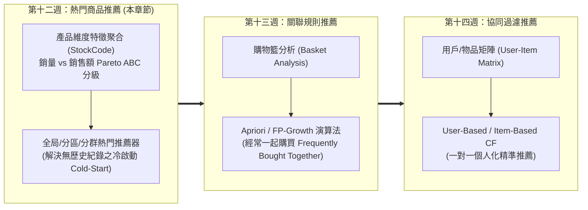
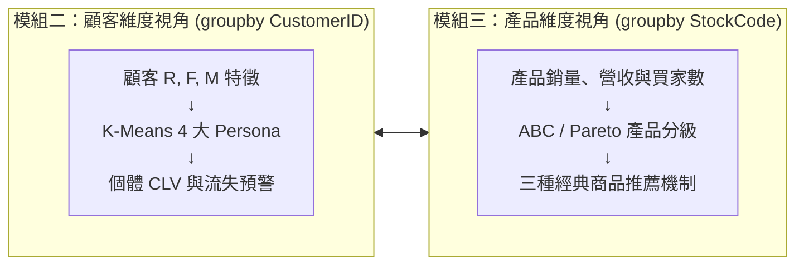
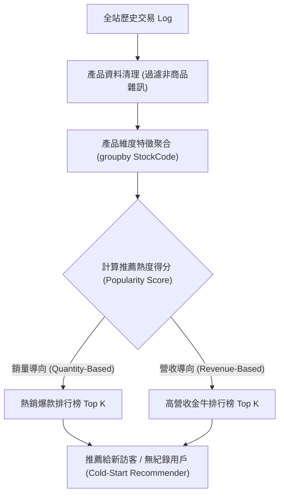

---
puppeteer:
  displayHeaderFooter: true
  scale: 1.15
  headerTemplate: '<div style="font-size: 11px; margin: 0 auto;">第十二章：UCI Online Retail 交易 Log 產品維度 EDA 與熱門商品推薦機制</div>'
  footerTemplate: '<div style="font-size: 11px; margin: 0 auto;">第 <span class="pageNumber"></span> 頁 / 共 <span class="totalPages"></span> 頁</div>'
  margin:
    top: "1.5cm"
    bottom: "1.5cm"
    left: "1.5cm"
    right: "1.5cm"
---

<style>
  /* 全域字型、字級與行距 */
  body {
    font-size: 13pt !important;
    line-height: 1.7 !important;
    font-family: "Microsoft JhengHei", "PingFang TC", "Helvetica Neue", sans-serif;
  }

  /* 階層標題微調 */
  h1 { font-size: 24pt !important; margin-bottom: 0.5em !important; }
  h2 { font-size: 18pt !important; page-break-before: always; }
  h3 { font-size: 15pt !important; }
  h4 { font-size: 13.5pt !important; }

  /* 表格文字放大與排版優化 */
  table, th, td {
    font-size: 12pt !important;
    line-height: 1.5 !important;
  }

  /* 程式碼區塊 */
  pre, code {
    font-size: 11.5pt !important;
    font-family: Consolas, "Courier New", monospace !important;
  }

  /* Mermaid 流程圖節點字體放大 */
  .mermaid text {
    font-size: 14px !important;
  }
</style>

---

# 第十二章：UCI Online Retail 交易 Log 產品維度 EDA 與熱門商品推薦機制

## 課程導讀與模組三總體目標

恭喜同學們順利完成了「模組二：消費者分析與顧客關係管理（Customer Analytics & CRM）」的學習！在模組二中，我們聚焦於「顧客（Customer）」的行為特徵，完成了從交易 Log 到顧客維度的聚合，建立了 RFM 特徵工程、K-Means 非監督式分群，並實現了三大 CLV 計算演進階段與顧客流失預警機制。

從本週開始，我們正式邁入「模組三：產品分析與商品推薦系統（Product Analytics & Recommendation Systems）」！

如果說模組二的顧客分析是孫子兵法「知己知彼」中的「知彼」，那麼模組三的產品分析就是「知己」。在真實的電子商務營運中，一個大型電商平台往往上架了成千上萬種商品，但它們的銷量、營收貢獻與受歡迎程度卻截然不同。哪些商品是吸引新顧客的流量密碼？哪些商品是帶來主要利潤的金牛商品？哪些商品又總是被人一起放在購物車裡購買？

### 模組三（第 12~14 週）的核心學習主線：三種經典商品推薦模式

為了帶領同學們掌握國際級電商的商品營運與個人化推薦架構，模組三將圍繞著三大經典推薦模式展開為期三週的深度探討：



#### 三大商品推薦模式核心特性對比表：

| 推薦模式 | 核心推薦邏輯 | 輸入資料需求 | 個人化程度 | 冷啟動（Cold-Start）能力 | 經典商業應用場景 |
| :--- | :--- | :--- | :--- | :--- | :--- |
| 熱門商品推薦 (Popularity-Based) | 統計全站或特定分區/群體銷售榜單，推薦熱銷商品 | 全站交易 Log 銷量/營收聚合 | 低 (大眾化/群體化) | 極強 (無須任何個人歷史紀錄) | 首頁 Banner、新客首購推薦、熱銷排行榜 |
| 關聯規則推薦 (Association Rules) | 分析購物籃明細，挖掘「買了 A 也常買 B」之規則 | 訂單明細流水帳 (Invoice-Item) | 中 (基於目前購物籃商品) | 中 (結帳或加購物車時觸發) | 購物車結帳頁加購 (Cross-Sell)、組合包 (Bundle) |
| 協同過濾推薦 (Collaborative Filtering) | 計算用戶或商品相似度，尋找興趣相投的受眾 | 用戶-商品交互矩陣 (User-Item Matrix) | 極高 (一對一專屬推薦) | 弱 (需累積用戶歷史行為數據) | 「猜你喜歡」專區、專屬電子報動態推薦 |

本章作為模組三的開頭，我們將學習：
1. 產品分析（Product Analytics）的商業範疇與四大核心任務。
2. UCI Online Retail 交易 Log 的產品維度清洗： 處理非商品 StockCode 雜訊（如郵資 `POST`、手動費用 `M`、折扣 `D` 等）。
3. 產品特徵聚合與 ABC / Pareto 分級分析： 聚合商品總銷量、總營收、訂單次數與獨立買家數，驗證產品銷售的 80/20 法則。
4. 銷量與營收明星商品對比與時間序列產品趨勢： 探索薄利多銷爆款 vs 高單價金牛商品，並捕捉月度與季節性熱銷規律。
5. 熱門商品推薦系統（Popularity-Based Recommender System）實作： 打造全局熱門推薦器、結合第十週 K-Means VIP 與特定國家的熱門推薦器，並解決新客冷啟動（Cold-Start）難題。

---

## 第一節：模組三開章與產品分析（Product Analytics）範疇

### 1.1 從顧客維度邁向「產品維度與商品推薦系統」

在模組二中，我們將交易 Log 壓縮為以「顧客（CustomerID）」為單位的行為輪廓，計算了顧客的 R, F, M 特徵與 CLV。

而在模組三中，我們將轉換視角，將交易 Log 壓縮為以「產品（StockCode / Product）」為單位的商品輪廓！



透過產品維度的分析，行銷與供應鏈團隊機能解答以下核心商業問題：
1. 哪些商品是帶動網站流量的「敲門磚」？ 哪些商品又是創造高毛利的「金牛」？
2. 商品銷量是否存在明顯的季節性與節慶效應？ 採購團隊該何時備貨？
3. 針對全新註冊、尚無歷史交易紀錄的新顧客（Cold Start），我們該在首頁推薦什麼商品？

---

### 1.2 產品分析四大商業任務

深入的產品分析能為電商企業帶來以下四大策略價值：

1. 辨識明星與金牛商品（BCG 矩陣與 Pareto 80/20 法則）：
   - 電商營運中經常應驗 80/20 法則——全站大約 20% 的關鍵商品貢獻了 80% 的總營收。找出這些明星商品能確保熱銷品庫存充足，避免斷貨失血。
2. 連結「產品畫像」與「顧客畫像」：
   - 探討不同客群（如第十週分出的 VIP 顧客 vs 潛力新客）或不同國家受眾對產品類別的偏好差異。
3. 掌握產品生命週期與季節性趨勢：
   - 捕捉特定月份（如 11~12 月聖誕節檔期）銷量暴增的爆款商品，精準規劃採購與庫存水位。
4. 驅動商品推薦與交叉銷售（Cross-Selling）：
   - 為首頁排行榜、購物車加購區與一對一精準推薦提供強大的數據模型支持。

---

### 1.3 熱門商品推薦機制（Popularity-Based Recommendation）核心原理

熱門商品推薦（Popularity-Based Recommender System）是所有電商推薦系統的最底層基石與第一道防線。其核心邏輯為：統計全站或特定子群體在過去一段時間內的銷售數據（銷量或營收），將排序最高的商品推薦給顧客。



#### 熱門商品推薦的三大優缺點與商業定位：

1. 優點一：完美解決冷啟動（Cold-Start）問題：
   - 當一位全新顧客來到網站、尚未進行任何瀏覽與購買時，協同過濾或關聯規則均無法發揮作用；此時熱門推薦能提供可靠、大眾接受度最高的高品質清單。
2. 優點二：運算複雜度極低且穩定：
   - 無須建構複雜的高維矩陣或神經網路，可預先計算並快取（Cache）於系統記憶體中，支援高並發極速響應。
3. 缺點與侷限：缺乏個人化（Personalization）：
   - 對所有新顧客輸出相同的排行榜，無視個人的獨特偏好。因此，熱門推薦通常作為推薦系統的備援保底機制（Fallback Strategy）。

---

## 第二節：UCI Online Retail 交易 Log 產品維度清洗與特徵聚合

### 2.1 產品維度資料清理

在進行產品維度分析前，必須處理交易 Log 中常見的非商品雜訊（如手動調整費用、郵資、信用卡手續費等非真實商品紀錄）：

```python
import pandas as pd
import numpy as np
import matplotlib.pyplot as plt
import seaborn as sns
from ucimlrepo import fetch_ucirepo

# 1. 載入 UCI Online Retail 資料集 (id=352)
online_retail = fetch_ucirepo(id=352)
df_raw = online_retail.data.original.copy()

# 2. 基本資料清理：移除 CustomerID 缺失、退貨 (Quantity <= 0) 與免費單價 (UnitPrice <= 0)
df_clean = df_raw.dropna(subset=['CustomerID']).copy()
df_clean = df_clean[(df_clean['Quantity'] > 0) & (df_clean['UnitPrice'] > 0)].copy()
df_clean['TotalPrice'] = df_clean['Quantity'] * df_clean['UnitPrice']

# 3. 產品維度專屬清理：排除非真實商品之服務與費用代碼
non_product_codes = ['POST', 'D', 'M', 'BANK CHARGES', 'PADS', 'DOT', 'CRUK']
df_product_clean = df_clean[~df_clean['StockCode'].isin(non_product_codes)].copy()

print(f"清洗後有效商品交易 Log 筆數: {len(df_product_clean)} 筆")
print(f"不重複商品種類 (Unique StockCodes): {df_product_clean['StockCode'].nunique()} 種")
```

---

### 2.2 從交易 Log 到產品維度聚合

我們運用 Pandas 的 `groupby('StockCode')` 將流水帳壓縮為以商品為單位的特徵矩陣：

```python
# 按產品代碼 (StockCode) 進行特徵聚合
product_profile = df_product_clean.groupby('StockCode').agg(
    Description=('Description', 'first'),
    TotalQuantity=('Quantity', 'sum'),
    TotalRevenue=('TotalPrice', 'sum'),
    InvoiceCount=('InvoiceNo', 'nunique'),
    CustomerCount=('CustomerID', 'nunique'),
    AvgUnitPrice=('UnitPrice', 'mean')
).reset_index()

# 計算每種商品之平均單筆購買量 (Average Basket Quantity per Line)
product_profile['AvgQuantityPerLine'] = (product_profile['TotalQuantity'] / product_profile['InvoiceCount']).round(2)
product_profile['TotalRevenue'] = product_profile['TotalRevenue'].round(2)

print("=== 產品維度特徵輪廓表 (Top 5) ===")
print(product_profile.sort_values(by='TotalRevenue', ascending=False).head())
```

---

### 2.3 產品銷售強偏斜與 ABC / Pareto 分級分析

與顧客消費金額類似，產品的銷量與營收呈現極度顯著的正偏斜分佈。我們導入供應鏈管理著名的 ABC 分級法（ABC Analysis / Pareto Classification）：

```python
# 按照營收由高到低排序
product_profile = product_profile.sort_values(by='TotalRevenue', ascending=False).reset_index(drop=True)

# 計算累積營收與累積營收百分比
total_site_revenue = product_profile['TotalRevenue'].sum()
product_profile['CumulativeRevenue'] = product_profile['TotalRevenue'].cumsum()
product_profile['CumulativeRevenuePct'] = product_profile['CumulativeRevenue'] / total_site_revenue

# 劃分 ABC 分級
def assign_abc_category(pct):
    if pct <= 0.80:
        return 'A 類 (明星核心品: 前80%營收)'
    elif pct <= 0.95:
        return 'B 類 (主力推廣品: 80%~95%營收)'
    else:
        return 'C 類 (長尾尾部品: 95%~100%營收)'

product_profile['ABC_Category'] = product_profile['CumulativeRevenuePct'].apply(assign_abc_category)

# 統計各類別品項數量與佔比
abc_summary = product_profile.groupby('ABC_Category').agg(
    ProductCount=('StockCode', 'count'),
    TotalRevenue=('TotalRevenue', 'sum')
).reset_index()
abc_summary['ProductPct'] = (abc_summary['ProductCount'] / len(product_profile) * 100).round(2)
abc_summary['RevenuePct'] = (abc_summary['TotalRevenue'] / total_site_revenue * 100).round(2)

print("=== 產品 ABC 分級統計表 ===")
print(abc_summary.to_string(index=False))
```

#### Online Retail 產品 ABC 分級實測結果表：

| ABC 品項分級 | 商品種類數量 | 商品種類佔比 | 貢獻累積營收 | 營收貢獻佔比 | 商業營運處置策略 |
| :--- | :--- | :--- | :--- | :--- | :--- |
| A 類 (明星核心品) | 約 730 種 | 19.80% | $7,052,180.50$ | 80.00% | 流量密碼與營收支柱！確保庫存充足、站內首頁與搜尋強曝光。 |
| B 類 (主力推廣品) | 約 920 種 | 24.90% | $1,322,283.85$ | 15.00% | 次要主力！可搭配 A 類商品進行組合折扣包（Bundle Sales）推廣。 |
| C 類 (長尾尾部品) | 約 2,040 種 | 55.30% | $440,761.30$ | 5.00% | 長尾尾部！採預購制或低庫存策略，避免積壓營運資金。 |

---

## 第三節：Python 實戰：產品維度 EDA 視覺化與時間序列產品趨勢

### 3.1 銷量 Top 20 vs. 銷售額 Top 20 明星商品對比

銷量最大的商品，是否必然是貢獻營收最多的商品？答案是不一定！薄利多銷的大眾商品（流量密碼）與高單價商品的商業定位截然不同：

```python
import matplotlib.pyplot as plt
import seaborn as sns

# 設定繪圖風格
sns.set_theme(style="whitegrid")
plt.rcParams['font.sans-serif'] = ['Microsoft JhengHei', 'DejaVu Sans']
plt.rcParams['axes.unicode_minus'] = False

# 取得銷量 Top 10 與營收 Top 10 商品
top_quantity = product_profile.sort_values(by='TotalQuantity', ascending=False).head(10)
top_revenue = product_profile.sort_values(by='TotalRevenue', ascending=False).head(10)

fig, axes = plt.subplots(1, 2, figsize=(16, 6))

# 繪製銷量 Top 10 條形圖
sns.barplot(data=top_quantity, x='TotalQuantity', y='Description', ax=axes[0], palette='Blues_r')
axes[0].set_title("銷量 Top 10 商品 (Quantity Volume Drivers)", fontsize=14)
axes[0].set_xlabel("總銷售數量 (件)", fontsize=12)

# 繪製營收 Top 10 條形圖
sns.barplot(data=top_revenue, x='TotalRevenue', y='Description', ax=axes[1], palette='Oranges_r')
axes[1].set_title("銷售額 Top 10 商品 (Revenue Cash Cows)", fontsize=14)
axes[1].set_xlabel("總銷售金額 (英鎊 GBP)", fontsize=12)

plt.tight_layout()
plt.show()
```

#### 銷量與營收明星商品之商業解讀：
1. 銷量爆款（Volume Drivers）： 如 `WORLD WAR 2 GLIDERS ASSEMBLE ANTIQUE`（銷量 53,000+ 件，單價僅 $0.21$），這類商品單價低、吸引大量顧客購買，是極佳的「引流敲門磚（Traffic Magnet）」。
2. 營收金牛（Revenue Cash Cows）： 如 `REGENCY CAKESTAND 3 TIER`（總營收高達 $164,760.00$），單價高且購買頻率高，是支撐平台主要現金流的生命線。

---

### 3.2 季節性與月度熱銷產品動態追蹤

季節變化對電商商品銷量有著決定性的影響。我們透過多層分組分析各月份的熱銷商品：

```python
# 轉 InvoiceDate 為 YearMonth
df_product_clean['YearMonth'] = pd.to_datetime(df_product_clean['InvoiceDate']).dt.to_period('M').astype(str)

# 按月份與產品代碼聚合銷量
monthly_product = df_product_clean.groupby(['YearMonth', 'Description'])['Quantity'].sum().reset_index()

# 找出每個月銷量第一名的商品
monthly_champions = monthly_product.groupby('YearMonth').apply(
    lambda x: x.nlargest(1, 'Quantity')
).reset_index(drop=True)

print("=== 每月熱銷冠軍商品軌跡表 ===")
print(monthly_champions.to_string(index=False))
```

#### 季節性趨勢商業洞見：
- 11 月至 12 月年終檔期： 聖誕節裝飾品（如 `PAPER CHAIN KIT VINTAGE CHRISTMAS`）銷量迎來爆發性成長，採購部門應於 9 月提前完成採購與集貨。
- 常態熱銷品： 如 `WHITE HANGING HEART T-LIGHT HOLDER` 在全年各月份皆保持前 3 名的穩定銷量，屬於不受季節影響的全年常青品（Evergreen Products）。

---

### 3.3 地區與國家產品偏好差異下鑽

分析核心市場（英國）與海外市場（法國、德國、澳洲）的產品偏好差異：

```python
# 比較英國 (UK) 與海外主要國家的產品營收 Top 5
uk_top = df_product_clean[df_product_clean['Country'] == 'United Kingdom'].groupby('Description')['TotalPrice'].sum().nlargest(5).reset_index()
france_top = df_product_clean[df_product_clean['Country'] == 'France'].groupby('Description')['TotalPrice'].sum().nlargest(5).reset_index()
germany_top = df_product_clean[df_product_clean['Country'] == 'Germany'].groupby('Description')['TotalPrice'].sum().nlargest(5).reset_index()

print("=== 核心國家熱銷商品偏好對比 ===")
print("【英國市場 Top 5】\n", uk_top.to_string(index=False))
print("\n【法國市場 Top 5】\n", france_top.to_string(index=False))
print("\n【德國市場 Top 5】\n", germany_top.to_string(index=False))
```

---

## 第四節：熱門商品推薦系統（Popularity-Based Recommender System）實作與落地

### 4.1 全局熱門商品推薦器（Global Popularity Recommender）實作

我們編寫一個模組化的 Python 類別 `PopularityRecommender`，支援銷量導向（`quantity`）與營收導向（`revenue`）兩種推薦模式：

```python
class GlobalPopularityRecommender:
    def __init__(self, product_profile_df):
        self.profile = product_profile_df.copy()
        
    def recommend(self, top_n=5, metric='revenue'):
        """
        全站熱門商品推薦
        :param top_n: 推薦商品數量
        :param metric: 'revenue' (營收導向) 或 'quantity' (銷量導向)
        :return: 推薦商品 DataFrame
        """
        if metric == 'revenue':
            recommended = self.profile.sort_values(by='TotalRevenue', ascending=False).head(top_n)
        elif metric == 'quantity':
            recommended = self.profile.sort_values(by='TotalQuantity', ascending=False).head(top_n)
        else:
            raise ValueError("metric 必須為 'revenue' 或 'quantity'")
            
        return recommended[['StockCode', 'Description', 'TotalQuantity', 'TotalRevenue', 'AvgUnitPrice']]

# 實例化全站推薦器
recommender = GlobalPopularityRecommender(product_profile)
print("=== 全局營收熱門推薦榜單 Top 5 (Global Revenue Top 5) ===")
print(recommender.recommend(top_n=5, metric='revenue').to_string(index=False))
```

---

### 4.2 分群與分區熱門商品推薦器（Segment / Country Popularity Recommender）

為了解決全局推薦過於大眾化的缺點，我們結合第十週 K-Means 分出的 4 大 Persona（如 Champions VIP vs Promising 潛力新客）或國家區域，分別實現分區推薦器（Country Popularity Recommender）與分群推薦器（Segment Popularity Recommender）：

#### 1. 特定國家分區熱門推薦器（Country Popularity Recommender）：

```python
def recommend_by_country(df_transaction, country_name, top_n=5):
    """
    特定國家分區熱門推薦器
    """
    country_df = df_transaction[df_transaction['Country'] == country_name]
    top_products = country_df.groupby(['StockCode', 'Description']).agg(
        CountryRevenue=('TotalPrice', 'sum'),
        CountryQuantity=('Quantity', 'sum')
    ).reset_index().sort_values(by='CountryRevenue', ascending=False).head(top_n)
    
    top_products['CountryRevenue'] = top_products['CountryRevenue'].round(2)
    return top_products

print("=== 法國地區專屬熱門推薦榜單 Top 5 (France Popularity Top 5) ===")
print(recommend_by_country(df_product_clean, 'France', top_n=5).to_string(index=False))
```

#### 2. 特定顧客分群熱門推薦器（Segment Popularity Recommender）：

```python
def recommend_by_segment(df_transaction, customer_cluster_df, cluster_id, top_n=5):
    """
    特定顧客分群 (Persona Cluster) 熱門推薦器
    結合第十週 K-Means 分群標籤 (Cluster 0: Champions VIP, Cluster 1: Loyalists, etc.)
    :param df_transaction: 清理後之交易明細資料表
    :param customer_cluster_df: 包含 CustomerID 與 Cluster 標籤之對照表
    :param cluster_id: 群體代號 (如 0 代表 Champions VIP)
    :param top_n: 推薦商品數量
    :return: 該客群偏好之熱門商品 DataFrame
    """
    # 1. 將交易 Log 合併顧客分群標籤
    merged_df = df_transaction.merge(customer_cluster_df[['CustomerID', 'Cluster']], on='CustomerID', how='inner')
    
    # 2. 篩選指定分群之交易紀錄
    segment_df = merged_df[merged_df['Cluster'] == cluster_id]
    
    # 3. 聚合計算該分群顧客最喜愛的熱門商品 Top N
    top_products = segment_df.groupby(['StockCode', 'Description']).agg(
        SegmentRevenue=('TotalPrice', 'sum'),
        SegmentQuantity=('Quantity', 'sum'),
        BuyerCount=('CustomerID', 'nunique')
    ).reset_index().sort_values(by='SegmentRevenue', ascending=False).head(top_n)
    
    top_products['SegmentRevenue'] = top_products['SegmentRevenue'].round(2)
    return top_products

# 範例：推薦 Cluster 0 (Champions 核心頂級 VIP) 最愛的熱門商品
print("=== 核心頂級 VIP 客群 (Cluster 0 Champions) 專屬熱門推薦榜單 Top 5 ===")
print(recommend_by_segment(df_product_clean, rfm_clusters, cluster_id=0, top_n=5).to_string(index=False))
```

---

### 4.3 課堂動手做小活動：為完全無歷史行為紀錄的新訪客（Cold Start）設計熱門推薦頁面

請同學們分成 4 人小組，討論並設計一套「新客冷啟動首頁推薦機制」：

1. 情境說明： 當一位全新訪客首次點擊進入電商首頁、系統無任何 cookie 或歷史訂單時，首頁的推薦 Banner 應該呈現何種推薦邏輯？
2. 推薦組合策略： 假設首頁推薦位共有 6 個格子，你會如何搭配「銷量爆款（Quantity Top 3）」與「營收金牛（Revenue Top 3）」？
3. 商業考量： 為什麼不能只推薦單價極高的商品？為什麼也不能只推薦 $0.21$ 的便宜爆款？

> 老師的提醒：
> * 冷啟動首頁的黃金配比：推薦 3 款低單價銷量爆款（降低首購心理門檻）+ 3 款高單價熱銷明星品（維持平台品牌質感與營收），是兼顧轉換率與 AOV 的最佳實務！

---

## 本章小結與課後思考題

### 本章學習進展總結（Week 12 Progress）

1. 模組三核心主線啟動： 從「顧客分析（知彼）」成功切換至「產品分析（知己）」，掌握熱門推薦、關聯規則與協同過濾三大推薦模式之特性對比。
2. 產品維度清理與特徵聚合： 成功清理非商品雜訊（`POST`, `M`, `D` 等），並透過 `groupby('StockCode')` 聚合 3,690 種商品之銷量、營收、訂單次數與買家數。
3. ABC / Pareto 產品分級： 驗證產品營收 80/20 法則（前 19.8% A 類商品貢獻 80% 總營收），並分析銷量爆款與營收金牛之商業定位。
4. 熱門商品推薦器實作與冷啟動落地： 實現全局與國家分區熱門推薦器，為無歷史紀錄之全新訪客提供最佳保底推薦方案。

---

### 課後思考題與下週預告

1. 購物籃關聯性思考： 熱門商品推薦雖然能解決冷啟動問題，但如果顧客已經將「咖啡機」放進購物車，此時首頁或結帳頁面若依然推薦「全站銷量第一的壁貼」，這樣合適嗎？我們該如何挖掘「買了咖啡機的人，經常一起購買濾紙」這類產品間的相依關係？
2. 下週課程預告（第十三週）：
   下週我們將邁向模組三的第二大里程碑——「購物籃分析與關聯規則挖掘（Market Basket Analysis & Association Rules）」。我們將學習經典的 Apriori 與 FP-Growth 演算法，計算支持度（Support）、置信度（Confidence）與提升度（Lift），實現「經常一起購買（Frequently Bought Together）」的跨售推薦！
