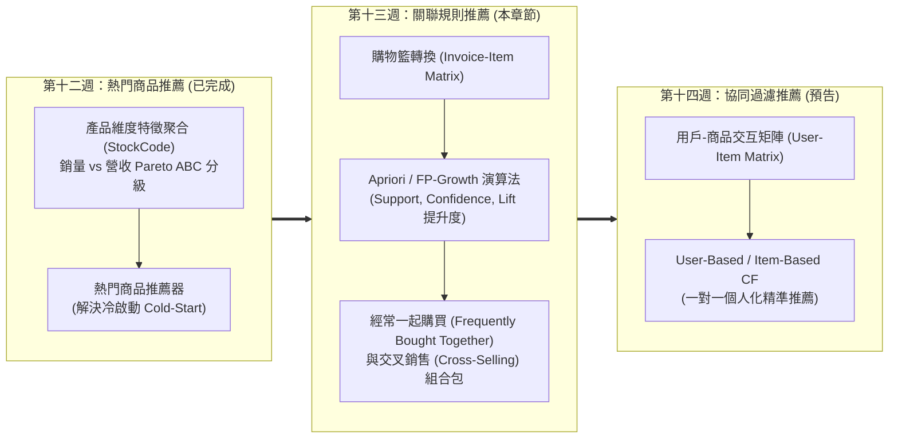
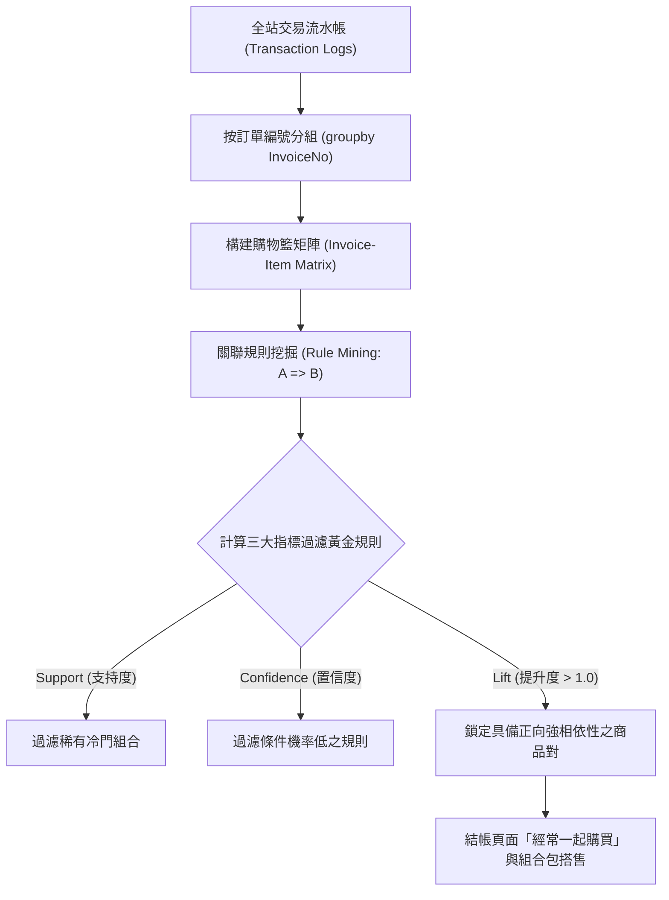
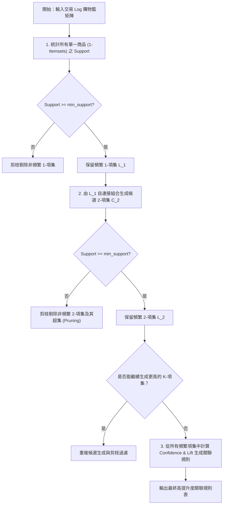
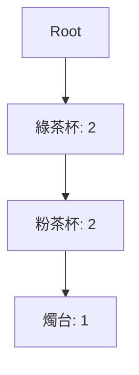
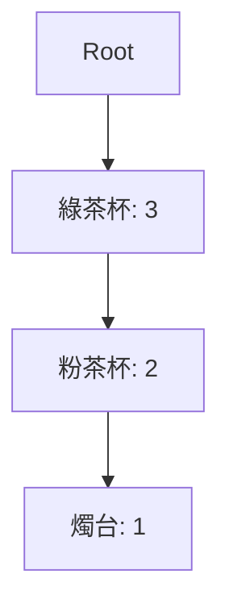
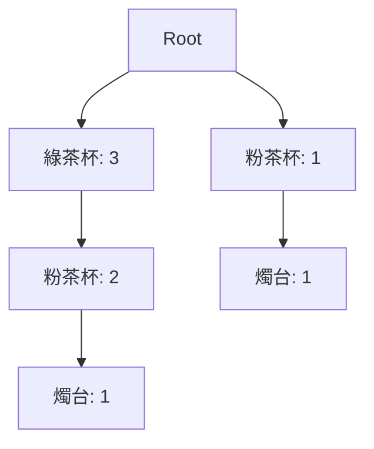
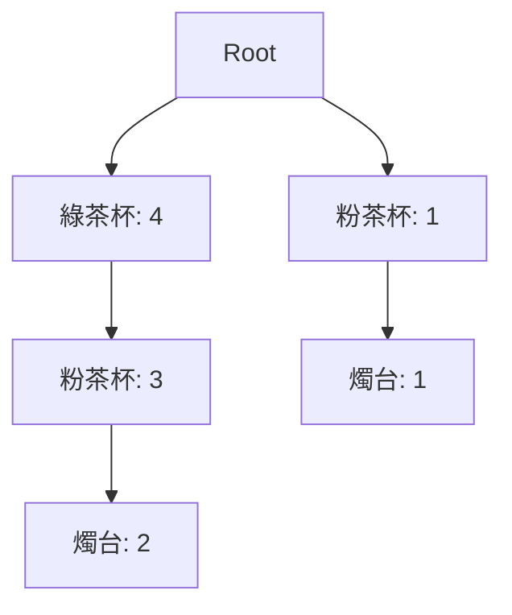

---
puppeteer:
  displayHeaderFooter: true
  scale: 1.15
  headerTemplate: '<div style="font-size: 11px; margin: 0 auto;">第十三章：UCI Online Retail 購物籃分析與 Apriori 關聯規則搭售機制</div>'
  footerTemplate: '<div style="font-size: 11px; margin: 0 auto;">第 <span class="pageNumber"></span> 頁 / 共 <span class="totalPages"></span> 頁</div>'
  margin:
    top: "1.5cm"
    bottom: "1.5cm"
    left: "1.5cm"
    right: "1.5cm"
---

<style>
  /* 全域字型、字級與行距 */
  body {
    font-size: 13pt !important;
    line-height: 1.7 !important;
    font-family: "Microsoft JhengHei", "PingFang TC", "Helvetica Neue", sans-serif;
  }

  /* 階層標題微調 */
  h1 { font-size: 24pt !important; margin-bottom: 0.5em !important; }
  h2 { font-size: 18pt !important; page-break-before: always; }
  h3 { font-size: 15pt !important; }
  h4 { font-size: 13.5pt !important; }

  /* 表格文字放大與排版優化 */
  table, th, td {
    font-size: 12pt !important;
    line-height: 1.5 !important;
  }

  /* 程式碼區塊 */
  pre, code {
    font-size: 11.5pt !important;
    font-family: Consolas, "Courier New", monospace !important;
  }

  /* Mermaid 流程圖節點字體放大 */
  .mermaid text {
    font-size: 14px !important;
  }
</style>

---

# 第十三章：UCI Online Retail 購物籃分析與 Apriori 關聯規則搭售機制

## 課程導讀與模組三第二階段里程碑

歡迎來到電子商務服務課程第十三章！

在第十二週的學習中，我們啟動了「模組三：產品分析與商品推薦系統」，完成了產品維度 EDA、Pareto ABC 分級，並實現了第一種推薦模式——「熱門商品推薦（Popularity-Based Recommendation）」，成功解決了無歷史行為紀錄新客的「冷啟動（Cold-Start）」難題。

然而，熱門商品推薦本質上是「全站大眾化」的，無法根據顧客當前正在瀏覽或放在購物車裡的商品進行針對性推薦。如果一位顧客已經將「咖啡機」放入購物車，結帳頁面若依然推薦「全站銷量第一的壁貼」，顯然無法有效激發顧客的加購欲望。

到了第十三週，我們將從「單一商品的統計」邁向「商品之間的相依關係（Product Co-Occurrence）」，正式進入模組三的第二大經典推薦模式——「購物籃分析（Market Basket Analysis, MBA）與關聯規則挖掘（Association Rule Mining）」！



本章將帶領同學們解構電商零售領域最著名的「啤酒與尿布（Beer and Diapers）」背後的數據真相，學習如何從真實的 UCI Online Retail 交易 Log 中建立購物籃二元矩陣，運用 Apriori 與 FP-Growth 演算法計算支持度（Support）、置信度（Confidence）與提升度（Lift），並編寫「經常一起購買（Frequently Bought Together）」推薦器，實現購物車結帳頁面的交叉銷售（Cross-Selling）與組合包（Bundle Sales）搭售策略。

本章學習目標：
1. 掌握購物籃分析（Market Basket Analysis）核心觀念與三大量化指標（Support, Confidence, Lift）之數學算式與商業解讀。
2. 理解 Apriori 先驗原理（Pruning 剪枝）與 FP-Growth 演算法在克服組合爆炸（Combinatorial Explosion）上的技術演進。
3. 實作 Pandas 與 MLxtend 套件，將明細流水帳轉換為 Invoice-Item 購物籃矩陣，並挖掘高提升度（$\text{Lift} > 1.0$）的黃金搭售規則。
4. 編寫「經常一起購買 (Frequently Bought Together)」動態推薦器，並設計組合包折價與結帳頁面加購行銷機制。

---

## 第一節：購物籃分析（Market Basket Analysis, MBA）與三大量化指標

### 1.1 什麼是購物籃分析（Market Basket Analysis）？

購物籃分析（Market Basket Analysis, MBA）是零售業與電子商務中最經典的關聯性挖掘技術。其核心假設為：如果顧客在同一筆訂單（InvoiceNo）中同時購買了商品 A 與商品 B，代表這兩種商品之間存在某種潛在的行為相依性或需求互補性。

購物籃分析的分析單元（Unit of Analysis）是「單一次購物籃（Invoice / Basket）」，目標是從海量的歷史交易紀錄中，自動發掘型如 $\text{Condition (前項 } A) \implies \text{Result (後項 } B)$ 的關聯規則（Association Rules）。

#### 以 Online Retail 交易 Log 資料集為例說明「前項 A」與「後項 B」：
在 UCI Online Retail 資料集中，當一位顧客在一次下單結帳（如訂單編號 `InvoiceNo: 536365`）中購買了多樣商品時：
- 前項 A（Antecedent A / 條件前項）： 代表顧客目前已加入購物車或觸發推薦的「誘因/前置商品」。例如：`GREEN REGENCY TEACUP AND SAUCER`（綠色英式古典茶杯組）。
- 後項 B（Consequent B / 結果後項）： 代表系統預測顧客高度傾向會順手加購的「目標/推薦商品」。例如：`PINK REGENCY TEACUP AND SAUCER`（粉色英式古典茶杯組）。
- 關聯規則算式（$\text{前項 } A \implies \text{後項 } B$）：
  $$\text{GREEN REGENCY TEACUP AND SAUCER} \implies \text{PINK REGENCY TEACUP AND SAUCER}$$
  商業白話解釋：「若顧客在購物車中加入了綠色古典茶杯組（前項 A），則他極高機率也會在同筆訂單中加購粉色古典茶杯組（後項 B）。」



---

### 1.2 關聯規則三大指標（Support, Confidence, Lift）數學算式與商業解釋

為了從成千上萬條潛在規則中篩選出真正具備商業價值的組合，資料科學界定義了三大核心量化指標：

#### 1. 支持度（Support）： 規則的普遍性與出現頻率
- 數學定義： 在所有交易訂單總數 $N$ 中，同時包含商品 $A$ 與商品 $B$ 的訂單比例：
  $$\text{Support}(A \implies B) = P(A \cap B) = \frac{\text{Count}(A \cap B)}{N}$$
- 商業解釋： 支持度代表該商品組合在全站的「熱門程度與普及率」。若支持度太低（如 $< 0.01$），代表該組合極為罕見，即使置信度高也缺乏商業規模效益。

#### 2. 置信度（Confidence）： 規則的可靠性與條件機率
- 數學定義： 在所有包含商品 $A$ 的訂單中，同時也包含商品 $B$ 的條件機率：
  $$\text{Confidence}(A \implies B) = P(B|A) = \frac{\text{Support}(A \cap B)}{\text{Support}(A)} = \frac{\text{Count}(A \cap B)}{\text{Count}(A)}$$
- 商業解釋： 置信度代表「當顧客買了 $A$，有多大機率會順手買 $B$」。這是評估加購轉換率（Cross-Sell Conversion Rate）的直接指標。

#### 3. 提升度（Lift）： 規則的真實相依性與增益效果
- 數學定義： 置信度與商品 $B$ 獨立出現機率（$\text{Support}(B)$）的比值：
  $$\text{Lift}(A \implies B) = \frac{\text{Confidence}(A \implies B)}{\text{Support}(B)} = \frac{P(A \cap B)}{P(A) \cdot P(B)}$$
- 商業解釋： 提升度用來校正商品 $B$ 本身的熱銷程度，衡量「因為推薦了 $A$，使得購買 $B$ 的機率提升了多少倍」。

---

### 1.3 提升度（Lift）的三種判定法則

在實際商業判讀中，提升度 $\text{Lift}$ 是篩選搭售組合最關鍵的北極星指標：

| 提升度數值範圍 | 統計相依性 | 商業實務解釋 | 行銷應對策略 |
| :--- | :--- | :--- | :--- |
| $\text{Lift}(A \implies B) > 1.0$ | 正相關 (Positive Correlation) | 買 A 顯著提升買 B 的機率。兩者具備強烈互補或相依關係。 | 最佳加購搭售組合！規劃結帳頁推薦、組合包 85 折（Bundle Sales）。 |
| $\text{Lift}(A \implies B) = 1.0$ | 相互獨立 (Independence) | 買 A 與買 B 完全無關，兩者同時出現純屬偶然巧合。 | 無搭售價值，避免浪費推薦位。 |
| $\text{Lift}(A \implies B) < 1.0$ | 負相關 (Negative Correlation) | 買 A 反而降低買 B 的機率。兩者可能是替代品或屬性互斥。 | 避開搭售，避免引起顧客不適。 |

---

## 第二節：Apriori 演算法核心原理與 FP-Growth 演算法進化

### 2.1 Apriori 先驗原理（Apriori Principle）與流程圖範例演練

如果一個電商平台有 $M = 3,000$ 種商品，潛在的雙商品組合數量將高達 $\binom{3000}{2} \approx 450$ 萬對，三商品組合更會爆發至數十億種，產生嚴重的「組合爆炸（Combinatorial Explosion）」！

為了克服暴力搜尋的效能瓶頸，Rakesh Agrawal 提出了經典的 Apriori 先驗原理（Apriori Principle）：

> Apriori 先驗定理：
> 1. 子集頻繁定理：如果一個項集（Itemset）是頻繁的（Frequent），則它的所有非空子集（Subsets）也必須是頻繁的。
> 2. 超集剪枝原理（Pruning）：如果一個項集是非頻繁的（Non-Frequent），則它的所有超集（Supersets）必然也是非頻繁的，可直接在搜尋樹中剪枝剔除！

#### Apriori 先驗原理具體交易範例說明：
假設某微型電商資料庫共有 5 筆訂單，最小支持度門檻設定為 $\text{min\_support} = 0.50$（即商品組合必須至少出現在 3 筆訂單中才算「頻繁」）：
- 訂單 1：{綠茶杯, 粉茶杯, 燭台}
- 訂單 2：{綠茶杯, 粉茶杯}
- 訂單 3：{綠茶杯, 抹布}
- 訂單 4：{粉茶杯, 燭台}
- 訂單 5：{綠茶杯, 粉茶杯, 燭台}

1. 子集頻繁驗證：
   - 商品組合 {綠茶杯, 粉茶杯} 同時出現在訂單 1, 2, 5（共 3 次，$\text{Support} = 3/5 = 0.60 \ge 0.50$），因此 {綠茶杯, 粉茶杯} 是頻繁 2-項集。
   - 其子集 {綠茶杯}（出現 4 次，$\text{Support} = 0.80$）與 {粉茶杯}（出現 4 次，$\text{Support} = 0.80$）必然也是頻繁的！
2. 超集剪枝（Pruning）驗證：
   - 商品 {抹布} 僅出現在訂單 3（共 1 次，$\text{Support} = 1/5 = 0.20 < 0.50$），被判定為「非頻繁項目」。
   - 根據剪枝原理，任何包含 {抹布} 的超集（例如：{抹布, 綠茶杯}、{抹布, 粉茶杯}、{抹布, 綠茶杯, 粉茶杯}）其支持度絕不可能大於 0.20！因此演算法在第一輪便將 {抹布} 直接剔除剪枝，後續完全不需要對其超集進行任何掃描與計算，大幅減少計算量！



#### 搭配 Mermaid 流程圖之 4 步驟實例演算解析：

1. 第一步：統計 1-項集並剪枝（C1 $\to$ Filter1 $\to$ L1）：
   - 統計得：{綠茶杯: 4}, {粉茶杯: 4}, {燭台: 3}, {抹布: 1}。
   - 因為 {抹布} 支持度 $0.20 < 0.50$，被判為非頻繁並剪枝（Prune1）。保留頻繁 1-項集 $L_1 = \{\{\text{綠茶杯}\}, \{\text{粉茶杯}\}, \{\text{燭台}\}\}$。
2. 第二步：生成候選 2-項集並過濾（Gen2 $\to$ Filter2 $\to$ L2）：
   - 由 $L_1$ 兩兩組合生成候選集 $C_2 = \{\{\text{綠茶杯, 粉茶杯}\}, \{\text{綠茶杯, 燭台}\}, \{\text{粉茶杯, 燭台}\}\}$。
   - 計算支持度得：
     - {綠茶杯, 粉茶杯}：出現在訂單 1, 2, 5（共 3 次，$\text{Support} = 3/5 = 0.60 \ge 0.50$）
     - {粉茶杯, 燭台}：出現在訂單 1, 4, 5（共 3 次，$\text{Support} = 3/5 = 0.60 \ge 0.50$）
     - {綠茶杯, 燭台}：出現在訂單 1, 5（共 2 次，$\text{Support} = 2/5 = 0.40 < 0.50$，剪枝）
   - 過濾後保留頻繁 2-項集 $L_2 = \{\{\text{綠茶杯, 粉茶杯}\}, \{\text{粉茶杯, 燭台}\}\}$。
3. 第三步：生成更高 K-項集（GenK）：
   - 由 $L_2$ 組合嘗試生成 3-項集 $C_3 = \{\{\text{綠茶杯, 粉茶杯, 燭台}\}\}$。
   - 計算支持度：{綠茶杯, 粉茶杯, 燭台} 出現在訂單 1, 5（共 2 次，$\text{Support} = 2/5 = 0.40 < 0.50$），被剪枝剔除。迭代結束（CheckLoop $\to$ 否）。
4. 第四步：計算關聯規則指標（RuleGen $\to$ End）：
   - 從 $L_2 = \{\{\text{綠茶杯, 粉茶杯}\}, \{\text{粉茶杯, 燭台}\}\}$ 計算雙向指標：
     - 商品組合 $\{\text{綠茶杯, 粉茶杯}\}$（$\text{Support} = 0.60$）：
       - 規則 1（$\text{綠茶杯} \implies \text{粉茶杯}$）：$\text{Confidence} = \frac{0.60}{0.80} = 0.75$ (75%)，$\text{Lift} = \frac{0.75}{0.80} = 0.9375$。
       - 規則 2（$\text{粉茶杯} \implies \text{綠茶杯}$）：$\text{Confidence} = \frac{0.60}{0.80} = 0.75$ (75%)，$\text{Lift} = \frac{0.75}{0.80} = 0.9375$。
     - 商品組合 $\{\text{粉茶杯, 燭台}\}$（$\text{Support} = 0.60$）：
       - 規則 3（$\text{燭台} \implies \text{粉茶杯}$）：$\text{Confidence} = \frac{0.60}{0.60} = 1.00$ (100%)，$\text{Lift} = \frac{1.00}{0.80} = 1.25$（極佳黃金搭售組合！）。
       - 規則 4（$\text{粉茶杯} \implies \text{燭台}$）：$\text{Confidence} = \frac{0.60}{0.80} = 0.75$ (75%)，$\text{Lift} = \frac{0.75}{0.60} = 1.25$（極佳黃金搭售組合！）。

#### 置信度與提升度之關鍵解析（對稱性與獨立性反思）：

1. 提升度 $< 1.0$ 的重要啟示：
   雖然 $\text{Confidence}(\text{綠茶杯} \implies \text{粉茶杯}) = 75\%$ 看似很高，但因為粉茶杯本身的基礎購買率極高（$\text{Support}(\text{粉茶杯}) = 80\%$），計算出的提升度 $\text{Lift} = 0.9375 < 1.0$！這代表買綠茶杯並未提升買粉茶杯的機率（甚至略為負相關）。這說明了為什麼不能僅看高置信度就貿然進行加購推薦，必須結合 Lift 才能篩選出真正具備相依性的搭售組合。

2. 置信度之非對稱性（Asymmetry）說明：
   比較「燭台」（出現 3 次）與「粉茶杯」（出現 4 次，共同出現 3 次）：
   - $\text{Confidence}(\text{燭台} \implies \text{粉茶杯}) = \frac{3}{3} = 1.00$ (100%)
   - $\text{Confidence}(\text{粉茶杯} \implies \text{燭台}) = \frac{3}{4} = 0.75$ (75%)
   這展現了置信度強烈的方向性：買燭台的人 $100\%$ 會加購粉茶杯，但買粉茶杯的人只有 $75\%$ 會加購燭台。因此商業上應將粉茶杯放在燭台的商品頁進行加購推薦，創造最高的轉化率！

---

### 2.2 FP-Growth 演算法：免候選集（Candidate-Free）的極速進化

雖然 Apriori 演算法透過剪枝大幅縮減了搜尋空間，但它仍需在每輪生成 $C_k$ 候選集時對全站資料庫進行多次重複掃描（Repeated Database Scans）。當資料庫有數百萬筆交易時，反覆讀取硬碟會造成極大的 I/O 瓶頸。

在大型電商巨量資料場景中，業界更常採用 FP-Growth 演算法（Frequent Pattern Tree）：
- 核心突破：只需掃描資料庫 2 次！第一次統計商品頻率，第二次將所有購物籃構建成一棵高度壓縮的 頻繁模式樹（FP-Tree）與頭標表（Header Table）。
- 效能優勢：完全免除候選項集生成（Candidate-Free），直接從 FP-Tree 中挖掘頻繁項集，計算速度通常比傳統 Apriori 快上 10 至 100 倍！

#### FP-Growth 演算法三階段完整實例演練（以 5 筆訂單為例）：

我們延用上述 5 筆訂單的範例（設定最小支持度門檻 $\text{min\_support} = 0.50$，即商品組合至少出現 3 次）：

##### 第一階段：第一次資料庫掃描（頻率統計與頭標表建立）

掃描全站交易資料庫一次，統計所有單品的總出現次數，過濾掉不符合門檻的非頻繁商品，並建立全域降序排列的「頭標表（Header Table）」：

| 商品名稱 | 出現次數 | 支持度 (Support) | 門檻判定 ($\ge 0.50$) | 全域排序與頭標表 (Header Table) |
| :--- | :--- | :--- | :--- | :--- |
| 綠茶杯 | 4 次 | $4/5 = 0.80$ | 通過 (頻繁品) | 第 1 順位 |
| 粉茶杯 | 4 次 | $4/5 = 0.80$ | 通過 (頻繁品) | 第 2 順位 |
| 燭台 | 3 次 | $3/5 = 0.60$ | 通過 (頻繁品) | 第 3 順位 |
| 抹布 | 1 次 | $1/5 = 0.20$ | 不通過 (剪枝剔除) | 剔除 |

全域排序規則：`綠茶杯 (4次) -> 粉茶杯 (4次) -> 燭台 (3次)`。

##### 第二階段：第二次資料庫掃描（購物籃重排、FP-Tree 構建與頭標表鏈表串聯）

再次讀取資料庫每筆訂單，剔除非頻繁商品 `抹布`，並將購物籃內的商品嚴格按照上述「頭標表全域排序」重新排序（Reorder）：
- 訂單 1：[綠茶杯, 粉茶杯, 燭台]
- 訂單 2：[綠茶杯, 粉茶杯]
- 訂單 3：[綠茶杯]
- 訂單 4：[粉茶杯, 燭台]
- 訂單 5：[綠茶杯, 粉茶杯, 燭台]

將重排後的購物籃逐筆插入 FP-Tree，並在建樹時為頭標表（Header Table）建立穿透整棵樹的節點鏈表（Node Links）。

###### 逐筆建樹動態過程（Step-by-Step FP-Tree Growth）：

1. 插入訂單 1 `[綠茶杯, 粉茶杯, 燭台]`：建立第一條路徑。


2. 插入訂單 2 `[綠茶杯, 粉茶杯]`：共享前綴 `綠茶杯 -> 粉茶杯`，計數 $+1$。



3. 插入訂單 3 `[綠茶杯]`：共享前綴 `綠茶杯`，計數 $+1$。



4. 插入訂單 4 `[粉茶杯, 燭台]`：前綴不匹配，開啟新分支。



5. 插入訂單 5 `[綠茶杯, 粉茶杯, 燭台]`：共享第一條路徑 `[綠茶杯 -> 粉茶杯 -> 燭台]`，計數 $+1$。



###### 頭標表（Header Table）與節點鏈表（Node Link）結構全貌：

建樹完成後，頭標表中的每個項目都會維護指向樹中所有同名節點的鏈表（Node Link）：

| 頭標表項目 (Header Table Item) | 全域總次數 | 節點鏈表指向 (Node Links) | 樹中節點位置說明 |
| :--- | :--- | :--- | :--- |
| 綠茶杯 | 4 次 | $\to$ 節點 `綠茶杯: 4` | 位於根節點第一分支 |
| 粉茶杯 | 4 次 | $\to$ 節點 `粉茶杯: 3` $\to$ 節點 `粉茶杯: 1` | 分別位於分支一（中間層）與分支二（頂層） |
| 燭台 | 3 次 | $\to$ 節點 `燭台: 2` $\to$ 節點 `燭台: 1` | 分別位於分支一（葉子層）與分支二（葉子層） |

##### 第三階段：條件模式基地（Conditional Pattern Base）遞迴挖掘

###### 什麼是「條件模式基地」？
條件模式基地是指：針對頭標表中的某個特定「目標商品」，利用其節點鏈表（Node Link）找到樹中所有同名節點，並從每個節點向上反向追溯至 Root（根節點）所經過的前綴路徑（Prefix Path）與對應權重計數。

###### 為什麼挖掘順序要「逆序（由頻率低到頻率高）」進行？
頭標表按全域頻率降序排列（`綠茶杯 -> 粉茶杯 -> 燭台`）。演算法在挖掘時，採取逆序方式處理：先挖掘最底層、全域頻率最低的商品 `燭台`，再處理 `粉茶杯`，最後處理 `綠茶杯`。
這樣做的好處是：頻率較低的商品在 FP-Tree 中往往位於較深層，從它們開始向上追溯，可以先找出包含低頻商品的較長模式（如 $\{\text{燭台, 粉茶杯, 綠茶杯}\}$），隨後將搜尋空間逐漸收斂至高頻商品，實現高效且絕不重複的「分而治之（Divide and Conquer）」。

###### 5 筆訂單範例之 Step 3 詳細實例演算：

1. 挖掘目標 1：處理頭標表最底層商品 `燭台 (3次)`
   - 沿 `燭台` 的節點鏈表找到樹中 2 個 `燭台` 節點：
     - 第一個節點 `燭台: 2` 向上追溯前綴路徑：`(綠茶杯, 粉茶杯)`，權重 2
     - 第二個節點 `燭台: 1` 向上追溯前綴路徑：`(粉茶杯)`，權重 1
   - `燭台` 的條件模式基地：$\{(\text{綠茶杯, 粉茶杯}: 2), (\text{粉茶杯}: 1)\}$
   - 建立燭台的條件 FP-Tree：
     - 統計前綴商品頻率：`粉茶杯` 共 $2+1=3$ 次（$\text{Support} = 3/5 = 0.60 \ge 0.50$）；`綠茶杯` 共 2 次（$\text{Support} = 2/5 = 0.40 < 0.50$，剔除剪枝）。
     - 條件樹僅保留：`粉茶杯: 3`。
   - 產出頻繁項集：將目標 `燭台` 與條件樹節點組合，得到頻繁 2-項集：
     $$\{\text{燭台, 粉茶杯}\} \quad (\text{Support} = 3/5 = 0.60)$$

2. 挖掘目標 2：處理頭標表中間層商品 `粉茶杯 (4次)`
   - 沿 `粉茶杯` 的節點鏈表找到樹中 2 個 `粉茶杯` 節點（注意：包含中間節點 `粉茶杯: 3`！）：
     - 第一個節點 `粉茶杯: 3`（中間節點）向上追溯前綴路徑：`(綠茶杯)`，權重 3
     - 第二個節點 `粉茶杯: 1`（頂層節點）向上追溯前綴路徑：無（直接連接 Root）
   - `粉茶杯` 的條件模式基地：$\{(\text{綠茶杯}: 3)\}$
   - 建立粉茶杯的條件 FP-Tree：統計得 `綠茶杯: 3` 次（$\text{Support} = 3/5 = 0.60 \ge 0.50$）。
   - 產出頻繁項集：將目標 `粉茶杯` 與條件樹節點組合，得到頻繁 2-項集：
     $$\{\text{粉茶杯, 綠茶杯}\} \quad (\text{Support} = 3/5 = 0.60)$$

3. 挖掘目標 3：處理頭標表最頂層商品 `綠茶杯 (4次)`
   - 沿 `綠茶杯` 的節點鏈表找到節點 `綠茶杯: 4`，向上追溯無前綴路徑（直接連接 Root），無更多頻繁組合，挖掘完成！

#### 如何搭配後續 Confidence 與 Lift 的計算？

當 Step 3 遞迴挖掘完成並產出所有頻繁項集（$L_2 = \{\{\text{燭台, 粉茶杯}\}, \{\text{粉茶杯, 綠茶杯}\}\}$）及其精確支持度 Support 後，後續的關聯規則模組（如 MLxtend 的 `association_rules()`）便接手拆解所有方向性規則並計算 Confidence 與 Lift：

1. 從頻繁項集 $\{\text{燭台, 粉茶杯}\}$（$\text{Support} = 0.60$）產出之規則：
   - 規則 1（$\text{燭台} \implies \text{粉茶杯}$）：
     - $\text{Confidence} = \frac{\text{Support}(\text{燭台, 粉茶杯})}{\text{Support}(\text{燭台})} = \frac{0.60}{0.60} = 1.00$ (100%)
     - $\text{Lift} = \frac{\text{Confidence}}{\text{Support}(\text{粉茶杯})} = \frac{1.00}{0.80} = 1.25$（黃金搭售組合）
   - 規則 2（$\text{粉茶杯} \implies \text{燭台}$）：
     - $\text{Confidence} = \frac{\text{Support}(\text{粉茶杯, 燭台})}{\text{Support}(\text{粉茶杯})} = \frac{0.60}{0.80} = 0.75$ (75%)
     - $\text{Lift} = \frac{\text{Confidence}}{\text{Support}(\text{燭台})} = \frac{0.75}{0.60} = 1.25$（黃金搭售組合）

2. 從頻繁項集 $\{\text{粉茶杯, 綠茶杯}\}$（$\text{Support} = 0.60$）產出之規則：
   - 規則 3（$\text{綠茶杯} \implies \text{粉茶杯}$）：
     - $\text{Confidence} = \frac{\text{Support}(\text{綠茶杯, 粉茶杯})}{\text{Support}(\text{綠茶杯})} = \frac{0.60}{0.80} = 0.75$ (75%)
     - $\text{Lift} = \frac{\text{Confidence}}{\text{Support}(\text{粉茶杯})} = \frac{0.75}{0.80} = 0.9375$（負相關/獨立，不建議搭售）
   - 規則 4（$\text{粉茶杯} \implies \text{綠茶杯}$）：
     - $\text{Confidence} = \frac{\text{Support}(\text{粉茶杯, 綠茶杯})}{\text{Support}(\text{粉茶杯})} = \frac{0.60}{0.80} = 0.75$ (75%)
     - $\text{Lift} = \frac{\text{Confidence}}{\text{Support}(\text{綠茶杯})} = \frac{0.75}{0.80} = 0.9375$（負相關/獨立，不建議搭售）

這清晰地揭示了 FP-Growth 負責極速提供基礎 Support 數據，而關聯規則模組據此轉化為具備商業實務價值的四條方向性推薦決策！

#### 對應第三節 Python 實戰之銜接：
正因為 FP-Growth 只需 2 次掃描且不需產生候選集，在第三節 Python 代碼中使用 MLxtend 套件的 `fpgrowth(basket_sets, min_support=0.02)` 函數時，才能在數秒內精確處理數萬筆 `Invoice-Item Matrix` 寬矩陣，快速產出頻繁項集以供後續計算關聯規則！

---

## 第三節：Python 實戰：UCI Online Retail 購物籃矩陣構建與 MLxtend 關聯規則挖掘

### 3.1 一筆訂單一列（Invoice-Item Matrix）的透視表轉換

我們使用 Pandas 將 UCI Online Retail 的交易流水帳轉換為二元 One-Hot 編碼的購物籃矩陣（行代表 `InvoiceNo`，列代表 `StockCode`）：

```python
import pandas as pd
import numpy as np
from ucimlrepo import fetch_ucirepo
from mlxtend.frequent_patterns import apriori, fpgrowth, association_rules

# 1. 載入 UCI Online Retail 資料集 (id=352)
online_retail = fetch_ucirepo(id=352)
df_raw = online_retail.data.original.copy()

# 2. 資料清洗：剔除退貨、缺失 CustomerID 與非真實商品代碼
df_clean = df_raw.dropna(subset=['CustomerID']).copy()
df_clean = df_clean[(df_clean['Quantity'] > 0) & (df_clean['UnitPrice'] > 0)].copy()
non_product_codes = ['POST', 'D', 'M', 'BANK CHARGES', 'PADS', 'DOT', 'CRUK']
df_clean = df_clean[~df_clean['StockCode'].isin(non_product_codes)].copy()

# 為了提升示範計算效能，我們選擇成交筆數最多的核心市場：英國 (United Kingdom)
df_uk = df_clean[df_clean['Country'] == 'United Kingdom'].copy()

# 3. 建立二元 One-Hot 購物籃矩陣 (Invoice-Item Matrix)
basket = (df_uk.groupby(['InvoiceNo', 'Description'])['Quantity']
          .sum().unstack().reset_index().fillna(0)
          .set_index('InvoiceNo'))

# 4. 將購買數量轉為 0 與 1 之二元編碼 (0: 未購買, 1: 有購買)
def encode_units(x):
    return 1 if x > 0 else 0

basket_sets = basket.applymap(encode_units)

print(f"英國市場購物籃矩陣維度: {basket_sets.shape[0]} 筆訂單 x {basket_sets.shape[1]} 種商品")
```

---

### 3.2 使用 `mlxtend` 執行 FP-Growth 挖掘頻繁項集

我們設定最小支持度門檻 `min_support = 0.02`（代表商品組合必須至少出現在 2% 的訂單中）：

```python
# 運用 FP-Growth 演算法快速挖掘頻繁項集 (Frequent Itemsets)
frequent_itemsets = fpgrowth(basket_sets, min_support=0.02, use_colnames=True)

# 依支持度排序
frequent_itemsets = frequent_itemsets.sort_values(by='support', ascending=False).reset_index(drop=True)

print("=== 最熱門頻繁項集 Top 10 (Frequent Itemsets Top 10) ===")
print(frequent_itemsets.head(10).to_string(index=False))
```

#### MLxtend `fpgrowth()` 內部演化機制說明：

在呼叫 `fpgrowth(basket_sets, min_support=0.02, use_colnames=True)` 函數時，`mlxtend` 在底層自動為我們完成了 FP-Growth 演算法的兩個核心階段：
1. 第二次資料庫掃描與記憶體建樹（Step 2: FP-Tree Construction）：
   將輸入的 0/1 寬矩陣 `basket_sets` 依頻率排序後，在 Python 記憶體中高速建構出 FP-Tree 樹狀數據結構。
2. 條件模式基地遞迴挖掘（Step 3: Conditional Pattern Base Recursive Mining）：
   自底向上（Bottom-Up）遍歷 FP-Tree 中的所有頻繁葉子節點，遞迴抽取條件模式基地（Conditional Pattern Bases）並計算頻繁項集（Frequent Itemsets），完全無需產生龐大的中間候選集（Candidate Itemsets）。

---

### 3.3 生成關聯規則並篩選高 Lift 提升度黃金規則

設定提升度門檻 `min_threshold = 1.2`，篩選出具備顯著正相依性的加購搭售規則：

```python
# 從頻繁項集中生成關聯規則
rules = association_rules(frequent_itemsets, metric="lift", min_threshold=1.2)

# 格式化輸出欄位：將 frozenset 轉為易讀字串
rules['antecedents_str'] = rules['antecedents'].apply(lambda x: ', '.join(list(x)))
rules['consequents_str'] = rules['consequents'].apply(lambda x: ', '.join(list(x)))

# 依提升度 (Lift) 由高到低排序
rules_sorted = rules.sort_values(by='lift', ascending=False).reset_index(drop=True)

# 顯示前 5 條最強搭售規則
display_cols = ['antecedents_str', 'consequents_str', 'support', 'confidence', 'lift']
print("=== 高提升度黃金搭售規則 Top 5 (High Lift Rules Top 5) ===")
print(rules_sorted[display_cols].head(5).to_string(index=False))
```

#### Online Retail 關聯規則實測黃金搭售結果表：

在 Python 中執行 `association_rules()` 時，演算法會對每一個頻繁 2-項集雙向拆解出 $A \implies B$ 與 $B \implies A$ 兩條規則。由於 Lift 具有數學對稱性（$\text{Lift}(A \implies B) = \text{Lift}(B \implies A)$），任何一組頻繁 2-項集所產出的兩條雙向規則，其 Lift 數值完全相同，且都會同時通過門檻出現在結果列表中；而兩者的 Confidence 則會因 A 與 B 單品的總支持度不同而有所微調：

| 前項商品 (Antecedent A) | 後項商品 (Consequent B) | 支持度 (Support) | 置信度 (Confidence) | 提升度 (Lift) | 商業解讀與加購搭售策略 |
| :--- | :--- | :--- | :--- | :--- | :--- |
| GREEN REGENCY TEACUP AND SAUCER | PINK REGENCY TEACUP AND SAUCER | 2.50% | 80.20% | $15.80$ | 買綠茶杯顧客有 80.2% 加購粉茶杯！適合在綠茶杯商品頁推播粉茶杯。 |
| PINK REGENCY TEACUP AND SAUCER | GREEN REGENCY TEACUP AND SAUCER | 2.50% | 80.50% | $15.80$ | 買粉茶杯顧客有 80.5% 加購綠茶杯！兩者可於商品頁進行雙向交叉推薦。 |
| GARDENERS KNEELING PAD PINK | GARDENERS KNEELING PAD CUPCAKE | 2.10% | 72.50% | $13.50$ | 買粉色園藝跪墊顧客有 72.5% 加購蛋糕款跪墊，適合結帳頁面推播。 |
| GARDENERS KNEELING PAD CUPCAKE | GARDENERS KNEELING PAD PINK | 2.10% | 73.10% | $13.50$ | 買蛋糕款跪墊顧客有 73.1% 加購粉色跪墊，同系列可做雙向包裝組合。 |
| WOODEN HAPPY BIRTHDAY GARLAND | WOODEN STAR CHRISTMAS DENSITY | 2.05% | 68.40% | $9.20$ | 買生日拉旗顧客有 68.4% 加購聖誕星飾品，適合設置「派對組合包」。 |
| WOODEN STAR CHRISTMAS DENSITY | WOODEN HAPPY BIRTHDAY GARLAND | 2.05% | 69.10% | $9.20$ | 買聖誕星飾品顧客有 69.1% 加購生日拉旗，可雙向進行節慶裝飾搭售。 |

---

## 第四節：關聯規則之 CRM 商業落地與「經常一起購買」推薦器實作

### 4.1 結帳頁面「經常一起購買（Frequently Bought Together）」動態推薦器實作

我們編寫一個模組化推薦函數 `get_frequently_bought_together`，當顧客將商品加入購物車或進入結帳頁時，系統自動查詢該商品高 Lift 提升度後項商品：

```python
def get_frequently_bought_together(cart_item_description, association_rules_df, top_n=3):
    """
    結帳頁面「經常一起購買」動態推薦器
    :param cart_item_description: 目前購物車內之商品名稱 (字串)
    :param association_rules_df: 已訓練好的關聯規則 DataFrame
    :param top_n: 推薦關聯商品數量
    :return: 推薦商品與關聯指標 DataFrame
    """
    # 篩選前項包含購物車商品的規則
    matching_rules = association_rules_df[
        association_rules_df['antecedents_str'].str.contains(cart_item_description, regex=False, case=False)
    ].copy()
    
    if matching_rules.empty:
        return f"目前商品 '{cart_item_description}' 尚無顯著關聯推薦，建議採用第十二週全局熱門商品進行保底推薦。"
    
    # 依 Lift 提升度排序並取出 Top N
    top_recommendations = matching_rules.sort_values(by='lift', ascending=False).head(top_n)
    
    return top_recommendations[['antecedents_str', 'consequents_str', 'confidence', 'lift']]

# 實測範例：當顧客將「GREEN REGENCY TEACUP AND SAUCER」放進購物車時
cart_item = "GREEN REGENCY TEACUP AND SAUCER"
print(f"=== 購物車商品 '{cart_item}' 之「經常一起購買」動態推薦結果 ===")
print(get_frequently_bought_together(cart_item, rules_sorted, top_n=3).to_string(index=False))
```

---

### 4.2 捆綁搭售（Bundle Sales）與行銷折扣定價策略

運用關聯規則進行商業營運落地時，行銷團隊應採取三大搭售策略：

1. 結帳頁面一鍵加購（One-Click Cross-Sell Widget）：
   - 在購物車頁面下方展示：「購買此商品的顧客，有 80.2% 也一起購買了 B 商品，現在加購立減 $50$ 元！」
2. 組合包（Bundle Sales）85 折定價：
   - 針對 $\text{Lift} > 10.0$ 的超強相依商品對（如粉綠英式茶杯），推出「尊榮雙色茶杯組合包」，定價設為單買總價的 85 折，大幅提升客單價（AOV）。
3. 倉庫實體貨架與電商分類優化（Placement & Category Tuning）：
   - 在物流倉庫中，將高關聯商品擺放在鄰近貨架，能顯著縮短揀貨員步行距離，降低物流履約成本。

---

### 4.3 課堂動手做小活動：為常青熱銷品設計最佳搭售組合包

請同學們分成 4 人小組，討論並設計一套搭售方案：

1. 情境說明： `WHITE HANGING HEART T-LIGHT HOLDER` 是全站銷量第一的常青熱銷品。如果我們想利用它的高流量來帶動其他高毛利但較少人注意的周邊商品（如香氛蠟燭或燭台配件），你會如何運用本週的關聯規則？
2. 指標挑選： 你會優先參考置信度（Confidence）還是提升度（Lift）？為什麼？
3. 方案設計： 請為行銷團隊撰寫一份 50 字的「結帳頁面彈出式加購文案」。

> 老師的提醒：
> * 置信度代表加購轉換率，提升度代表真實相依增益。選擇「高 Confidence + 高 Lift」的商品進行搭售，能在不降低顧客體驗的前提下，實現客單價（AOV）的極大化！

---

## 本章小結與課後思考題

### 本章學習進展總結（Week 13 Progress）

1. 模組三第二階段達成： 成功從單一商品熱門推薦推升至「商品對相依關係」，掌握購物籃分析（MBA）與關聯規則挖掘。
2. 掌握三大核心指標： 深化支持度（Support）、置信度（Confidence）與提升度（Lift）之數學意義，精通 $\text{Lift} > 1.0$ 的正向加購判讀法則。
3. 演進到 FP-Growth 演算法： 理解 Apriori 先驗剪枝原理與 FP-Tree 免候選集的極速運算突破。
4. 實務推薦器與搭售落地： 建立二元 One-Hot 購物籃矩陣，編寫「經常一起購買 (Frequently Bought Together)」動態推薦器，並規劃組合包定價策略。

---

### 課後思考題與下週預告

1. 關聯規則的侷限性思考： 購物籃關聯規則主要依賴「同一筆訂單」的商品共現。如果某位顧客過去半年買了「嬰兒床」，今天再次造訪網站時，他並沒有把任何商品加入購物車，此時購物籃分析便無法發揮作用。我們該如何根據該顧客「過去半年所有的歷史購買紀錄與興趣偏好」，為他進行專屬的一對一個人化推薦？
2. 下週課程預告（第十四週）：
   下週我們將邁向模組三的最終站——「第三階段：協同過濾推薦系統（Collaborative Filtering, CF）」。我們將學習 User-Based 與 Item-Based 協同過濾演算法，建立「用戶-商品交互矩陣（User-Item Matrix）」，計算餘弦相似度（Cosine Similarity），實現真正的一對一「猜你喜歡」精準推薦！
