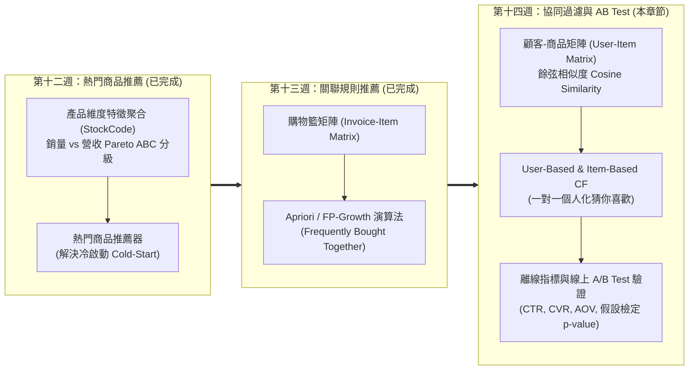
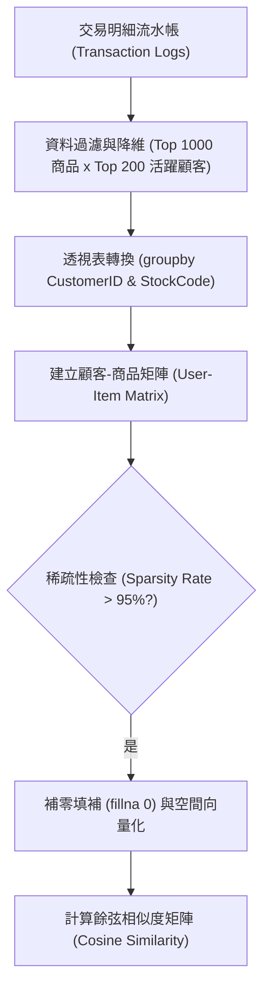
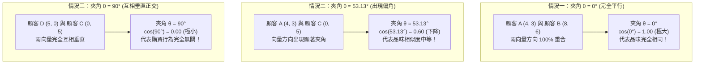
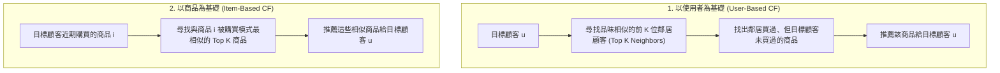
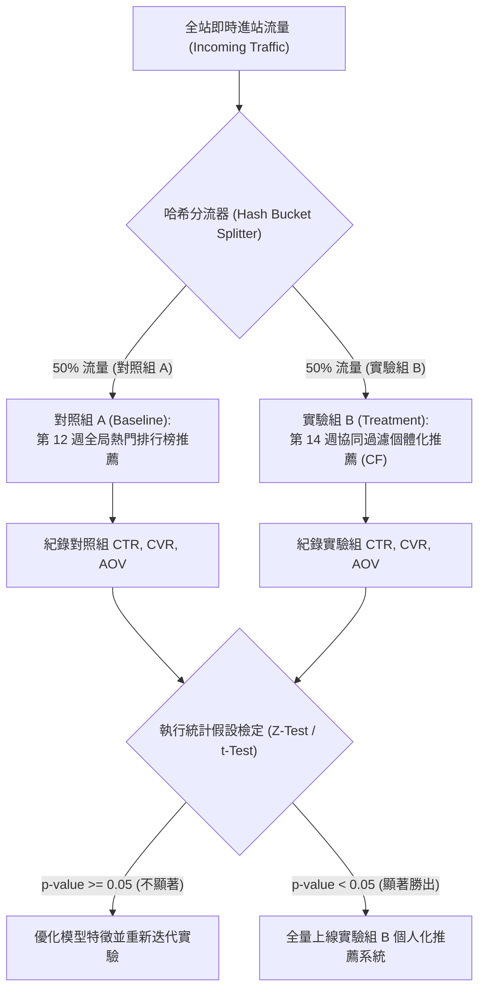
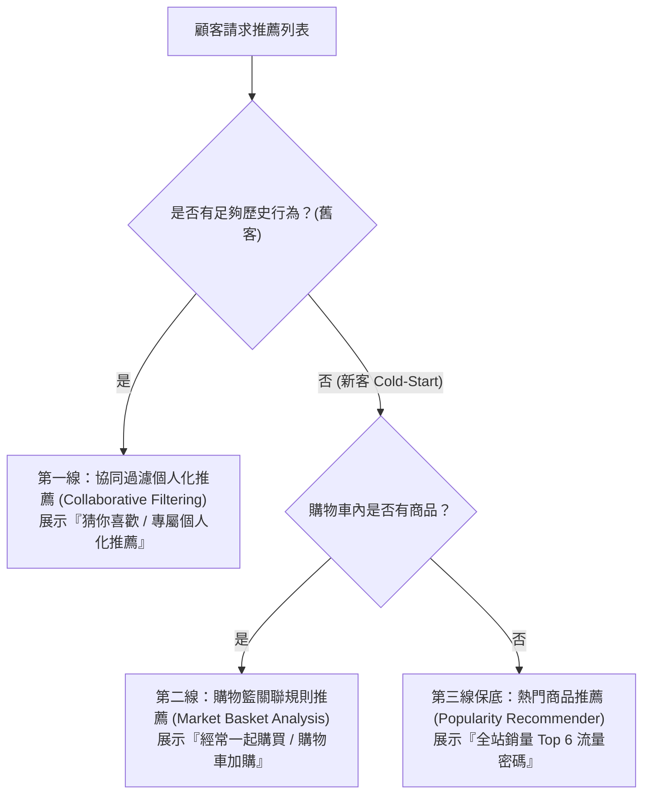

---
puppeteer:
  displayHeaderFooter: true
  scale: 1.15
  headerTemplate: '<div style="font-size: 11px; margin: 0 auto;">第十四章：UCI Online Retail 協同過濾推薦系統與 A/B Test 評估機制</div>'
  footerTemplate: '<div style="font-size: 11px; margin: 0 auto;">第 <span class="pageNumber"></span> 頁 / 共 <span class="totalPages"></span> 頁</div>'
  margin:
    top: "1.5cm"
    bottom: "1.5cm"
    left: "1.5cm"
    right: "1.5cm"
---

<style>
  /* 全域字型、字級與行距 */
  body {
    font-size: 16pt !important;
    line-height: 1.7 !important;
    font-family: "Microsoft JhengHei", "PingFang TC", "Helvetica Neue", sans-serif;
  }

  /* 階層標題微調 */
  h1 { font-size: 28pt !important; margin-bottom: 0.5em !important; }
  h2 { font-size: 22pt !important; page-break-before: always; }
  h3 { font-size: 18pt !important; }
  h4 { font-size: 15pt !important; }

  /* 表格文字放大與排版優化 */
  table, th, td {
    font-size: 16pt !important;
    line-height: 1.5 !important;
  }

  /* 程式碼區塊 */
  pre, code {
    font-size: 16pt !important;
    font-family: Consolas, "Courier New", monospace !important;
    white-space: pre-wrap !important;
    word-break: break-word !important;
    overflow-wrap: break-word !important;
  }

  /* Mermaid 流程圖節點字體放大 */
  .mermaid text {
    font-size: 16px !important;
  }
</style>

---

# 第十四章：UCI Online Retail 協同過濾推薦系統與 A/B Test 評估機制

## 課程導讀與模組三終點站總結

歡迎來到電子商務服務課程第十四章！本章是「模組三：產品分析與商品推薦系統」的終點站與總結章節。

在第十二週與第十三週的推進中，我們實現了推薦系統的前兩大里程碑：
- 第十二週：我們建立了產品維度 EDA 與「熱門商品推薦（Popularity-Based Recommender）」，成功解決了新訪客無歷史行為紀錄的「冷啟動（Cold-Start）」難題。
- 第十三週：我們建立了購物籃分析與「關聯規則挖掘（Association Rule Mining, Apriori / FP-Growth）」，發掘了「買了 A 也常買 B」的共現相依性，實現了結帳頁面的交叉銷售（Cross-Selling）與組合包搭售。

到了第十四週，我們將邁向推薦系統的最高境界——「第三階段：一對一個人化協同過濾推薦系統（Collaborative Filtering, CF）與線上 A/B Test 實驗驗證」！



本章將帶領同學們解構 Amazon、Netflix 與 Spotify 等國際巨頭背後的核心技術，學習如何從真實交易 Log 中構建「顧客-商品矩陣（User-Item Matrix）」，運用餘弦相似度（Cosine Similarity）實現 User-Based 與 Item-Based 協同過濾；進而學習如何設計線上 A/B Test 實驗，透過 Z 檢定與 t 檢定驗證推薦系統對點擊率（CTR）、轉換率（CVR）與客單價（AOV）的真實商業提升。

本章學習目標：
1. 掌握協同過濾（Collaborative Filtering）核心原理，理解「物以類聚，人以群分」的群體智慧（Collective Intelligence）。
2. 精通餘弦相似度（Cosine Similarity）之數學算式與向量空間幾何意義。
3. 區分 User-Based CF 與 Item-Based CF 的演算法結構、運算複雜度與電商應用場景（Amazon 模式：Item-Based 相似度穩定且可離線計算）。
4. 實作 Python 與 Scikit-Learn 建立 User-Item 寬矩陣，編寫個體化推薦器。
5. 掌握離線評估指標（Precision@K, Recall@K）與線上 A/B Test 統計假設檢定（Z-Test, t-Test, p-value < 0.05）。
6. 建構電商全站「多階層保底推薦架構（Multi-Tier Fallback Cascade Architecture）」，完成模組三之學習總結。

---

## 第一節：協同過濾（Collaborative Filtering, CF）核心理論與餘弦相似度

### 1.1 顧客-商品矩陣（Customer-Item Matrix）的建立與稀疏性（Sparsity）挑戰

要實現協同過濾，第一步是將顧客的歷史交易紀錄整理成標準的「顧客-商品矩陣（Customer-Item Matrix / User-Item Matrix）」：

1. 矩陣結構與維度解構：
   - 第 $i$ 行（Row $i$）：代表平台上的第 $i$ 位獨立顧客（$\text{CustomerID}_i$）。
   - 第 $j$ 列（Column $j$）：代表平台上的第 $j$ 項獨立商品（$\text{StockCode}_j$ / $\text{Description}_j$）。
   - 矩陣元素 $\text{Cell}(i, j)$：代表第 $i$ 位顧客曾購買第 $j$ 項商品的累積件數（Cumulative Purchased Quantity）。若第 $i$ 位顧客從未購買過第 $j$ 項商品，則 $\text{Cell}(i, j) = 0$。

2. 顧客-商品矩陣具體範例說明：
   假設平台上有 3 位顧客（$C_1, C_2, C_3$）與 4 項商品（$P_1: \text{綠茶杯}, P_2: \text{粉茶杯}, P_3: \text{燭台}, P_4: \text{抹布}$），其累積購買矩陣 $\mathbf{M}$ 表示如下：

$$\mathbf{M} = \begin{bmatrix}
\text{Cell}(1,1) & \text{Cell}(1,2) & \text{Cell}(1,3) & \text{Cell}(1,4) \\
\text{Cell}(2,1) & \text{Cell}(2,2) & \text{Cell}(2,3) & \text{Cell}(2,4) \\
\text{Cell}(3,1) & \text{Cell}(3,2) & \text{Cell}(3,3) & \text{Cell}(3,4)
\end{bmatrix} = \begin{bmatrix}
4 & 3 & 2 & 0 \\
2 & 0 & 1 & 0 \\
0 & 0 & 0 & 5
\end{bmatrix}$$

   - 範例 $\text{Cell}(1, 2) = 3$：代表第 1 位顧客（第 1 行）曾累積購買了 3 件第 2 項商品「粉茶杯」（第 2 列）。
   - 範例 $\text{Cell}(1, 4) = 0$：代表第 1 位顧客未曾購買過第 4 項商品「抹布」（第 4 列）。



#### 稀疏性（Sparsity）挑戰與特徵降維策略：
在真實大型電商中，單一顧客通常只會購買平台成千上萬商品中的極少數幾件，導致 User-Item 矩陣高達 99% 以上的元素都是 0（極度稀疏）。
為了使教學示範與模型運算更穩健，實務上我們會先篩選「銷量前 1,000 名的熱門商品」與「交易次數最多的前 200 位活躍顧客」，建立精準的品味輪廓矩陣。

---

### 1.2 餘弦相似度（Cosine Similarity）數學算式與空間向量解釋

有了顧客-商品矩陣後，我們需要量化「顧客 A 與顧客 B 的品味有多相似」或「商品 X 與商品 Y 被購買的模式有多接近」。最常用的計量工具是 餘弦相似度（Cosine Similarity）。

將每位顧客的購物行為想像成高維空間中的向量 $\vec{u}$ 與 $\vec{v}$，餘弦相似度計算的是這兩個向量之間的夾角餘弦值 $\cos(\theta)$：

$$\text{Cosine Similarity}(u, v) = \cos(\theta) = \frac{\vec{u} \cdot \vec{v}}{\|\vec{u}\| \|\vec{v}\|} = \frac{\sum_{i=1}^{n} u_i v_i}{\sqrt{\sum_{i=1}^{n} u_i^2} \sqrt{\sum_{i=1}^{n} v_i^2}}$$

#### 空間向量夾角與相似性對應關係：
- 夾角 $\theta = 0^\circ \implies \cos(0^\circ) = 1.0$：兩向量方向完全重合（夾角最小，Cosine 最大，品味完全一致！）。
- 夾角 $\theta = 90^\circ \implies \cos(90^\circ) = 0.0$：兩向量互相垂直正交（夾角最大，Cosine 最小為 0，購買行為完全獨立無關！）。
- 核心規律：夾角 $\theta$ 越小，$\cos(\theta)$ 數值越接近 1（相似度越高）；夾角 $\theta$ 越大，$\cos(\theta)$ 數值越小接近 0（相似度越低）。



#### 具體 3 位顧客購物向量之數值演算範例：

假設在包含兩項商品（$P_1: \text{綠茶杯}$, $P_2: \text{粉茶杯}$）的二維空間中，有 4 位顧客的購物向量：
- 顧客 A ($\vec{v}_A$): $[4, 3]$（累積購買 4 件綠茶杯、3 件粉茶杯）
- 顧客 B ($\vec{v}_B$): $[8, 6]$（累積購買 8 件綠茶杯、6 件粉茶杯，購買比例與 A 完全一致：$4:3 = 8:6$）
- 顧客 C ($\vec{v}_C$): $[0, 5]$（累積購買 0 件綠茶杯、5 件粉茶杯）
- 顧客 D ($\vec{v}_D$): $[5, 0]$（累積購買 5 件綠茶杯、0 件粉茶杯）

1. 計算顧客 A 與顧客 B 的相似度（極小夾角 $\theta = 0^\circ$）：
   - 向量內積：$\vec{v}_A \cdot \vec{v}_B = (4 \times 8) + (3 \times 6) = 32 + 18 = 50$
   - 向量模長（長度）：$\|\vec{v}_A\| = \sqrt{4^2 + 3^2} = 5$，$\|\vec{v}_B\| = \sqrt{8^2 + 6^2} = 10$
   - 餘弦值算式：
     $$\text{Cosine Similarity}(A, B) = \frac{50}{5 \times 10} = \frac{50}{50} = 1.00$$
   - 結果解析：因為夾角 $\theta = 0^\circ$ 最低，$\cos(0^\circ) = 1.00$ 達到最大值！這代表雖然顧客 B 買的數量是顧客 A 的 2 倍，但兩人的購買比例喜好 100% 平行，品味完全一致！

2. 計算顧客 A 與顧客 C 的相似度（中等夾角 $\theta \approx 53.13^\circ$）：
   - 向量內積：$\vec{v}_A \cdot \vec{v}_C = (4 \times 0) + (3 \times 5) = 0 + 15 = 15$
   - 向量模長：$\|\vec{v}_A\| = 5$，$\|\vec{v}_C\| = \sqrt{0^2 + 5^2} = 5$
   - 餘弦值算式：
     $$\text{Cosine Similarity}(A, C) = \frac{15}{5 \times 5} = \frac{15}{25} = 0.60$$
   - 結果解析：顧客 A 與顧客 C 的向量夾角為 $\theta \approx 53.13^\circ$，$\cos(\theta) = 0.60$。相較於顧客 A 與 B 向量的完全重合（$\cos = 1.00$），顧客 A 與 C 的購物偏好存在一定偏角，代表兩人的品味相似性中等略有差異。

3. 計算顧客 D 與顧客 C 的相似度（極大夾角 $\theta = 90^\circ$ 正交）：
   - 向量內積：$\vec{v}_D \cdot \vec{v}_C = (5 \times 0) + (0 \times 5) = 0$
   - 餘弦值算式：
     $$\text{Cosine Similarity}(D, C) = \frac{0}{5 \times 5} = 0.00$$
   - 結果解析：當夾角達到最大角 $\theta = 90^\circ$ 垂直時，$\cos(90^\circ) = 0.00$ 為最小值！代表顧客 D 只買綠茶杯、顧客 C 只買粉茶杯，兩人的購物行為完全沒有交集與相似性。

---

### 1.3 User-Based CF vs. Item-Based CF 比較

協同過濾主要分為兩大演算法流派：



#### User-Based CF 與 Item-Based CF 比較表：

| 評估維度 | 以使用者為基礎 (User-Based CF) | 以商品為基礎 (Item-Based CF) |
| :--- | :--- | :--- |
| 核心思想 | 「物以類聚，人以群分」—— 找到跟你品味相似的人，推薦他們喜歡的東西。 | 「愛屋及烏」—— 找到跟你買過的東西相似的其他商品。 |
| 相似度矩陣 | 計算顧客之間的相似度 ($N \times N$ 矩陣，N 為顧客數)。 | 計算商品之間的相似度 ($M \times M$ 矩陣，M 為商品數)。 |
| 運算複雜度 | 當顧客數遠大於商品數時，計算極慢且需即時更新。 | 當商品數相對穩定時，可預先在離線批次計算並快取。 |
| 驚喜度與個人化 | 驚喜度高，容易發現意想不到的跨類別商品。 | 推薦結果較符合直覺，解釋性強（「因為你買過 X，所以推薦 Y」）。 |
| 業界採納度 | 適用於顧客數較少、內容導向平台。 | 大型電商（如 Amazon）的標準金牌解法！ |

---

## 第二節：Python 實戰：UCI Online Retail 協同過濾推薦系統實作

### 2.1 建立 User-Item 寬格式矩陣與資料降維

我們使用 Pandas 將 UCI Online Retail 的交易 Log 進行篩選，並轉換為寬格式矩陣：

```python
import pandas as pd
import numpy as np
import matplotlib.pyplot as plt
import seaborn as sns
from ucimlrepo import fetch_ucirepo
from sklearn.metrics.pairwise import cosine_similarity

# 1. 載入 UCI Online Retail 資料集 (id=352)
online_retail = fetch_ucirepo(id=352)
df_raw = online_retail.data.original.copy()

# 2. 資料清理：移除退貨與缺失 CustomerID
df_clean = df_raw.dropna(subset=['CustomerID']).copy()
df_clean = df_clean[
    (df_clean['Quantity'] > 0) &
    (df_clean['UnitPrice'] > 0)
].copy()

# 3. 特徵降維：
# 篩選銷量 Top 1000 商品與 Top 200 顧客
top_1000 = (
    df_clean.groupby('Description')['Quantity']
    .sum().nlargest(1000).index
)
df_top_p = df_clean[
    df_clean['Description'].isin(top_1000)
].copy()

top_200 = (
    df_top_p.groupby('CustomerID')['InvoiceNo']
    .nunique().nlargest(200).index
)
df_reduced = df_top_p[
    df_top_p['CustomerID'].isin(top_200)
].copy()

# 4. 建立 User-Item 矩陣
user_item_matrix = (
    df_reduced.groupby(['CustomerID', 'Description'])
    ['Quantity'].sum().unstack().fillna(0)
)

print(f"矩陣維度：{user_item_matrix.shape[0]} 顧客 x "
      f"{user_item_matrix.shape[1]} 商品")
```

---

### 2.2 User-Based 協同過濾推薦器實作

我們計算顧客相似度矩陣，並編寫 `recommend_user_based` 函數：

```python
# 1. 計算使用者餘弦相似度矩陣
user_sim_matrix = pd.DataFrame(
    cosine_similarity(user_item_matrix),
    index=user_item_matrix.index,
    columns=user_item_matrix.index
)

def recommend_user_based(target_customer_id,
                         user_item_df,
                         user_sim_df,
                         top_k_neighbors=5,
                         top_n_recommend=3):
    """
    User-Based 協同過濾推薦器
    """
    if target_customer_id not in user_item_df.index:
        return "目標顧客不存在於矩陣中"
        
    # 取出與目標顧客最相似的前 K 位鄰居 (扣除自己)
    sim_series = user_sim_df[target_customer_id]
    similar_users = (
        sim_series.sort_values(ascending=False)
        .iloc[1:top_k_neighbors + 1]
    )
    
    # 目標顧客已買過的商品列表
    u_row = user_item_df.loc[target_customer_id]
    target_bought = set(u_row[u_row > 0].index)
    
    # 彙總鄰居們買過、但目標顧客沒買過的商品
    recommendations = {}
    for sim_user, sim_score in similar_users.items():
        sim_bought = (
            user_item_df.loc[sim_user]
            [user_item_df.loc[sim_user] > 0]
        )
        for item, qty in sim_bought.items():
            if item not in target_bought:
                curr = recommendations.get(item, 0)
                recommendations[item] = (
                    curr + (qty * sim_score)
                )
                
    # 排序並取出 Top N 推薦商品
    rec_series = (
        pd.Series(recommendations)
        .sort_values(ascending=False)
        .head(top_n_recommend)
    )
    return pd.DataFrame({
        'RecommendedProduct': rec_series.index,
        'PredictedScore': rec_series.values.round(2)
    })

# 測試實作：為前 1 位活躍顧客進行推薦
sample_customer = user_item_matrix.index[0]
print(f"=== 為顧客 ID: {sample_customer} 進行推薦 ===")
res_df = recommend_user_based(
    sample_customer, user_item_matrix,
    user_sim_matrix,
    top_k_neighbors=5, top_n_recommend=3
)
print(res_df.to_string(index=False))
```

---

### 2.3 Item-Based 協同過濾推薦器實作

對矩陣進行轉置，計算商品相似度矩陣，實作 Amazon 金牌 Item-Based 推薦器：

```python
# 1. 將矩陣轉置，計算商品餘弦相似度矩陣
item_sim_matrix = pd.DataFrame(
    cosine_similarity(user_item_matrix.T),
    index=user_item_matrix.columns,
    columns=user_item_matrix.columns
)

def recommend_item_based(target_item_name,
                         item_sim_df,
                         top_n=3):
    """
    Item-Based 協同過濾推薦器
    """
    if target_item_name not in item_sim_df.index:
        return "目標商品不存在於矩陣中"
        
    # 取出與目標商品最相似的前 N 個商品 (扣除自己)
    sim_series = item_sim_df[target_item_name]
    similar_items = (
        sim_series.sort_values(ascending=False)
        .iloc[1:top_n + 1]
    )
    
    return pd.DataFrame({
        'SimilarProduct': similar_items.index,
        'CosineSimilarity': (
            similar_items.values.round(4)
        )
    })

# 測試實作：尋找熱銷商品的最相似拍檔
sample_item = "WHITE HANGING HEART T-LIGHT HOLDER"
print(f"=== 與 '{sample_item}' 最相似之推薦 ===")
rec_df = recommend_item_based(
    sample_item, item_sim_matrix, top_n=3
)
print(rec_df.to_string(index=False))
```

---

## 第三節：推薦系統評估機制：離線評估與線上 A/B Test 實驗設計

### 3.1 離線評估指標（Offline Evaluation Metrics）

在推薦模型正式上線推播給真實顧客之前，必須在歷史資料集上進行離線評估（Offline Evaluation）。
我們通常將歷史交易 Log 依照時間或隨機劃分為「訓練集（80%）」與「測試集（20%，即 Ground Truth）」。演算法利用訓練集建立模型並預測顧客的前 $K$ 個推薦商品清單（Top-$K$ Recommendation List），隨後與測試集中顧客實際發生的購買行為進行比對。

離線評估中最核心的三大指標為準確率（Precision@K）、召回率（Recall@K）與調和平均值（F1-Score@K）：

1. 準確率（Precision@K）：
   - 數學算式：
     $$\text{Precision@K} = \frac{|\text{Top-K 推薦商品清單} \cap \text{顧客測試集實際購買商品}|}{K}$$
   - 商業解讀：「推薦給顧客的 $K$ 個商品中，有多少比例是顧客真正會買的？」 衡量推薦清單的「質」與「不浪費推薦版位」的精準程度。

2. 召回率（Recall@K）：
   - 數學算式：
     $$\text{Recall@K} = \frac{|\text{Top-K 推薦商品清單} \cap \text{顧客測試集實際購買商品}|}{|\text{顧客測試集實際購買的所有商品總數}|}$$
   - 商業解讀：「顧客測試集實際購買的所有商品中，推薦系統成功抓到了多少比例？」 衡量推薦系統對顧客潛在興趣的「涵蓋率與捕捉完備度」。

3. 調和平均值（F1-Score@K）：
   - 數學算式：
     $$\text{F1-Score@K} = 2 \times \frac{\text{Precision@K} \times \text{Recall@K}}{\text{Precision@K} + \text{Recall@K}}$$
   - 商業解讀：綜合平衡精準率與召回率的單一評估指標。

#### Precision@K 與 Recall@K 具體數字實例演算：

假設我們設定推薦清單長度 $K = 5$（即為每位顧客推薦 Top 5 個商品）：
- 測試集實際行為（Ground Truth）：顧客小明在測試集中實際購買了 4 個商品：
  $$\text{GroundTruth} = \{\text{綠茶杯}, \text{粉茶杯}, \text{燭台}, \text{抹布}\} \quad (|\text{GroundTruth}| = 4)$$
- 推薦系統預測結果：模型為小明生成的前 5 個推薦商品清單為：
  $$\text{Top-5 Recommendation} = \{\text{綠茶杯}, \text{粉茶杯}, \text{保溫瓶}, \text{馬克杯}, \text{餐巾紙}\} \quad (K = 5)$$
- 命中商品集合（Intersection）：
  $$\text{Top-5 Rec} \cap \text{GroundTruth} = \{\text{綠茶杯}, \text{粉茶杯}\} \quad (\text{成功命中 2 個商品})$$

代入算式計算各項指標：
1. 計算 Precision@5：
   $$\text{Precision@5} = \frac{2}{5} = 0.40 \quad (40\%)$$
   - 解讀：在系統推薦給小明的 5 個商品中，有 40%（2 個）精準命中了小明的購買意向。
2. 計算 Recall@5：
   $$\text{Recall@5} = \frac{2}{4} = 0.50 \quad (50\%)$$
   - 解讀：在小明實際感興趣並購買的 4 個商品中，系統成功召回並捕捉到了 50%（2 個）。
3. 計算 F1-Score@5：
   $$\text{F1-Score@5} = 2 \times \frac{0.40 \times 0.50}{0.40 + 0.50} = \frac{0.40}{0.90} \approx 0.444 \quad (44.4\%)$$

#### Precision@K 與 Recall@K 的權衡（Trade-off）與 K 值選擇策略：

在推薦系統設計中，Precision@K 與 Recall@K 存在著天然的權衡關係（Trade-off）：

| K 值設定 (Top-K 清單長度) | Precision@K 變化傾向 | Recall@K 變化傾向 | 電商實務應用場景與版位策略 |
| :--- | :--- | :--- | :--- |
| 小 K 值 (如 K = 3) | 通常較高 | 通常較低 | 適用於手機 App 首頁彈窗、簡訊推播（版位昂貴極受限，追求精準打擊、不干擾顧客）。 |
| 大 K 值 (如 K = 20) | 通常較低 | 通常較高 | 適用於「猜你喜歡」無限下滑頁面、EDM 採購電子報（版位空間充裕，追求高涵蓋率與探索多樣性）。 |

#### 其他常見離線評估指標延伸：
- 命中率（Hit Rate@K）：在評估的顧客中，至少命中 1 個推薦商品的顧客數佔總顧客數之比例（衡量冷啟動與保底推薦效果）。
- 平均平均精準率（MAP@K, Mean Average Precision）：考量命中商品在推薦清單中「排序位置（Ranking Order）」的指標，命中商品越靠前，分數越高。

---

### 3.2 線上 A/B Test 實驗架構與流量切割

離線指標高並不等於商業營收必然增加！評估推薦系統商業價值的終極金標準是 線上 A/B Test（Online A/B Testing）。



---

### 3.3 統計假設檢定（Z-Test / t-Test）與 p-value 判讀

進行 A/B Test 評估時，我們必須排除純屬隨機抽樣波動的可能性，透過統計假設檢定驗證商業效益：

1. 轉換率 CVR 假設檢定（雙樣本比例 Z 檢定 Two-Sample Z-Test）：
   - 零假設 $H_0$： 實驗組 B 的 CVR 與對照組 A 無顯著差異（$\text{CVR}_B = \text{CVR}_A$）。
   - 對立假設 $H_1$： 實驗組 B 的 CVR 顯著高於對照組 A（$\text{CVR}_B > \text{CVR}_A$）。
2. 每位顧客平均營收 RPU 假設檢定（雙樣本獨立 t 檢定 Two-Sample Independent t-Test）：
   - 衡量兩組顧客的人均消費金額是否存在顯著差異。
3. 顯著水準與 p-value 判讀規則：
   - 設定顯著水準 $\alpha = 0.05$（統計檢定力 $1 - \beta = 0.80$）。
   - 若 $p\text{-value} < 0.05$，代表我們有 95% 的信心拒絕零假設，證實協同過濾個人化推薦能顯著提升營收！

---

## 第四節：CRM 商業落地與全套推薦系統整合決策

### 4.1 電商全站多階層保底推薦架構（Multi-Tier Fallback Cascade Architecture）

在實際電商系統中，單一推薦演算法無法覆蓋 100% 的場景。頂級電商架構採用「多階層保底降級架構（Multi-Tier Fallback Cascade Architecture）」：



---

### 4.2 課堂動手做小活動：為核心 VIP 設計個人化推薦與 A/B Test 驗證企劃

請同學們分成 4 人小組，討論並設計一套方案：

1. 推薦清單設計： 針對第十週分出的 Cluster 0（Champions 核心頂級 VIP），你會選擇使用 User-Based CF 還是 Item-Based CF 來為他們生成「尊榮 VIP 專屬推薦列表」？為什麼？
2. A/B Test 實驗指標選擇： 如果要在 VIP 專屬區進行 A/B Test，你會挑選「點擊率（CTR）」還是「人均消費金額（Revenue per User）」作為主要 KPI？
3. 風險控管： 如果實驗組 B 的個人化推薦導致部分 VIP 抱怨推薦內容太過重複，行銷團隊該如何調校模型（如加入多樣性 Diversity 與驚喜度 Serendipity 懲罰因子）？

> 老師的提醒：
> * 推薦系統的最高境界是兼顧「精準度（Precision）」與「驚喜度（Serendipity）」。多階層保底架構能確保系統在極端情況下絕不空轉！

---

## 本章小結與模組三總結

### 本章學習進展總結（Week 14 Progress）

1. 協同過濾核心理論達成： 掌握 User-Item 矩陣建立、稀疏性降維（Top 1000 商品 x Top 200 顧客）與餘弦相似度（Cosine Similarity）幾何計算。
2. User-CF 與 Item-CF 雙流派實作： 實作 User-Based 與 Item-Based 協同過濾推薦器，理解 Amazon 模式的離線計算優勢。
3. 線上 A/B Test 與假設檢定： 掌握流量對稱切割、CTR/CVR/AOV 核心指標，以及 Z 檢定與 $p\text{-value} < 0.05$ 的統計驗證邏輯。
4. 全站多階層保底推薦架構： 整合「協同過濾 $\to$ 關聯規則 $\to$ 熱門保底」，構建高可用性的個人化推薦機制。

---

### 模組三全體學習總結（第 12~14 週總結）

恭喜同學們順利完成了「模組三：產品分析與商品推薦系統」的全部內容！

回顧模組三的三週演進歷程：
- 第十二週：我們從產品維度探索（Pareto ABC 分級）出發，建立了「第一階段：熱門商品推薦」，成功破解了新客無紀錄的冷啟動（Cold-Start）難題。
- 第十三週：我們深化至商品共現相依性，建立了「第二階段：購物籃分析與 Apriori / FP-Growth 關聯規則」，實現了結帳頁面的「經常一起購買」與組合包搭售。
- 第十四週：我們登頂推薦系統最高峰，建立了「第三階段：一對一個人化協同過濾（Collaborative Filtering）」與「線上 A/B Test 統計驗證」，構建了多階層保底推薦架構。

至此，同學們已完整掌握了從「轉換率分析（模組一）」到「顧客分析與 CLV 預警（模組二）」，再到「產品分析與個人化推薦（模組三）」的電商資料科學全套核心戰術！
