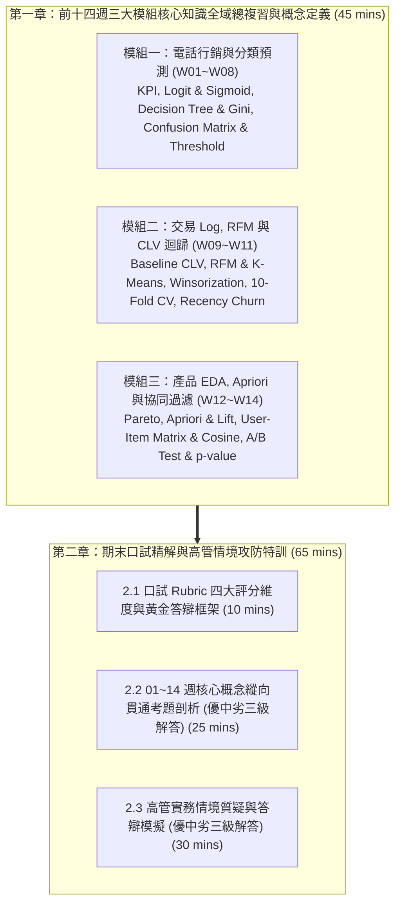

---
puppeteer:
  displayHeaderFooter: true
  headerTemplate: '
第十五章：全域課程總複習與期末口試精解
'
  footerTemplate: '
第  頁 / 共  頁
'
  margin:
    top: "1.5cm"
    bottom: "1.5cm"
    left: "1.5cm"
    right: "1.5cm"
---

---

# 第十五章：全域課程總複習與期末口試精解

## 課程導讀與學期終章總結

歡迎來到電子商務服務課程的第十五週！本章是全學期「數據驅動商業決策」三大模組的總結站與期末口試（Oral Exam）備戰特訓。

在本學期前十四週的修練歷程中，同學們從零程式基礎出發，逐步建構了完整的數據分析與機器學習實戰體系：
- 模組一（第 01 至 08 週）：金融電話行銷與轉換率預測專案。我們精通了 Pandas 資料診斷、KPI 下鑽分析、羅吉斯迴歸勝算比、決策樹 IF-THEN 規則切割，以及混淆矩陣、Precision、Recall、F1-Score 與決策門檻值調整。
- 模組二（第 09 至 11 週）：電商交易 Log 探索與顧客終身價值（CLV）預測專案。我們從交易 Log 聚合開始，打破「全域平均迷思」，運用 RFM 特徵工程與 K-Means（$K=4$）分群建立客群分級 CLV；進而建立固定時間窗口（P1~P3 預測 P4）監督式迴歸模型，搭配 95 分位數極端值封頂截斷（Winsorization）、10-Fold 交叉驗證與 4.1 節 Recency 流失臨界門檻定義，打造 2D CLV-流失風險決策矩陣。
- 模組三（第 12 至 14 週）：產品維度 EDA 與個性化推薦系統專案。我們建立了帕累托 80/20 銷量分析與熱門商品冷啟動推薦，學習了 Apriori 購物籃關聯規則（Support, Confidence, Lift）組合搭售，並實作了 User-Based 協同過濾（顧客-商品矩陣與餘弦相似度 Cosine Similarity）及線上 A/B Test 假設檢定（$p\text{-value} < 0.05$ 雙樣本 t 檢定）。

本章（總時長 110 分鐘）將聚焦於全學期核心概念的深入定義，並針對期末口試進行「優、中、劣」三等級回答範例剖析與高管攻防演練！

---

## 第一節：前十四週三大模組核心知識全域總複習與概念定義 (45 分鐘)

### 1.1 模組一：行銷 KPI 下鑽與分類預測模型 (W01~W08 / 15 分鐘)

#### 1. 電商導論與行銷 KPI 下鑽分析（W01~W05）
- 電商四大流：商流（商品所有權轉移與交易合約）、金流（資金支付、結算與退款）、物流（實體商品倉儲與配送）以及資訊流（商品訊息、訂單數據與顧客行為追蹤）。
- 轉換率（Conversion Rate）：完成目標行銷行為（如購買、訂閱）的用戶占總造訪用戶的比例。
- 獲客成本（CAC, Customer Acquisition Cost）：取得一位全新付費顧客所花費的總行銷與銷售費用。
- 行銷投資報酬率（ROI, Return on Investment）：行銷活動帶來的淨收益與行銷成本之比例。
- Pandas 資料診斷與下鑽分析：運用 `shape`, `info()`, `describe()`, `isnull()`, `duplicated()` 進行資料體檢；透過 `groupby()`, `pivot_table()`, `crosstab()` 按多重維度（如年齡區間、接觸方式）層層剖析轉換率差異，並搭配 Seaborn 熱點圖（Heatmap）定位極端高轉換受眾。

#### 2. 羅吉斯迴歸（Logistic Regression）與勝算比（W06）
- 羅吉斯迴歸（Logistic Regression）：專門用於處理「二元分類問題」（預測結果只有 0 或 1，如：是否訂閱）的監督式機器學習模型。
- Sigmoid 函數：將線性組合 $z = \beta_0 + \beta_1 X_1 + \dots + \beta_k X_k$ 透過非線性 S 型曲線映射至 $(0, 1)$ 的概率數值 $p$：
  $$p = \frac{1}{1 + e^{-z}}$$
- 勝算（Odds）與對數勝算（Logit）：勝算定義為事件發生概率與未發生概率之比，即 $\text{Odds} = \frac{p}{1-p}$。對勝算取自然對數即為 Logit：
  $$\ln\left(\frac{p}{1-p}\right) = \beta_0 + \beta_1 X_1 + \dots + \beta_k X_k$$
- 勝算比（Odds Ratio, OR）：特徵係數對數指數化值 $\text{OR} = e^{\beta_i}$。代表當其他條件不變時，特徵 $X_i$ 每增加 1 單位，成功勝算將擴大為 $e^{\beta_i}$ 倍。
- 變數前處理與概率預測：將類別變數進行 One-Hot Encoding 轉為 Dummy 虛擬變數；使用 `predict_proba()` 取得每位顧客屬於成功類別的個體預測機率。

#### 3. 決策樹（Decision Tree）與模型評估（W08）
- 決策樹（Decision Tree）：透過一系列直觀的「如果……就……（IF-THEN）」規則，將複雜資料集逐步切割為高純度子集的非線性分類與迴歸模型。
- Gini 不純度（Gini Impurity）：衡量節點內部混亂程度的定量指標。對於二元分類，算式為：
  $$\text{Gini} = 1 - (p_0^2 + p_1^2)$$
  $\text{Gini} = 0.0$ 代表純度 100%（節點內全為同一類別）；$\text{Gini} = 0.5$ 代表最混亂狀態（兩類各占 50%）。決策樹分支時目標是讓 Gini 下降量最大化。
- 特徵重要性（Feature Importance）：歸一化各特徵在所有切割節點中所貢獻的 Gini 不純度減少量（總和為 1.0 或 100%）。
- 樹深剪枝與過擬合（Overfitting）：未經限制的決策樹會過度擬合訓練集細節（過擬合 Overfitting）；透過 `max_depth` 限制樹深進行剪枝（Pruning），能保留具備泛化能力的核心規則。
- 混淆矩陣（Confusion Matrix）與四大分類指標算式：
  - 混淆矩陣結構：TN（真陰性，正確預測為 0）、FP（假陽性，誤判為 1，造成撥打成本浪費）、FN（假陰性，誤判為 0，漏抓黃金顧客）、TP（真陽性，正確預測為 1）。
  - 準確率 (Accuracy)：全體預測正確的比例。
    $$\text{Accuracy} = \frac{\text{TP} + \text{TN}}{\text{TP} + \text{TN} + \text{FP} + \text{FN}}$$
  - 精確率 (Precision)：模型預測為 1 的樣本中，實際上真正為 1 的比例（反映打擊精準度）。
    $$\text{Precision} = \frac{\text{TP}}{\text{TP} + \text{FP}}$$
  - 召回率 (Recall)：實際上真正為 1 的顧客中，被模型成功抓出的比例（反映涵蓋率）。
    $$\text{Recall} = \frac{\text{TP}}{\text{TP} + \text{FN}}$$
  - F1-Score：精確率與召回率的調和平均數（Harmonic Mean），用以平衡兩者之間的拉鋸與權衡。
    $$\text{F1-Score} = 2 \times \frac{\text{Precision} \times \text{Recall}}{\text{Precision} + \text{Recall}} = \frac{2 \cdot \text{TP}}{2 \cdot \text{TP} + \text{FP} + \text{FN}}$$
- 決策門檻值（Decision Threshold）調整：透過 `predict_proba()` 輸出機率，將預設 0.50 的決策門檻依行銷資源進行調整（調高門檻提升 Precision 以節省外呼成本；調低門檻提升 Recall 以擴大名單涵蓋）。

---

### 1.2 模組二：電商交易 Log 探索、RFM 分群與 CLV 迴歸預測 (W09~W11 / 15 分鐘)

#### 1. 交易 Log 探索與全域 Baseline CLV（W09）
- 顧客終身價值（CLV, Customer Lifetime Value）：一位顧客在整個與企業維繫關係的生命週期內，預估能為企業帶來的總貢獻利益或營收。
- 明細 Log 聚合：將包含數十萬筆單筆交易（`InvoiceNo`）的原始資料集，按顧客識別碼（`CustomerID`）進行群組聚合。
- 全域 Baseline CLV 算式：
  $$\text{CLV}_{\text{global}} = \text{AOV} \times \text{Purchase Frequency} \times \text{Customer Lifespan}$$
- 全域平均迷思（Global Average Trap）：直接套用全公司單一平均 AOV 與平均流失率計算 CLV，會抹平顧客間的個體差異，導致嚴重低估頂級 VIP 顧客並高估沉睡客。

#### 2. RFM 特徵工程與 K-Means 非監督分群（W10）
- RFM 模型：
  - Recency (R)：顧客距離最近一次消費的靜止天數（天數越少越活躍）。
  - Frequency (F)：顧客在指定時間內的累積消費次數（次數越多越忠誠）。
  - Monetary (M)：顧客在指定時間內的累積消費總金額（金額越高貢獻越大）。
- 特徵預處理：對極端右偏的 RFM 數據套用對數轉換 `np.log1p` 消除偏斜，並透過 `StandardScaler` 標準化轉為均值 0、標準差 1 的同等尺度。
- K-Means 非監督式分群演算法：透過最小化群內平方和（WCSS），自動將顧客距離向量聚類為 $K$ 個同質群體（本課程設定 $K=4$，劃分 Champions, Loyalists, Promising, Hibernating 四大 Persona），並為各客群單獨計算 Segmented CLV。

#### 3. 固定時間窗口迴歸預測與流失預警（W11）
- 固定時間窗口特徵工程（Fixed-Window Feature Engineering）：將歷史交易時間軸切分為觀測期（P1~P3，計算 RFM 等行為特徵）與目標預測期（P4，計算未來消費總金額 $y$）。
- 線性迴歸（Linear Regression）：建立監督式連續數值預測模型 $y = f(X)$，預測個體顧客在未來的消費金額。
- <b>95 分位數極端值封頂截斷（Winsorization / Quantile Capping）</b>：在預測目標 $y$ 或 M 值極度右偏時，將超過第 95 分位數（$P_{95}$）的極端數值統一封頂修飾為 $P_{95}$ 臨界值，避免少數極端大單顧客拉抬並扭曲迴歸模型的總體擬合能力。
- 10-Fold 交叉驗證（10-Fold Cross-Validation）：將訓練資料等分為 10 份，輪流以 9 份訓練、1 份驗證，計算平均 MAE、RMSE 與 $R^2$，產出無偏穩健的模型評估指標。
- <b>4.1 節 非合約制顧客流失（Non-Contractual Churn）與 Recency 靜止天數臨界門檻定義</b>：在無明確退訂時間點的零售電商場景中，結合「模型預測 P4 消費金額 $\hat{y} \le 0$」與「靜止天數 Recency 突破臨界門檻（如 90 天/180 天）」雙重條件判定流失，並建構二維 CLV-流失風險干預矩陣（2D CLV-Churn Matrix）。

---

### 1.3 模組三：產品維度 EDA、Apriori 購物籃與協同過濾 (W12~W14 / 15 分鐘)

#### 1. 產品維度 EDA 與熱門商品推薦（W12）
- 產品維度特徵聚合：將交易 Log 依商品識別碼（`StockCode` / `Description`）聚合，計算總銷售量與總銷售金額。
- 帕累托 80/20 法則（Pareto Analysis）：商業世界中 80% 的營業額往往由 20% 的熱門商品貢獻；其餘大量商品形成長尾（Long Tail）。
- 熱門商品推薦（Popularity-Based Recommender）：計算全站銷量與營收 Top-K 商品進行推薦。這是最穩定、強健的 Baseline 推薦器，專門用來解決全新顧客無任何歷史行為紀錄的「冷啟動（Cold-Start）」難題。

#### 2. 購物籃分析與 Apriori 關聯規則（W13）
- 購物籃分析（Market Basket Analysis）：透過發票明細建構「購物籃矩陣（Invoice-Item Matrix）」，發掘商品之間的共現相依性（Frequently Bought Together）。
- Apriori 關聯規則演算法三大核心指標算式：
  - 支持度 (Support)：組合 A 與 B 同時出現於所有購物籃中的機率。
    $$\text{Support}(A \to B) = P(A \cap B) = \frac{\text{包含 A 與 B 的購物籃數}}{\text{總購物籃數}}$$
  - 置信度 (Confidence)：在購買商品 A 的條件下，同時購買商品 B 的條件機率。
    $$\text{Confidence}(A \to B) = P(B|A) = \frac{P(A \cap B)}{P(A)} = \frac{\text{包含 A 與 B 的購物籃數}}{\text{包含 A 的購物籃數}}$$
  - 提升度 (Lift)：購買 A 後購買 B 的條件機率，相較於隨機購買 B 的機率提升倍數。
    $$\text{Lift}(A \to B) = \frac{P(B|A)}{P(B)} = \frac{P(A \cap B)}{P(A) \times P(B)}$$
    $\text{Lift} > 1$ 代表 A 與 B 存在強烈正相關；$\text{Lift} = 1$ 代表互相獨立；$\text{Lift} < 1$ 代表負相關。
- 商業應用：運用高 Lift 關聯規則進行商品組合包搭售與結帳頁面交叉銷售（Cross-Selling）。

#### 3. 協同過濾（Collaborative Filtering）與 A/B Testing 評估（W14）
- 顧客-商品矩陣（User-Item Matrix）：列代表獨立顧客（`CustomerID`），欄代表商品（`StockCode`），Cell 數值代表購買件數，矩陣內部充斥大量 0 值（矩陣稀疏性 Sparsity）。
- User-Based 協同過濾：基於「物以類聚，人以群分」的群體智慧（Collective Intelligence），尋找與目標顧客購物品味最相似的鄰居顧客群，並將鄰居買過而目標顧客尚未購買的商品推薦給目標顧客。
- 餘弦相似度（Cosine Similarity）：在向量空間中計算兩位顧客購買向量 $\mathbf{u}$ 與 $\mathbf{v}$ 的夾角餘弦值：
  $$\cos(\theta) = \frac{\mathbf{u} \cdot \mathbf{v}}{\|\mathbf{u}\| \|\mathbf{v}\|} = \frac{\sum_{i=1}^n u_i v_i}{\sqrt{\sum_{i=1}^n u_i^2} \sqrt{\sum_{i=1}^n v_i^2}}$$
  當向量夾角 $\theta = 0^\circ$ 時，$\cos(\theta) = 1.0$ 代表購物品味完全一致；當夾角擴大，$\cos(\theta)$ 下降代表品味差異變大。
- 離線指標（Recall@K, Precision@K）：評估模型在歷史測試集中 Top-K 推薦商品命中顧客真實購買的覆蓋率與精確率。
- 線上 A/B Testing 實驗與假設檢定：將線上即時流量隨機劃分為對照組（Control，如熱門推薦）與實驗組（Treatment，如協同過濾），透過雙樣本 t 檢定計算 $p\text{-value}$。當 $p\text{-value} < 0.05$ 時，代表實驗組對點擊率（CTR）、轉換率（CVR）或客單價（AOV）的提升具備統計顯著性。

---

## 第二節：期末口試精解與高管情境攻防特訓 (65 分鐘)

### 2.1 口試 Rubric 四大評分維度與黃金答辯框架 (10 分鐘)

#### 期末口試 Rubric 四大評分維度（總分 100 分）：
1. 觀念精準度（30%）：模型原理、數據預處理與指標算式解讀之正確性與無誤性。
2. 商業邏輯連貫性（30%）：問題定義 $\rightarrow$ 數據處置 $\rightarrow$ 商業落地 之因果推論與完整度。
3. 實務應變能力（20%）：面對冷啟動、極端值、A/B Test 不顯著或資源受限時的分析師靈活應變能力。
4. 企劃表達與溝通能力（20%）：口條清晰度、時間掌控與回答結構化程度。

#### 口試答辯黃金框架：
$$\text{Problem（問題定義）} \rightarrow \text{Data \& Model（數據與模型處置）} \rightarrow \text{Validation（評估依據）} \rightarrow \text{Business Impact（商業效益）}$$

---

### 2.2 01~14 週核心概念縱向貫通考題剖析 (25 分鐘)

#### 貫通考題一：分類預測模型原理與變數前處理

> 口試問題：
> 「羅吉斯迴歸（Logistic Regression）與決策樹（Decision Tree）在商業可解釋性上各有何優缺點？為什麼羅吉斯迴歸需要做 One-Hot Encoding，而決策樹使用 Gini Impurity 分割時不需要假設特徵與 Log-Odds 的線性關係？」

##### 優等答案（Outstanding Answer）：
「老師好，這兩種模型在商業應用上相輔相成：
1. 羅吉斯迴歸的優勢在於能輸出係數的對數勝算比（$\text{OR}=e^{\beta}$），精確量化單一變數在排除其他干擾後的獨立影響倍數；但缺點是它假設特徵與 Log-Odds 為線性關係，無法自動處理非線性趨勢（如年齡的 U 型分佈），且類別變數必須透過 One-Hot Encoding 轉為 Dummy 虛擬變數才能輸入矩陣運算。
2. 決策樹的優勢在於具備極致直觀的 IF-THEN 規則圖與特徵重要性，且它是非線性階梯切割模型。當它以 Gini 不純度（$\text{Gini} = 1 - p_0^2 - p_1^2$）進行純度最大化切割時，會在特徵空間中自動尋找最優門檻點（如自動發現 $\text{age} > 60.5$），完全不需要假設線性關係或手動作 Dummy 編碼。
在實務專案中，我們用 Logistic Regression 向精算或風險部門驗證統計顯著性，用 Decision Tree 萃取自動化規則腳本給前線電銷團隊執行。」

##### 優等答案優缺點剖析：
- 優點：完全符合 Rubric 的觀念精準度與商業邏輯。同時涵蓋了數學算式（$\text{OR}=e^{\beta}$、Gini 算式）、模型假設差異（線性 vs. 非線性階梯）、變數處置 rationale，並以 Business Impact 結尾。
- 缺點：需要對兩大模型有極高熟練度，答題時間約需要 2 分鐘，口條必須極為俐落。

---

##### 中等答案（Moderate Answer）：
「羅吉斯迴歸是用公式預測機率，優點是可以算出勝算比，看出來某個變數增加會讓成功機率變幾倍；缺點是比較抽象，而且一定要做 One-Hot Encoding 才能跑。決策樹則是用流程圖切資料，優點是非常好看懂，非技術主管也看得懂，而且不用手動轉虛擬變數，因為它自己會用 Gini 係數找切分點。我們通常會看決策樹的特徵重要性來選變數。」

##### 中等答案優缺點剖析：
- 優點：概念方向大致正確，能說出勝算比、流程圖與特徵重要性等關鍵字。
- 缺點：缺乏對「線性假設」本質的解說，沒有說明為什麼 Logit 假設線性而 Decision Tree 是非線性切割，數學算式細節不足（未說明 Gini 算式與 $\text{OR}=e^{\beta}$）。

---

##### 劣等答案（Poor Answer）：
「羅吉斯迴歸就是算線性的，比較複雜；決策樹就是畫樹狀圖，比較簡單。One-Hot Encoding 是所有機器學習都要做的前處理，決策樹不用做是因為它是樹狀模型，樹狀模型本來就比較厲害，不用管線性不線性。」

##### 劣等答案優缺點剖析：
- 優點：無。
- 缺點：嚴重觀念錯誤！誤稱『One-Hot Encoding 是所有機器學習都要做』，忽略了決策樹處理類別與連續變數的本質；用『比較厲害』等非專業術語填塞，在 Rubric 觀念精準度與溝通能力項目將面臨大幅扣分。

---

#### 貫通考題二：離群值處置哲學與非合約制流失定義

> 口試問題：
> 「在 CLV 迴歸預測中，為什麼選擇對預測目標做 95 分位數極端值封頂截斷（Winsorization）而非直接刪除極端值顧客？在 4.1 節中我們如何結合 Recency 定義非合約制電商的顧客流失？」

##### 優等答案（Outstanding Answer）：
「老師好，這涉及數據處置與非合約制商業邏輯：
1. 關於離群值處置：在電商交易 Log 中，頂級 VIP 顧客的消費金額（M 值或目標 $y$）呈極度右偏分佈。如果直接刪除超過 $P_{95}$ 的顧客，會損失最寶貴的頂級 VIP 資料；但如果不處理，少數巨額訂單會大幅拉抬迴歸模型的平方誤差，導致模型嚴重歪斜。我們採用 95 分位數極端值封頂截斷（Winsorization / Quantile Capping），將超過 $P_{95}$ 的極端值平滑修飾至臨界值，既保留了 VIP 顧客的樣本與行為特徵，又保護了迴歸模型的穩健性。
2. 關於非合約制流失定義：零售電商沒有明確退訂合約（Non-Contractual），顧客流失是無聲無息的。我們在 4.1 節結合雙重條件定義流失：第一是『模型預測 P4 消費金額 $\hat{y} \le 0$』，第二是『靜止天數 Recency 突破臨界門檻（如突破 90 天或 180 天未消費）』。將這兩者結合，能避免將暫時未買的忠誠客誤判為流失，進而精準建構 2D CLV-流失風險干預矩陣。」

##### 優等答案優缺點剖析：
- 優點：精準切中 Winsorization 處置的商業哲學（保留樣本 + 避免拉抬），並完整引述 4.1 節的非合約制流失雙重定義（預估金額 $\hat{y} \le 0$ + Recency 突破門檻），展現高超的邏輯連貫性。
- 缺點：若時間受限，需要迅速精簡表達。

---

##### 中等答案（Moderate Answer）：
「因為極端值直接刪掉太可惜了，那些都是大客戶。所以用 Winsorization 把太大的金額改成第 95 百分位數的值，這樣模型預估才不會被極端值拉走。非合約制電商因為沒有合約，所以不知道顧客是不是走了，我們就是看 Recency 靜止天數過太長（比如超過 90 天沒買），再加上預測他未來消費是 0，就認定他流失了。」

##### 中等答案優缺點剖析：
- 優點：理解 Winsorization 的基本操作與 95 百分位數概念，也能說出 Recency 與預測消費為 0 的條件。
- 缺點：未提出『極度右偏分佈』與『平方誤差歪斜』等定量技術術語，回答層次較為口語化。

---

##### 劣等答案（Poor Answer）：
「把極端值刪掉資料會變少，所以用 Winsorization 去除極端值。流失定義就是看顧客是不是很久沒來買，只要 Recency 天數很長就是流失顧客。」

##### 劣等答案優缺點剖析：
- 優點：無。
- 缺點：誤解 Winsorization 為『去除極端值』（應為封頂修飾而非刪除）；流失定義過於單薄，完全遺漏了固定時間窗口預測金額 $\hat{y} \le 0$ 的條件，缺乏模組二核心知識脈絡。

---

#### 貫通考題三：冷啟動應對與線上 A/B Test 顯著性

> 口試問題：
> 「當新顧客進入網站完全沒有歷史交易 Log 時，你的推薦系統如何處理 Cold Start 難題？若線下 Recall@K 指標很高，但線上 A/B Test 的點擊率 $p\text{-value} \ge 0.05$ 代表什麼？你該如何處置？」

##### 優等答案（Outstanding Answer）：
「老師好，這考驗推薦系統架構設計與線上實驗應變：
1. 關於 Cold Start 處理：User-Based 協同過濾依賴顧客-商品矩陣與餘弦相似度（$\cos(\theta) = \frac{\mathbf{u} \cdot \mathbf{v}}{\|\mathbf{u}\| \|\mathbf{v}\|}$），新顧客因矩陣向量全為 0 而無法計算相似鄰居。我們的系統設計了無縫降級（Fallback）機制：新顧客一律自動退回第十二週的 Popularity-Based 熱門推薦，展示全站銷量與營收 Top-K 商品，直到顧客產生首次點擊或購買 Log 後，再切換至個性化協同過濾。
2. 關於 A/B Test $p\text{-value} \ge 0.05$：線下離線指標 Recall@K 高僅代表模型對歷史測試集擬合好；線上 $p\text{-value} \ge 0.05$ 代表在雙樣本 t 檢定下，實驗組（協同過濾）與對照組（熱門推薦）的點擊率差異不具備統計顯著性，無法排除隨機抽樣誤差。
3. 處置方案：第一，檢查線上流量切割是否均勻、樣本數是否達到 Power 要求；第二，檢查前端 UI 排版，是否推薦位置不顯眼；第三，進行分群 A/B Test，檢視協同過濾是否在舊客顯著但在新客不顯著，進而優化推薦發送觸發點。」

##### 優等答案優缺點剖析：
- 優點：完美的『Problem $\rightarrow$ Data & Model $\rightarrow$ Validation $\rightarrow$ Business Impact』回答結構！從向量全 0 數學原因、Popularity-Based 降級機制、雙樣本 t 檢定 $p\text{-value}$ 意義到三大實務處置步驟，層層遞進。
- 缺點：內容極為豐富，講述時需注意語速平穩。

---

##### 中等答案（Moderate Answer）：
「新顧客沒有歷史紀錄就是冷啟動，這時候協同過濾不能用，我們會推薦第十二週教的熱門商品排行榜給他看。線上記錄 $p\text{-value} \ge 0.05$ 表示兩組沒有顯著差異，代表新推薦系統沒有比原本的好。處置方法就是回去檢查是不是程式有 Bug，或是重新調高推薦的商品數量再做一次 A/B Test。」

##### 中等答案優缺點剖析：
- 優點：能答出熱門商品推薦解決冷啟動，且知道 $p\text{-value} \ge 0.05$ 代表不顯著。
- 缺點：沒有從矩陣稀疏性或向量角度解釋冷啟動原因，對 $p\text{-value}$ 檢定原理與線下/線上指標落差的分析不夠深刻，處置建議較為隨機。

---

##### 劣等答案（Poor Answer）：
「沒有歷史紀錄就隨機推薦商品給新顧客。$p\text{-value} \ge 0.05$ 就是代表 A/B Test 成功了，表示推薦系統有效，可以全面上線。」

##### 劣等答案優缺點剖析：
- 優點：無。
- 缺點：嚴重觀念錯誤！將 $p\text{-value} \ge 0.05$（不顯著/拒絕虛無假設失敗）誤解為『實驗成功』；冷啟動回答隨機推薦，忽略了第十二週熱門商品推薦 Baseline。

---

### 2.3 高管實務情境質疑與答辯模擬 (30 分鐘)

#### 模擬情境 A：行銷預算與門檻值決策

> 高管質疑：
> 「分析師，行銷團隊外呼人力極度有限，每天最多只能撥打 200 通電話，你建構的模型預測出幾千個潛在顧客，該如何幫我們精準挑選這 200 位顧客？難道直接用預設的 0.50 門檻嗎？」

##### 優等答案（Outstanding Answer）：
「報告總監，我們絕對不能使用預設的 0.50 門檻！以下是我的精準挑選方案：
1. 模型機率輸出：我們的分類模型（Logistic Regression 或 Decision Tree）透過 `predict_proba()` 會輸出每位顧客屬於成功訂閱（$y=1$）的連續預估機率值。
2. 門檻值（Decision Threshold）主動調控：預設門檻 0.50 是在無資源限制下的均衡點。在每天限撥 200 通的極端人力約束下，我們改採『名額導向的動態門檻策略』——將全體顧客按預估機率從高到低排序，直接選取機率最高的 Top 200 名顧客進行外呼。此時實質門檻值可能被調高至 0.75 以上。
3. 商業效益與評估：調高門檻雖然會降低召回率（Recall，放棄機率較低的顧客），但能將精確率（Precision = $\frac{\text{TP}}{\text{TP}+\text{FP}}$）推升至極致！這確保了外呼團隊撥打的每一通電話都具備極高的成功回報，將有限人力成本發揮出最大 ROI。」

##### 優等答案優缺點剖析：
- 優點：直接正面回應高管挑戰，明確拒絕 0.50 預設門檻，並運用 `predict_proba()`、排序法與 Precision/Recall Trade-off 做出量化商業決策，非常具備顧問氣勢。
- 缺點：回答非常果斷，需注意表達語氣要專業且謙遜。

---

##### 中等答案（Moderate Answer）：
「報告主管，200 通的話不能用 0.5 門檻。我們可以把門檻調高，例如調到 0.7 或 0.8，這樣篩選出來的人比較少但比較準。透過提高 Precision 精確率，雖然有些可能會漏掉（Recall 變低），但可以保證打出去的 200 通電話比較會買，不會浪費電銷人員的時間。」

##### 中等答案優缺點剖析：
- 優點：知道不能用 0.5 門檻，且理解調高門檻能提升 Precision、降低 Recall。
- 缺點：沒有說明用 `predict_proba()` 排序取 Top 200 的具體作法，僅說明『手動把門檻調到 0.7 或 0.8』，可能無法精確剛好湊滿 200 人。

---

##### 劣等答案（Poor Answer）：
「報告主管，模型預測出來 0.5 以上的就是會買，如果超過 200 個人，我們就從這幾千個人裡面隨機抽 200 個出來打電話就好了，因為模型已經幫我們過濾掉不會買的人了。」

##### 劣等答案優缺點剖析：
- 優點：無。
- 缺點：完全沒有發揮機器學習概率排序的價值！在門檻之上採用隨機抽樣，忽視了概率高低代表的優先級差異，會被高管判定缺乏數據驅動決策能力。

---

#### 模擬情境 B：購物籃 Lift 指標與交叉銷售促銷

> 高管質疑：
> 「分析師，你用 Apriori 挖掘出來商品 A 與商品 B 的支持度（Support）只有 1.2%，全公司沒幾個人買，但你卻跟我說提升度（Lift）高達 3.5。你敢不敢建議我們花預算建置 A+B 組合包促銷？理由是什麼？」

##### 優等答案（Outstanding Answer）：
「報告總監，我敢強烈建議建置 A+B 組合包，理由如下：
1. 指標意義拆解：支持度 $\text{Support}(A \cap B) = 1.2\%$ 確實代表同時購買 A 與 B 的訂單占全站總訂單比例較低，這通常是因為商品 A 或 B 本身屬於中長尾商品；但提升度算式 $\text{Lift}(A \to B) = \frac{P(B|A)}{P(B)} = 3.5$（遠大於 1.0），代表購買商品 A 的顧客中，同時購買 B 的機率是全站顧客隨機購買 B 的 3.5 倍！這證實了兩者之間存在極強的行為相依性。
2. 商業落地策略：我們不需要花大錢印製實體大禮包，而是套用第十三週的購物籃交叉銷售（Cross-Selling）策略：在顧客將商品 A 放入購物車或進入結帳頁面時，利用演算法觸發『加購商品 B 享 85 折』的動態推薦彈窗。
3. 效益預估：這能精準活化長尾商品 B 的銷量，並在不增加倉儲包裝成本的前提下，顯著拉升顧客的平均結帳客單價（AOV）！」

##### 優等答案優缺點剖析：
- 優點：清晰解釋 Support 偏低（長尾特性）與 Lift 高達 3.5（強相依性）的數學與商業差異，且提出了『動態頁面交叉銷售』低成本高回報的落地方案，完全展現高階分析師思維。
- 缺點：無顯著缺點。

---

##### 中等答案（Moderate Answer）：
「報告主管，我建議做促銷。因為 Lift 高達 3.5，代表 Lift 大於 1 就是有正相關，買 A 的人買 B 的機率比普通人高出 3.5 倍。雖然 Support 1.2% 聽起來很少，但只要有買 A 的人看到 A+B 組合包，買單的機會很高，所以做組合包可以幫公司多賣出商品 B，提升客單價。」

##### 中等答案優缺點剖析：
- 優點：理解 $\text{Lift} > 1$ 為正相關，且能指出買 A 的人買 B 的機率高出 3.5 倍。
- 缺點：沒有解釋為何 Support 會偏低（長尾商品），也沒有提出具體的動態加購 UI 落地機制，商業說服力略遜一籌。

---

##### 劣等答案（Poor Answer）：
「報告主管，Support 只有 1.2% 太低了，代表根本沒有人買這個組合，所以不建議花錢做促銷。提升度 Lift 3.5 只是數學算出來的數字，不代表實際賣得好，我們應該只選 Support 高於 50% 的熱門商品做促銷。」

##### 劣等答案優缺點剖析：
- 優點：無。
- 缺點：嚴重誤解 Apriori 指標！忽略了 Lift 是衡量相依性的核心指標；誤以為 Support 必須高達 50%（實際上熱門商品組合 Support 也很難達到 50%）；把 Apriori 與熱門商品推薦混為一談。

---

## 本章小結與期末備戰建議

1. **核心知識貫通**：複習不應只是死記公式，而應理解三大模組工具組在商業數據鏈條中的分工（分類預測 $\rightarrow$ CLV 分群迴歸與流失預警 $\rightarrow$ 商品推薦與線上實驗）。
2. **口試答辯思維**：始終保持「數據分析師與商業決策者」的雙重視角，運用 Problem $\rightarrow$ Data & Model $\rightarrow$ Validation $\rightarrow$ Business Impact 框架展示邏輯連貫性。
3. **祝同學們期末口試順利，成功展現數據驅動商業決策的實務競爭力！**
